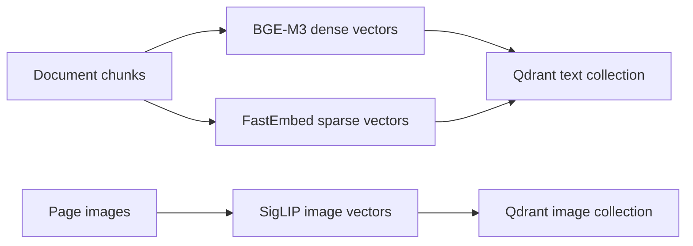

## Description

Use BGE-M3 for dense text, direct FastEmbed support for sparse text, and SigLIP for images. SigLIP is the only supported image embedding backend.

## Context

The original decision replaced separate BGE-large, SPLADE, and CLIP paths with fewer model families. The current runtime uses BGE-M3 dense vectors, FastEmbed sparse vectors, and SigLIP image vectors.

## Decision drivers

- Reduce duplicate model and adapter ownership
- Keep dense, sparse, and image roles explicit
- Support local execution after model installation
- Preserve Qdrant named-vector and image-collection contracts
- Use maintained library integrations

## Decision

Adopt:

- BGE-M3 for 1024-dimensional dense text vectors
- Direct FastEmbed support for sparse text vectors
- SigLIP for image and text-to-image vectors
- BGE reranker v2-m3 for text reranking

Store dense and sparse text vectors under their canonical Qdrant names. Store SigLIP image vectors in the dedicated image collection.

Do not expose an OpenCLIP or alternate image-backend selector.


```mermaid
flowchart LR
    CHUNK["Document chunks"] --> DENSE["BGE-M3 dense vectors"]
    CHUNK --> SPARSE["FastEmbed sparse vectors"]
    PAGE["Page images"] --> IMAGE["SigLIP image vectors"]
    DENSE --> TEXTQ["Qdrant text collection"]
    SPARSE --> TEXTQ
    IMAGE --> IMAGEQ["Qdrant image collection"]
```

## Runtime ownership

| Concern | Owner |
| --- | --- |
| Dense text model | `src/config/integrations.py` through the LlamaIndex Hugging Face adapter |
| Sparse text model | Direct FastEmbed integration in retrieval and storage |
| SigLIP model loading | `src/utils/vision_siglip.py` |
| Image embedding API | `src/utils/siglip_adapter.py` |
| Vector schema | `src/utils/storage.py` and image-index helpers |
| Retrieval fusion | Qdrant prefetch and fusion queries |

## Local operation and privacy

Embedding models can load from local caches after operators prefetch them. Set `HF_HUB_OFFLINE=1` and `TRANSFORMERS_OFFLINE=1` for an offline run.

Local embedding and loopback Qdrant paths do not require a hosted embedding API. This configuration does not itself measure network egress.

## Image metadata

- Tag page-image vectors with `image_backbone: "siglip"`
- Persist `page_id`, `source_file`, and `page_number`
- Render PDF images through pypdfium2
- Store EXIF-free WebP with JPEG fallback
- Use a perceptual hash for stability checks

## Current dependencies

- `sentence-transformers>=5.2.0,<6.0.0`
- `fastembed>=0.5.1`
- `torch==2.11.0`
- `transformers>=5.0.0,<6.0.0`
- `llama-index-core>=0.14.21,<0.15.0`
- `llama-index-embeddings-huggingface>=0.7.0,<0.8.0`
- `BAAI/bge-m3`
- `google/siglip-base-patch16-224`

The package does not require the `llama-index` meta-package or LlamaIndex embedding adapters for OpenAI, FastEmbed, or CLIP.

## Consequences

Positive outcomes:

- One image backend and one SigLIP loader owner
- Explicit dense and sparse responsibilities
- Fewer published adapter dependencies
- Stable vector dimensions and collection ownership
- Reproducible BGE-M3 loading from a pinned Hub revision, cache folder, or
  explicit local snapshot

Trade-offs:

- Embedding changes require explicit reindexing
- Custom SigLIP models need an explicit compatible revision and vector schema
- Custom text models need an explicit compatible revision and vector dimension
- GPU performance varies by hardware and is not a release guarantee

## Historical decision context

Earlier revisions compared BGE-M3 plus CLIP, Nomic plus CLIP, and the original three-model stack. Those alternatives explain the transition but are not supported runtime backends.

Earlier performance and memory figures were evaluation targets, not retained release evidence.

## Verification

```bash
uv run pytest tests/unit/models/embeddings -q
uv run pytest tests/unit/retrieval/embeddings -q
uv run pytest tests/unit/retrieval/reranking/siglip -q
```

## Changelog

- 4.6 (2026-07-11): Pinned BGE-M3, wired native LlamaIndex Hugging Face
  sequence/normalization/batch options, and made missing local artifacts fail
  without a mock embedding fallback.
- 4.5 (2026-07-11): Removed the unused parallel `FlagEmbedding` implementation and made the LlamaIndex Hugging Face adapter, direct FastEmbed sparse path, and shared SigLIP loader the only owners.
- 4.4 (2026-07-10): Aligned current implementation with BGE-M3 dense, direct FastEmbed sparse, and SigLIP-only image embeddings. Removed active OpenCLIP and meta-package claims.
- 4.3 (2025-09-07): Added SigLIP metadata, canonical page metadata, and pypdfium2 imaging defaults.
- 4.2 (2025-09-07): Changed the image backbone from CLIP to SigLIP.
- 4.1 (2025-09-02): Replaced ADR-007 with ADR-031 and added ADR-034.
- 4.0 (2025-08-18): Recorded the BGE-M3 evaluation.
- 3.0 (2025-08-17): Removed API-only Voyage-3.
- 1.0 (2025-01-16): Recorded the initial design.
