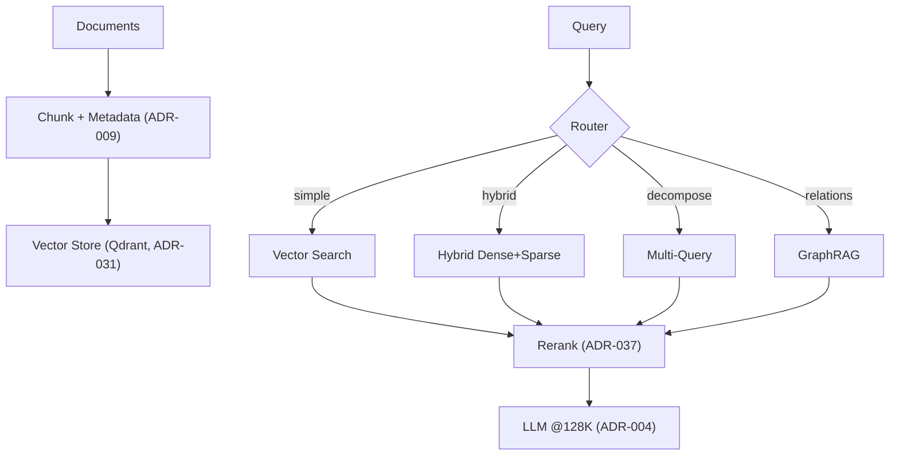

## Description

Adopt a library‑first, adaptive retrieval pipeline using LlamaIndex router + built‑in retrievers, providing RAPTOR‑Lite hierarchical benefits with local performance. Adds routing, hybrid dense+sparse, query decomposition, and optional GraphRAG — all tuned for the enforced 128K context (ADR‑004/010).

## Context

Flat vector search underperforms on complex queries, lacks hierarchical awareness, and cannot adapt across query types. Full RAPTOR is too heavy for local 16GB VRAM deployments. We need an adaptive, locally efficient pipeline that preserves hierarchical synthesis and integrates cleanly with embeddings (ADR‑002), storage (ADR‑031), agents (ADR‑011), and 128K LLM limits (ADR‑004).

## Decision Drivers

- Local‑first performance on consumer GPUs
- Higher answer quality for complex/multi‑hop queries
- Maintainability: prefer LlamaIndex built‑ins over custom code
- Predictable context usage within 128K cap
- Seamless fit with ADR‑002/004/011/024/031/037

## Alternatives

- A: Flat vector retrieval — Pros: simple, fast; Cons: poor for complex synthesis. Rejected.
- B: Full RAPTOR — Pros: strong hierarchy; Cons: heavy compute/memory, complex. Rejected for local.
- C: RAPTOR‑Lite + Multi‑Strategy (Selected) — Pros: balanced capability/latency; Cons: added orchestration.

### Decision Framework

| Model / Option                     | Solution Leverage (30%) | Application Value (30%) | Maintenance (20%) | Adaptability (20%) | Total | Decision |
| ---------------------------------- | ----------------------- | ----------------------- | ----------------- | ------------------ | ----- | -------- |
| RAPTOR‑Lite + Router (Selected)    | 5                       | 4                       | 5                 | 5                  | 4.7   | ✅ Selected |
| Flat Vector Only                   | 3                       | 2                       | 5                 | 2                  | 2.9   | Rejected |
| Full RAPTOR                        | 4                       | 4                       | 2                 | 4                  | 3.6   | Rejected |

## Decision

Adopt **LlamaIndex RouterQueryEngine** with built‑in **HybridRetriever** (dense+sparse, RRF), **MultiQueryRetriever** (decomposition), and **MetadataFilters**. Optionally enable **PropertyGraphIndex** for relationship queries (ADR‑019). Reranking remains modality‑aware per ADR‑037. All components respect the **128K context cap** from ADR‑004.

## High-Level Architecture



## Related Requirements

### Functional Requirements

- **FR-1:** Route queries to optimal strategy (vector/hybrid/decompose/graph).
- **FR-2:** Provide hierarchical signals (section/summary usage) without full RAPTOR.
- **FR-3:** Retry/expand strategy when quality is low.
- **FR-4:** Support both precise facts and broad synthesis.

### Non-Functional Requirements

- **NFR-1 (Performance):** Additional routing overhead ≤300ms P95.
- **NFR-2 (Memory):** Hierarchy metadata ≤500MB for 10k docs.
- **NFR-3 (Quality):** ≥15% improvement on complex queries vs flat baseline.
- **NFR-4 (Local-First):** All retrieval runs locally.

### Performance Requirements

- **PR-1:** End-to-end retrieval + rerank P95 <2s on target machine.
- **PR-2:** Router decision accuracy ≥90% on evaluation set.

### Integration Requirements

- **IR-1:** Use LlamaIndex `Settings` and official components (no custom wrappers).
- **IR-2:** Provide async paths for streaming and batching.
- **IR-3:** Respect ADR‑004 context cap in prompt assembly.

## Design

### Architecture Overview

- Library‑first: Router + Hybrid + MultiQuery + MetadataFilters; optional GraphRAG.
- Reranking: ADR‑037 handles modality‑aware reranking before LLM synthesis.
- Config‑driven: ADR‑024 `DocMindSettings` toggles strategies and params.

### Implementation Details

```python
# src/retrieval/query_engine.py (skeleton)
from llama_index.core.query_engine import RouterQueryEngine
from llama_index.core.selectors import LLMSingleSelector
from llama_index.core.retrievers import HybridRetriever, MultiQueryRetriever
from llama_index.core.tools import QueryEngineTool
from llama_index.core import Settings

def build_adaptive_query_engine(index, llm, *, enable_graphrag: bool = False):
    # Base retrievers
    vector_retriever = index.as_retriever(similarity_top_k=10)
    hybrid_retriever = HybridRetriever(
        vector_retriever=index.as_retriever(similarity_top_k=5),
        keyword_retriever=index.as_retriever(mode="keyword", top_k=5),
        fusion_mode="reciprocal_rank",
    )
    multi_retriever = MultiQueryRetriever.from_defaults(
        retriever=hybrid_retriever, llm=llm, num_queries=3
    )

    tools = [
        QueryEngineTool.from_defaults(
            query_engine=vector_retriever.as_query_engine(),
            name="vector_search",
            description="Semantic similarity for simple factual queries",
        ),
        QueryEngineTool.from_defaults(
            query_engine=hybrid_retriever.as_query_engine(),
            name="hybrid_search",
            description="Dense+sparse for keyword + semantic needs",
        ),
        QueryEngineTool.from_defaults(
            query_engine=multi_retriever.as_query_engine(),
            name="multi_query",
            description="Decompose complex questions into subqueries",
        ),
    ]

    if enable_graphrag:
        from src.retrieval.graph_config import build_graph_query_engine
        tools.append(
            QueryEngineTool.from_defaults(
                query_engine=build_graph_query_engine(index),
                name="graph_search",
                description="Relationship/multi‑hop retrieval",
            )
        )

    return RouterQueryEngine(
        selector=LLMSingleSelector.from_defaults(llm=llm),
        query_engine_tools=tools,
        verbose=True,
    )
```

### Configuration

```env
# Retrieval routing and strategies
DOCMIND_RETRIEVAL__ROUTER=auto                 # auto|simple|hierarchical|graph
DOCMIND_RETRIEVAL__TOP_K=10                    # per‑retriever default
DOCMIND_RETRIEVAL__HYBRID=true                 # dense+sparse with RRF
DOCMIND_RETRIEVAL__HIERARCHY=true              # RAPTOR‑Lite signals only
DOCMIND_RETRIEVAL__GRAPH=false                 # PropertyGraphIndex routing (ADR‑019)

# Reranking (ADR‑037)
DOCMIND_RETRIEVAL__RERANKING_TOP_K=5
DOCMIND_RETRIEVAL__RERANKER_MODE=auto          # auto|text|multimodal
```

### Using MetadataFilters for Advanced Retrieval

```python
from llama_index.core.vector_stores import MetadataFilters, MetadataFilter, FilterOperator, FilterCondition

def filtered_retriever(index, *, doc_type: str | None = None, after_date: str | None = None):
    filters = []
    if doc_type:
        filters.append(MetadataFilter(key="doc_type", value=doc_type, operator=FilterOperator.EQ))
    if after_date:
        filters.append(MetadataFilter(key="date", value=after_date, operator=FilterOperator.GTE))

    meta = MetadataFilters(filters=filters, condition=FilterCondition.AND)
    return index.as_retriever(similarity_top_k=10, filters=meta)
```

### Using AsyncQueryEngine for Performance

```python
from llama_index.core.query_engine import AsyncQueryEngine
from llama_index.core.callbacks import TokenCountingHandler

async def build_async_engine(index, llm):
    handler = TokenCountingHandler()
    Settings.callback_manager.add_handler(handler)
    return AsyncQueryEngine.from_defaults(retriever=index.as_retriever(), llm=llm, streaming=True)
```

## Testing

```python
# tests/unit/test_adaptive_retrieval.py (skeleton)
import pytest

@pytest.mark.unit
def test_router_exposes_expected_tools(adaptive_engine):
    names = {t.metadata.name for t in adaptive_engine._tools}
    assert {"vector_search", "hybrid_search", "multi_query"}.issubset(names)

@pytest.mark.integration
def test_metadata_filters_reduce_result_set(index_with_metadata):
    r_all = index_with_metadata.as_retriever(similarity_top_k=10)
    r_filtered = filtered_retriever(index_with_metadata, doc_type="report")
    assert len(r_filtered.retrieve("quarterly revenue")) <= len(r_all.retrieve("quarterly revenue"))

@pytest.mark.asyncio
async def test_latency_budget(async_adaptive_engine):
    import time
    start = time.monotonic()
    _ = await async_adaptive_engine.aquery("Summarize Q2 revenue by region")
    assert time.monotonic() - start < 2.0  # PR-1
```

## Consequences

### Positive Outcomes

- Adaptive strategy selection improves complex query quality.
- Hierarchical signals without full RAPTOR complexity.
- Clean, maintainable integration via official LlamaIndex features.
- Predictable context usage aligned to 128K constraints.

### Negative Consequences / Trade-offs

- Router adds up to ~300ms overhead per query.
- Multiple strategies increase surface area for tuning.
- Optional GraphRAG introduces additional index maintenance.

### Ongoing Maintenance & Considerations

- Monitor strategy distribution and success; adjust thresholds and top‑k.
- Re‑evaluate reranker mode and top‑k as dataset modality mix changes.
- Track LlamaIndex API changes; pin versions in `pyproject.toml`.
- Periodically benchmark against flat baseline to confirm value.

### Dependencies

- System: Qdrant (ADR‑031) for vector storage.
- Python: `llama-index-core>=0.12`, `numpy>=1.24`, `scikit-learn>=1.3` (if clustering used).
- Models: BGE‑M3 embeddings (ADR‑002), LLM per ADR‑004.

## Changelog

- 3.4 (2025-09-04): Standardized to ADR template; added weighted decision matrix, high‑level architecture section, explicit PR/IR requirements, testing skeletons; moved dependencies under Consequences.
- 3.2 (2025-09-02): Standardized to 128K context (ADR‑004/010), updated cache refs (ADR‑030).
- 3.1 (2025-08-21): IMPLEMENTATION COMPLETE — RouterQueryEngine deployed with adaptive strategies.
- 3.0 (2025-08-19): (Deprecated) 262K context mention — superseded by 128K enforcement.
- 2.1 (2025-08-18): Added DSPy optimization and PropertyGraphIndex option.
- 2.0 (2025-08-17): Multi‑strategy routing and DSPy integration.
- 1.0 (2025-01-16): Initial RAPTOR‑Lite concept.
