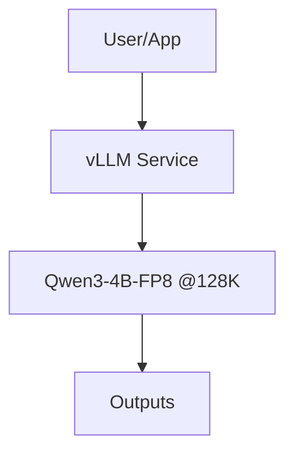

## Description

Adopts a local‑first LLM strategy centered on Qwen3‑4B‑Instruct‑2507 with FP8 weights and FP8 KV cache via vLLM, enforcing a 131,072‑token (128K) context. This balances capability and resource limits on 16GB VRAM and standardizes predictable latency and memory.

## Context

We require offline operation, tool use, and reliable performance on consumer GPUs. Larger native contexts are impractical at 16GB VRAM. FP8 quantization and FP8 KV cache with vLLM enable a stable 128K context, ~12–14GB VRAM usage, and strong throughput (≈100–160 tok/s decode; ≈800–1300 tok/s prefill) while preserving quality.

## Decision Drivers

- Local‑first privacy and availability (no external APIs)
- Deterministic 128K context on 16GB VRAM
- Strong tool use for agentic workflows (ADR‑001/011)
- Throughput/latency targets compatible with ADR‑010

## Alternatives

- A: Cloud APIs (OpenAI/Claude) — Pros: quality; Cons: not local‑first, cost, latency
- B: Larger local models — Pros: quality; Cons: VRAM limits, unstable at 128K
- C: Qwen3‑4B‑FP8 + vLLM (chosen) — Pros: predictable, fast, 128K stable; Cons: slightly lower headroom vs larger models

### Decision Framework

| Model / Option          | Solution Leverage (30%) | Local‑First (30%) | Performance (30%) | Maintainability (10%) | Total Score | Decision    |
| ----------------------- | ----------------------- | ----------------- | ----------------- | --------------------- | ----------- | ----------- |
| **Qwen3‑4B‑FP8 + vLLM** | 8.5                     | 10.0              | 8.5               | 8.0                   | **8.9**     | ✅ Selected |
| Cloud APIs              | 9.5                     | 1.0               | 8.5               | 8.5                   | 6.9         | Rejected   |
| Larger Local Models     | 9.0                     | 10.0              | 6.0               | 6.0                   | 7.8         | Rejected   |

## Decision

We adopt Qwen/Qwen3‑4B‑Instruct‑2507 with FP8 quantization and FP8 KV cache served by vLLM, enforcing `--max-model-len 131072`. This standardizes a 128K context, meets latency/throughput targets, and integrates with ADR‑001 (agents), ADR‑003 (retrieval), and ADR‑010 (performance).

## High-Level Architecture



## Related Requirements

### Functional Requirements

- FR‑1: Function calling for agentic RAG operations
- FR‑2: 131,072‑token context handling with trimming at ~120K
- FR‑3: Reasoning support for routing/validation

### Non-Functional Requirements

- NFR‑1: Local‑first; zero external API dependency
- NFR‑2: ~12–14GB VRAM at 128K (FP8 + FP8 KV cache)
- NFR‑3: ≥100 tok/s decode; ≥800 tok/s prefill

### Performance Requirements

- PR‑1: P95 response latency ≤ 1.5s for agent prompts
- PR‑2: Stable generation at 128K without OOM

### Integration Requirements

- IR‑1: Centralize configuration in ADR‑024 settings
- IR‑2: Expose both sync and async client interfaces

## Design

### Architecture Overview

Single local service (vLLM) exposes Qwen3‑4B‑FP8 with enforced 128K context. Agents (ADR‑001/011) and retrieval (ADR‑003) call the same endpoint.

### Implementation Details

```bash
# vLLM launch (minimal)
vllm serve Qwen/Qwen3-4B-Instruct-2507-FP8 \
  --max-model-len 131072 \
  --kv-cache-dtype fp8_e5m2 \
  --calculate-kv-scales \
  --gpu-memory-utilization 0.95 \
  --enable-chunked-prefill \
  --host 0.0.0.0 --port 8000
```

### Configuration

```env
DOCMIND_VLLM__MODEL=Qwen/Qwen3-4B-Instruct-2507-FP8
DOCMIND_VLLM__MAX_CONTEXT=131072
DOCMIND_VLLM__KV_CACHE_DTYPE=fp8_e5m2
DOCMIND_VLLM__HOST=0.0.0.0
DOCMIND_VLLM__PORT=8000
```

## Testing

```python
import time
import pytest

@pytest.mark.integration
def test_llm_latency_budget(llm_client):
    t0 = time.monotonic()
    out = llm_client.complete("say hi")
    assert out and isinstance(out.text, str)
    assert time.monotonic() - t0 <= 1.5
```

## Consequences

### Positive Outcomes

- Predictable 128K context on 16GB VRAM
- Strong throughput with FP8 + FP8 KV cache
- Fully offline operation; consistent with ADR‑010

### Negative Consequences / Trade-offs

- Slightly lower peak quality vs larger models
- Requires careful trimming near 128K to avoid stalls

### Ongoing Maintenance & Considerations

- Track vLLM and FlashInfer releases for compatibility
- Re‑validate latency/throughput quarterly
- Monitor memory headroom at 128K during long sessions

### Dependencies

- System: CUDA‑capable GPU (16GB VRAM)
- Python: `vllm>=0.5`, `torch>=2.2`
- Models: `Qwen/Qwen3-4B-Instruct-2507-FP8`

## Changelog

- 10.3 (2025‑09‑04): Standardized to ADR template; condensed content; added testing and configuration.
- 10.2 (2025‑09‑04): Performance/latency clarifications; FP8 KV cache details.
