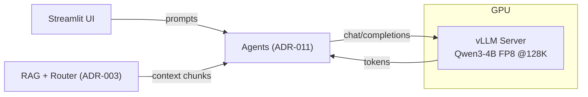

## Description

Adopt a local-first LLM strategy using vLLM serving of **Qwen/Qwen3-4B-Instruct-2507-FP8**, enforcing a fixed 131,072-token (128K) context via `--max-model-len 131072` and FP8 KV cache. Targets consumer GPUs (RTX 4090 Laptop 16GB) with 100–160 tok/s decode and 800–1300 tok/s prefill.

## Context

We lacked a unified, explicit policy for local LLM selection, context limits, and performance on consumer hardware. External APIs introduce latency, cost, and privacy risks. Modern small dense LLMs deliver solid reasoning and function-calling while fitting 16GB VRAM when carefully configured. We constrain context to 128K for reliability on RTX 4090 Laptop GPUs using FP8 weights and FP8 KV cache. This reduces memory while preserving quality and throughput.

Key forces and constraints:

- Privacy/cost: Avoid external API reliance for core features.
- Hardware: 16GB VRAM target; avoid swapping/OOM at large contexts.
- Capability: Reasoning + function calling for agentic RAG (ADR-001/011).
- Simplicity: Library-first, minimal custom glue (ADR-024 config model).

## Decision Drivers

- Local-first and offline operation for core flows
- Low latency on consumer GPUs (decode ≥100 tok/s)
- Extended context with predictable memory ceiling (128K enforced)
- Maintainability via settings and proven libraries (vLLM, LlamaIndex)
- Clear integration with agent stack and retrieval (ADR-003/011/024)

## Alternatives

- A: Cloud APIs (OpenAI/Claude) — Pros: quality, zero local setup; Cons: cost, privacy, vendor lock-in. Rejected.
- B: Qwen3‑14B + YaRN via llama.cpp/vLLM — Pros: higher quality; Cons: more VRAM/latency, extra tuning. Rejected for baseline due to 16GB VRAM constraints.
- C: Smaller local models (Phi‑3‑Mini/Llama3‑8B) — Pros: faster, cheaper; Cons: weaker reasoning/function calling. Rejected for primary.
- D: Large dense/MoE (Qwen3‑32B/Mixtral) — Pros: strong quality; Cons: heavy VRAM, slower. Optional advanced path.

### Decision Framework

| Model / Option                    | Local-First (35%) | Performance (25%) | Quality (20%) | Maintainability (20%) | Total Score | Decision    |
| --------------------------------- | ----------------- | ----------------- | ------------- | --------------------- | ----------- | ----------- |
| Qwen3‑4B FP8 on vLLM (Selected)   | 5                 | 4                 | 4             | 5                     | 4.6         | ✅ Selected |
| Qwen3‑14B + YaRN (llama.cpp/vLLM) | 4                 | 3                 | 5             | 3                     | 3.95        | Rejected    |
| Cloud API (OpenAI/Claude)         | 1                 | 4                 | 5             | 4                     | 3.2         | Rejected    |

## Decision

We will adopt **Qwen/Qwen3-4B-Instruct-2507-FP8** on **vLLM** with enforced 128K context and FP8 KV cache. This standardizes a local-first baseline for agents and retrieval. Key parameters: `--max-model-len 131072`, `--kv-cache-dtype fp8_e5m2`, FlashInfer attention, chunked prefill. Typical VRAM at 128K: ~12–14GB.

## High-Level Architecture



## Related Requirements

### Functional Requirements

- **FR-1:** Support function calling for agentic RAG flows.
- **FR-2:** Handle up to 131,072 tokens with FP8 KV cache.
- **FR-3:** Provide reasoning for routing and result validation.
- **FR-4:** Retain multi-turn context with trimming at thresholds.
- **FR-5:** Enable adaptive context strategies per ADR-003.

### Non-Functional Requirements

- **NFR-1 (Performance):** P95 time-to-first-token <1.5s on RTX 4090 Laptop.
- **NFR-2 (Memory):** ~12–14GB VRAM at 128K with FP8 weights + FP8 KV cache.
- **NFR-3 (Quality):** ≥95% of GPT‑3.5 on reasoning via retrieval augmentation.
- **NFR-4 (Local-First):** No external API dependency for core operations.
- **NFR-5 (Throughput):** 100–160 tok/s decode, 800–1300 tok/s prefill (FP8).

### Performance Requirements

- **PR-1:** Interactive queries return first token <1.5s, full response <4s median.
- **PR-2:** VRAM ≤14GB sustained at 128K context; no swap.

### Integration Requirements

- **IR-1:** Integrates via LlamaIndex OpenAI-like client with central `DocMindSettings` (ADR‑024).
- **IR-2:** Supports async calls for streaming and tool execution.
- **IR-3:** Enforces `context_window` cap consistently across UI and agents.

## Design

### Architecture Overview

- vLLM serves Qwen3‑4B FP8 with FlashInfer; single-GPU target.
- Agents (ADR‑011) call the OpenAI-like client via LlamaIndex.
- Retrieval (ADR‑003) trims to fit 128K; UI reflects the enforced cap.

### Implementation Details

```python
# src/config/llm_factory.py (skeleton usage)
from src.config.settings import DocMindSettings
from src.config.llm_factory import build_llm

def setup_llm_for_agents(settings: DocMindSettings):
    """Create vLLM-backed LLM with enforced 128K window."""
    llm = build_llm(settings)
    # Optional: apply streaming/structured outputs wrappers here
    return llm

# Example: creating settings from env and building the client
if __name__ == "__main__":
    from src.config.settings import settings
    llm = setup_llm_for_agents(settings)
```

### Configuration

```env
# vLLM model and limits (ADR-004)
DOCMIND_VLLM__MODEL=Qwen/Qwen3-4B-Instruct-2507-FP8
DOCMIND_VLLM__CONTEXT_WINDOW=131072
DOCMIND_VLLM__KV_CACHE_DTYPE=fp8_e5m2
DOCMIND_VLLM__GPU_MEMORY_UTILIZATION=0.90
DOCMIND_LLM_REQUEST_TIMEOUT_SECONDS=120
DOCMIND_LLM_STREAMING_ENABLED=true

# vLLM server environment (optional helpers)
VLLM_ATTENTION_BACKEND=FLASHINFER
VLLM_MAX_MODEL_LEN=131072
```

## Testing

```python
# tests/unit/test_llm_local_first.py (skeleton)
import time
import pytest
from src.config.settings import DocMindSettings
from src.config.llm_factory import build_llm


@pytest.mark.unit
def test_context_window_enforced():
    s = DocMindSettings(vllm={"context_window": 200000})
    assert s.llm_context_window_max == 131072
    # factory should respect the cap via settings usage
    llm = build_llm(s)
    # spot-check attribute when available; otherwise rely on settings
    assert s.vllm.context_window <= s.llm_context_window_max


@pytest.mark.asyncio
async def test_latency_smoke(async_llm_client):
    start = time.monotonic()
    _ = await async_llm_client.acomplete("Say hi in one word.")
    assert (time.monotonic() - start) < 1.5  # P95 target
```

## Consequences

### Positive Outcomes

- Local-first baseline with predictable latency and VRAM usage on 16GB GPUs.
- Standardized 128K context across UI/agents/retrieval; fewer OOMs.
- Library-first integration (vLLM + LlamaIndex) reduces custom code.
- Clear knobs in settings; easier ops and reproducible performance.

### Negative Consequences / Trade-offs

- 4B model quality below larger 14B+/Mixture models on complex tasks.
- FP8 path ties us to vLLM features (FlashInfer, KV cache dtype).
- Single‑GPU target may limit batch throughput for heavy workloads.

### Ongoing Maintenance & Considerations

- Track vLLM releases for FP8/attention backend changes.
- Re‑validate latency/VRAM after dependency bumps and driver updates.
- Monitor token utilization; keep trim thresholds aligned with 128K cap.
- Keep manual cloud fallbacks out of core path; evaluate via separate ADRs.

### Dependencies

- System: NVIDIA driver + CUDA/cuDNN compatible with vLLM; RTX 4090 Laptop (16GB VRAM).
- Python (app env): `llama-index-core>=0.14.12,<0.15.0`, `torch==2.8.0`, `tenacity>=9.1.2,<10.0.0`.
- vLLM: external OpenAI-compatible server process (installed and managed separately from the app env).
- Removed: Custom LLM wrappers; prefer LlamaIndex official integrations.

## Addendum — Ollama Native Capabilities (ADR-059)

This ADR’s “no custom wrappers” guidance remains the default. However, we now
allow a **minimal, centralized** Ollama SDK adapter (`src/config/ollama_client.py`)
to expose Ollama-native `/api/*` features (structured outputs, thinking, tool
calling, logprobs, embed dimensions, and optional web tools) with explicit
streaming semantics and offline-first gating. This is a narrow exception scoped
to the official Ollama SDK and does **not** reintroduce broad, bespoke wrappers
for other backends. See ADR-059 and SPEC-043.

## High-Level Architecture (Operational Detail)

- vLLM launch example (one-liner):

```bash
VLLM_ATTENTION_BACKEND=FLASHINFER \
vllm serve Qwen/Qwen3-4B-Instruct-2507-FP8 \
  --max-model-len 131072 \
  --kv-cache-dtype fp8_e5m2 \
  --enable-chunked-prefill \
  --gpu-memory-utilization 0.90 \
  --host 0.0.0.0 --port 8000 \
  --served-model-name docmind-qwen3-fp8
```

## Changelog

- 2025-09-04

  - 12.1: Standardized to ADR template; added weighted decision matrix, mermaid architecture, config, and testing skeletons; clarified 128K enforcement and dependencies. Updated front‑matter and references.

- 2025-08-27

  - 12.0: USER SCENARIO VALIDATION & HARDWARE ADAPTABILITY — expanded multi‑provider documentation and scenarios.

- 2025-08-20

  - 11.1: Hardware-constrained rationale; FlashInfer backend; 120K trim + 8K buffer strategy.

- 2025-08-19

  - 11.0: Corrected to Qwen3‑4B‑FP8; enforce 128K; FP8 KV cache; performance/memory updates.
  - 10.0: INT8 KV cache optimization analysis.
  - 9.0: Initial reality check.
  - 8.0: Initial Qwen3‑4B evaluation.

- 2025-08-18

  - 7.0: Shift to 32K native + adaptive retrieval.
  - 6.0: Hardware upgrade; YaRN configs documented.
  - 5.2: Reverted to Qwen3‑14B practicality; multi‑provider support.
  - 5.1: MoE corrections.
  - 5.0: Experimental MoE attempt.
  - 4.3: Context spec corrections.
  - 4.2: Naming correction.
  - 4.1: Agent integration improvements.

- 2025-08-17

  - 4.0: Missing prior entry.

- 2025-08-16

  - 3.0: Critical corrections to Qwen3‑14B and context.

- 2025-01-16
  - 2.0: Major upgrade to Qwen2.5‑14B.
  - 1.0: Initial local LLM strategy.
