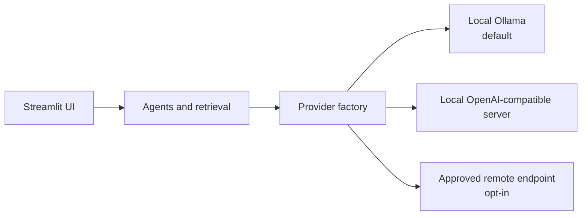

## Description

Default to a local Ollama large language model (LLM) endpoint. Support local OpenAI-compatible servers, including vLLM, LM Studio, and llama.cpp. Treat remote providers as opt-in endpoints governed by the central security policy.

## Context

DocMind needs one policy for local LLM selection, context limits, and optional remote access. Hosted APIs introduce cost and move data across a trust boundary. Local servers preserve the default offline posture but vary in model support, memory use, and latency.

The original decision selected a Qwen FP8 model on vLLM for a specific laptop GPU. That remains an available deployment profile, not the application default. The current application defaults to Ollama. vLLM runs as a separately installed OpenAI-compatible server and is not part of the Python application environment.

Key forces and constraints:

- Privacy/cost: Avoid external API reliance for core features.
- Hardware: Avoid swapping and out-of-memory failures at the configured context size.
- Capability: Reasoning + function calling for agentic RAG (ADR-001/011).
- Simplicity: Library-first, minimal custom glue (ADR-024 config model).

## Decision Drivers

- Local-first and offline operation for core flows
- Measured latency on the operator's model, backend, and hardware
- A validated context limit that the selected server supports
- Maintainability via settings and proven libraries (vLLM, LlamaIndex)
- Clear integration with agent stack and retrieval (ADR-003/011/024)

## Alternatives

- A: Cloud APIs (OpenAI/Claude). Pros: quality and no local model setup. Cons: cost, privacy, and vendor lock-in. Retained as an explicit opt-in path.
- B: Qwen3-14B plus YaRN via llama.cpp or vLLM. Pros: higher quality. Cons: more memory, latency, and tuning. Rejected for the original laptop profile.
- C: Smaller local models. Pros: lower resource use. Cons: weaker reasoning and function calling. Rejected as the original primary model.
- D: Large dense or mixture-of-experts models. Pros: stronger quality. Cons: higher resource use. Retained as an optional path.

### Historical decision framework

The scores capture the original model evaluation. They do not select the current default backend or represent benchmark results.

| Model / Option | Local-First (35%) | Performance (25%) | Quality (20%) | Maintainability (20%) | Total Score | Decision |
| --- | --- | --- | --- | --- | --- | --- |
| Qwen3‑4B FP8 on vLLM (Selected) | 5 | 4 | 4 | 5 | 4.6 | Selected |
| Qwen3‑14B + YaRN (llama.cpp/vLLM) | 4 | 3 | 5 | 3 | 3.95 | Rejected |
| Cloud API (OpenAI/Claude) | 1 | 4 | 5 | 4 | 3.2 | Rejected |

## Decision

Default to Ollama on a loopback endpoint. Use the provider factory for Ollama, vLLM, LM Studio, llama.cpp, and generic OpenAI-compatible endpoints.

Operators may run Qwen on an external vLLM server with FP8 key-value cache and chunked prefill. The configured 131,072-token window is a vLLM profile default, not a runtime guarantee. Validate model support and measure memory, time to first token, prefill throughput, and decode throughput on the target environment.

## High-Level Architecture


```mermaid
flowchart LR
  UI["Streamlit UI"] --> AG["Agents and retrieval"]
  AG --> FACTORY["Provider factory"]
  FACTORY --> OLLAMA["Local Ollama<br/>default"]
  FACTORY --> LOCAL["Local OpenAI-compatible server"]
  FACTORY --> REMOTE["Approved remote endpoint<br/>opt-in"]
```

## Related Requirements

### Functional Requirements

- **FR-1:** Support function calling for agentic RAG flows.
- **FR-2:** Pass the configured context window to the selected provider adapter.
- **FR-3:** Provide reasoning for routing and result validation.
- **FR-4:** Retain multi-turn context with trimming at thresholds.
- **FR-5:** Enable adaptive context strategies per ADR-003.

### Non-Functional Requirements

- **NFR-1 (Performance):** Record the model, backend, hardware, and context size with every result.
- **NFR-2 (Memory):** Refuse deployment profiles that exhaust host or accelerator memory.
- **NFR-3 (Quality):** Evaluate answer quality against a versioned task corpus.
- **NFR-4 (Local-first):** Keep local endpoints as the default and require explicit endpoint policy configuration for remote endpoints.
- **NFR-5 (Throughput):** Measure prefill and decode throughput in the target environment.

### Performance Requirements

- **PR-1:** Establish a release baseline before publishing latency or throughput figures.
- **PR-2:** Capture peak host and accelerator memory at the configured context size.

### Integration Requirements

- **IR-1:** Integrates via LlamaIndex OpenAI-like client with central `DocMindSettings` (ADR‑024).
- **IR-2:** Supports async calls for streaming and tool execution.
- **IR-3:** Uses the effective context configuration consistently across clients and agents.

## Design

### Architecture Overview

- Ollama is the default local backend.
- vLLM, LM Studio, and llama.cpp use an OpenAI-compatible HTTP boundary.
- Remote OpenAI-compatible providers require explicit endpoint policy configuration.
- Agents call the selected provider through LlamaIndex adapters.

### Implementation Details

```python
# src/config/llm_factory.py
from src.config.settings import DocMindSettings
from src.config.llm_factory import build_llm

def setup_llm_for_agents(settings: DocMindSettings):
    """Build the configured provider client."""
    return build_llm(settings)
```

### Configuration

```env
DOCMIND_LLM_BACKEND=vllm
DOCMIND_VLLM__MODEL=Qwen/Qwen3-4B-Instruct-2507-FP8
DOCMIND_VLLM__CONTEXT_WINDOW=131072
DOCMIND_VLLM__KV_CACHE_DTYPE=fp8_e5m2
DOCMIND_VLLM__GPU_MEMORY_UTILIZATION=0.90
DOCMIND_LLM_REQUEST_TIMEOUT_SECONDS=120
DOCMIND_LLM_STREAMING_ENABLED=true

# Configure and validate these separately in the external vLLM process.
VLLM_ATTENTION_BACKEND=FLASHINFER
VLLM_MAX_MODEL_LEN=131072
```

## Testing

```bash
uv run pytest tests/unit/config/test_llm_factory.py \
  tests/unit/config/test_settings_backend_url_and_policies.py -q
```

Run a separate inference benchmark against the target server before publishing performance figures. The tracked parser benchmark does not measure LLM inference.

## Consequences

### Positive Outcomes

- Local-first default with explicit remote-provider controls.
- One provider factory for supported local and OpenAI-compatible endpoints.
- Library-first integration reduces custom provider code.
- Operator-controlled model and context settings.

### Negative Consequences / Trade-offs

- Model quality and resource use depend on the selected deployment.
- The optional FP8 profile depends on vLLM and accelerator compatibility.
- Remote providers cross a trust boundary and can add cost.

### Ongoing Maintenance & Considerations

- Track vLLM releases for FP8/attention backend changes.
- Re‑validate latency/VRAM after dependency bumps and driver updates.
- Monitor token utilization; keep trim thresholds aligned with 128K cap.
- Keep remote providers explicit and subject to endpoint validation.

### Dependencies

- Optional vLLM profile: a compatible external vLLM installation and accelerator runtime.
- Python application environment: `llama-index-core>=0.14.21,<0.15.0`,
  selected LlamaIndex LLM adapters, `torch==2.8.0`, and
  `tenacity>=9.1.2,<10.0.0`.
- vLLM: external OpenAI-compatible server process (installed and managed separately from the app env).
- Package exclusions: no `llama-index` meta-package, `llama` extra, or in-process
  vLLM dependency.
- Removed: Custom LLM wrappers; prefer the selected LlamaIndex integrations.

## Addendum — Ollama Native Capabilities (ADR-059)

This ADR’s “no custom wrappers” guidance remains the default. However, we now
allow a **minimal, centralized** Ollama SDK adapter (`src/config/ollama_client.py`)
to expose Ollama-native `/api/*` features (structured outputs, thinking, tool
calling, logprobs, embed dimensions, and optional web tools) with explicit
streaming semantics and offline-first gating. This is a narrow exception scoped
to the official Ollama SDK and does **not** reintroduce broad, bespoke wrappers
for other backends. See ADR-059 and SPEC-043.

## High-Level Architecture (Operational Detail)

- Optional vLLM launch example:

```bash
VLLM_ATTENTION_BACKEND=FLASHINFER \
vllm serve Qwen/Qwen3-4B-Instruct-2507-FP8 \
  --max-model-len 131072 \
  --kv-cache-dtype fp8_e5m2 \
  --enable-chunked-prefill \
  --gpu-memory-utilization 0.90 \
  --host 127.0.0.1 --port 8000 \
  --served-model-name docmind-qwen3-fp8
```

## Changelog

- 2026-07-10

  - 12.2: Amend the ADR for Ollama as the local default, external OpenAI-compatible vLLM, opt-in remote providers, and environment-specific performance evidence.

- 2025-09-04

  - 12.1: Standardized to ADR template; added weighted decision matrix, mermaid architecture, config, and testing skeletons; clarified 128K enforcement and dependencies. Updated front‑matter and references.

- 2025-08-27

  - 12.0: USER SCENARIO VALIDATION & HARDWARE ADAPTABILITY — expanded multi‑provider documentation and scenarios.

- 2025-08-20

  - 11.1: Hardware-constrained rationale; FlashInfer backend; 120K trim + 8K buffer strategy.

- 2025-08-19

  - 11.0: Selected Qwen3‑4B‑FP8, an extended context, and FP8 KV cache as a deployment profile; its performance and memory assumptions were not backed by a reproducible repository benchmark.
  - 10.0: INT8 KV cache optimization analysis.
  - 9.0: Initial reality check.
  - 8.0: Initial Qwen3‑4B evaluation.

- 2025-08-18

  - 7.0: Shift to 32K native + adaptive retrieval.
  - 6.0: Hardware upgrade; YaRN configs documented.
  - 5.2: Reverted to Qwen3‑14B practicality; multi‑provider support.
  - 5.1: MoE corrections.
  - 5.0: Experimental MoE attempt.
  - 4.3: Context spec corrections.
  - 4.2: Naming correction.
  - 4.1: Agent integration improvements.

- 2025-08-17

  - 4.0: Missing prior entry.

- 2025-08-16

  - 3.0: Critical corrections to Qwen3‑14B and context.

- 2025-01-16
  - 2.0: Major upgrade to Qwen2.5‑14B.
  - 1.0: Initial local LLM strategy.
