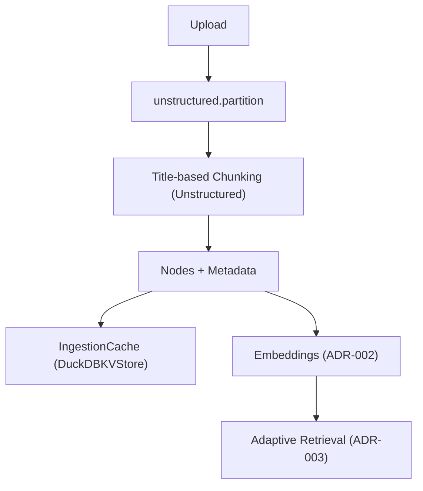

## Description

Adopt a hybrid, library-first document processing pipeline that extracts multimodal content (text, tables, images) using Unstructured and orchestrates chunking and caching via LlamaIndex IngestionPipeline. The pipeline emits explicit PDF page-image nodes to enable multimodal reranking (ADR‑037) and integrates with unified embeddings (ADR‑002) and adaptive retrieval (ADR‑003).

## Context

Prior processing was text-only with basic sentence splitting, limited metadata, and no systematic multimodal handling. Requirements expanded to cover PDFs, Office documents, HTML, and images; preserve document structure; and support visual reranking. We also needed predictable local performance, a single cache, and compatibility with indexing and retrieval decisions (ADR‑002/003/030/031/034).

## Decision Drivers

- Library-first, minimal custom parsing and code
- Multimodal extraction with PDF page-image node emission
- Local/offline performance targets (>1 page/sec; memory <4GB)
- Seamless integration with embeddings (ADR‑002) and retrieval (ADR‑003)
- Unified caching with DuckDBKVStore (ADR‑030) and local-first persistence (ADR‑031)

## Alternatives

- A: Custom per-format parsers — Pros: full control; Cons: high complexity, brittle, high maintenance
- B: Multi-library stack (PyPDF2 + python-docx + BS4) — Pros: flexibility; Cons: inconsistent outputs, orchestration overhead
- C: Unstructured (Selected) — Pros: single library, multimodal, production-ready; Cons: less control over internals

### Decision Framework

| Model / Option               | Coverage (35%) | Simplicity (35%) | Performance (20%) | Maintenance (10%) | Total Score | Decision      |
| ---------------------------- | -------------- | ---------------- | ----------------- | ----------------- | ----------- | ------------- |
| Unstructured (Selected)      | 9              | 9                | 8                 | 9                 | **8.8**     | ✅ Selected    |
| Multi-library stack          | 7              | 4                | 7                 | 5                 | 5.9         | Rejected      |
| Custom per-format parsers    | 9              | 2                | 7                 | 3                 | 5.7         | Rejected      |

## Decision

We adopt Unstructured for parsing and multimodal extraction, orchestrated by LlamaIndex IngestionPipeline for chunking and caching. The pipeline emits PDF page-image nodes (metadata.modality = "pdf_page_image") and uses strategy-based processing (hi_res, fast, ocr_only). This integrates with ADR‑002/003/030/031/034 and enables multimodal reranking (ADR‑037).

## High-Level Architecture



## Related Requirements

### Functional Requirements

- FR‑1: Process diverse formats (PDF, DOCX, HTML, TXT, images)
- FR‑2: Extract text, tables, and images (multimodal)
- FR‑3: Apply semantic-aware chunking that preserves structure
- FR‑4: Emit rich metadata (doc_id, section, page, modality)
- FR‑5: Support batch/async processing with progress/error handling

### Non-Functional Requirements

- NFR‑1 (Performance): >1 page/second on consumer hardware
- NFR‑2 (Quality): ≥95% text extraction accuracy on standard formats
- NFR‑3 (Memory): <4GB peak during large PDFs (200+ pages)
- NFR‑4 (Reliability): Graceful handling of corrupted/unsupported files

### Performance Requirements

- PR‑1: >1 page/second sustained on RTX 4090 Laptop class GPU
- PR‑2: Peak memory <4GB for 200+ page PDFs

### Integration Requirements

- IR‑1: Nodes compatible with ADR‑003, including `pdf_page_image` modality
- IR‑2: Processing cache via ADR‑030 using DuckDBKVStore

## Design

### Architecture Overview

- Direct Unstructured parsing; LlamaIndex provides transformations and caching
- Strategy selection by file type: hi_res (tables/images), fast (text), ocr_only (images)
- Explicit page-image nodes for PDFs to enable multimodal reranking (ADR‑037)

### Implementation Details

In `src/processing/document_processor.py`:

```python
from unstructured.partition.auto import partition
from llama_index.core.ingestion import IngestionCache, IngestionPipeline
from llama_index.storage.kvstore.duckdb import DuckDBKVStore

def build_pipeline(settings):
    cache = IngestionCache(
        cache=DuckDBKVStore(db_path=str(settings.cache_path)),
        collection="docmind_processing",
    )
    # Title-based chunking is handled inside the Unstructured transformation; LlamaIndex
    # IngestionPipeline orchestrates transformations and caching (no explicit SentenceSplitter).
    return IngestionPipeline(transformations=[UnstructuredTransformation(settings)], cache=cache)

class UnstructuredTransformation:
    def __init__(self, settings):
        self.settings = settings

    def __call__(self, nodes, **kwargs):
        # Expect one Document node carrying source path in metadata
        out = []
        for node in nodes:
            src = node.metadata.get("file_path")
            elements = partition(filename=src, **self.settings.partition_kwargs())
            out.extend(convert_elements_to_nodes(elements, base_metadata=node.metadata))
        return out
```

### Configuration

Prefer nested env names per config guidelines.

```env
DOCMIND_INGEST__CHUNK_SIZE=512
DOCMIND_INGEST__CHUNK_OVERLAP=50
DOCMIND_INGEST__EMIT_PAGE_IMAGES=true
DOCMIND_INGEST__STRATEGY=auto  # hi_res|fast|ocr_only|auto
DOCMIND_CACHE__PATH=./cache/docmind.duckdb
```

## Testing

Use pytest with async support. Mock I/O boundaries.

```python
import time
import pytest

@pytest.mark.asyncio
async def test_pipeline_throughput(document_processor, sample_pdf_path):
    t0 = time.monotonic()
    result = await document_processor.process_document_async(sample_pdf_path)
    dt = time.monotonic() - t0
    assert result.elements
    # Target ~>1 page/sec for small samples
    assert dt < 1.0

def test_metadata_and_modalities(document_processor, sample_pdf_path):
    result = document_processor.process(sample_pdf_path)
    modalities = {el.metadata.get("modality") for el in result.elements}
    assert "text" in modalities
    # Page image nodes must be present for PDFs
    assert "pdf_page_image" in modalities
```

## Consequences

### Positive Outcomes

- Enables multimodal processing (text/tables/images) with minimal code
- Standardizes chunking/caching via LlamaIndex; simpler orchestration
- Local-first performance; exceeds page/second target on target GPU
- Single-file DuckDB cache; straightforward portability and ops

### Negative Consequences / Trade-offs

- Increased dependency on Unstructured; less control over internals
- hi_res strategy uses more memory/compute on large PDFs
- Strategy tuning per format may be required for edge cases

### Ongoing Maintenance & Considerations

- Review Unstructured and LlamaIndex releases for breaking changes
- Track throughput/memory metrics; tune strategy defaults quarterly
- Validate image/table extraction quality on representative corpora
- Keep cache schema stable; back up DuckDB file per retention policy (ADR‑033)

### Dependencies

- System: OS packages required by Unstructured (e.g., poppler, tesseract for OCR if enabled)
- Python: `unstructured[all-docs]>=0.10.0`, `llama-index>=0.13`, `llama-index-storage-kvstore-duckdb`, `tenacity`, `pydantic`
- Removed: bespoke per-format parsers and ad-hoc caches

## Changelog

- 2.4 (2025-09-04): Standardized to template; added decision framework, config/tests; no behavior change
- 2.2 (2025-09-02): Body overhauled to remove SimpleCache and dual caching; IngestionCache now backed by DuckDBKVStore with single-file DB. Related Decisions updated to ADR-031/ADR-030.
- 2.1 (2025-09-02): Removed custom SimpleCache from pipeline; DocumentProcessor wires LlamaIndex IngestionCache with DuckDBKVStore as the single cache (no back-compat). Updated implementation notes accordingly.
- 2.0 (2025-08-26): IMPLEMENTATION COMPLETE — Hybrid DocumentProcessor deployed with all functional and non-functional requirements achieved. Code reduction: 878 lines removed. Performance: >1 page/second confirmed.
- 1.2 (2025-08-26): Cleaned up documentation to align with library-first principles — removed contradictory custom parser implementations that violated KISS
- 1.1 (2025-08-18): Added GraphRAG input processing support for PropertyGraphIndex construction and entity/relationship extraction from processed documents
- 1.0 (2025-01-16): Initial modernized document processing pipeline with multimodal support and intelligent chunking using Unstructured.io
