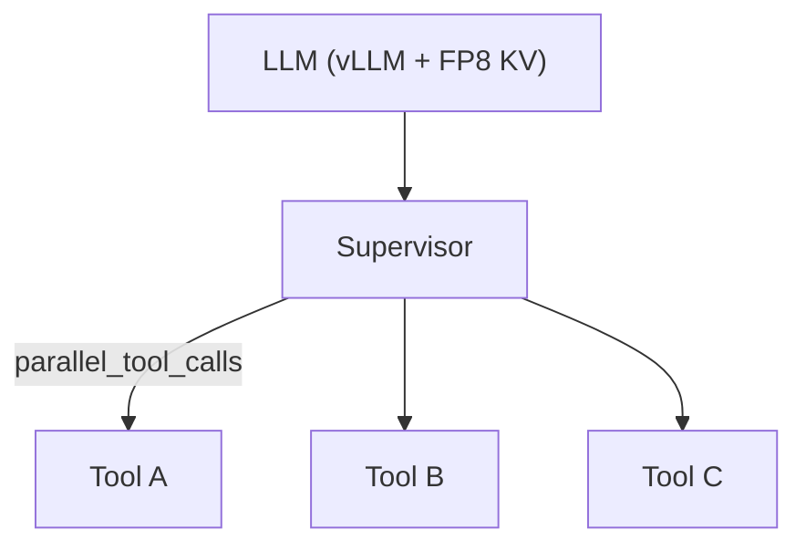

## Description

Optimize local LLM performance via FP8 KV cache and parallel tool execution to achieve a reliable 128K context (ADR‑004) on RTX 4090 Laptop while keeping latency low. Application‑level document cache is handled separately (ADR‑030).

## Context

Local multi‑agent RAG requires predictable, low‑latency inference under tight VRAM constraints. FP8 KV cache and parallel tool execution together reduce memory and tokens, enabling 128K context with practical throughput on consumer hardware.

## Decision Drivers

- Enable 128K context within ~12–14GB VRAM
- Reduce latency via FP8 and parallel tool execution
- Keep configuration simple and library‑first

## Alternatives

- A: FP16 KV cache — Too much VRAM at 128K
- B: Reduce context to 32K — Limits capabilities; more chunking
- C: Sequential tools — Higher tokens and slower
- D: FP8 + parallel tools (Selected) — Meets targets with simple settings

### Decision Framework

| Model / Option                 | Latency (40%) | VRAM (30%) | Simplicity (20%) | Stability (10%) | Total | Decision      |
| ------------------------------ | ------------- | ---------- | ---------------- | --------------- | ----- | ------------- |
| FP8 + parallel (Selected)      | 9             | 9          | 8                | 8               | **8.7** | ✅ Selected    |
| FP16 KV                         | 6             | 5          | 9                | 9               | 6.7   | Rejected      |
| 32K context                     | 7             | 9          | 9                | 9               | 8.0   | Rejected      |

## Decision

Use FP8 KV cache (`fp8_e5m2`) with vLLM + FlashInfer and enable parallel tool execution in the supervisor. Keep settings minimal and validated.

## High-Level Architecture



## Related Requirements

### Functional Requirements

- FR‑1: Run 128K context reliably via FP8 KV cache
- FR‑2: Execute tools in parallel to reduce tokens

### Non-Functional Requirements

- NFR‑1: <300ms response component latency target
- NFR‑2: ~12–14GB VRAM for full pipeline at 128K

### Performance Requirements

- PR‑1: 50–87% token reduction with parallel tools
- PR‑2: ~30% speedup with FP8 vs FP16

### Integration Requirements

- IR‑1: Compatible with supervisor orchestration (ADR‑011)
- IR‑2: Separate from application cache (ADR‑030)

## Design

### Architecture Overview

- FP8 KV cache configured via vLLM engine args
- Parallel tool calls enabled in supervisor config

### Implementation Details

In `src/config/llm.py` (illustrative):

```python
ENGINE_ARGS = {"max_model_len": 131072, "kv_cache_dtype": "fp8_e5m2"}

def compose_engine_args(user_overrides: dict | None = None) -> dict:
    args = ENGINE_ARGS.copy()
    args.update(user_overrides or {})
    return args

SUPERVISOR_TUNING = {
    "parallel_tool_calls": True,
}
```

### Configuration

```env
DOCMIND_VLLM__CONTEXT_WINDOW=131072
DOCMIND_VLLM__KV_CACHE_DTYPE=fp8_e5m2
DOCMIND_AGENTS__PARALLEL_TOOLS=true
```

## Testing

```python
def test_engine_args_compose(settings):
    assert settings.vllm.context_window == 131072
```

## Consequences

### Positive Outcomes

- 128K context feasible on 16GB VRAM
- Lower latency via FP8 and parallel tools

### Negative Consequences / Trade-offs

- FP8 requires careful backend compatibility

### Ongoing Maintenance & Considerations

- Track vLLM/FlashInfer releases and verify stability

### Dependencies

- Python: `vllm`, `flashinfer`

## Changelog

- 9.0 (2025-08-26): Separated from application cache (ADR‑030); FP8 + parallel tools focus
- 8.1 (2025-08-20): Verified supervisor parameters for parallelism
- 8.0 (2025-08-19): FP8 128K context with token reduction via parallel tools
- 7.0 (2025-08-19): INT8 KV cache attempt for 262K context
- 6.0 (2025-08-18): Hardware upgrade for 128K via YaRN
