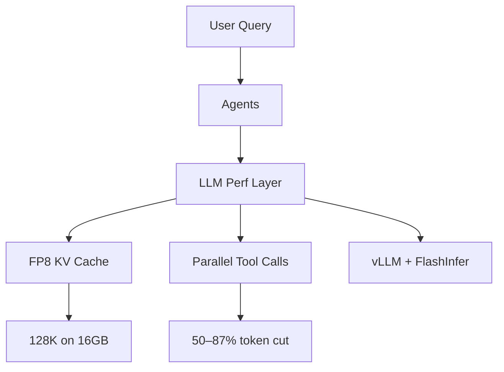

## Description

Adopt FP8 KV‑cache quantization and parallel tool execution to fit 128K context on a 16GB RTX 4090 Laptop while cutting latency and tokens. Document‑level caching is covered by ADR‑030; this ADR is strictly LLM‑level performance.

## Context

- Memory constraints with 128K contexts require KV‑cache compression
- Local‑first target hardware: RTX 4090 Laptop (16GB VRAM)
- Parallel tool calls reduce duplicated token usage across agents

## Decision Drivers

- Meet 128K context within VRAM budget
- Reduce latency and token usage for multi‑agent flows
- Keep implementation library‑first and simple to maintain

## Alternatives

- FP16 KV cache — exceeds VRAM or reduces batch size
- Reduce context window to 32K — limits capabilities
- Sequential tool execution — higher latency and token use

### Decision Framework

| Option                          | Memory (40%) | Perf (30%) | Quality (20%) | Maint (10%) | Total | Decision      |
| --------------------------------| ------------ | ---------- | ------------- | ----------- | ----- | ------------- |
| FP8 KV + Parallel (Selected)    | 10           | 9          | 9             | 8           | 9.4   | ✅ Selected    |
| FP16 KV                         | 3            | 8          | 10            | 9           | 6.6   | Rejected      |
| 32K context (reduce window)     | 8            | 6          | 6             | 9           | 7.0   | Rejected      |
| Sequential tool execution       | 7            | 4          | 9             | 8           | 6.4   | Rejected      |

## Decision

Configure vLLM with FP8 KV‑cache and enable parallel tool calls in supervision/orchestration to achieve 128K context with acceptable latency on local hardware. Application‑level caches remain in ADR‑030.

## High-Level Architecture

User → Agents → LLM Performance Layer → {FP8 KV Cache, Parallel Tool Calls} → Responses

## Related Requirements

### Functional Requirements

- FR‑1: Support provider‑specific optimizations (vLLM + FlashInfer)
- FR‑2: Parallel tool calls in supervised workflows

### Non-Functional Requirements

- NFR‑1: End‑to‑end response <1.5s on RTX 4090 Laptop where feasible
- NFR‑2: Total VRAM ~12–14GB at 128K context

### Performance Requirements

- PR‑1: FP8 KV‑cache reduces memory ≥50% vs FP16
- PR‑2: Parallel tool calls reduce tokens by 50–87% in agent flows

### Integration Requirements

- IR‑1: Works with LangGraph Supervisor (ADR‑011)
- IR‑2: No custom inference stack beyond vLLM flags

## Design

### Architecture Overview



### Implementation Details

Short Python config and CLI snippets to anchor implementation:

```python
# src/core/inference/vllm_fp8.py
from dataclasses import dataclass

@dataclass
class FP8Config:
    kv_cache_dtype: str = "fp8_e5m2"
    max_model_len: int = 131_072
    attention_backend: str = "FLASHINFER"
    gpu_memory_utilization: float = 0.85

    def as_vllm_args(self) -> dict:
        return {
            "kv_cache_dtype": self.kv_cache_dtype,
            "max_model_len": self.max_model_len,
            "attention_backend": self.attention_backend,
            "gpu_memory_utilization": self.gpu_memory_utilization,
        }
```

```bash
# vLLM (pinned) — FP8 + 128K
vllm serve Qwen/Qwen3-4B-Instruct-2507-FP8 \
  --max-model-len 131072 \
  --kv-cache-dtype fp8_e5m2 \
  --gpu-memory-utilization 0.85 \
  --enable-chunked-prefill \
  --host 0.0.0.0 --port 8000
```

### FP8 KV Cache Benefits

- Memory: ~50% KV‑cache reduction vs FP16 enables 128K within 16GB
- Throughput: ~30% faster from FP8 kernels on supported hardware
- Stability: Use an ~8K safety buffer for trimming near max context

### Configuration

```env
# .env
VLLM_ATTENTION_BACKEND=FLASHINFER
VLLM_KV_CACHE_DTYPE=fp8_e5m2
VLLM_GPU_MEMORY_UTILIZATION=0.85
VLLM_MAX_MODEL_LEN=131072
ENABLE_PARALLEL_TOOLS=true
MAX_PARALLEL_CALLS=3
```

## Testing

Minimal pytest skeletons to validate configuration wiring:

```python
from src.core.inference.vllm_fp8 import FP8Config

def test_vllm_fp8_defaults():
    cfg = FP8Config()
    args = cfg.as_vllm_args()
    assert args["kv_cache_dtype"] == "fp8_e5m2"
    assert args["max_model_len"] == 131072

def test_parallel_defaults():
    # minimal check for supervisor parallel settings (if present)
    try:
        from src.agents.supervisor_opts import SUPERVISOR_OPTS
        assert SUPERVISOR_OPTS.get("parallel_tool_calls") is True
    except Exception:
        # optional: not all builds expose this
        pass
```

## Consequences

### Positive Outcomes

- 128K context on 16GB VRAM with headroom
- Significant token and latency reduction in multi‑agent flows
- Minimal code surface; library‑first

### Negative Consequences / Trade-offs

- Requires specific provider/kernel support (vLLM + FlashInfer)
- FP8 requires validation on each upgrade

### Ongoing Maintenance & Considerations

- Track vLLM/FlashInfer release notes
- Periodically benchmark token/latency improvements

### Dependencies

- Python: `vllm>=0.9.0`, `flashinfer>=0.1.0`, `torch>=2.2`
- Optional: `flash-attn>=2.0.0`
- Hardware: NVIDIA GPU 16GB VRAM for 128K; CUDA 12.x

## Changelog

- 9.1 (2025‑09‑04): Standardized to template; expanded tests and FP8 notes; no behavior change
- 9.0 (2025‑08‑26): Focus on FP8 KV + parallel tools; move app cache to ADR‑030
- 8.x (2025‑08‑19): Verified parallel params with Supervisor
- 7.x (2025‑08‑19): Prior INT8 exploration (deprecated here)
