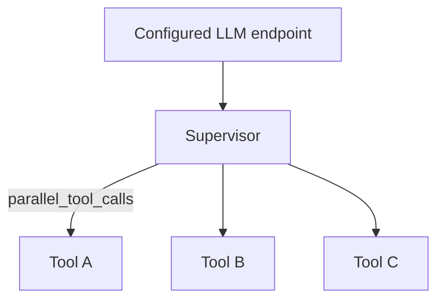

## Description

Measure the full retrieval-augmented generation path before optimizing it. Keep bounded parallel tool execution enabled. Treat FP8 key-value cache and extended context as optional settings for an external vLLM server. Application-level document cache remains separate (ADR-030).

## Context

Local multi-agent RAG performance depends on the model, server, hardware, context size, retrieval work, and tool workload. Parallel tools can reduce wall-clock time when calls are independent. They can also increase contention. FP8 key-value cache can reduce cache storage on supported vLLM deployments, but the repository has no reproducible LLM benchmark that proves a fixed latency, token, or memory improvement.

## Decision Drivers

- Measure end-to-end behavior in the target environment
- Bound parallel work through the orchestration layer
- Keep optional vLLM tuning in server configuration
- Keep configuration library-first

## Alternatives

- A: Server-default cache format. Broad compatibility, but it may use more memory
- B: Smaller context. Lower memory use, but less room for retrieved evidence
- C: Sequential tools. Predictable resource use, but independent calls cannot overlap
- D: Optional FP8 plus bounded parallel tools (Selected). Exposes useful controls without claiming universal gains

### Historical decision framework

The 2025 scores were planning judgments. They are not benchmark results.

| Model / Option | Latency (40%) | VRAM (30%) | Simplicity (20%) | Stability (10%) | Total | Decision |
| --- | --- | --- | --- | --- | --- | --- |
| FP8+parallel (Selected) | 9 | 9 | 8 | 8 | **8.7** | Selected |
| FP16 KV | 6 | 5 | 9 | 9 | 6.7 | Rejected |
| 32K context | 7 | 9 | 9 | 9 | 8.0 | Rejected |

## Decision

Enable bounded parallel tool execution in the supervisor. When an operator selects an external vLLM server, expose the FP8 cache and FlashInfer settings as an optional deployment profile. Do not treat either setting as a performance guarantee.

Measure time to first token, end-to-end latency, prefill and decode throughput, peak host memory, peak accelerator memory, and failure rate. Record the model, backend, hardware, context size, concurrency, and corpus with each result.

## High-Level Architecture


```mermaid
graph TD
  M["Configured LLM endpoint"] --> S["Supervisor"]
  S -->|parallel_tool_calls| T1["Tool A"]
  S --> T2["Tool B"]
  S --> T3["Tool C"]
```

## Related Requirements

### Functional Requirements

- FR‑1: Validate and record external vLLM context, cache, and attention settings
  for operator-managed server launch; inference requests do not forward
  server-only cache or attention controls
- FR‑2: Execute independent tools with bounded parallelism

### Non-Functional Requirements

- NFR‑1: Publish performance figures only with reproducible environment metadata
- NFR‑2: Avoid host or accelerator out-of-memory failures at the configured workload

### Performance Requirements

- PR‑1: Compare parallel and sequential tool execution on the same workload
- PR‑2: Compare cache formats on the same vLLM version, model, and hardware

### Integration Requirements

- IR‑1: Compatible with supervisor orchestration (ADR‑011)
- IR‑2: Separate from application cache (ADR‑030)

## Design

### Architecture Overview

- The external vLLM process owns cache and attention settings
- The supervisor owns bounded parallel tool execution

### Implementation Details

In `src/config/settings.py`:

```python
backend = settings.llm_backend
parallel_tools = settings.agents.enable_parallel_tool_execution
vllm_cache_dtype = settings.vllm.kv_cache_dtype
```

Notes:

- Prefer expressing parallelism at the orchestration layer (LangGraph tool execution)
  using bounded concurrency (e.g., `RunnableConfig.max_concurrency` / supervisor
  settings). Avoid hiding `asyncio.gather(...)` inside tool implementations.
- Keep tools sync-callable (`BaseTool.invoke(...)`) unless the full orchestration is
  migrated end-to-end to async. This preserves compatibility with the current
  `agent.invoke(...)` execution model (ADR-011).

### Configuration

```env
DOCMIND_VLLM__CONTEXT_WINDOW=131072
DOCMIND_VLLM__KV_CACHE_DTYPE=fp8_e5m2
DOCMIND_AGENTS__ENABLE_PARALLEL_TOOL_EXECUTION=true
```

## Testing

```bash
uv run pytest tests/unit/config/test_integrations.py \
  tests/unit/config/test_llm_factory.py tests/unit/agents/test_coordinator.py -q
```

## Consequences

### Positive Outcomes

- Operators can record external vLLM deployment values with
  `DOCMIND_VLLM__*` and orchestration values with `DOCMIND_AGENTS__*`; the
  application does not install vLLM or FlashInfer
- Bounded parallelism is controlled at one orchestration boundary
- Performance claims require reproducible evidence

### Negative Consequences / Trade-offs

- FP8 requires backend and hardware compatibility
- Parallel work can increase contention or provider load

### Ongoing Maintenance & Considerations

- Track vLLM and FlashInfer releases when that optional profile is in use
- Re-run the same benchmark after model, dependency, driver, or hardware changes

### Dependencies

- Server-side (optional): vLLM with a compatible attention backend and accelerator runtime.
- Python app: no vLLM or FlashInfer dependencies. The provider factory uses OpenAI-compatible HTTP with the direct OpenAI, LlamaIndex, LangGraph, and LangChain dependencies.

## Changelog

- 9.2 (2026-07-10): Replace unverified performance guarantees with environment-specific measurements; clarify that vLLM is an optional external server and parallel-tool gains require comparison
- 9.0 (2025-08-26): Separated from application cache (ADR‑030); FP8 + parallel tools focus
- 8.1 (2025-08-20): Verified supervisor parameters for parallelism
- 8.0 (2025-08-19): Record the FP8, extended-context, and parallel-tool planning assumptions; quantitative gains were not backed by a reproducible repository benchmark
- 7.0 (2025-08-19): INT8 KV cache attempt for 262K context
- 6.0 (2025-08-18): Hardware upgrade for 128K via YaRN
