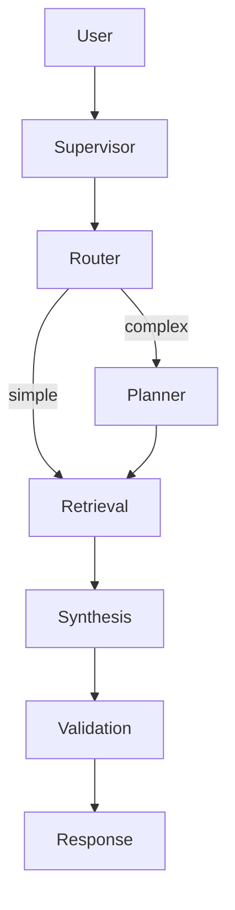

## Description

Use LangGraph Supervisor to coordinate five agent roles (router, planner, retrieval, synthesis, validation). Replace custom orchestration logic with proven, library‑first patterns that are easy to test and maintain.

## Context

DocMind AI relies on multiple agent roles that must coordinate while preserving context and working fully offline. A prebuilt supervisor pattern avoids bespoke state machines and reduces orchestration bugs.

## Decision Drivers

- Simplicity over bespoke orchestration
- Local‑first operation (no external services)
- Clear observability of handoffs and outcomes
- Compatibility with adaptive retrieval (ADR‑003)

## Alternatives

- Monolithic agent — simple but inflexible; weak error recovery
- Manual orchestration — complex state and error handling
- Heavy multi‑agent frameworks — overkill for local desktop app
- LangGraph Supervisor (Selected) — prebuilt, testable patterns

### Decision Framework

| Option                       | Simplicity (40%) | Reliability (30%) | Capability (20%) | Effort (10%) | Total | Decision      |
| --------------------------- | ---------------- | ----------------- | ---------------- | ------------ | ----- | ------------- |
| LangGraph Supervisor        | 10               | 9                 | 9                | 9            | 9.5   | ✅ Selected    |
| Manual orchestration        | 3                | 5                 | 8                | 4            | 4.9   | Rejected      |
| Monolithic agent            | 9                | 4                 | 4                | 8            | 6.1   | Rejected      |

## Decision

Adopt LangGraph Supervisor for five‑agent coordination with minimal customization. Surface small, explicit configuration for logging, parallel tool calls (ADR‑010), and guardrails.

## High-Level Architecture

User → Supervisor → {Router → Planner → Retrieval → Synthesis → Validation} → Response



## Related Requirements

### Functional Requirements

- FR‑1: Orchestrate multi‑agent workflows with conditional execution
- FR‑2: Maintain conversation context and pass state
- FR‑3: Provide fallback and retries for failed steps

### Non-Functional Requirements

- NFR‑1: Coordination overhead ≤500ms
- NFR‑2: Local‑first; no external services
- NFR‑3: Clear boundaries; small testable units

### Performance Requirements

- PR‑1: Coordination overhead ≤500ms at P95
- PR‑2: Parallel tool calls available where safe (see ADR‑010)

### Integration Requirements

- IR‑1: Integrates with ADR‑003 retrieval and ADR‑004 model
- IR‑2: Exposes minimal settings via ADR‑024 config

## Design

### Architecture Overview

- Five roles implemented with prebuilt agents; early exits where applicable
- Minimal prompts; rely on Supervisor primitives

### Implementation Details

```python
# src/agents/supervisor.py (skeleton)
from langgraph_supervisor import create_supervisor

def create_app(llm, tools):
    agents = make_agents(llm, tools)  # router, planner, retrieval, synthesis, validation
    return create_supervisor(agents=agents, model=llm, config={
        "parallel_tool_calls": True,
        "output_mode": "structured",
    })
```

### Configuration

- Flags: `parallel_tool_calls`, `max_parallel_calls`, log level
- Expose as part of unified settings (ADR‑024)

```env
DOCMIND_AGENTS__PARALLEL_TOOL_CALLS=true
DOCMIND_AGENTS__MAX_PARALLEL_CALLS=3
DOCMIND_LOG_LEVEL=INFO
```

## Testing

```python
def test_supervisor_boots_with_agents(supervisor_app):
    result = supervisor_app.invoke({"messages": [{"role": "user", "content": "hi"}]})
    assert "messages" in result
```

## Consequences

### Positive Outcomes

- Simpler code; fewer orchestration bugs
- Clear observability and testability

### Negative Consequences / Trade-offs

- Some constraints from the framework’s control flow

### Dependencies

- Python: `langgraph>=0.2`, `langchain-core>=0.3`, `langgraph-supervisor>=0.0.29`

## Changelog

- 6.1 (2025‑09‑04): Standardized to template; added diagram, PR/IR, config/tests
- 6.0 (2025‑08‑19): Accepted Supervisor implementation; integrates ADR‑003/004/010
