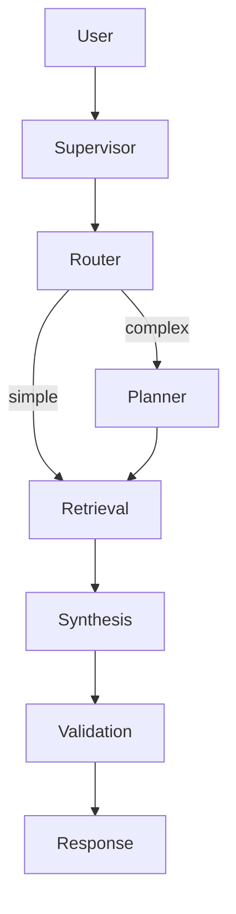

## Description

Use LangGraph `StateGraph` to coordinate five agent roles (router, planner, retrieval, synthesis, validation). Preserve the existing external coordinator behavior while removing the `langgraph-supervisor` dependency (which currently pulls a deprecated `create_react_agent` path).

## Context

DocMind AI relies on multiple agent roles that must coordinate while preserving context and working fully offline. The project originally adopted `langgraph-supervisor` for a prebuilt supervisor pattern. However, the pinned supervisor package relies on deprecated LangGraph prebuilts (`create_react_agent`) which forces local warning suppression and creates upgrade risk.

We therefore migrate the orchestration to graph-native LangGraph primitives (`StateGraph`) while keeping the existing per-role agents built via LangChain v1 `create_agent` and continuing to use LlamaIndex for retrieval/indexing (not as the orchestration runtime).

## Decision Drivers

- Simplicity over bespoke orchestration
- Local‑first operation (no external services)
- Clear observability of handoffs and outcomes
- Compatibility with adaptive retrieval (ADR‑003)
- Avoid deprecated dependencies and reduce upgrade risk

## Alternatives

- Monolithic agent — simple but inflexible; weak error recovery
- Manual orchestration — complex state and error handling
- Heavy multi‑agent frameworks — overkill for local desktop app
- LlamaIndex AgentWorkflow — introduces a second orchestration/state subsystem; would require rewriting existing LangChain/LangGraph tool seams
- LangGraph Supervisor library — prebuilt, but currently depends on deprecated LangGraph prebuilts in the pinned version
- LangGraph StateGraph (Selected) — graph-native, testable, minimizes dependencies and upgrade risk

### Decision Framework

| Option                    | Simplicity (35%) | Reliability (30%) | Maintenance (25%) | Adaptability (10%) | Total | Decision    |
| ------------------------- | ---------------- | ----------------- | ----------------- | ------------------ | ----- | ----------- |
| LangGraph StateGraph      | 9                | 9                 | 9                 | 9                  | 9.0   | ✅ Selected |
| LangGraph Supervisor lib  | 9                | 8                 | 6                 | 7                  | 7.9   | Rejected    |
| LlamaIndex AgentWorkflow  | 6                | 7                 | 6                 | 7                  | 6.4   | Rejected    |
| Manual orchestration      | 3                | 5                 | 5                 | 6                  | 4.3   | Rejected    |
| Monolithic agent          | 9                | 4                 | 6                 | 5                  | 6.2   | Rejected    |

## Decision

Adopt a graph-native LangGraph `StateGraph` for five-agent coordination with minimal customization. Preserve the current `MultiAgentCoordinator` external API and state fields. Keep per-role agents built with LangChain v1 `create_agent` and keep the existing tool interfaces (LangChain tools with LangGraph `InjectedState` / `ToolRuntime` injection).

### Agent Roles and Coordinator

- `Supervisor/Coordinator`: Central controller that routes, hands off, and collects outcomes; owns prompt and guardrails
- `Router`: Chooses retrieval path (hybrid, hierarchical, graph) based on query/metadata
- `Planner`: Decomposes complex queries into sub‑tasks (optional early‑exit for simple queries)
- `Retrieval`: Executes adaptive retrieval (ADR‑003), including multimodal reranking (ADR‑037)
- `Synthesis`: Aggregates evidence into a coherent answer with citations
- `Validation`: Checks relevance/faithfulness; may trigger correction or re‑route

## High-Level Architecture

User → Supervisor → {Router → Planner → Retrieval → Synthesis → Validation} → Response



## Related Requirements

### Functional Requirements

- FR‑1: Orchestrate multi‑agent workflows with conditional execution
- FR‑2: Maintain conversation context and pass state
- FR‑3: Provide fallback and retries for failed steps

### Non-Functional Requirements

- NFR‑1: Coordination overhead ≤500ms
- NFR‑2: Local‑first; no external services
- NFR‑3: Clear boundaries; small testable units

### Performance Requirements

- PR‑1: Coordination overhead ≤500ms at P95
- PR‑2: Parallel tool calls available where safe (see ADR‑010)

### Integration Requirements

- IR‑1: Integrates with ADR‑003 retrieval and ADR‑004 model
- IR‑2: Exposes minimal settings via ADR‑024 config

## Design

### Architecture Overview

- Five roles implemented with prebuilt agents; early exits where applicable
- Minimal prompts; rely on Supervisor primitives

### Implementation Details

```python
# src/agents/coordinator.py (skeleton)
from langgraph.graph import END, START, StateGraph

SUPERVISOR_PROMPT = (
    "You are a supervisor coordinating a modern 5‑agent RAG system. "
    "Route, plan, retrieve, synthesize, and validate answers. Prefer minimal steps."
)

def create_app(state_schema, nodes, *, checkpointer, store):
    # nodes: router_agent/planner_agent/retrieval_agent/synthesis_agent/validation_agent
    graph = StateGraph(state_schema)
    for name, node in nodes.items():
        graph.add_node(name, node)

    # Minimal deterministic pipeline; optional early exits are encoded in router/planner nodes.
    graph.add_edge(START, "router_agent")
    graph.add_edge("router_agent", "planner_agent")
    graph.add_edge("planner_agent", "retrieval_agent")
    graph.add_edge("retrieval_agent", "synthesis_agent")
    graph.add_edge("synthesis_agent", "validation_agent")
    graph.add_edge("validation_agent", END)

    return graph.compile(checkpointer=checkpointer, store=store)
```

### Supervisor Configuration (Key Options)

- `parallel_tool_calls`: Enable concurrent tool/agent branches to reduce tokens (50–87%)
- `output_mode`: Controls message history added by the supervisor. Supported values:
  - `"last_message"` (default): Add only the final agent message
  - `"full_history"`: Add the entire agent message history
- `create_forward_message_tool`: Allow direct message passthrough when no processing is needed
- `add_handoff_messages`: Emit coordination breadcrumbs for debugging and audits
- `pre_model_hook`/`post_model_hook`: Trim context (e.g., at ~120K) and attach metrics (always-on)

### Configuration

- Flags: `parallel_tool_calls`, `max_parallel_calls`, log level
- Expose as part of unified settings (ADR‑024)

```env
DOCMIND_AGENTS__ENABLE_PARALLEL_TOOL_EXECUTION=true
DOCMIND_AGENTS__MAX_CONCURRENT_AGENTS=3
DOCMIND_LOG_LEVEL=INFO
```

### Deprecations

- `output_mode="structured"` is not supported by the Supervisor. Structured metadata belongs in state and response models. Use `output_mode="last_message"` or `"full_history"` and rely on hooks/state to record metrics.
- `add_handoff_back_messages` is no longer relied upon; use `add_handoff_messages=True` to include handoff traces.

## Testing

```python
def test_supervisor_boots_with_agents(supervisor_app):
    result = supervisor_app.invoke({"messages": [{"role": "user", "content": "hi"}]})
    assert "messages" in result
```

## Limitations / Future Improvements

- Deadline propagation: The supervisor’s wall-clock timeout (decision timeout) is enforced at the coordinator boundary. Deadlines are not yet propagated to nested LLM/tool calls, so a long-running subcall may continue even after the overall timeout has elapsed. In practice, the coordinator returns a timeout fallback quickly and stops streaming to the UI, but subcalls may continue in the background. A future enhancement should propagate an absolute deadline or remaining time budget through agent graph calls and tools to enable cooperative cancellation.

## Consequences

### Positive Outcomes

- Simpler code; fewer orchestration bugs
- Clear observability and testability

### Negative Consequences / Trade-offs

- Some constraints from the framework’s control flow

### Dependencies

- Python: `langgraph>=1.0.5`, `langchain-core>=1.2.6` (remove `langgraph-supervisor`)

### Ongoing Maintenance & Considerations

- Track LangGraph breaking changes; pin versions in lockfile
- Periodically review agent prompts and routing heuristics with logs
- Keep supervisor config minimal; avoid custom state machines

## Changelog

- 6.2 (2025‑09‑04): Restored explicit agent role list and supervisor configuration details (parallel_tool_calls, output_mode, create_forward_message_tool, add_handoff_back_messages) with hook notes and prompt
- 6.1 (2025‑09‑04): Standardized to template; added diagram, PR/IR, config/tests
- 6.0 (2025‑08‑19): Accepted Supervisor implementation; integrates ADR‑003/004/010
- 7.0 (2026‑01‑17): Migrate orchestration to graph-native LangGraph `StateGraph`; remove `langgraph-supervisor` dependency due to deprecated `create_react_agent` path.

## Supervisor Configuration Updates

- Supervisor `output_mode` MUST be one of `last_message` (default) or `full_history`. A custom `structured` output mode is NOT supported; structured metadata SHOULD be carried in state/response models.
- Rename legacy `add_handoff_back_messages` to `add_handoff_messages`.
- Prefer `create_forward_message_tool("supervisor")` when summarization is unnecessary.

## Performance & Timeouts

- Coordinators SHOULD enforce elapsed‑time guards around streaming and tool execution; publish sane defaults and document override points.

## Streaming Fallback & Analytics

- The Chat UI MUST implement streaming fallback using chunked `write_stream`.
- Analytics MUST be best‑effort and non‑blocking; failures MUST NOT impact the user experience.
