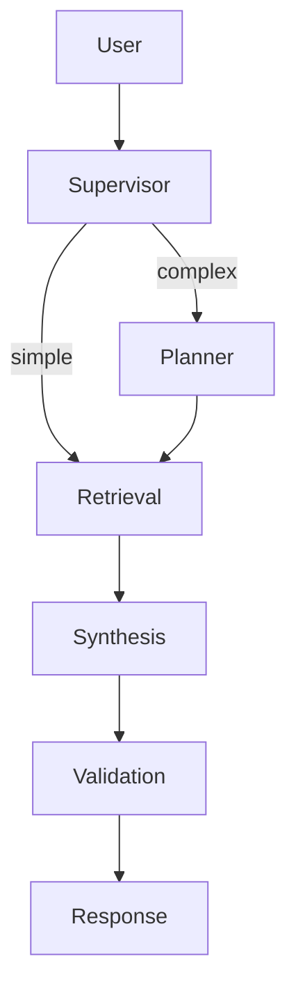

## Description

Use LangGraph `StateGraph` to coordinate four agent roles: planner, retrieval, synthesis, and validation. The retrieval worker delegates strategy selection to LlamaIndex's native `RouterQueryEngine`. Preserve the external coordinator behavior while removing the legacy third-party supervisor wrapper and duplicate query-routing agent.

## Context

DocMind AI relies on multiple agent roles that must coordinate while preserving context and working fully offline. The project originally adopted a third‑party supervisor wrapper for a prebuilt supervisor pattern. However, the pinned wrapper depended on deprecated LangGraph prebuilts, which forced local warning suppression and created upgrade risk.

We therefore migrate the orchestration to graph-native LangGraph primitives (`StateGraph`) while keeping the existing per-role agents built via LangChain v1 `create_agent` and continuing to use LlamaIndex for retrieval/indexing (not as the orchestration runtime).

ADR-066 re-evaluated modern `llama-index-workflows` and LlamaAgents options for
issue #86. The decision remains unchanged for the default runtime: LangGraph
`StateGraph` stays canonical. Any future LlamaIndex Workflows work must be a
contained, in-process pilot with explicit parity gates and net code deletion
potential before replacement can be considered.

## Decision Drivers

- Simplicity over bespoke orchestration
- Local‑first operation (no external services)
- Clear observability of handoffs and outcomes
- Compatibility with adaptive retrieval (ADR‑003)
- Avoid deprecated dependencies and reduce upgrade risk

## Alternatives

- Monolithic agent — simple but inflexible; weak error recovery
- Manual orchestration — complex state and error handling
- Heavy multi‑agent frameworks — overkill for local desktop app
- LlamaIndex AgentWorkflow — introduces a second orchestration/state subsystem; would require rewriting existing LangChain/LangGraph tool seams
- Modern LlamaIndex Workflows — active and promising for contained future
  pilots, but not a replacement for the current default runtime without
  checkpoint, store, streaming, deadline, cache, telemetry, and offline parity
  evidence (see ADR-066)
- Third‑party supervisor wrapper — prebuilt, but depended on deprecated LangGraph prebuilts in the pinned version
- LangGraph StateGraph (Selected) — graph-native, testable, minimizes dependencies and upgrade risk

### Decision Framework

| Option | Simplicity (35%) | Reliability (30%) | Maintenance (25%) | Adaptability (10%) | Total | Decision |
| --- | --- | --- | --- | --- | --- | --- |
| LangGraph StateGraph | 9 | 9 | 9 | 9 | 9.0 | Selected |
| Third‑party supervisor | 9 | 8 | 6 | 7 | 7.9 | Rejected |
| LlamaIndex AgentWorkflow | 6 | 7 | 6 | 7 | 6.4 | Rejected |
| Manual orchestration | 3 | 5 | 5 | 6 | 4.3 | Rejected |
| Monolithic agent | 9 | 4 | 6 | 5 | 6.2 | Rejected |

## Decision

Adopt a graph-native LangGraph `StateGraph` for four-agent coordination with minimal customization. Preserve the current `MultiAgentCoordinator` external API. Keep per-role agents built with LangChain v1 `create_agent`, retain the existing LangChain tool interfaces with LangGraph `ToolRuntime` injection, and make LlamaIndex's `RouterQueryEngine` the sole retrieval-strategy selector.

### Agent Roles and Coordinator

- `Supervisor/Coordinator`: Central controller that routes, hands off, and collects outcomes; owns prompt and guardrails
- `Planner`: Decomposes complex queries into sub‑tasks (optional early‑exit for simple queries)
- `Retrieval`: Uses the native router for adaptive retrieval (ADR‑003), including multimodal reranking (ADR‑037)
- `Synthesis`: Aggregates evidence into a coherent answer with citations
- `Validation`: Checks relevance/faithfulness; may trigger correction or re‑route

## High-Level Architecture

User → Supervisor → {Planner → Retrieval → Synthesis → Validation} → Response


```mermaid
graph TD
  U["User"] --> S["Supervisor"]
  S -->|complex| P["Planner"]
  S -->|simple| T["Retrieval"]
  P --> T
  T --> Y["Synthesis"]
  Y --> V["Validation"]
  V --> O["Response"]
```

## Related Requirements

### Functional Requirements

- FR‑1: Orchestrate multi‑agent workflows with conditional execution
- FR‑2: Maintain conversation context and pass state
- FR‑3: Provide bounded retries and explicit timeout or error responses

### Non-Functional Requirements

- NFR‑1: Coordination overhead ≤500ms
- NFR‑2: Local‑first; no external services
- NFR‑3: Clear boundaries; small testable units

### Performance Requirements

- PR‑1: Coordination overhead ≤500ms at P95
- PR‑2: Parallel tool calls available where safe (see ADR‑010)

### Integration Requirements

- IR‑1: Integrates with ADR‑003 retrieval and ADR‑004 model
- IR‑2: Exposes minimal settings via ADR‑024 config

## Design

### Architecture Overview

- Four roles implemented with LangChain v1 `create_agent`; early exits where applicable
- Minimal prompts; rely on Supervisor primitives

### Implementation Details

```python
# src/agents/coordinator.py (skeleton)
from langchain.agents import create_agent
from langgraph.checkpoint.memory import InMemorySaver

from src.agents.models import MultiAgentGraphState
from src.agents.supervisor_graph import (
    SupervisorBuildParams,
    build_multi_agent_supervisor_graph,
)

# Build role-specific agents (LangChain v1 create_agent).
planner_agent = create_agent(model, tools=planner_tools, state_schema=MultiAgentGraphState, name="planner_agent")
retrieval_agent = create_agent(model, tools=retrieval_tools, state_schema=MultiAgentGraphState, name="retrieval_agent")
synthesis_agent = create_agent(model, tools=synthesis_tools, state_schema=MultiAgentGraphState, name="synthesis_agent")
validation_agent = create_agent(model, tools=validation_tools, state_schema=MultiAgentGraphState, name="validation_agent")

# Build a parent StateGraph supervisor with one atomic dispatch tool.
graph = build_multi_agent_supervisor_graph(
    [planner_agent, retrieval_agent, synthesis_agent, validation_agent],
    model=model,
    prompt=SUPERVISOR_PROMPT,
    state_schema=MultiAgentGraphState,
    params=SupervisorBuildParams(output_mode="last_message"),
)
compiled = graph.compile(checkpointer=InMemorySaver(), store=store)
```

### Supervisor Configuration (Key Options)

- `output_mode`: Controls message history added by each subagent handoff. Supported values:
  - `"last_message"` (default): Add only the final agent message
  - `"full_history"`: Add the entire agent message history
- `dispatch_agents`: The supervisor's only navigation tool. One call carries a
  unique destination list and schedules independent workers atomically.
- `add_handoff_messages`: Emit coordination breadcrumbs for debugging and audits.
- `add_handoff_back_messages`: Emit return-to-supervisor breadcrumbs after each
  worker.
- Hooks: Apply trimming/metrics with LangChain agent middleware (`before_model`/`after_model`).
  When trimming messages, use the `RemoveMessage(id=REMOVE_ALL_MESSAGES)` mechanism so the
  `add_messages` reducer replaces history rather than appending.

### Configuration

LangGraph owns atomic dispatch scheduling. DocMind exposes only live coordinator
budgets and injection controls through unified settings (ADR-024).

```env
DOCMIND_AGENTS__DECISION_TIMEOUT=200
DOCMIND_LOG_LEVEL=INFO
```

### Deprecations

- Deprecated LangGraph prebuilts are not used; build subagents with `langchain.agents.create_agent`.
- `output_mode="structured"` is not supported. Structured metadata belongs in state/response models.

## Testing

```python
def test_supervisor_boots_with_agents(supervisor_app):
    result = supervisor_app.invoke({"messages": [{"role": "user", "content": "hi"}]})
    assert "messages" in result
```

## Limitations / Future Improvements

- Deadline propagation: The supervisor’s wall-clock timeout (decision timeout) is enforced at the coordinator boundary. Deadlines are not yet propagated to every nested LLM/tool call, so a long-running subcall may continue after the overall timeout has elapsed. The coordinator returns a canonical timeout response and stops consuming supervisor state, but a subcall without cooperative cancellation may continue in the background. A future enhancement should propagate an absolute deadline or remaining time budget through every agent graph call and tool.
- Tool invocation model: The current supervisor graph calls subagents synchronously
  via `agent.invoke(...)`. Tools SHOULD remain sync-callable (`BaseTool.invoke(...)`)
  unless the orchestration is migrated end-to-end to async. Parallel tool execution,
  when enabled, SHOULD be handled by the tool execution layer with bounded
  concurrency (ADR-010), not by embedding `asyncio.gather(...)` inside tool bodies.

## Consequences

### Positive Outcomes

- Simpler code; fewer orchestration bugs
- Clear observability and testability

### Negative Consequences / Trade-offs

- Some constraints from the framework’s control flow

### Dependencies

- `pyproject.toml` defines compatible dependency ranges and `uv.lock` records
  the authoritative resolved versions. The runtime uses LangGraph, LangChain,
  `llama-index-core`, and selected adapters. `llama-index-workflows` remains a
  transitive dependency rather than a second orchestration runtime.

### Ongoing Maintenance & Considerations

- Track LangGraph breaking changes; pin versions in lockfile
- Periodically review agent prompts and routing heuristics with logs
- Keep supervisor config minimal; avoid custom state machines

## Changelog

- 7.5 (2026-07-13): Hard-cut supervisor navigation to one atomic
  `dispatch_agents` tool and remove competing parent-navigation tools.
- 7.4 (2026-07-13): Remove the obsolete shared-client toggle and brittle lockfile
  version snapshot; keep provider retries and resolved versions with their owners
- 7.3 (2026-07-11): Replaced the removed LlamaIndex meta-package reference with the direct core and selected-adapter contract.
- 7.2 (2026-05-01): Linked ADR-066 issue #86 decision; reaffirmed LangGraph as
  the default runtime and refreshed dependency posture.
- 7.1 (2026‑01‑18): Clarified handoff option deprecations and aligned dependency
  references with `pyproject.toml` as the source of truth.
- 7.0 (2026‑01‑17): Migrate orchestration to graph-native LangGraph `StateGraph`;
  remove legacy third‑party supervisor wrapper due to deprecated prebuilt agent
  dependency.
- 6.2 (2025‑09‑04): Restored the explicit agent role list and then-current
  supervisor handoff options with hook notes and prompt guidance.
- 6.1 (2025‑09‑04): Standardized to template; added diagram, PR/IR, config/tests
- 6.0 (2025‑08‑19): Accepted Supervisor implementation; integrates ADR‑003/004/010

## Supervisor Configuration Updates

- Supervisor `output_mode` MUST be one of `last_message` (default) or `full_history`. A custom `structured` output mode is NOT supported; structured metadata SHOULD be carried in state/response models.
- Finish with a direct supervisor response. Do not expose a second parent-navigation
  tool alongside `dispatch_agents`.

## Performance & Timeouts

- Coordinators SHOULD enforce elapsed‑time guards around streaming and tool execution; publish sane defaults and document override points.

## Streaming Fallback & Analytics

- The Chat UI MUST implement streaming fallback using chunked `write_stream`.
- Analytics MUST be best‑effort and non‑blocking; failures MUST NOT impact the user experience.
