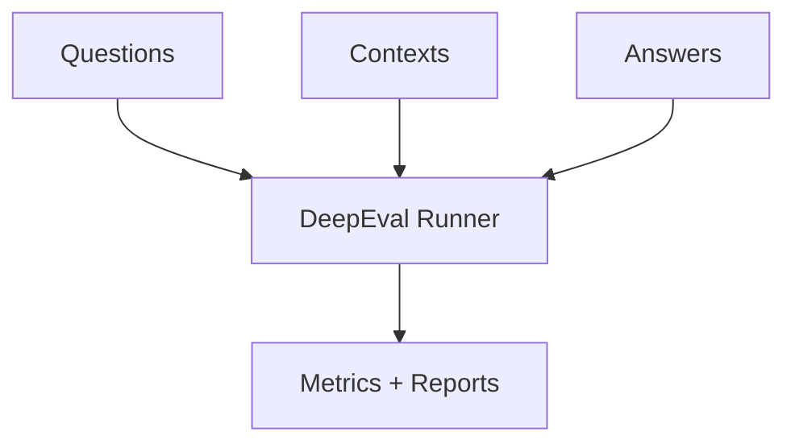

## Description

Adopt DeepEval for quality evaluation (RAG and LLM) with minimal glue. Replace custom evaluators with library metrics; keep tests local and deterministic.

## Context

Custom evaluation code was large and brittle. DeepEval provides ready metrics for relevance, faithfulness, context precision/recall, toxicity, and latency that fit our needs with little code.

## Decision Drivers

- Reduce custom evaluation code
- Use standard metrics; keep tests local/offline
- Integrate with agentic pipelines for regression checks

## Alternatives

- A: Custom evaluators — Flexible but heavy to maintain
- B: DeepEval (Selected) — Library‑first, minimal glue
- C: Ad‑hoc spot checks — Insufficient rigor

### Decision Framework

| Model / Option         | Rigor (35%) | Simplicity (35%) | Local (20%) | Maintenance (10%) | Total | Decision      |
| ---------------------- | ----------- | ---------------- | ----------- | ----------------- | ----- | ------------- |
| DeepEval (Selected)    | 8           | 9                | 9           | 9                 | **8.6** | ✅ Selected    |
| Custom evaluators      | 9           | 3                | 9           | 4                 | 6.6   | Rejected      |
| Spot checks            | 3           | 9                | 9           | 9                 | 6.0   | Rejected      |

## Decision

Use DeepEval metrics for RAG and LLM evaluation; maintain small wrappers to run locally with our models.

## High-Level Architecture



## Related Requirements

### Functional Requirements

- FR‑1: Evaluate answers using relevance/faithfulness and context metrics
- FR‑2: Capture latency and basic quality signals in CI

### Non-Functional Requirements

- NFR‑1: Offline/local determinism
- NFR‑2: Minimal code; library‑first

### Performance Requirements

- PR‑1: Evaluation overhead per case <300ms locally

### Integration Requirements

- IR‑1: Runnable in CI with local models

## Design

### Architecture Overview

- DeepEval runner consumes questions, contexts, and answers to produce metrics and reports.
- Runs locally with our selected LLM; wrappers keep setup minimal and deterministic.

### Implementation Details

In `tests/eval/test_rag.py` (illustrative):

```python
from deepeval import evaluate
from deepeval.metrics import AnswerRelevancyMetric, FaithfulnessMetric
from deepeval.test_case import LLMTestCase

def evaluate_response(query: str, answer: str, contexts: list[str]):
    metrics = [
        AnswerRelevancyMetric(threshold=0.7, model="local-llm"),
        FaithfulnessMetric(threshold=0.7, model="local-llm"),
        # Optional: context precision/recall metrics
        # ContextualPrecisionMetric(threshold=0.7, model="local-llm"),
        # ContextualRecallMetric(threshold=0.7, model="local-llm"),
    ]
    case = LLMTestCase(input=query, actual_output=answer, retrieval_context=contexts)
    return evaluate(test_cases=[case], metrics=metrics, print_results=False)
```

### Configuration

```env
DOCMIND_EVAL__ENABLED=true
```

## Testing

```python
def test_eval_passes(mini_corpus, rag_answer):
    # smoke: ensure metrics run and produce scores
    pass
```

## Consequences

### Positive Outcomes

- Standardized metrics and simpler code
- Repeatable, local evaluation in CI

### Negative Consequences / Trade-offs

- Library evolution requires periodic updates

### Ongoing Maintenance & Considerations

- Freeze metric thresholds to stabilize CI

### Dependencies

- Python: `deepeval`

## Changelog

- 4.0 (2025-08-19): DeepEval adopted; accepted
- 3.3 (2025-08-18): Reverted to Qwen3‑14B eval model
- 3.2 (2025-08-18): Corrected model naming
- 3.1 (2025-08-18): Added DSPy/GraphRAG‑specific metrics
- 3.0 (2025-08-17): Finalized with Qwen3‑14B; accepted status
- 2.0 (2025-08-17): Simplified to DeepEval
- 1.0 (2025-01-16): Original large custom evaluation
