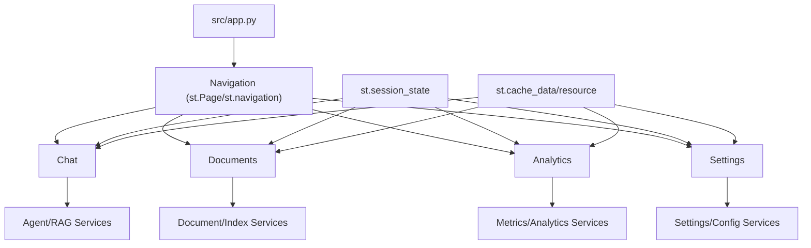

## Description

Adopt a Streamlit-based, programmatic multipage UI that favors native components, native caching/state, and native streaming. Provide chat, documents, analytics, and settings pages with a consistent, simple architecture integrated with agentic retrieval, document processing, and local metrics.

## Context

The UI must surface agentic RAG (ADR‑001), multimodal processing (ADR‑009), adaptive retrieval (ADR‑003), local analytics (ADR‑032), and reranker controls (ADR‑036) while remaining simple and maintainable. Prior approaches mixed ad‑hoc state and external components; this ADR standardizes on native Streamlit patterns for predictable behavior and minimal code.

## Decision Drivers

- Simplicity and maintainability (KISS, library‑first)
- Native Streamlit features for state, caching, and streaming
- Programmatic multipage navigation without custom routing
- Smooth integration with state (ADR‑016) and settings (ADR‑024)
- Fast local performance and low setup friction

## Alternatives

- A: Directory‑based multipage Streamlit — Pros: simple; Cons: limited navigation/state patterns
- B: Gradio — Pros: rapid ML UI; Cons: weaker multipage, customization limits
- C: FastAPI + React — Pros: maximal flexibility; Cons: overkill for local‑first
- D: Programmatic Streamlit (Selected) — Pros: native, fast, minimal code; Cons: fewer deep customization hooks

### Decision Framework

| Model / Option                | Simplicity (35%) | UX (30%) | Integration (20%) | Maintenance (15%) | Total Score | Decision    |
| ----------------------------- | ---------------- | -------- | ----------------- | ----------------- | ----------- | ----------- |
| Programmatic Streamlit (Sel.) | 9                | 9        | 9                 | 9                 | **9.0**     | ✅ Selected |
| Directory‑based multipage     | 8                | 6        | 6                 | 7                 | 6.9         | Rejected    |
| Gradio                        | 9                | 6        | 5                 | 8                 | 6.9         | Rejected    |
| FastAPI + React               | 4                | 9        | 9                 | 5                 | 6.4         | Rejected    |

## Decision

We adopt Streamlit’s programmatic multipage pattern with native components and caching. Pages: Chat (native streaming), Documents (sortable/filterable table; prefer `st.dataframe`, allow AgGrid only when necessary), Analytics (Plotly charts), and Settings (forms). Reranking remains always-on with internal guardrails (ADR‑024/SPEC‑005); v1 avoids advanced reranker controls in the UI. State uses `st.session_state`; caching uses `st.cache_data` and `st.cache_resource`.

### GraphRAG UI Controls (Amendment)

- Documents page: add toggle “Build GraphRAG (beta)” to optionally construct `PropertyGraphIndex` post‑ingestion and expose export buttons (JSONL baseline; Parquet optional with pyarrow).
- Chat page: when a snapshot exists, default strategy to Router (vector+graph); display a staleness badge when `corpus_hash`/`config_hash` from the latest manifest differ from the current environment; provide an action to rebuild.
- Session state entries: `vector_index`, `pg_index`, `router_engine`, `snapshot_manifest` (see ADR‑016 and ADR‑038).

## High-Level Architecture



## Related Requirements

### Functional Requirements

- FR‑1: Multipage navigation via `st.Page`/`st.navigation`
- FR‑2: Document table with sorting/filtering (prefer `st.dataframe`; AgGrid optional)
- FR‑3: Chat page streams token output natively
- FR‑4: Analytics dashboard with charts (Plotly)
- FR‑5: Settings forms for model and feature flags
- FR‑6: Cross‑page session state and chat history

### Non-Functional Requirements

- NFR‑1 (Performance): <2s page load, <100ms interactive response
- NFR‑2 (Accessibility): Keyboard navigation; readable theme
- NFR‑3 (Maintainability): <500 LOC per page; minimal custom code

### Performance Requirements

- PR‑1: Chat streaming updates at >10 tokens/sec for small responses
- PR‑2: Analytics charts render <300ms with cached data

### Integration Requirements

- IR‑1: Reranking stays always-on with internal guardrails (ADR‑024/SPEC‑005)
- IR‑2: Use unified settings (ADR‑024) and state model (ADR‑016)

## Design

### Architecture Overview

- Programmatic pages defined in `src/app.py` using `st.Page` and `st.navigation`
- Native session state for cross‑page context; no custom state manager
- Native caching for data/resources; avoid bespoke caches

### Implementation Details

In `src/app.py`:

```python
import streamlit as st

st.set_page_config(page_title="DocMind AI", page_icon="📄", layout="wide", initial_sidebar_state="expanded")

chat = st.Page("src/pages/01_chat.py", title="Chat", icon="💬", default=True)
docs = st.Page("src/pages/02_documents.py", title="Documents", icon="📁")
analytics = st.Page("src/pages/03_analytics.py", title="Analytics", icon="📊")
settings = st.Page("src/pages/04_settings.py", title="Settings", icon="⚙️")

nav = st.navigation({"Main": [chat, docs], "System": [analytics, settings]})
st.logo("assets/docmind_logo.png", icon_image="assets/docmind_icon.png")
nav.run()
```

**Page naming convention:** Page files are prefixed with a two-digit index (e.g., `01_chat.py`, `02_documents.py`) to enforce deterministic ordering in Streamlit’s page discovery and to keep sidebar grouping predictable. Keep leading zeros for correct lexical ordering, avoid reusing indices, and ensure filenames match the `st.Page` registrations.

### Configuration

`.streamlit/config.toml`:

```toml
[theme]
primaryColor = "#4A90E2"
backgroundColor = "#FFFFFF"
secondaryBackgroundColor = "#F8F9FA"
textColor = "#2C3E50"
font = "Inter"

[runner]
fastReruns = true
enforceSerializableSessionState = false

[server]
enableCORS = false
enableWebsocketCompression = true
enableXsrfProtection = true
maxUploadSize = 1000

[browser]
gatherUsageStats = false
```

## Testing

Use pytest with lightweight smoke tests and streaming checks.

```python
import pytest

def test_pages_construct():
    import streamlit as st
    st.Page("src/pages/01_chat.py", title="Chat", icon="💬", default=True)
    st.Page("src/pages/02_documents.py", title="Documents", icon="📁")

def test_page_registry_metadata():
    # Verify titles/icons/default selection for registered pages.
    # (Implementation-specific: assert against Streamlit's page registry.)
    ...

def test_session_state_shared_keys(app_runner):
    # Load Chat and Documents pages to confirm shared session_state keys persist.
    ...

@pytest.mark.asyncio
async def test_streaming_generator(mock_llm):
    async for token in mock_llm.astream("hi"):
        assert isinstance(token, str)
        break
```

## Consequences

### Positive Outcomes

- Native Streamlit primitives; minimal custom infrastructure
- Faster development and simpler maintenance
- Consistent UX with programmatic navigation
- Easy integration with reranker controls and analytics

### Negative Consequences / Trade-offs

- Less fine‑grained control vs. custom web stack
- Optional components (AgGrid) introduce extra deps if used

### Ongoing Maintenance & Considerations

- Track Streamlit release notes for `st.Page`/`st.navigation` changes
- Monitor page load and interaction latency; profile slow render paths
- Keep pages under 500 LOC; refactor heavy logic to services

### Dependencies

- Python: `streamlit>=1.36.0`, `plotly>=5.17.0`
- Optional: `streamlit-aggrid>=0.3.4` (if large tables require it)
- Assets: Logo/icon files under `assets/`

## Changelog

- **3.2 (2025-09-09)**: Added GraphRAG toggle, exports, and staleness badge integration; linked to ADR‑038/019
- **3.1 (2025-09-03)**: DOCS - Added related-decision reference to ADR-036 (now superseded)
- **3.0 (2025-08-17)**: Accepted version reflecting premium Streamlit multipage UI and modern patterns
- **2.0 (2025-08-17)**: MAJOR — Complete redesign with modern multipage architecture, component integration, advanced state management, and production-ready performance optimization
- **1.0 (2025-01-16)**: Initial user interface architecture with basic Streamlit implementation
