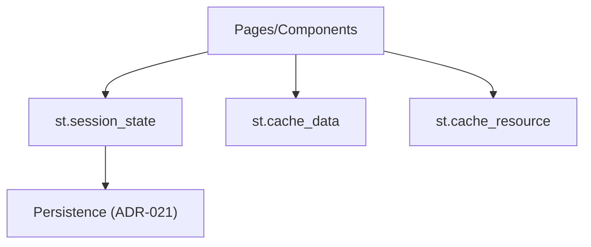

## Description

Use Streamlit’s native `st.session_state`, `st.cache_data`, and `st.cache_resource` with minimal glue. Avoid custom state layers.

## Context

Earlier versions introduced custom SessionState/Cache managers. Streamlit provides sufficient primitives for a local app; native usage reduces code and complexity.

## Decision Drivers

- Simplicity; fewer moving parts
- Native primitives are battle‑tested
- Works well with programmatic multipage UI (ADR‑013)

## Alternatives

- A: Custom state/cache layers — Over‑engineered
- B: Streamlit native (Selected) — Simple and maintainable

### Decision Framework

| Model / Option            | Simplicity (40%) | Reliability (30%) | Integration (20%) | Maintenance (10%) | Total | Decision      |
| ------------------------- | ---------------- | ----------------- | ----------------- | ----------------- | ----- | ------------- |
| Streamlit native (Sel.)   | 10               | 9                 | 9                 | 9                 | **9.5** | ✅ Selected    |
| Custom layer              | 4                | 6                 | 7                 | 5                 | 5.5   | Rejected      |

## Decision

Adopt Streamlit native state and caching. For conversational memory, integrate with ChatMemoryBuffer/ChatStore (ADR‑021) without adding new state layers.

## High-Level Architecture



## Related Requirements

### Functional Requirements

- FR‑1: Cross‑page state for chat and controls
- FR‑2: Cached data and resources

### Non-Functional Requirements

- NFR‑1: <100ms interaction latency
- NFR‑2: <500 LOC per page

### Performance Requirements

- PR‑1: Cache hit path negligible overhead

### Integration Requirements

- IR‑1: Compatible with ADR‑013 UI and ADR‑021 memory

## Design

### Architecture Overview

- Pages and components read/write `st.session_state` for cross‑page state.
- `st.cache_data` caches small/fast results; `st.cache_resource` caches heavy resources.
- Conversational persistence integrates with ADR‑021 (ChatMemory) when needed.

### Implementation Details

In `src/app.py`:

```python
if "messages" not in st.session_state:
    st.session_state["messages"] = []

@st.cache_data(ttl=300)
def load_documents():
    # inexpensive cached data
    return []

@st.cache_resource
def get_vector_client():
    # expensive client
    return object()
```

### Configuration

No new settings.

## Testing

```python
def test_session_state_defaults():
    # smoke: defaults created without error
    pass
```

## Consequences

### Positive Outcomes

- Less code; easier maintenance
- Predictable behavior across pages

### Negative Consequences / Trade-offs

- Limited customization vs. bespoke layers

### Ongoing Maintenance & Considerations

- Track Streamlit state/caching changes

### Dependencies

- Python: `streamlit`

## Changelog

- 4.2 (2025-08-18): Corrected model naming; minor state improvements
- 4.1 (2025-08-18): Enhanced state for 5‑agent workflows; DSPy/GraphRAG support
- 4.0 (2025-08-17): [Missing note]
- 3.0 (2025-08-17): Finalized with Qwen3 models; accepted
- 2.0 (2025-08-17): Simplified to native state
- 1.0 (2025-08-17): Original custom state layer
