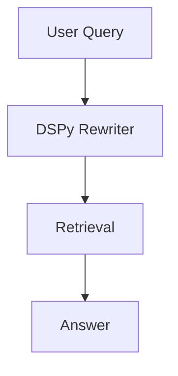

## Description

Adopt DSPy for automatic prompt optimization and query rewriting, starting zero‑shot and evolving to few‑shot with collected examples. Keep integration thin and local‑first.

## Context

Manual prompt tuning is slow and inconsistent. DSPy compiles prompt programs and can optimize without large training sets (MIPROv2).

## Decision Drivers

- Improve retrieval quality via better queries
- Keep implementation simple and library‑first
- Run entirely locally with our LLM setup

## Alternatives

- A: Manual prompts — Unsystematic and time‑consuming
- B: LCEL few‑shot — Helpful, but not self‑optimizing
- C: DSPy (Selected) — Programmatic and self‑improving

### Decision Framework

| Model / Option | Quality (40%) | Simplicity (30%) | Local (20%) | Maintenance (10%) | Total | Decision      |
| -------------- | ------------- | ---------------- | ----------- | ----------------- | ----- | ------------- |
| DSPy (Sel.)    | 9             | 8                | 9           | 8                 | **8.7** | ✅ Selected    |
| LCEL few‑shot   | 7             | 7                | 9           | 8                 | 7.6   | Rejected      |
| Manual          | 5             | 9                | 9           | 9                 | 6.9   | Rejected      |

## Decision

Integrate a DSPy query‑rewriter step before retrieval and compile prompts progressively (zero‑shot → few‑shot) as data accrues.

## High-Level Architecture



## Related Requirements

### Functional Requirements

- FR‑1: Rewrite queries; expand terms
- FR‑2: Track improvement vs. baseline

### Non-Functional Requirements

- NFR‑1: <200ms optimization overhead
- NFR‑2: Local‑first execution

### Integration Requirements

- IR‑1: Works with ADR‑003/001 pipelines

## Design

### Architecture Overview

- DSPy rewrites queries before retrieval; progressive compilation improves prompts as examples accrue.
- Keeps latency low (<200ms target) and runs locally with our LLM.

### Implementation Details

In `src/llm/prompt_opt.py` (illustrative):

```python
import dspy

# configure local LLM and retrieval model
def configure_dspy_from_settings():
    # Example only: wire your local LM and retrieval model if desired
    # dspy.settings.configure(lm=dspy.LM("local"), rm=dspy.ColBERTv2(url="http://localhost:8893/api/search"))
    pass

class QueryExpansion(dspy.Signature):
    """Expand a query into search variants for better retrieval."""
    original_query: str = dspy.InputField()
    expanded_queries: list[str] = dspy.OutputField()
    keywords: list[str] = dspy.OutputField()

class QueryRewriter(dspy.Module):
    """Simple DSPy module for query rewriting."""
    def __init__(self):
        super().__init__()
        # In a real implementation you'd compile a program here
        self.program = None

    def forward(self, query: str) -> str:
        # Minimal identity; plug DSPy program when ready
        return query

def rewrite(query: str) -> str:
    # placeholder for DSPy program; identity until optimized
    return QueryRewriter() .forward(query)

def optimize_program(examples: list[tuple[str, str]] | None = None):
    """Run a compile step (e.g., MIPROv2) when examples are available."""
    if not examples:
        return None  # zero-shot path; nothing to do
    # Example skeleton only; replace with actual compile call when enabled
    # from dspy.teleprompt import MIPROv2
    # teleprompter = MIPROv2()
    # program = teleprompter.compile(QueryRewriter(), trainset=examples)
    return None
```

### Configuration

```env
# Enable DSPy optimization (planned flag; off by default)
DOCMIND_ENABLE_DSPY_OPTIMIZATION=false
DOCMIND_DSPY_OPTIMIZATION_ITERATIONS=10
DOCMIND_DSPY_OPTIMIZATION_SAMPLES=20
DOCMIND_DSPY_MAX_RETRIES=3
DOCMIND_DSPY_TEMPERATURE=0.1
DOCMIND_DSPY_METRIC_THRESHOLD=0.8
DOCMIND_ENABLE_DSPY_BOOTSTRAPPING=true
```

## Testing

```python
def test_rewrite_smoke():
    assert rewrite("hello")
```

## Consequences

### Positive Outcomes

- Systematic prompt improvements; minimal glue

### Negative Consequences / Trade-offs

- Requires curated examples for later few‑shot gains

### Ongoing Maintenance & Considerations

- Periodically refresh evaluation and examples

### Dependencies

- Python: `dspy`

## Changelog

- 2.1 (2025-08-22): Implementation complete
- 2.0 (2025-08-19): FP8 model optimization for DSPy
- 1.0 (2025-08-17): Initial design
