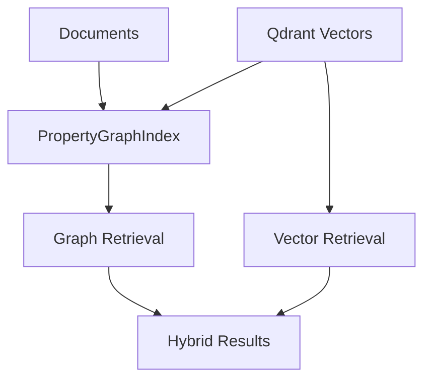

## Description

Add an optional PropertyGraphIndex module (LlamaIndex) to extract entities/relationships and support graph‑based retrieval alongside vector search. Zero extra infra using in‑memory store.

## Context

Vector‑only RAG struggles with multi‑hop and relationship queries. PropertyGraphIndex provides graph traversal and hybrid strategies without adding external databases.

## Decision Drivers

- Better handling of relationship/multi‑hop questions
- Minimal code and infrastructure
- Seamless integration with existing pipeline

## Alternatives

- A: Vector‑only — Simple, but weaker on relationships
- B: Full Microsoft GraphRAG — Powerful, but heavy infra
- C: Neo4j + custom — Powerful, but heavy and custom code
- D: PropertyGraphIndex (Selected) — Balanced capability with zero infra

### Decision Framework

| Model / Option              | Capability (40%) | Simplicity (30%) | Infra (20%) | Maintenance (10%) | Total | Decision      |
| --------------------------- | ---------------- | ---------------- | ----------- | ----------------- | ----- | ------------- |
| PropertyGraphIndex (Sel.)   | 8                | 9                | 10          | 9                 | **8.9** | ✅ Selected    |
| Vector‑only                  | 5                | 10               | 10          | 10                | 7.5   | Rejected      |
| Full GraphRAG               | 10               | 4                | 3           | 5                 | 6.6   | Rejected      |

## Decision

Provide a feature‑flagged PropertyGraphIndex path using in‑memory store and Qdrant vectors. Keep code minimal and library‑first. Use only documented LlamaIndex APIs (e.g., `PropertyGraphIndex.from_documents`, `as_retriever`, `as_query_engine`, `SimplePropertyGraphStore.get` / `get_rel_map`) and avoid mutating index instances.

Amendment: Align with ADR‑038 by composing GraphRAG through a RouterQueryEngine toolset (vector + graph), and persisting via SnapshotManager with atomic snapshot directories and a manifest for staleness detection. Exports use `get_rel_map` to JSONL baseline and Parquet optionally (pyarrow).

## High-Level Architecture



## Related Requirements

### Functional Requirements

- FR‑1: Extract entities/relationships and build graph
- FR‑2: Support graph retrieval and hybrid search

### Non-Functional Requirements

- NFR‑1: Local‑first; no extra services
- NFR‑2: Incremental updates; background build allowed

### Integration Requirements

- IR‑1: Reuse Qdrant vectors and LlamaIndex pipeline

## Design

### Architecture Overview

- PropertyGraphIndex extracts entities/relationships from documents; queries can traverse graph, vectors, or both.
- No external DB; in‑memory store with optional persistence later.

### Implementation Details

- Graph construction: `PropertyGraphIndex.from_documents(nodes/docs, property_graph_store=SimplePropertyGraphStore(), kg_extractors=[...])`.
- Retrieval: `index.as_retriever(include_text=False, path_depth=...)` and `index.as_query_engine(...)` for NL queries.
- Exports: Build edges from `property_graph_store.get_rel_map(seeds, depth=...)` and persist to JSONL (1 record per line) and Parquet (if PyArrow available). A `save_networkx_graph` HTML may be produced for inspection.
- No index mutation: expose helpers via a small wrapper or pure functions; keep any legacy attachment solely for tests.

### Configuration

```env
# Global GraphRAG feature flag (used by router + UI)
DOCMIND_ENABLE_GRAPHRAG=true

# Advanced GraphRAG tuning (nested GraphRAG config model)
DOCMIND_GRAPHRAG_CFG__DEFAULT_PATH_DEPTH=1
```

Notes:
- `DOCMIND_ENABLE_GRAPHRAG` is the authoritative gate for router/UI behavior.
- `DOCMIND_GRAPHRAG_CFG__ENABLED` controls the nested GraphRAG config helper; keep it in sync with the top-level flag.
- Legacy `DOCMIND_GRAPHRAG__*` variables were used in early drafts and are deprecated in favor of the names above.

## Testing

```python
def test_graph_build_smoke():
    assert build_graph([]) is None
```

## Consequences

### Positive Outcomes

- Graph reasoning without extra infra
- Hybrid retrieval improves certain queries

### Negative Consequences / Trade-offs

- Additional code path to maintain (feature‑flagged)

### Instrumentation

- Graph build, export, and router selection SHALL emit OpenTelemetry spans via `configure_observability` (SPEC-012).
- `export_performed` and `router_selected` telemetry events provide structured logging for audits and offline analysis.

### Ongoing Maintenance & Considerations

- Monitor library updates and hybrid retrieval performance

### Dependencies

- Python: `llama-index`

## Changelog

- 3.4 (2025-09-16): Documented snapshot manifest integration and OpenTelemetry instrumentation requirements
- 3.3 (2025-09-09): Amended by ADR‑038 — router composition (vector+graph), SnapshotManager persistence, staleness badge, exports clarified
- 3.2 (2025-09-08): Library-first API policy; no index mutation; exports via get_rel_map JSONL/Parquet; updated tests
- 3.1 (2025-08-22): Implementation complete
- 3.0 (2025-08-19): FP8 optimization context for extraction
- 1.0 (2025-08-17): Initial optional GraphRAG design
