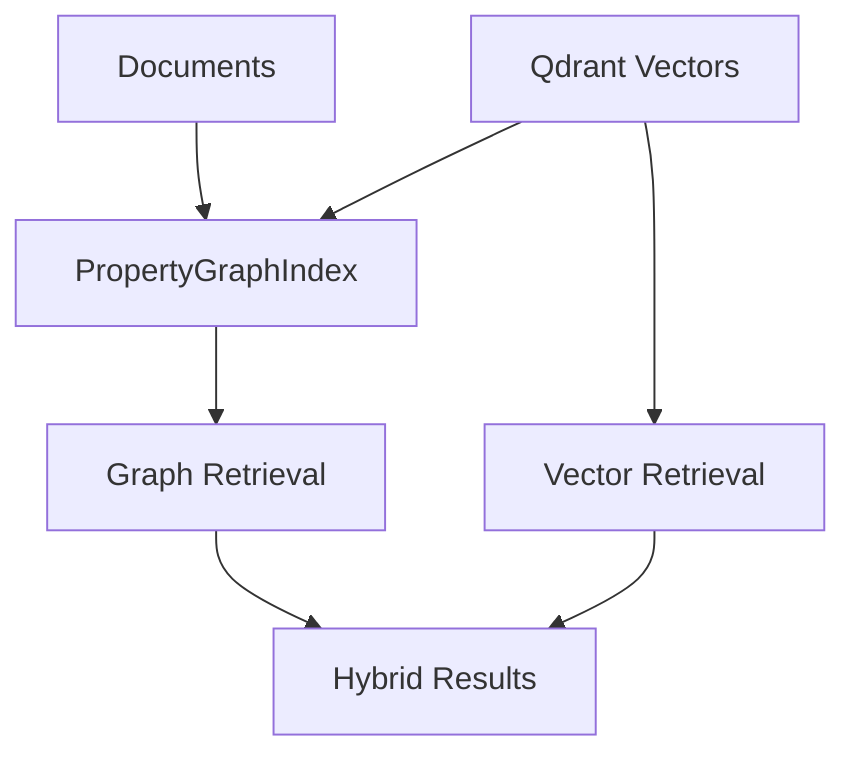

## Description

Add an optional PropertyGraphIndex module (LlamaIndex) to extract entities/relationships and support graph‑based retrieval alongside vector search. Zero extra infra using in‑memory store.

## Context

Vector‑only RAG struggles with multi‑hop and relationship queries. PropertyGraphIndex provides graph traversal and hybrid strategies without adding external databases.

## Decision Drivers

- Better handling of relationship/multi‑hop questions
- Minimal code and infrastructure
- Seamless integration with existing pipeline

## Alternatives

- A: Vector‑only — Simple, but weaker on relationships
- B: Full Microsoft GraphRAG — Powerful, but heavy infra
- C: Neo4j + custom — Powerful, but heavy and custom code
- D: PropertyGraphIndex (Selected) — Balanced capability with zero infra

### Decision Framework

| Model / Option              | Capability (40%) | Simplicity (30%) | Infra (20%) | Maintenance (10%) | Total | Decision      |
| --------------------------- | ---------------- | ---------------- | ----------- | ----------------- | ----- | ------------- |
| PropertyGraphIndex (Sel.)   | 8                | 9                | 10          | 9                 | **8.9** | ✅ Selected    |
| Vector‑only                  | 5                | 10               | 10          | 10                | 7.5   | Rejected      |
| Full GraphRAG               | 10               | 4                | 3           | 5                 | 6.6   | Rejected      |

## Decision

Provide a feature‑flagged PropertyGraphIndex path using in‑memory store and Qdrant vectors. Keep code minimal and library‑first.

## High-Level Architecture



## Related Requirements

### Functional Requirements

- FR‑1: Extract entities/relationships and build graph
- FR‑2: Support graph retrieval and hybrid search

### Non-Functional Requirements

- NFR‑1: Local‑first; no extra services
- NFR‑2: Incremental updates; background build allowed

### Integration Requirements

- IR‑1: Reuse Qdrant vectors and LlamaIndex pipeline

## Design

### Architecture Overview

- PropertyGraphIndex extracts entities/relationships from documents; queries can traverse graph, vectors, or both.
- No external DB; in‑memory store with optional persistence later.

### Implementation Details

In `src/retrieval/graphrag.py` (illustrative):

```python
from typing import Iterable
from llama_index.core import PropertyGraphIndex
from llama_index.core.graph_stores import SimplePropertyGraphStore

def build_graph(docs: Iterable) -> PropertyGraphIndex | None:
    """Construct a simple in-memory PropertyGraphIndex.

    This is a minimal skeleton; production code should configure
    extractors and persistence if required.
    """
    try:
        store = SimplePropertyGraphStore()
        return PropertyGraphIndex.from_documents(list(docs), graph_store=store)
    except Exception:
        return None
```

### Configuration

```env
DOCMIND_GRAPHRAG__ENABLED=true
```

## Testing

```python
def test_graph_build_smoke():
    assert build_graph([]) is None
```

## Consequences

### Positive Outcomes

- Graph reasoning without extra infra
- Hybrid retrieval improves certain queries

### Negative Consequences / Trade-offs

- Additional code path to maintain (feature‑flagged)

### Ongoing Maintenance & Considerations

- Monitor library updates and hybrid retrieval performance

### Dependencies

- Python: `llama-index`

## Changelog

- 3.1 (2025-08-22): Implementation complete
- 3.0 (2025-08-19): FP8 optimization context for extraction
- 1.0 (2025-08-17): Initial optional GraphRAG design
