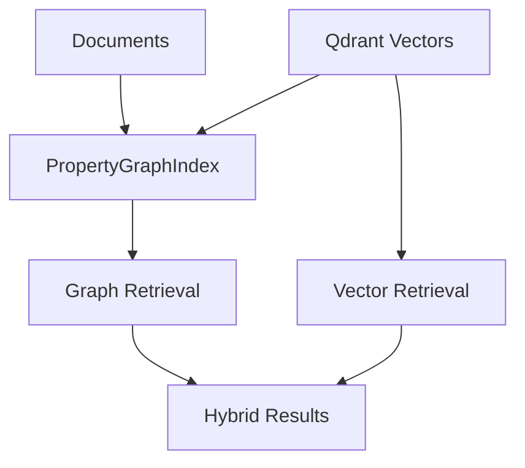

## Description

Add an optional PropertyGraphIndex module (LlamaIndex) to extract entities/relationships and support graph‑based retrieval alongside vector search. Zero extra infra using in‑memory store.

## Context

Vector‑only RAG struggles with multi‑hop and relationship queries. PropertyGraphIndex provides graph traversal and hybrid strategies without adding external databases.

## Decision Drivers

- Better handling of relationship/multi‑hop questions
- Minimal code and infrastructure
- Seamless integration with existing pipeline

## Alternatives

- A: Vector‑only — Simple, but weaker on relationships
- B: Full Microsoft GraphRAG — Powerful, but heavy infra
- C: Neo4j + custom — Powerful, but heavy and custom code
- D: PropertyGraphIndex (Selected) — Balanced capability with zero infra

### Decision Framework

| Model / Option | Capability (40%) | Simplicity (30%) | Infra (20%) | Maintenance (10%) | Total | Decision |
| --- | --- | --- | --- | --- | --- | --- |
| PropertyGraphIndex (Sel.) | 8 | 9 | 10 | 9 | **8.9** | Selected |
| Vector‑only | 5 | 10 | 10 | 10 | 7.5 | Rejected |
| Full GraphRAG | 10 | 4 | 3 | 5 | 6.6 | Rejected |

## Decision

Provide a feature‑flagged PropertyGraphIndex path using in‑memory store and Qdrant vectors. Keep code minimal and library‑first. Use only documented LlamaIndex APIs (e.g., `PropertyGraphIndex.from_documents`, `as_retriever`, `as_query_engine`, `SimplePropertyGraphStore.get` / `get_rel_map`) and avoid mutating index instances.

LlamaIndex core is the sole graph implementation. Construct its retriever and
query engine directly; do not retain a backend registry, one-implementation
factory protocol, exporter abstraction, or no-op telemetry hooks.

Amendment: Align with ADR‑038 by composing GraphRAG through a RouterQueryEngine toolset (vector + graph), and persisting via SnapshotManager with atomic snapshot directories and a manifest for staleness detection. Exports use `get_rel_map` to JSONL baseline and Parquet optionally (pyarrow).

## High-Level Architecture


```mermaid
graph TD
  D["Documents"] --> G["PropertyGraphIndex"]
  Q["Qdrant Vectors"] --> G
  G --> R["Graph Retrieval"]
  Q --> H["Vector Retrieval"]
  R --> S["Hybrid Results"]
  H --> S
```

## Related Requirements

### Functional Requirements

- FR‑1: Extract entities/relationships and build graph
- FR‑2: Support graph retrieval and hybrid search

### Non-Functional Requirements

- NFR‑1: Local‑first; no extra services
- NFR‑2: Incremental updates; background build allowed

### Integration Requirements

- IR‑1: Reuse Qdrant vectors and LlamaIndex pipeline

## Design

### Architecture Overview

- PropertyGraphIndex extracts entities/relationships from documents; queries can traverse graph, vectors, or both.
- No external DB; in‑memory store with optional persistence later.

### Implementation Details

- Graph construction: `PropertyGraphIndex.from_documents(nodes/docs, property_graph_store=SimplePropertyGraphStore(), kg_extractors=[...])`.
- Retrieval: `index.as_retriever(include_text=False, path_depth=...)` and `index.as_query_engine(...)` for NL queries.
- Exports: Build edges from `property_graph_store.get_rel_map(seeds, depth=...)` and persist to JSONL (1 record per line) and Parquet (if PyArrow available). A `save_networkx_graph` HTML may be produced for inspection.
- No index mutation: expose helpers as pure functions over LlamaIndex objects.

### Configuration

```env
# GraphRAG ingestion default and tuning
DOCMIND_GRAPHRAG_CFG__ENABLED=false
DOCMIND_GRAPHRAG_CFG__DEFAULT_PATH_DEPTH=1
```

Notes:

- `DOCMIND_GRAPHRAG_CFG__ENABLED` sets the per-ingestion control's default.
- The submitted control decides whether ingestion builds a property graph index.
- The native router includes any supplied healthy property graph index. It does not recheck configuration.

## Testing

```python
def test_graph_build_smoke():
    assert build_graph([]) is None
```

## Consequences

### Positive Outcomes

- Graph reasoning without extra infra
- Hybrid retrieval improves certain queries

### Negative Consequences / Trade-offs

- Additional code path to maintain (feature‑flagged)

### Instrumentation

- Graph export helpers and router construction emit OpenTelemetry spans via
  `configure_observability` (SPEC-012). Router construction adds the
  `router_selected` span event with tool count and names.
- Snapshot and manual graph exports emit local `export_performed` JSONL events.
  The runtime does not emit per-query route or traversal-depth JSONL events.

### Ongoing Maintenance & Considerations

- Monitor library updates and hybrid retrieval performance

### Dependencies

- Python: `llama-index-core>=0.14.21,<0.15.0`; `PropertyGraphIndex` and `SimplePropertyGraphStore` are core-owned

## Changelog

- 3.7 (2026-07-11): Hard-cut the unused graph adapter registry and protocols; construct LlamaIndex GraphRAG directly and retain the real OpenTelemetry path.
- 3.6 (2026-07-11): Remove the unused Kuzu adapter and graph extra; use LlamaIndex core's property graph store as the single implementation.
- 3.5 (2026-07-10): Replace the removed LlamaIndex meta-package with the direct core and optional graph-store dependencies.
- 3.4 (2025-09-16): Documented snapshot manifest integration and OpenTelemetry instrumentation requirements
- 3.3 (2025-09-09): Amended by ADR‑038 — router composition (vector+graph), SnapshotManager persistence, staleness badge, exports clarified
- 3.2 (2025-09-08): Library-first API policy; no index mutation; exports via get_rel_map JSONL/Parquet; updated tests
- 3.1 (2025-08-22): Implementation complete
- 3.0 (2025-08-19): FP8 optimization context for extraction
- 1.0 (2025-08-17): Initial optional GraphRAG design
