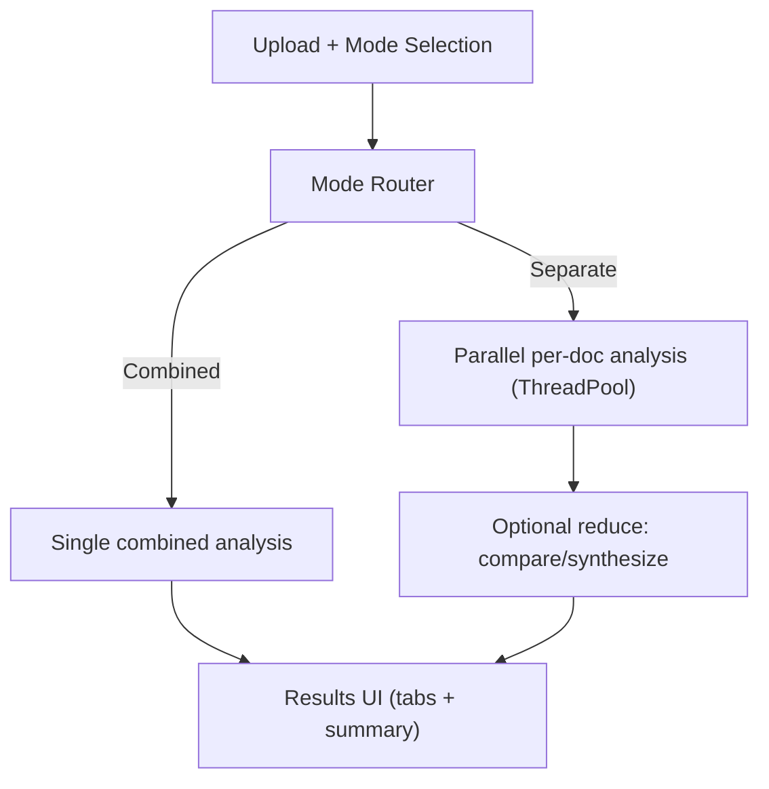

## Description

Provide three analysis modes for working with a document set:

- **Separate**: per-document analysis in parallel, with an optional “compare/synthesize” reduce step.
- **Combined**: a single holistic analysis across all selected documents.
- **Auto**: chooses Separate vs. Combined based on corpus size and doc count.

This adds an explicit user-facing knob (UI + config) and a small, testable domain service that routes work through existing retrieval + multi-agent synthesis rather than duplicating business logic in Streamlit pages.

## Context

Users need document‑specific insights and cross‑document synthesis. Separate mode preserves context and supports comparisons; Combined mode surfaces patterns and unified summaries. We require fast parallelism for Separate mode, simple aggregation, and UI control for mode selection. Solution leverages QueryPipeline and the existing agent orchestration (ADR‑001/011).

## Decision Drivers

- Flexibility to support per‑document and holistic analysis
- Parallel performance for Separate mode
- Simple aggregation and clear result presentation
- Minimal additional complexity; library‑first approach

## Alternatives

- A: Combined only — simple, but no doc‑specific insights
- B: Sequential per‑doc — simple, but slow; no synthesis
- C: ThreadPool “map” + lightweight reduce (Selected) — simple, fast, integrates with existing coordinator
- D: LangGraph-native MapReduce graph — powerful but higher complexity

### Decision Framework

Weights: Capability 35% · Performance 35% · Simplicity 20% · Maintenance 10%

| Model / Option                             | Capability (35%) | Performance (35%) | Simplicity (20%) | Maintenance (10%) | Total Score | Decision |
| ------------------------------------------ | ---------------- | ----------------- | ---------------- | ----------------- | ----------: | -------- |
| **C: ThreadPool map + lightweight reduce** | 9                | 9                 | 9                | 9                 | **9.0**     | ✅ Sel.  |
| D: LangGraph-native MapReduce              | 9                | 9                 | 6                | 7                 | 7.9         | Rejected |
| B: Sequential per-doc                      | 7                | 4                 | 9                | 9                 | 6.6         | Rejected |
| A: Combined only                           | 5                | 7                 | 10               | 10                | 7.0         | Rejected |

### Architecture Tier-2 ≥9.0 (Complexity/Perf/Alignment)

Weights: Complexity 40% · Perf 30% · Alignment 30% (10 = best)

| Option | Complexity (40%) | Perf (30%) | Alignment (30%) | Total | Decision |
| --- | ---: | ---: | ---: | ---: | --- |
| **ThreadPool map + lightweight reduce** | 9.5 | 9.0 | 9.5 | **9.35** | ✅ Selected |
| LangGraph-native MapReduce graph | 7.0 | 9.0 | 9.0 | 8.10 | Rejected |

## Decision

Adopt a conditional analysis strategy implemented as a small domain-layer service:

1) **Route** the request into `separate` or `combined` mode (auto selection supported).
2) **Separate** runs per-document analyses concurrently (ThreadPool), each using the existing retrieval + agent synthesis stack with a doc filter applied.
3) **Reduce** (optional) synthesizes a short cross-document comparison using the per-doc outputs (bounded input size).
4) **Combined** performs a single analysis over the full document set.

This keeps Streamlit pages thin and makes the behavior easy to test offline with the existing MockLLM and retrieval stubs.

## High-Level Architecture



## Related Requirements

### Functional Requirements

- FR‑1: Separate mode produces individual results per document
- FR‑2: Combined mode produces unified cross‑document result
- FR‑3: Separate mode executes in parallel
- FR‑4: Optional reduce step merges insights and comparisons

### Non-Functional Requirements

- NFR‑1 (Performance): 3–5x speedup for Separate mode with ≥4 docs
- NFR‑2 (Memory): Bounded resource use per worker
- NFR‑3 (Quality): Comparable output quality across modes

### Performance Requirements

- PR‑1: Mode selection <100ms; aggregation <500ms

### Integration Requirements

- IR‑1: UI exposes mode selection (ADR‑016); export formats follow ADR‑022
- IR‑2: Retrieval adapts to mode (ADR‑003)

## Design

### Architecture Overview

- Separate: spawn parallel per‑document analyses; preserve doc context via doc-level retrieval filters
- Combined: run one analysis across the selected corpus
- Reduce: merge the per-doc outputs into a short comparison/summary (optional)

### Implementation Details

In `src/analysis/service.py` (illustrative):

```python
from concurrent.futures import ThreadPoolExecutor

def analyze_documents(documents, query, mode, settings):
    # Separate: map over docs in parallel (bounded by settings.analysis.max_workers)
    # Combined: single run over corpus
    ...
```

### Configuration

```env
DOCMIND_ANALYSIS__MODE=auto   # separate|combined|auto
DOCMIND_ANALYSIS__MAX_WORKERS=4
```

## Testing

```python
import pytest

@pytest.mark.asyncio
async def test_parallel_separate(fake_docs, analyzer):
    res = await analyzer.analyze_documents(fake_docs, "q", mode="separate")
    assert len(res.individual_results) == len(fake_docs)
```

## Consequences

### Positive Outcomes

- Flexible user choice of modes; fast parallel Separate mode
- Cross‑document synthesis in Combined mode
- Clean integration with existing agents and retrieval

### Negative Consequences / Trade-offs

- Additional routing/aggregation complexity
- Higher resource use in parallel paths

### Ongoing Maintenance & Considerations

- Tune thresholds for auto selection as datasets vary.

- Keep aggregation minimal; extend only with clear value

### Dependencies

- Python: `concurrent.futures`, `asyncio`
- LlamaIndex: QueryPipeline, VectorStoreIndex

## Changelog

- **2.0 (2026-01-10)**: Tier-2 decision gate added; updated references and maintenance notes.
