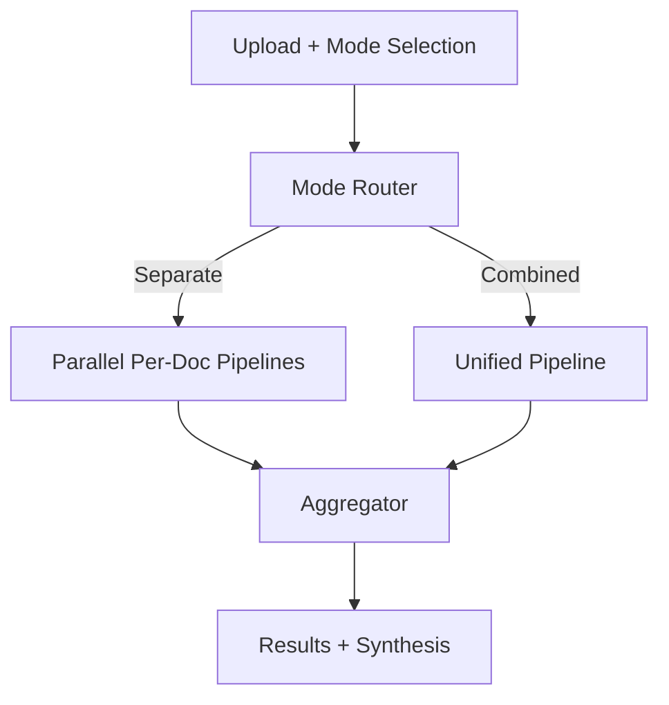

## Description

Provide two analysis modes for uploaded documents: Separate (per‑document analysis in parallel) and Combined (holistic multi‑document analysis). Use LlamaIndex QueryPipeline with conditional routing and lightweight aggregation to deliver flexible, performant analysis.

## Context

Users need document‑specific insights and cross‑document synthesis. Separate mode preserves context and supports comparisons; Combined mode surfaces patterns and unified summaries. We require fast parallelism for Separate mode, simple aggregation, and UI control for mode selection. Solution leverages QueryPipeline and the existing agent orchestration (ADR‑001/011).

## Decision Drivers

- Flexibility to support per‑document and holistic analysis
- Parallel performance for Separate mode
- Simple aggregation and clear result presentation
- Minimal additional complexity; library‑first approach

## Alternatives

- A: Combined only — simple, but no doc‑specific insights
- B: Sequential per‑doc — simple, but slow; no synthesis
- C: Manual mode without optimization — flexible, but inconsistent
- D: QueryPipeline + conditional routing (Selected) — parallel + synthesis; modest coordination

### Decision Framework

| Model / Option                            | Capability (35%) | Performance (35%) | Simplicity (20%) | Maintenance (10%) | Total Score | Decision      |
| ----------------------------------------- | ---------------- | ----------------- | ---------------- | ----------------- | ----------- | ------------- |
| D: QueryPipeline + routing (Selected)     | 9                | 9                 | 7                | 8                 | **8.6**     | ✅ Selected    |
| B: Sequential individual                   | 6                | 4                 | 9                | 8                 | 6.2         | Rejected      |
| A: Combined only                           | 4                | 6                 | 9                | 9                 | 5.8         | Rejected      |
| C: Manual w/o optimization                 | 7                | 5                 | 7                | 7                 | 6.2         | Rejected      |

## Decision

Adopt a conditional analysis strategy with QueryPipeline routing: Separate mode runs per‑document pipelines in parallel; Combined mode uses a unified index; aggregation merges insights and comparisons. Auto mode selects based on document count/size. Integrates with the 5‑agent system (ADR‑001/011).

## High-Level Architecture



## Related Requirements

### Functional Requirements

- FR‑1: Separate mode produces individual results per document
- FR‑2: Combined mode produces unified cross‑document result
- FR‑3: Separate mode executes in parallel
- FR‑4: Aggregation merges insights and comparisons

### Non-Functional Requirements

- NFR‑1 (Performance): 3–5x speedup for Separate mode with ≥4 docs
- NFR‑2 (Memory): Bounded resource use per worker
- NFR‑3 (Quality): Comparable output quality across modes

### Performance Requirements

- PR‑1: Mode selection <100ms; aggregation <500ms

### Integration Requirements

- IR‑1: UI exposes mode selection (ADR‑016); export formats follow ADR‑022
- IR‑2: Retrieval adapts to mode (ADR‑003)

## Design

### Architecture Overview

- Separate: spawn parallel per‑document pipelines; preserve doc context
- Combined: build unified index; synthesize across documents
- Aggregation: merge insights, comparisons, and action items

### Implementation Details

In `src/analysis/modes.py` (illustrative):

```python
from concurrent.futures import ThreadPoolExecutor

def analyze(documents, query, mode, settings):
    mode = auto_select(mode, len(documents), settings)
    if mode == "separate":
        with ThreadPoolExecutor(max_workers=settings.max_workers) as ex:
            return [ex.submit(run_single, d, query).result() for d in documents]
    return [run_combined(documents, query)]
```

### Configuration

```env
DOCMIND_ANALYSIS__MODE=auto   # separate|combined|auto
DOCMIND_ANALYSIS__MAX_WORKERS=4
```

## Testing

```python
import pytest

@pytest.mark.asyncio
async def test_parallel_separate(fake_docs, analyzer):
    res = await analyzer.analyze_documents(fake_docs, "q", mode="separate")
    assert len(res.individual_results) == len(fake_docs)
```

## Consequences

### Positive Outcomes

- Flexible user choice of modes; fast parallel Separate mode
- Cross‑document synthesis in Combined mode
- Clean integration with existing agents and retrieval

### Negative Consequences / Trade-offs

- Additional routing/aggregation complexity
- Higher resource use in parallel paths

### Ongoing Maintenance & Considerations

-.Tune thresholds for auto selection as datasets vary

- Keep aggregation minimal; extend only with clear value

### Dependencies

- Python: `concurrent.futures`, `asyncio`
- LlamaIndex: QueryPipeline, VectorStoreIndex

## Changelog

- **1.1 (2025-09-02)**: No change required; cache unification speeds both modes without architectural impact.
- **1.0 (2025-08-18)**: Initial document analysis mode strategy with parallel individual processing, unified combined analysis, and intelligent result aggregation
