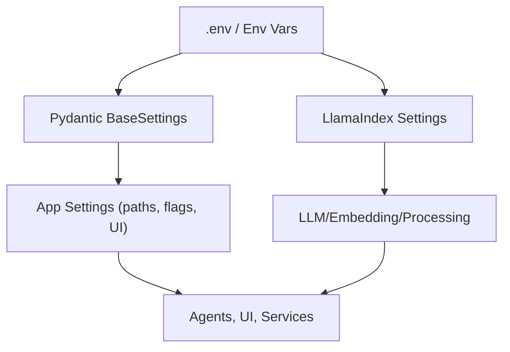

## Description

Adopt a unified configuration model: app‑specific settings via Pydantic `BaseSettings` and LLM/embedding configuration via LlamaIndex `Settings`. Hybrid retrieval and reranking are always‑on with internal caps/timeouts (no UI toggles). Enforce `llm.context_window_max=131072` (128K) consistently across backends.

## Context

Previous configuration was over‑abstracted and duplicated framework features. We require a simple, library‑first approach that supports local‑first workflows across diverse hardware (CPU‑only to high‑VRAM GPUs), with minimal code and predictable env mapping.

## Decision Drivers

- Library‑first: prefer LlamaIndex `Settings` + Pydantic `BaseSettings`
- Simplicity: eliminate custom layers and duplicative validators
- Flexibility: support CPU‑only → high‑end GPU profiles via env
- Consistency: enforce 128K context cap; eliminate fragile UI toggles for reranking/hybrid

## Alternatives

- A: Monolithic custom settings class — Pros: total control; Cons: heavy, duplicative, hard to maintain
- B: Multiple disjoint config modules — Pros: localized; Cons: fragmentation and drift
- C: Pydantic `BaseSettings` + LlamaIndex `Settings` (Selected) — Pros: simple, native, maintainable

### Decision Framework

| Model / Option                      | Simplicity (35%) | Library Fit (35%) | Flexibility (20%) | Maintenance (10%) | Total Score | Decision    |
| ----------------------------------- | ---------------- | ----------------- | ----------------- | ----------------- | ----------- | ----------- |
| C: Pydantic + LlamaIndex (Selected) | 9                | 10                | 9                 | 9                 | **9.3**     | ✅ Selected |
| A: Monolithic custom                | 4                | 5                 | 8                 | 5                 | 5.5         | Rejected    |
| B: Disjoint modules                 | 6                | 6                 | 7                 | 6                 | 6.3         | Rejected    |

## Decision

Use Pydantic `BaseSettings` for app‑specific configuration and LlamaIndex `Settings` for LLM/embedding configuration. Hybrid and reranking are always‑on with internal caps/timeouts; enforce `llm.context_window_max=131072`. Follow nested env var mapping (`DOCMIND_{SECTION}__{FIELD}`) per project conventions. Default hybrid fusion is server‑side RRF in Qdrant; DBSF is optional and gated by env/version support. Prefer BM42 sparse (FastEmbed) with IDF modifier.

Amendment (OpenAI‑compatible servers & Local‑First):

- All OpenAI‑compatible backends (LM Studio, vLLM OpenAI server, llama.cpp server) must use base URLs that include a single `/v1` path segment. Base URLs are normalized idempotently in Settings; endpoint paths like `/chat/completions` must not be present in the base URL.
- Introduce `openai.*` config group:
  - `DOCMIND_OPENAI__BASE_URL` — e.g. `http://localhost:1234/v1` (LM Studio), `http://localhost:8000/v1` (vLLM), `http://localhost:8080/v1` (llama.cpp server)
  - `DOCMIND_OPENAI__API_KEY` — placeholder string (local‑first; not required by servers but some clients expect a non‑empty token)
- OpenAI cloud (optional): `DOCMIND_OPENAI__BASE_URL=https://api.openai.com/v1`, `DOCMIND_OPENAI__API_KEY=sk‑…`; requires enabling remote endpoints (see Security Policy below).
- Security Policy: `DOCMIND_SECURITY__ALLOW_REMOTE_ENDPOINTS=false` by default; only loopback hosts are allowed when disabled. To use remote endpoints (e.g., OpenAI cloud), set `DOCMIND_SECURITY__ALLOW_REMOTE_ENDPOINTS=true` or add the host to `DOCMIND_SECURITY__ENDPOINT_ALLOWLIST`.

Factory Resolution (library‑first):

- For OpenAI‑compatible backends, use LlamaIndex `OpenAILike` with `api_base=backend_base_url_normalized`. This ensures consistent `/v1` handling and avoids duplicated code.

See also: the canonical configuration guide at `docs/developers/configuration-reference.md#openai-compatible-local-servers-lm-studio-vllm-llamacpp`.

Amendment (Hybrid Fusion Flags; supersedes legacy flags):

```env
# Server-side hybrid and fusion mode
DOCMIND_RETRIEVAL__ENABLE_SERVER_HYBRID=true|false
DOCMIND_RETRIEVAL__FUSION_MODE=rrf|dbsf
```

Legacy flags such as `DOCMIND_RETRIEVAL__DBSF_ENABLED` are removed. Use `FUSION_MODE=dbsf` when server hybrid is enabled.

Telemetry requirements (local JSONL; PII-safe, bounded, sampled):

- Emit: `retrieval.fusion_mode`, `retrieval.prefetch_dense_limit`, `retrieval.prefetch_sparse_limit`, `retrieval.fused_limit`, `retrieval.return_count`, `retrieval.latency_ms`, `retrieval.sparse_fallback`, and `dedup.*`.
- Tuning via env: `DOCMIND_TELEMETRY_SAMPLE`, `DOCMIND_TELEMETRY_ENABLED/DISABLED` (bridge ensures sinks honor disabled).

Amendment (GraphRAG flags):

```env
# Global GraphRAG feature flag (used by router + UI)
DOCMIND_ENABLE_GRAPHRAG=false

# Advanced GraphRAG tuning (nested GraphRAG config model)
DOCMIND_GRAPHRAG_CFG__DEFAULT_PATH_DEPTH=1
```

Expose these in UI with safe defaults (toggle; read‑only path depth 1 unless advanced settings enabled). See ADR‑038.

Explicit clarifications:

- No UI toggles for hybrid or reranking; operators MAY use ops‑only env overrides (per ADR‑024 scope). Reranking remains a single integration path (auto‑detect direct FlagEmbedding else LlamaIndex wrapper). Canonical env override for reranking: `DOCMIND_RETRIEVAL__USE_RERANKING` (maps to `settings.retrieval.use_reranking`).
- For Qdrant hybrid retrieval, the collection schema SHALL be enforced idempotently with named vectors `text-dense` and `text-sparse` to align with Query API `using` fields; query‑time sparse vectors SHALL be produced by the same family (FastEmbed BM42/BM25) used at index time.

## High-Level Architecture



## Related Requirements

### Functional Requirements

- FR‑1: Centralize app settings via Pydantic `BaseSettings`
- FR‑2: Configure LLM/embeddings via LlamaIndex `Settings`
- FR‑3: Enforce `llm.context_window_max=131072` cap
- FR‑4: Keep hybrid and reranking always‑on with internal caps/timeouts and ops env overrides only

### Non-Functional Requirements

- NFR‑1: Maintainability — minimal code; remove redundant layers
- NFR‑2: Local‑first — no external services required
- NFR‑3: Flexibility — CPU‑only to high‑VRAM GPU profiles via env

### Performance Requirements

- PR‑1: Config load time ~<1ms; negligible runtime overhead

### Integration Requirements

- IR‑1: Works across agent orchestration and retrieval (ADR‑001/003)

## Local‑First & Privacy Guarantees

- Qdrant is run locally (Docker/embedded) and bound to `127.0.0.1`. All Query API hybrid fusion (RRF/DBSF) executes inside that local process. No cloud APIs are required or contacted.
- Embedding/reranking models (BGE‑M3, BGE Reranker, SigLIP, optional ColPali) are loaded from local cache; set `HF_HUB_OFFLINE=1` / `TRANSFORMERS_OFFLINE=1` and pre‑download weights to prevent any network access.
- FastEmbed sparse (BM42/BM25) runs locally on CPU/GPU; no external lexical services are used.
- The app enforces `allow_remote_endpoints=false` by default and rejects non‑localhost base URLs.
- Observability remains local; no third‑party telemetry is enabled by default.

## Design

### Architecture Overview

- Minimal app configuration in `DocMindSettings` (paths, flags)
- LlamaIndex `Settings` holds LLM/embedding/processing
- Nested env mapping (`DOCMIND_{SECTION}__{FIELD}`)

### Implementation Details

In `src/config/settings.py` (selected nested models; see file for full list):

```python
from pydantic import BaseModel, Field
from pydantic_settings import BaseSettings, SettingsConfigDict

class VLLMConfig(BaseModel):
    model: str = Field(default="Qwen/Qwen3-4B-Instruct-2507-FP8")
    context_window: int = Field(default=131072)
    max_tokens: int = Field(default=2048)
    temperature: float = Field(default=0.1)
    gpu_memory_utilization: float = Field(default=0.85)
    kv_cache_dtype: str = Field(default="fp8_e5m2")
    attention_backend: str = Field(default="FLASHINFER")
    enable_chunked_prefill: bool = Field(default=True)
    max_num_seqs: int = Field(default=16)
    max_num_batched_tokens: int = Field(default=8192)
    vllm_base_url: str = Field(default="http://localhost:8000")
    llamacpp_model_path: Path = Field(default=Path("./models/qwen3.gguf"))

class AgentConfig(BaseModel):
    enable_multi_agent: bool = True
    decision_timeout: int = 200
    max_retries: int = 2
    max_concurrent_agents: int = 3
    enable_fallback_rag: bool = True
    context_trim_threshold: int = 122880
    context_buffer_size: int = 8192
    enable_parallel_tool_execution: bool = True
    max_workflow_depth: int = 5
    enable_agent_state_compression: bool = True
    chat_memory_limit_tokens: int = 66560

class EmbeddingConfig(BaseModel):
    model_name: str = "BAAI/bge-m3"
    dimension: int = 1024
    max_length: int = 8192
    batch_size_gpu: int = 12
    batch_size_cpu: int = 4

class RetrievalConfig(BaseModel):
    strategy: str = "hybrid"
    top_k: int = 10
    # always-on reranking (caps/timeouts internal)
    reranking_top_k: int = 5
    reranker_normalize_scores: bool = True
    # server-side fusion controls
    fused_top_k: int = 60
    fusion_mode: Literal["rrf","dbsf"] = "rrf"  # env-gated; dbsf only if supported
    use_sparse_embeddings: bool = True

class ProcessingConfig(BaseModel):
    chunk_size: int = 1024
    new_after_n_chars: int = 1200
    combine_text_under_n_chars: int = 500
    multipage_sections: bool = True
    chunk_overlap: int = 100
    max_document_size_mb: int = 100
    debug_chunk_flow: bool = False

class CacheConfig(BaseModel):
    enable_document_caching: bool = True
    ttl_seconds: int = 3600
    max_size_mb: int = 1000

class DatabaseConfig(BaseModel):
    qdrant_url: str = "http://localhost:6333"
    qdrant_collection: str = "docmind_docs"
    qdrant_timeout: int = 60
    sqlite_db_path: Path = Path("./data/docmind.db")
    enable_wal_mode: bool = True

class DocMindSettings(BaseSettings):
    # top-level
    data_dir: Path = Path("./data")
    cache_dir: Path = Path("./cache")
    llm_backend: str = "ollama"
    ollama_base_url: str = "http://localhost:11434"
    lmstudio_base_url: str = "http://localhost:1234/v1"
    llm_context_window_max: int = 131072
    llm_request_timeout_seconds: int = 120
    llm_streaming_enabled: bool = True
    log_level: Literal["DEBUG","INFO","WARNING","ERROR"] = "INFO"

    # nested
    vllm: VLLMConfig = Field(default_factory=VLLMConfig)
    processing: ProcessingConfig = Field(default_factory=ProcessingConfig)
    agents: AgentConfig = Field(default_factory=AgentConfig)
    embedding: EmbeddingConfig = Field(default_factory=EmbeddingConfig)
    retrieval: RetrievalConfig = Field(default_factory=RetrievalConfig)
    cache: CacheConfig = Field(default_factory=CacheConfig)
    database: DatabaseConfig = Field(default_factory=DatabaseConfig)

    model_config = SettingsConfigDict(env_file=".env", env_prefix="DOCMIND_", extra="forbid")
```

In `src/config/llm_factory.py` (backend selection):

```python
def build_llm(settings: DocMindSettings):
    if settings.llm_backend == "ollama":
        from llama_index.llms.ollama import Ollama
        return Ollama(base_url=settings.ollama_base_url, model=settings.vllm.model,
                      request_timeout=float(settings.llm_request_timeout_seconds))
    if settings.llm_backend == "vllm":
        from llama_index.llms.openai_like import OpenAILike
        # Use normalized /v1 api_base and openai.api_key
        return OpenAILike(
            model=settings.vllm.model,
            api_base=settings.backend_base_url_normalized,
            api_key=(settings.openai.api_key or "not-needed"),
            context_window=settings.vllm.context_window,
            timeout=float(settings.llm_request_timeout_seconds),
        )
    if settings.llm_backend == "lmstudio":
        from llama_index.llms.openai_like import OpenAILike
        return OpenAILike(
            model=settings.vllm.model,
            api_base=settings.backend_base_url_normalized,
            api_key=(settings.openai.api_key or "not-needed"),
            context_window=settings.vllm.context_window,
            timeout=float(settings.llm_request_timeout_seconds),
        )
    if settings.llm_backend == "llamacpp":
        from llama_index.llms.llama_cpp import LlamaCPP
        return LlamaCPP(model_path=str(settings.vllm.llamacpp_model_path),
                        context_window=settings.vllm.context_window,
                        model_kwargs={"n_gpu_layers": -1 if settings.enable_gpu_acceleration else 0})
    raise ValueError("Unsupported llm_backend")
```

In `src/config/integrations.py` (LlamaIndex + vLLM):

```python
def setup_llamaindex() -> None:
    if Settings.llm is None:
        Settings.llm = build_llm(settings)
    if Settings.embed_model is None:
        from llama_index.embeddings.huggingface import HuggingFaceEmbedding
        Settings.embed_model = HuggingFaceEmbedding(model_name="BAAI/bge-m3", device="cuda" if settings.enable_gpu_acceleration else "cpu")
    Settings.context_window = settings.vllm.context_window
    Settings.num_output = settings.vllm.max_tokens

def setup_vllm_env() -> None:
    for k, v in settings.get_vllm_env_vars().items():
        os.environ.setdefault(k, v)

def get_vllm_server_command() -> list[str]:
    cmd = ["vllm", "serve", settings.vllm.model,
           "--max-model-len", str(settings.vllm.context_window),
           "--kv-cache-dtype", settings.vllm.kv_cache_dtype,
           "--gpu-memory-utilization", str(settings.vllm.gpu_memory_utilization),
           "--max-num-seqs", str(settings.vllm.max_num_seqs),
           "--max-num-batched-tokens", str(settings.vllm.max_num_batched_tokens),
           "--trust-remote-code"]
    if settings.vllm.enable_chunked_prefill:
        cmd.append("--enable-chunked-prefill")
    return cmd
```

Selected nested models (current + release plan)

In `src/config/settings.py` (canonical model; see dedicated SPECS for behavior):

```python
class SemanticCacheConfig(BaseModel):
    # ADR-035 / SPEC-038 (Qdrant-backed; strict invalidation)
    enabled: bool = False
    provider: Literal["qdrant", "none"] = "none"
    score_threshold: float = 0.85
    ttl_seconds: int = 1_209_600  # 14 days
    top_k: int = 5
    max_response_bytes: int = 24_000
    namespace: str = "default"

class AnalysisConfig(BaseModel):
    # ADR-023 / SPEC-036
    mode: Literal["auto", "separate", "combined"] = "auto"
    max_workers: int = 4

class DatabaseConfig(BaseModel):
    # ADR-055 / SPEC-039 (operational metadata store; WAL)
    sqlite_db_path: Path = Path("./data/docmind.db")
    enable_wal_mode: bool = True

# Note: Chat persistence is implemented via LlamaIndex `SimpleChatStore` JSON
# under `settings.data_dir` (ADR-043 / SPEC-024) and does not require a SQLite
# chat DB setting.
```

In `src/config/integrations.py`:

```python
from llama_index.core import Settings

def setup_llamaindex():
    # LLM/embedding configuration lives here
    Settings.context_window = 131072
    # Settings.llm = ...
    # Settings.embed_model = ...
```

### Configuration

```env
# Core app
DOCMIND_APP_NAME=DocMind AI
DOCMIND_APP_VERSION=2.0.0
DOCMIND_DEBUG=false
DOCMIND_LLM_BACKEND=ollama
DOCMIND_DATA_DIR=./data
DOCMIND_CACHE_DIR=./cache

# Agents (ADR-001/011)
DOCMIND_AGENTS__ENABLE_MULTI_AGENT=true
DOCMIND_AGENTS__DECISION_TIMEOUT=200
DOCMIND_AGENTS__MAX_RETRIES=2
DOCMIND_AGENTS__ENABLE_FALLBACK_RAG=true
DOCMIND_AGENTS__MAX_CONCURRENT_AGENTS=3
DOCMIND_AGENTS__ENABLE_PARALLEL_TOOL_EXECUTION=true

# LLM / vLLM (ADR-004/010)
DOCMIND_VLLM__MODEL=Qwen/Qwen3-4B-Instruct-2507-FP8
DOCMIND_OLLAMA_BASE_URL=http://localhost:11434
DOCMIND_LMSTUDIO_BASE_URL=http://localhost:1234/v1
DOCMIND_VLLM__VLLM_BASE_URL=http://localhost:8000
DOCMIND_VLLM__TEMPERATURE=0.1
DOCMIND_VLLM__MAX_TOKENS=2048
DOCMIND_VLLM__CONTEXT_WINDOW=131072
DOCMIND_LLM_REQUEST_TIMEOUT_SECONDS=120
DOCMIND_LLM_STREAMING_ENABLED=true

# Embeddings (ADR-002)
DOCMIND_EMBEDDING__MODEL_NAME=BAAI/bge-m3
DOCMIND_EMBEDDING__DIMENSION=1024
DOCMIND_EMBEDDING__MAX_LENGTH=8192
DOCMIND_EMBEDDING__BATCH_SIZE_GPU=12
DOCMIND_EMBEDDING__BATCH_SIZE_CPU=4

# Processing (ADR-009)
DOCMIND_PROCESSING__CHUNK_SIZE=1024
DOCMIND_PROCESSING__CHUNK_OVERLAP=100
DOCMIND_PROCESSING__NEW_AFTER_N_CHARS=1200
DOCMIND_PROCESSING__COMBINE_TEXT_UNDER_N_CHARS=500
DOCMIND_PROCESSING__MULTIPAGE_SECTIONS=true

# Retrieval (ADR-003/037)
DOCMIND_RETRIEVAL__STRATEGY=hybrid
DOCMIND_RETRIEVAL__TOP_K=10
DOCMIND_RETRIEVAL__RERANKING_TOP_K=5
DOCMIND_RETRIEVAL__RERANKER_NORMALIZE_SCORES=true
# Server-side hybrid fusion (Qdrant Query API)
DOCMIND_RETRIEVAL__FUSION_MODE=rrf
DOCMIND_RETRIEVAL__FUSED_TOP_K=60
DOCMIND_RETRIEVAL__RRF_K=60
DOCMIND_RETRIEVAL__USE_SPARSE_EMBEDDINGS=true
DOCMIND_RETRIEVAL__ENABLE_COLPALI=false

# Cache toggles (ADR-030)
DOCMIND_CACHE__ENABLE_DOCUMENT_CACHING=true
DOCMIND_CACHE__TTL_SECONDS=3600
DOCMIND_CACHE__MAX_SIZE_MB=1000

# Database / persistence (ADR-031)
DOCMIND_DATABASE__SQLITE_DB_PATH=./data/docmind.db
DOCMIND_DATABASE__ENABLE_WAL_MODE=true
DOCMIND_DATABASE__QDRANT_URL=http://localhost:6333
DOCMIND_DATABASE__QDRANT_COLLECTION=docmind_docs
DOCMIND_DATABASE__QDRANT_TIMEOUT=60

# Monitoring
DOCMIND_MONITORING__MAX_MEMORY_GB=4.0
DOCMIND_MONITORING__MAX_VRAM_GB=14.0
DOCMIND_MONITORING__MAX_QUERY_LATENCY_MS=2000

# vLLM performance (server)
DOCMIND_VLLM__GPU_MEMORY_UTILIZATION=0.95
DOCMIND_VLLM__ATTENTION_BACKEND=FLASHINFER
DOCMIND_VLLM__ENABLE_CHUNKED_PREFILL=true
DOCMIND_VLLM__MAX_NUM_BATCHED_TOKENS=8192
DOCMIND_VLLM__MAX_NUM_SEQS=16

# Analytics (ADR-032)
DOCMIND_ANALYTICS__ENABLED=false
DOCMIND_ANALYTICS__RETENTION_DAYS=60
DOCMIND_ANALYTICS__DB_PATH=./data/analytics/analytics.duckdb

# Backup (ADR-033)
DOCMIND_BACKUP__ENABLED=false
DOCMIND_BACKUP__KEEP_LAST=7

# Logging
DOCMIND_LOG_LEVEL=INFO

# --- Optional advanced features (targeted for the full release) ---
# These sections document supported (or imminently supported) configuration
# surfaces that have corresponding ADRs/SPECs and implementation prompts.
# Semantic Cache (ADR-035)
DOCMIND_SEMANTIC_CACHE__ENABLED=false
DOCMIND_SEMANTIC_CACHE__PROVIDER=qdrant
DOCMIND_SEMANTIC_CACHE__SCORE_THRESHOLD=0.85
DOCMIND_SEMANTIC_CACHE__TTL_SECONDS=1209600
DOCMIND_SEMANTIC_CACHE__TOP_K=5
DOCMIND_SEMANTIC_CACHE__MAX_RESPONSE_BYTES=24000
DOCMIND_SEMANTIC_CACHE__NAMESPACE=default

# Chat Memory / Persistence (ADR-043)
# Note: v1 implementation persists chat history via JSON SimpleChatStore (no SQLite required).
# If a SQLite-backed store is introduced later, it must be explicitly documented and tested.

# Analysis Modes (ADR-023)
DOCMIND_ANALYSIS__MODE=auto
DOCMIND_ANALYSIS__MAX_WORKERS=4

# GraphRAG (ADR-019)
DOCMIND_ENABLE_GRAPHRAG=false
DOCMIND_GRAPHRAG_CFG__DEFAULT_PATH_DEPTH=1
```

## Testing

```python
def test_env_mapping(monkeypatch):
    monkeypatch.setenv("DOCMIND_ANALYTICS__ENABLED", "true")
    from src.config.settings import DocMindSettings
    s = DocMindSettings()
    assert s.analytics_enabled is True
```

## Consequences

### Positive Outcomes

- Major complexity reduction; clear library‑first boundaries
- Easy env‑based customization for diverse hardware/users
- Consistent reranker mode exposure and 128K context cap

### Negative Consequences / Trade-offs

- Reliance on LlamaIndex `Settings` release cadence

### Ongoing Maintenance & Considerations

- Track LlamaIndex releases; adjust minimal glue as needed
- Keep `.env.example` authoritative for env naming

### Dependencies

- Python: `pydantic-settings>=2.0`, `llama-index>=0.12`

## Changelog

- 2.9 (2025-09-09): Added GraphRAG configuration flags and UI exposure; linked ADR‑038
- 2.9 (2025-09-08): Clarified always-on (no UI toggles), single reranker path; enforced Qdrant named-vector schema and sparse alignment.
- 2.8 (2025-09-07): Removed client-side fusion knobs; added server-side fusion envs (fusion_mode/fused_top_k), BM42(IDF) preference, and DBSF env-gating. Clarified env-only overrides and offline defaults.

- 2.7 (2025-09-07): Always‑on hybrid/rerank (no UI toggles); embed default BGE‑M3; updated examples and requirements

- 2.6 (2025‑09‑04): Standardized to template; verified decision framework; no behavior change
- v2.4 (2025-09-03): DOCS - Added related references to ADR-035 (SemanticCacheConfig) and ADR-036 (UI reranker controls)
- v2.3 (2025-09-02): Added ADR-032/ADR-033 toggles and examples
- v2.2 (2025-08-27): Restored user flexibility across CPU/GPU/backends; validated five user scenarios
- v2.1 (2025-08-25): Unified architecture implemented; major complexity reduction; tests pass
- v2.0 (2025-08-24): Complete replacement with unified architecture; library‑first pattern

## Offline Defaults & Allowlist

- The application MUST default to offline‑first behavior; remote endpoints are disabled unless explicitly allowlisted.
- LM Studio endpoints MUST terminate with `/v1` and be validated in Settings.
- Provide a centralized allowlist mechanism in configuration; tests MUST cover rejection of non‑allowlisted URLs when policy is strict.
