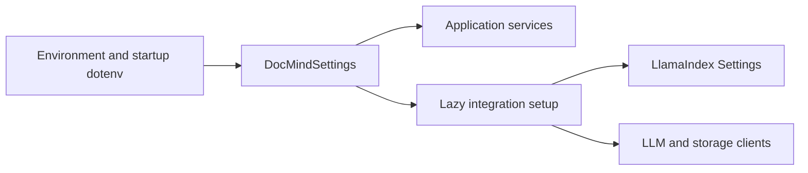

## Decision

Use Pydantic Settings as the single application configuration boundary. Configure LlamaIndex through the repository integration layer after application settings are resolved.

Environment variables use the `DOCMIND_` prefix and `__` for nested fields. `src/config/settings.py` owns models, defaults, aliases, and validation. `src/config/integrations.py` owns lazy library wiring.

## Context

The application previously spread defaults and environment parsing across configuration modules, factories, user interface code, and provider adapters. That duplication allowed the same value to resolve differently across runtime paths.

DocMind also needs one policy boundary for local and remote endpoints. Provider clients must not bypass the application’s validation and allowlist rules.

## Decision drivers

The configuration contract must:

- Keep one typed owner for every setting
- Avoid import-time file and network input or output
- Reuse Pydantic Settings and LlamaIndex primitives
- Preserve local-first endpoint policy across every provider
- Keep optional capability flags explicit
- Remove selectors for implementations that no longer vary

## Selected architecture

The runtime resolves configuration in this order:


```mermaid
flowchart LR
    ENV["Environment and startup dotenv"] --> PYDANTIC["DocMindSettings"]
    PYDANTIC --> APP["Application services"]
    PYDANTIC --> INTEGRATIONS["Lazy integration setup"]
    INTEGRATIONS --> LLAMA["LlamaIndex Settings"]
    INTEGRATIONS --> PROVIDERS["LLM and storage clients"]
```

`bootstrap_settings()` loads `.env` during application startup. Importing the settings module does not read `.env`.

Pydantic Settings precedence remains:

1. Initialization arguments
2. Environment variables
3. Values loaded from `.env` at startup
4. Secrets directory
5. Model defaults

An exported environment variable therefore overrides the matching `.env` value.

## Environment mapping

Top-level fields use one underscore after the prefix. Nested fields use two underscores:

```env
DOCMIND_LLM_BACKEND=ollama
DOCMIND_DATABASE__QDRANT_URL=http://localhost:6333
DOCMIND_RETRIEVAL__FUSION_MODE=rrf
DOCMIND_RETRIEVAL__USE_RERANKING=true
```

`.env.example` is the operator-facing inventory. `src/config/settings.py` remains authoritative when documentation and source disagree.

## Fixed parser identities

The parser framework, parser profile, and optical character recognition engine are fixed validation literals:

- Docling parser framework
- CPU-safe parser profile
- RapidOCR engine

They preserve provenance and reject invalid input. They are not user-selectable backends and do not belong in `.env.example`.

Operators can configure parser limits, rendering, optical character recognition forcing, model cache location, and searchable-PDF export.

## Language model providers

DocMind supports Ollama and OpenAI-compatible endpoints for vLLM, LM Studio, llama.cpp server, and approved hosted providers.

OpenAI-compatible base URLs contain one normalized `/v1` segment. They must not include endpoint paths such as `/chat/completions`.

Selected LlamaIndex LLM adapters remain direct dependencies. The package excludes the `llama-index` meta-package and removed embedding adapters.

## Retrieval configuration

Qdrant owns server-side hybrid fusion. Reciprocal Rank Fusion (RRF) is the default, and Distribution-Based Score Fusion (DBSF) is optional.

The collection uses these named vectors:

- `text-dense` for BGE-M3 dense vectors
- `text-sparse` for direct FastEmbed sparse vectors

Hybrid retrieval and reranking have one implementation path. Environment values can disable them for operations or diagnostics, but the user interface does not create a parallel configuration owner.

GraphRAG requires both application flags and uses LlamaIndex core's property
graph store. ColPali requires the `multimodal` extra. SigLIP remains the
canonical image embedding path.

## Endpoint security

`DOCMIND_SECURITY__ALLOW_REMOTE_ENDPOINTS=false` is the default. Loopback endpoints are allowed.

An allowlisted non-loopback hostname must resolve to public addresses while remote endpoints remain disabled. Private, link-local, reserved, and failed Domain Name System resolutions are rejected.

Approved private services and hosted providers require an explicit policy change. That change crosses the local trust boundary and must remain visible in operator configuration.

## Dependency contract

`pyproject.toml` and `uv.lock` own exact dependency resolution. The configuration architecture depends directly on:

- Pydantic 2 and Pydantic Settings 2
- `llama-index-core>=0.14.21,<0.15.0`
- Selected LlamaIndex provider and storage adapters
- `fastembed>=0.5.1`
- `ollama==0.6.2`

The default uv and Docker profiles use official CPU-only PyTorch wheels. The uv `gpu` extra replaces the CPU group with the locked CUDA 12.8 wheel sources.

## Consequences

This decision creates one typed configuration graph and one endpoint policy boundary. Tests can construct settings without reading the filesystem, and integrations can initialize heavy libraries only when needed.

The central model is large because it describes the complete application surface. Keep related values in focused nested models and avoid adding proxy wrappers that duplicate Pydantic behavior.

## Verification

Validate configuration changes with the focused settings tests, then run static checks:

```bash
uv run pytest tests/unit/config -q
uv run ruff check src/config tests/unit/config
uv run pyright --threads 4 src/config tests/unit/config
```

Update `.env.example`, the configuration reference, and affected specifications in the same change.

## Changelog

- 3.0 (2026-07-10): Align the decision with startup dotenv loading, canonical parser literals, direct LlamaIndex dependencies, native uv profiles, and current endpoint policy
- 2.9 (2025-09-09): Add GraphRAG flags and clarify server-side hybrid fusion
- 2.7 (2025-09-07): Consolidate hybrid retrieval and reranking configuration
- 2.0 (2025-08-24): Adopt Pydantic Settings and centralized LlamaIndex integration
