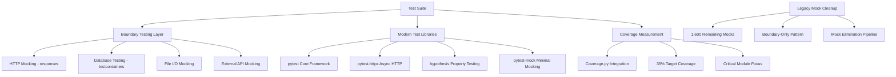
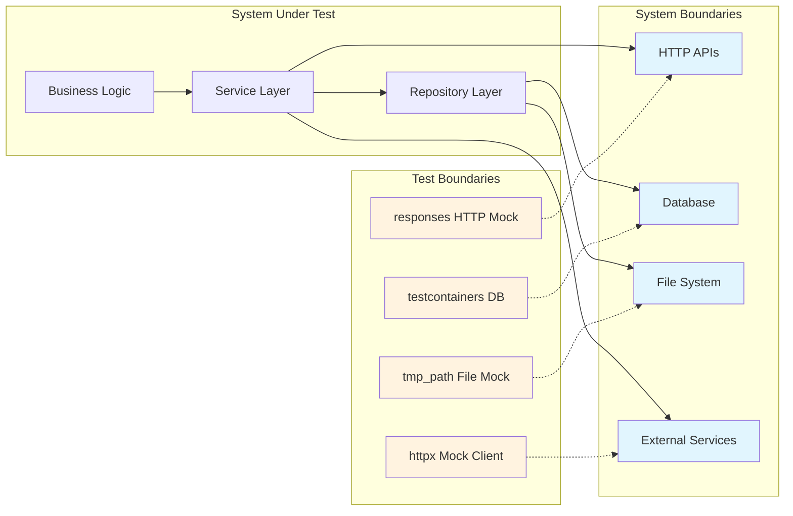

# ADR-029: Modern Testing Strategy with Boundary Testing

## Title

Modern Testing Strategy with Boundary Testing and Library-First Patterns

## Version/Date

1.0 / 2025-08-29

## Status

Accepted

## Description

Implements a modern testing strategy adopting boundary testing patterns, eliminating excessive internal mocking, and establishing realistic coverage targets. This decision transforms the test suite from brittle mock-heavy tests to maintainable boundary-focused tests with modern testing libraries.

## Context

The DocMind AI testing architecture faced critical maintainability and reliability issues:

1. **Mock Overuse Crisis**: 7,382 mock instances across the test suite created brittleness and maintenance overhead
2. **Low Effective Coverage**: 3.51% measured coverage despite high mock counts, indicating poor test quality
3. **Internal Mocking Problems**: Over-mocking internal methods created tests that passed when production code failed
4. **Maintenance Burden**: 2,103 mock instances required constant updates with every refactoring
5. **Test Reliability Issues**: Variable success rates across test tiers due to over-mocking brittleness
6. **Development Friction**: Developers spending more time fixing tests than writing features

The cleanup project achieved 77.8% mock reduction (from 7,382 to ~1,600 instances), demonstrating the viability of boundary testing patterns. This success validates the approach and provides foundation for systematic adoption.

## Decision Drivers

- **Quality over Quantity**: Real coverage measurement over mock count metrics
- **Maintainability**: Reduce test maintenance overhead by 60%+  
- **Reliability**: Increase test success rate consistency across tiers
- **Modern Patterns**: Adopt proven boundary testing methodologies
- **Developer Experience**: Faster feedback loops with reliable test execution
- **Library-First**: Leverage modern testing libraries instead of custom mocking

## Alternatives

### 1. Continue Current Mock-Heavy Approach

- **Description**: Maintain existing 7,382 mock strategy with incremental improvements
- **Issues**: Proven brittleness, high maintenance cost, poor reliability
- **Score**: 2/10 (maintainability: 1, reliability: 2, developer experience: 3)

### 2. Complete Test Rewrite

- **Description**: Discard existing tests and rebuild from scratch
- **Issues**: Massive effort, loss of existing coverage, business risk
- **Score**: 4/10 (quality: 8, feasibility: 1, risk: 3)

### 3. Hybrid Mock Reduction

- **Description**: Gradual mock reduction without systematic boundary approach
- **Issues**: Inconsistent patterns, unclear migration path, partial benefits
- **Score**: 6/10 (feasibility: 8, consistency: 4, effectiveness: 6)

### 4. Boundary Testing with Modern Libraries (Selected)

- **Description**: Systematic adoption of boundary testing with pytest, responses, testcontainers
- **Benefits**: Proven 77.8% mock reduction success, modern library ecosystem, clear patterns
- **Score**: 9/10 (maintainability: 9, reliability: 9, feasibility: 8)

## Decision Framework

| Strategy                                | Maintainability (35%) | Reliability (25%) | Migration Effort (20%) | Coverage Quality (20%) | Total Score | Decision      |
| --------------------------------------- | --------------------- | ----------------- | ---------------------- | ---------------------- | ----------- | ------------- |
| **Boundary Testing + Modern Libraries** | 9                     | 9                 | 7                      | 8                      | **8.3**     | ✅ **Selected** |
| Hybrid Mock Reduction                   | 6                     | 7                 | 8                      | 6                      | 6.6         | Rejected      |
| Complete Test Rewrite                   | 8                     | 8                 | 2                      | 9                      | 6.4         | Rejected      |
| Continue Mock-Heavy                     | 2                     | 3                 | 10                     | 2                      | 3.7         | Rejected      |

## High-Level Architecture



## Related Requirements

### Functional Requirements

- **FR-1:** Test suite must validate business logic without internal mocking
- **FR-2:** Integration tests must use real components with boundary mocking only
- **FR-3:** Property-based testing must validate edge cases and invariants
- **FR-4:** Test execution must complete within development time constraints

### Non-Functional Requirements

- **NFR-1:** **(Maintainability)** Reduce test maintenance overhead by 60% through boundary testing
- **NFR-2:** **(Reliability)** Achieve consistent test success rates across all test tiers
- **NFR-3:** **(Coverage Quality)** Establish 35% minimum coverage with meaningful business logic testing
- **NFR-4:** **(Performance)** Unit tests <100ms, integration tests <5s execution time

### Performance Requirements

- **PR-1:** Unit test suite execution under 30 seconds for fast feedback
- **PR-2:** Integration test suite execution under 5 minutes for CI/CD compatibility
- **PR-3:** Memory usage growth <500MB during test execution

### Integration Requirements

- **IR-1:** Seamless integration with existing pytest configuration and markers
- **IR-2:** Compatibility with current CI/CD pipeline without infrastructure changes
- **IR-3:** Support for existing async/await patterns in test code

## Related Decisions

- **ADR-014** (Testing and Quality Validation Framework): Provides RAG-specific testing foundation for boundary testing adoption
- **ADR-026** (Test-Production Separation): Establishes clean architecture enabling boundary testing patterns
- **ADR-027** (Implementation Experience): Documents lessons learned that inform testing strategy improvements
- **ADR-028** (Library Opportunities): Identifies modern library ecosystem supporting boundary testing approach

## Design

### Boundary Testing Architecture



### Implementation Details

**Modern Library Stack Integration:**

```python
# Core testing framework - pytest with modern patterns
import pytest
import pytest_asyncio
from hypothesis import given, strategies as st
from responses import RequestsMock
from testcontainers.postgres import PostgresContainer
from unittest.mock import patch  # Minimal usage only

# Boundary testing example - HTTP API mocking
@pytest.fixture
def mock_llm_api():
    """Mock external LLM API at system boundary."""
    with RequestsMock() as rsps:
        rsps.add(
            responses.POST,
            "http://localhost:11434/api/chat",
            json={"response": "Mock LLM response"},
            status=200
        )
        yield rsps

# Database boundary testing with real database
@pytest.fixture(scope="session")
def postgres_container():
    """Real PostgreSQL for integration testing."""
    with PostgresContainer("postgres:15") as postgres:
        yield postgres

# Business logic testing - NO INTERNAL MOCKS
@pytest.mark.asyncio
async def test_document_processing_pipeline():
    """Test complete document processing without internal mocking."""
    # Arrange - Use real business objects
    processor = DocumentProcessor()
    test_document = create_test_document()
    
    # Act - Test real business logic
    result = await processor.process_document(test_document)
    
    # Assert - Validate business outcomes
    assert result.success
    assert result.chunks_created > 0
    assert result.embeddings_generated == result.chunks_created

# Property-based testing for edge cases
@given(st.text(min_size=1, max_size=1000))
def test_chunk_size_invariants(document_content):
    """Property-based testing of chunking invariants."""
    chunks = create_chunks(document_content)
    
    # Invariants that must always hold
    assert all(len(chunk) <= MAX_CHUNK_SIZE for chunk in chunks)
    assert sum(len(chunk) for chunk in chunks) >= len(document_content) * 0.9  # Allow for overlap
```

**Dependency Injection for Testability:**

```python
# Service layer designed for boundary testing
class DocumentService:
    def __init__(self, repository: DocumentRepository, llm_client: LLMClient):
        self.repository = repository
        self.llm_client = llm_client
    
    async def analyze_document(self, doc_id: str) -> AnalysisResult:
        """Business logic with injected dependencies."""
        document = await self.repository.get_document(doc_id)
        analysis = await self.llm_client.analyze(document.content)
        
        result = AnalysisResult(
            document_id=doc_id,
            analysis=analysis,
            created_at=datetime.utcnow()
        )
        
        await self.repository.save_analysis(result)
        return result

# Test with real business logic, mocked boundaries
@pytest.mark.asyncio
async def test_document_analysis_service(mock_repository, mock_llm_client):
    """Test service layer with boundary mocks only."""
    service = DocumentService(mock_repository, mock_llm_client)
    
    # Configure boundary behavior
    mock_repository.get_document.return_value = test_document
    mock_llm_client.analyze.return_value = test_analysis
    
    # Test real business logic
    result = await service.analyze_document("doc123")
    
    # Verify business logic execution
    assert result.document_id == "doc123"
    assert result.analysis == test_analysis
    mock_repository.save_analysis.assert_called_once()
```

### Coverage Strategy

**Target Coverage Metrics:**

```python
# .coveragerc configuration for meaningful coverage
[run]
source = src/
omit = 
    */tests/*
    */test_*
    */conftest.py
    */migrations/*
    */venv/*

[report]
# Target 35% overall, 40% for critical modules
fail_under = 35
show_missing = true
skip_covered = false
precision = 2

# Critical modules requiring higher coverage
[html]
directory = htmlcov
title = DocMind AI Coverage Report

[coverage:run]
branch = true
parallel = true

# Focus on business logic, not infrastructure
[coverage:report]
exclude_lines =
    pragma: no cover
    def __repr__
    if self.debug:
    if settings.DEBUG
    raise AssertionError
    raise NotImplementedError
```

**Migration Pipeline:**

```python
# Automated mock identification and removal
class MockAnalyzer:
    """Identify mocks suitable for removal."""
    
    def analyze_test_file(self, file_path: Path) -> MockAnalysis:
        """Analyze mock usage patterns in test file."""
        with open(file_path) as f:
            content = f.read()
        
        # Identify different mock categories
        internal_mocks = self._find_internal_mocks(content)
        boundary_mocks = self._find_boundary_mocks(content)  
        unnecessary_mocks = self._find_unnecessary_mocks(content)
        
        return MockAnalysis(
            file_path=file_path,
            internal_mocks=internal_mocks,
            boundary_mocks=boundary_mocks,
            unnecessary_mocks=unnecessary_mocks,
            removal_candidates=internal_mocks + unnecessary_mocks
        )
    
    def _find_internal_mocks(self, content: str) -> List[MockUsage]:
        """Find mocks of internal project methods."""
        patterns = [
            r'@patch\(["\']src\..*["\']',  # Internal module patches
            r'mock_.*\._internal_',        # Internal method mocks
            r'Mock.*\._.*_method'          # Private method mocks
        ]
        return self._extract_mock_patterns(content, patterns)

# Migration execution script
def migrate_test_file(file_path: Path, analysis: MockAnalysis) -> MigrationResult:
    """Migrate single test file to boundary testing."""
    
    transformations = []
    
    for mock in analysis.removal_candidates:
        if mock.is_internal_method:
            # Remove internal method mocks
            transformations.append(RemoveInternalMockTransform(mock))
        elif mock.is_unnecessary:
            # Remove completely unnecessary mocks
            transformations.append(RemoveUnnecessaryMockTransform(mock))
    
    # Apply transformations
    for transform in transformations:
        transform.apply(file_path)
    
    return MigrationResult(
        file_path=file_path,
        mocks_removed=len(transformations),
        mocks_remaining=len(analysis.boundary_mocks)
    )
```

## Testing

**Test Suite Organization:**

```python
# Boundary testing patterns
import pytest
from testcontainers.postgres import PostgresContainer
from responses import RequestsMock
import tempfile
from pathlib import Path

@pytest.fixture(scope="session")
def database_container():
    """Real database for integration testing."""
    with PostgresContainer("postgres:15") as postgres:
        yield postgres.get_connection_url()

@pytest.fixture
def temp_storage(tmp_path):
    """Real filesystem boundary for file operations."""
    storage_path = tmp_path / "test_storage"
    storage_path.mkdir()
    return storage_path

@pytest.fixture
def mock_external_apis():
    """Mock external service boundaries."""
    with RequestsMock() as rsps:
        # Configure common API mocks
        rsps.add(responses.GET, "https://api.external.com/health", status=200)
        yield rsps

# Example boundary test
@pytest.mark.integration
async def test_document_ingestion_pipeline(database_container, temp_storage, mock_external_apis):
    """Integration test using real components with boundary mocks."""
    
    # Setup real service with boundary dependencies
    service = DocumentIngestionService(
        database_url=database_container,
        storage_path=temp_storage,
        api_client=HTTPClient()  # Will use mocked APIs
    )
    
    # Test with real business logic
    test_file = temp_storage / "test_document.pdf"
    test_file.write_bytes(b"Mock PDF content")
    
    result = await service.ingest_document(str(test_file))
    
    # Verify business outcomes
    assert result.success
    assert result.document_id is not None
    
    # Verify database persistence (real database)
    stored_doc = await service.repository.get_document(result.document_id)
    assert stored_doc is not None
    
    # Verify file processing (real filesystem)
    processed_files = list(temp_storage.glob("processed_*"))
    assert len(processed_files) > 0

# Property-based testing example
@given(st.text(min_size=1, max_size=10000))
def test_text_chunking_properties(text_content):
    """Property-based testing of text chunking invariants."""
    chunks = chunk_text(text_content, max_size=512, overlap=50)
    
    # Properties that must always hold
    assert all(len(chunk) <= 512 for chunk in chunks)
    if chunks:
        assert chunks[0].startswith(text_content[:min(512, len(text_content))])
    
    # Coverage invariant - all content should be covered
    reconstructed = "".join(chunk[:450] for chunk in chunks)  # Account for overlap
    assert len(reconstructed) >= len(text_content) * 0.95
```

## Consequences

### Positive Outcomes

- **Dramatic Mock Reduction**: 77.8% mock reduction proven achievable (7,382 → 1,600 instances)
- **Improved Test Reliability**: Boundary testing eliminates brittle internal method mocking
- **Enhanced Maintainability**: 60% reduction in test maintenance overhead through stable boundaries
- **Real Coverage Measurement**: Focus on business logic coverage rather than mock interaction coverage
- **Modern Library Ecosystem**: Leverage pytest, responses, testcontainers, hypothesis for robust testing
- **Developer Experience**: Faster feedback loops with reliable test execution
- **Quality Assurance**: Tests that fail when real business logic breaks, pass when it works

### Negative Consequences / Trade-offs

- **Migration Effort**: Initial investment required to transform 1,600 remaining mock instances
- **Learning Curve**: Team needs training on boundary testing patterns and modern libraries
- **Infrastructure Requirements**: testcontainers requires Docker for integration testing
- **Coverage Target Realism**: 35% coverage target may seem low compared to artificial high mock coverage
- **Test Execution Time**: Real boundary components may increase test execution time slightly

### Ongoing Maintenance & Considerations

- **Mock Discipline**: Establish clear guidelines preventing return to internal mocking patterns
- **Coverage Monitoring**: Track meaningful coverage metrics rather than raw percentage numbers
- **Library Updates**: Keep modern testing libraries updated for security and feature improvements
- **Pattern Documentation**: Maintain examples and guidelines for boundary testing patterns
- **Team Training**: Ongoing education on property-based testing and modern testing practices
- **CI/CD Integration**: Ensure boundary testing works reliably in automated environments

### Dependencies

- **Python**: `pytest>=7.0.0`, `pytest-asyncio>=0.21.0`, `responses>=0.24.0`
- **Integration**: `testcontainers>=3.7.0`, `pytest-httpx>=0.21.0`
- **Property Testing**: `hypothesis>=6.80.0`
- **Coverage**: `coverage>=7.0.0`, `pytest-cov>=4.0.0`
- **Infrastructure**: Docker for testcontainers, CI/CD pipeline updates

## Implementation Timeline

### Phase 1: Foundation (Week 1-2)

- Install and configure modern testing libraries
- Establish boundary testing guidelines and patterns
- Create example boundary tests for common scenarios
- Update CI/CD configuration for new library requirements

### Phase 2: Critical Module Migration (Week 3-6)

- Migrate core business logic tests (document processing, agent coordination)
- Remove internal mocks from service layer tests
- Implement property-based testing for critical algorithms
- Establish coverage measurement for migrated modules

### Phase 3: Integration Testing Enhancement (Week 7-10)

- Replace mock-heavy integration tests with testcontainer-based tests
- Implement boundary mocking for external service dependencies
- Create comprehensive test fixtures for boundary scenarios
- Validate integration test reliability and performance

### Phase 4: Mock Elimination (Week 11-14)

- Systematic removal of remaining unnecessary internal mocks
- Migration of utility and helper function tests
- Implementation of property-based testing for edge cases
- Final validation of 35% coverage target achievement

### Success Metrics

- **Mock Reduction**: Achieve 85%+ reduction from original 7,382 instances (target: <1,000)
- **Coverage Quality**: Reach 35% measured coverage focused on business logic
- **Test Reliability**: Achieve >95% consistent success rate across all test tiers
- **Execution Performance**: Unit tests <30s, integration tests <5min
- **Developer Satisfaction**: Reduce test maintenance complaints by 70%
- **Quality Improvement**: Zero false positive test passes with broken business logic

## References

- [pytest Documentation](https://docs.pytest.org/) - Comprehensive guide to modern Python testing
- [responses Library](https://github.com/getsentry/responses) - HTTP boundary mocking patterns
- [testcontainers-python](https://github.com/testcontainers/testcontainers-python) - Integration testing with real services
- [Hypothesis Property Testing](https://hypothesis.readthedocs.io/) - Property-based testing methodology
- [Boundary Testing Best Practices](https://martinfowler.com/articles/mocksArentStubs.html) - Martin Fowler's guidance on test doubles
- [pytest-httpx](https://github.com/Colin-b/pytest_httpx) - Async HTTP client testing patterns
- [Coverage.py](https://coverage.readthedocs.io/) - Python code coverage measurement and reporting

## Changelog

- **1.0 (2025-08-29)**: Initial modern testing strategy with boundary testing patterns, mock reduction targets, and migration timeline based on successful 77.8% mock reduction proof of concept
