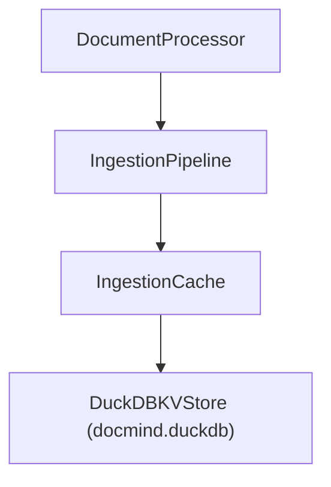

## Description

Unify document‑processing cache on LlamaIndex IngestionCache with a local DuckDB‑backed KV store (single file). Remove custom cache wrappers. No back‑compat. Library‑first, local‑first, minimal maintenance.

## Context

- Custom cache wrappers increased maintenance and re-implemented functionality already provided by LlamaIndex.
- JSON-based persistence lacks robustness/concurrency characteristics for larger caches.
- We require a single, durable, local-first cache with minimal code surface.

## Decision Drivers

- KISS and library‑first
- Local‑first durability and performance
- Zero external services
- Minimal maintenance

## Alternatives

- A: IngestionCache + JSON (SimpleKVStore) — Pros: simplest; Cons: limited durability/concurrency.
- B: IngestionCache + DuckDBKVStore — Pros: robust, single-file DB, local-first; Cons: integration dependency.
- C: Custom SimpleCache wrapper — Pros: known behavior; Cons: re-invents wheel; more code; harder to maintain.

### Decision Framework

| Model / Option         | Solution Leverage (35%) | Maintenance (30%) | Performance (25%) | Simplicity (10%) | Total Score | Decision      |
| ---------------------- | ----------------------- | ----------------- | ----------------- | ---------------- | ----------- | ------------- |
| B: Ingest+DuckDBKV     | 9.5                     | 9.0               | 9.0               | 9.0              | **9.2**     | ✅ Selected    |
| A: Ingest+JSON         | 8.0                     | 8.5               | 6.0               | 10.0             | 7.9         | Rejected      |
| C: Custom Wrapper      | 4.0                     | 3.0               | 6.0               | 5.0              | 4.3         | Rejected      |

## Decision

Adopt **LlamaIndex IngestionCache + DuckDBKVStore** as the single cache for document processing. Remove custom caches and JSON-based persistence. Store cache file at `settings.cache_dir/docmind.duckdb`.

## High-Level Architecture



## Related Requirements

### Functional Requirements

- FR‑1: Persist and retrieve document‑processing cache entries
- FR‑2: Operate fully offline/local‑first

### Non-Functional Requirements

- NFR‑1: Maintainability — remove custom cache code
- NFR‑2: Performance — efficient local IO with single‑file DB

### Performance Requirements

- PR‑1: Cache ops <10ms typical on consumer hardware

### Integration Requirements

- IR‑1: Integrates via LlamaIndex IngestionPipeline

## Related Decisions

- **ADR-031**: Local-first persistence; vectors in Qdrant, cache via DuckDBKVStore
- **ADR-025**: Simplified caching; now unified on IngestionCache(DuckDBKVStore)
- **ADR-026**: Test/production separation; removes SimpleCache from src
- **ADR-035**: Application-level semantic cache (GPTCache) — separate from document-processing cache described here

## Design

### Architecture Overview

- Cache file: `settings.cache_dir/docmind.duckdb` (single‑file DB)
- Namespace: `docmind_processing`
- Removal: delete `src/cache/simple_cache.py`

### Implementation Details

In `src/core/processing.py` (DocumentProcessor wiring):

  ```python
  from pathlib import Path
  from llama_index.core.ingestion import IngestionCache
  from llama_index.storage.kvstore.duckdb import DuckDBKVStore

  cache_db = Path(settings.cache_dir) / "docmind.duckdb"
  kv = DuckDBKVStore(db_path=str(cache_db))
  self.cache = IngestionCache(cache=kv, collection="docmind_processing")
  ```

### Configuration

- No additional env vars required beyond `DOCMIND_*` for cache directory paths.

## Testing

- Unit tests for store/retrieve, clear (delete file), and minimal stats.
- Integration: pipeline re-run should show unchanged outputs with fast second run.

## Consequences

### Positive Outcomes

- Eliminates custom cache code
- Single‑file, local‑first durability
- Minimal, library‑backed maintenance

### Negative Consequences / Trade-offs

- Requires proper LlamaIndex DuckDB KV integration package
- Stats may be minimal unless a count API is exposed

### Ongoing Maintenance & Considerations

- Track LlamaIndex integration package updates
- Keep cache DB isolated from analytics; avoid coupling responsibilities

### Dependencies

- Python: `duckdb`, `llama-index-*` packages exposing `DuckDBKVStore`

## References

- LlamaIndex docs: DuckDB vector/document/index stores; KV store integration modules

## Changelog

- **1.1 (2025-09-03)**: DOCS - Clarified separation from application-level semantic cache (ADR-035) in Related Decisions
- **1.0 (2025-09-02)**: Initial accepted version.
