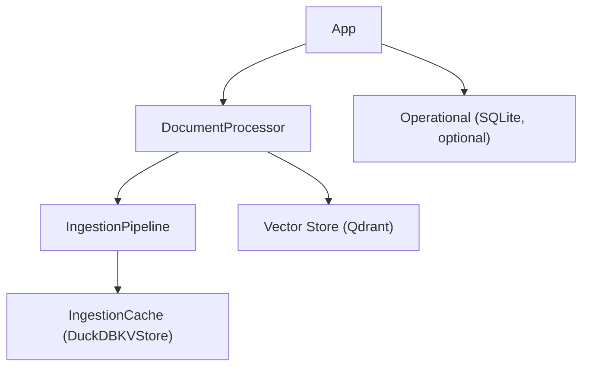

## Description

Adopt a simple, offline-first persistence split: Qdrant for vectors, LlamaIndex IngestionCache backed by DuckDBKVStore for document-processing cache, and optional SQLite for operational metadata. No external services required; minimal code and clear responsibilities.

## Context

Earlier designs mixed concerns and introduced multiple storage backends. To reduce complexity and maintenance, we separate responsibilities: vector search in Qdrant; processing cache in a single DuckDB file via LlamaIndex; operational metadata optionally in SQLite. Analytics remains separate (ADR‑032/033), avoiding coupling to cache or vectors.

## Decision Drivers

- KISS: minimal components and responsibilities
- Local-first, fully offline operation
- Library-first: direct LlamaIndex and Qdrant usage
- Maintainability: remove custom caches and legacy wrappers

## Alternatives

- A: Redis/external services — Pros: familiar; Cons: breaks offline/local-first
- B: Custom caching (JSON/diskcache) — Pros: control; Cons: reinvents LlamaIndex features
- C: Single-store for all data — Pros: one DB; Cons: mismatched requirements and tuning

### Decision Framework

| Model / Option                             | Simplicity (30%) | Library Fit (30%) | Performance (25%) | Maintenance (15%) | Total Score | Decision      |
| ------------------------------------------ | ---------------- | ----------------- | ----------------- | ----------------- | ----------- | ------------- |
| Qdrant + IngestionCache/DuckDBKV (Selected)| 9                | 10                | 9                 | 9                 | **9.2**     | ✅ Selected    |
| Redis-based                                | 5                | 6                 | 8.5               | 7                 | 6.4         | Rejected      |
| Custom cache                               | 4                | 5                 | 7                 | 4                 | 5.1         | Rejected      |

## Decision

Adopt Qdrant for vectors, LlamaIndex IngestionCache with DuckDBKVStore for processing cache (single file at `settings.cache_dir/docmind.duckdb`), and optionally SQLite for operational metadata. No test-only hooks in src; rely on library clients.

## High-Level Architecture



## Related Requirements

### Functional Requirements

- FR‑1: Persist and reuse processing cache entries across runs
- FR‑2: Store and retrieve vectors for similarity search

### Non-Functional Requirements

- NFR‑1: Fully offline/local
- NFR‑2: Minimal code and clean boundaries (no test seams)
- NFR‑3: Durable single-file cache

### Performance Requirements

- PR‑1: Cache lookup adds <5ms per document on local hardware
- PR‑2: Vector inserts throughput meets ingestion targets for batch indexing

### Integration Requirements

- IR‑1: Use LlamaIndex integrations for cache and vector stores
- IR‑2: Keep analytics/backup separate (ADR‑032/033)

## Design

### Architecture Overview

- Qdrant handles vectors; DuckDBKVStore handles cache via LlamaIndex IngestionCache
- Optional SQLite for ops data (e.g., session metadata) via app settings

### Implementation Details

In `src/core/processing.py` (illustrative wiring):

```python
from pathlib import Path
from llama_index.core.ingestion import IngestionCache
from llama_index.storage.kvstore.duckdb import DuckDBKVStore

def build_cache(settings):
    cache_db = Path(settings.cache_dir) / "docmind.duckdb"
    cache_db.parent.mkdir(parents=True, exist_ok=True)
    return IngestionCache(cache=DuckDBKVStore(db_path=str(cache_db)), collection="docmind_processing")
```

### Configuration

```env
DOCMIND_CACHE__DIR=./cache
DOCMIND_CACHE__FILENAME=docmind.duckdb
```

## Testing

```python
def test_cache_roundtrip(cache):
    key, value = ("k", {"v": 1})
    cache.put(key, value)
    assert cache.get(key) == value
```

## Consequences

### Positive Outcomes

- Clean, minimal architecture; easy maintenance
- Fully offline; straightforward local deployment
- Clear separation of responsibilities

### Negative Consequences / Trade-offs

- Analytics not co-located with cache DB; separate DB if needed (ADR‑032)

### Ongoing Maintenance & Considerations

- Track LlamaIndex and DuckDB integration versions
- Monitor cache file growth; pair with retention/backup policies (ADR‑033)

### Dependencies

- Python: `llama-index>=0.13`, `llama-index-storage-kvstore-duckdb`, `llama-index-vector-stores-qdrant`, `duckdb`

## Changelog

- **1.1 (2025-09-03)**: DOCS - Added Related Decisions note referencing ADR-035 (application-level semantic cache)
- **1.0 (2025-09-02)**: Initial accepted version.
