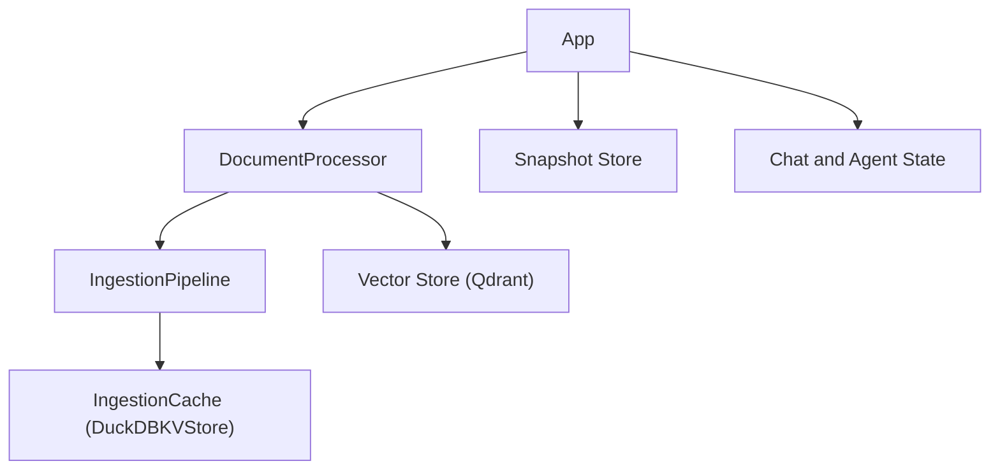

## Description

Adopt a simple, offline-first persistence split: Qdrant for vectors,
LlamaIndex IngestionCache backed by DuckDBKVStore for document-processing
cache, and the snapshot store for durable index manifests. Chat and agent state
retain their dedicated stores. Do not add a shared operational database without
a concrete consumer.

## Context

Earlier designs mixed concerns and introduced multiple storage backends. To
reduce complexity and maintenance, each subsystem retains one persistence
owner: vector search in Qdrant, processing cache in one DuckDB file, snapshots
in their manifest store, and chat/agent state in their dedicated stores.
Analytics remains separate (ADR-032/033), avoiding coupling to cache or vectors.

## Decision Drivers

- KISS: minimal components and responsibilities
- Local-first, fully offline operation
- Library-first: direct LlamaIndex and Qdrant usage
- Maintainability: remove custom caches and legacy wrappers

## Alternatives

- A: Redis/external services — Pros: familiar; Cons: breaks offline/local-first
- B: Custom caching (JSON/diskcache) — Pros: control; Cons: reinvents LlamaIndex features
- C: Single-store for all data — Pros: one DB; Cons: mismatched requirements and tuning

### Decision Framework

| Model / Option | Simplicity (30%) | Library Fit (30%) | Performance (25%) | Maintenance (15%) | Total Score | Decision |
| --- | --- | --- | --- | --- | --- | --- |
| Qdrant + IngestionCache/DuckDBKV (Selected) | 9 | 10 | 9 | 9 | **9.2** | Selected |
| Redis-based | 5 | 6 | 8.5 | 7 | 6.4 | Rejected |
| Custom cache | 4 | 5 | 7 | 4 | 5.1 | Rejected |

## Decision

Adopt Qdrant for vectors and LlamaIndex IngestionCache with DuckDBKVStore for
processing cache (single configured file at
`settings.cache.ingestion_db_path`). Keep snapshot, chat, agent-state, and
analytics persistence at their existing subsystem boundaries. No test-only
hooks in `src`; rely on library clients.

Hybrid Retrieval Schema (Qdrant Collections):

- Qdrant collections SHALL define named vectors to support server-side hybrid queries via the Query API:
  - `text-dense`: `VectorParams(distance=COSINE, size=<embed_dim>)`
  - `text-sparse`: `SparseVectorParams(modifier=IDF)`
- Collection ensure is idempotent at startup. A missing collection is created, while any incompatible existing dense or sparse schema fails closed. Only the explicit `scripts/qdrant_schema.py rebuild-empty` command may replace an empty collection after all writers stop.
- See SPEC‑004 for hybrid query and fusion details (Prefetch + FusionQuery; RRF default; DBSF optional via env).

### SnapshotManager (Amendment — GraphRAG)

For GraphRAG and indices requiring consistent reloads, adopt a SnapshotManager:

- Write under `storage/_tmp-<uuid>`; `fsync` and atomically rename to
  `storage/<timestamp>`. Readers activate only the checksum-verified manifest
  referenced by `CURRENT`; no directory-order fallback exists.
- Record immutable physical Qdrant text/image collection identities. Do not
  serialize vectors into app snapshots; Qdrant backups own point-in-time vector
  data. Persist the optional complete native property-graph `StorageContext`
  under `graph/`, including its graph-local vector store, and package snapshot
  exports under `graph/graph_export-snapshot-YYYYMMDDTHHMMSSZ.*`. The local
  graph vectors preserve semantic GraphRAG retrieval across restart and are not
  copies of the live Qdrant corpus vectors.
- Emit tri-file manifests (`manifest.jsonl`, `manifest.meta.json`,
  `manifest.checksum`). Redacted persistence failures live at
  `storage/errors.jsonl`; an aborted graph workspace may contain a transient
  error record. `manifest.meta.json` keeps `complete=false` until promotion
  succeeds, then flips to `true`. Legacy `manifest.json` SHALL NOT be emitted.
- Use a bounded `SnapshotLock` implemented with required `portalocker`. The OS
  lock on the permanent `.lock` sentinel is authoritative; JSON heartbeats are
  diagnostic only and never permit stale takeover. Fail closed when OS-lock
  support is unavailable. Telemetry captures export operations, lock timeouts,
  and stale-snapshot detection.
- Acquire the writer lock before crash recovery or retention. `CURRENT`
  replacement is the final commit point. A durable activation journal binds the
  promoted destination before rename, and recovery never promotes an
  unreferenced snapshot.
- Load latest snapshot in Chat (ADR‑038; SPEC‑014) using the pointer and staleness digests for badge display.

## High-Level Architecture


```mermaid
graph TD
    A["App"] --> B["DocumentProcessor"]
    B --> C["IngestionPipeline"]
    C --> D["IngestionCache (DuckDBKVStore)"]
    B --> E["Vector Store (Qdrant)"]
    A --> F["Snapshot Store"]
    A --> G["Chat and Agent State"]
```

## Related Requirements

### Functional Requirements

- FR‑1: Persist and reuse processing cache entries across runs
- FR‑2: Store and retrieve vectors for similarity search

### Non-Functional Requirements

- NFR‑1: Fully offline/local
- NFR‑2: Minimal code and clean boundaries (no test seams)
- NFR‑3: Durable single-file cache

### Performance Requirements

- PR‑1: Cache lookup adds <5ms per document on local hardware
- PR‑2: Vector inserts throughput meets ingestion targets for batch indexing

### Integration Requirements

- IR‑1: Use LlamaIndex integrations for cache and vector stores
- IR‑2: Keep analytics/backup separate (ADR‑032/033)

## Design

### Architecture Overview

- Qdrant handles vectors; DuckDBKVStore handles cache via LlamaIndex IngestionCache
- Snapshot, chat, and agent-state persistence remain separate from ingestion
  cache configuration

### Implementation Details

In `src/processing/ingestion_pipeline.py` (illustrative wiring):

```python
from llama_index.core.ingestion import IngestionCache
from llama_index.storage.kvstore.duckdb import DuckDBKVStore

def build_cache(settings):
    cache_db = settings.cache.ingestion_db_path
    cache_db.parent.mkdir(parents=True, exist_ok=True)
    return IngestionCache(cache=DuckDBKVStore(database_name=str(cache_db)), collection="docmind_processing")
```

### Configuration

```env
DOCMIND_CACHE__DIR=./cache
DOCMIND_CACHE__FILENAME=docmind.duckdb
```

## Testing

```python
def test_cache_roundtrip(cache):
    key, value = ("k", {"v": 1})
    cache.put(key, value)
    assert cache.get(key) == value
```

### Observability

- `configure_observability()` (SPEC-012) provisions OpenTelemetry SDK providers with OTLP exporters **only when enabled** via `settings.observability.enabled` (offline-first default is disabled).
- Key workflows emit spans/metrics (no-op unless exporters are enabled), including snapshot persistence (`snapshot.*` spans), ingestion (`ingest_documents` span), router composition (`router_factory.build_router_engine` span), and GraphRAG export metrics (`docmind.graph.export.*`).
- Local JSONL telemetry records retrieval backend/outcome,
  `snapshot_stale_detected`, `export_performed`, and retrieval/rerank fields for
  offline audits. Router construction emits `router_selected` through
  OpenTelemetry, not per-query JSONL. Rotation and sampling are controlled by
  `DOCMIND_TELEMETRY_*` environment variables.

## Consequences

### Positive Outcomes

- Clean, minimal architecture; easy maintenance
- Fully offline; straightforward local deployment
- Clear separation of responsibilities

### Negative Consequences / Trade-offs

- Analytics not co-located with cache DB; separate DB if needed (ADR‑032)

### Ongoing Maintenance & Considerations

- Track LlamaIndex and DuckDB integration versions
- Monitor cache file growth; pair with retention/backup policies (ADR‑033)

### Dependencies

- Python: `llama-index-core>=0.14.21,<0.15.0`, `llama-index-storage-kvstore-duckdb`, `llama-index-vector-stores-qdrant`, and `duckdb`

## Changelog

- 2.2 (2026-07-14): Persist the complete property-graph StorageContext so graph
  vector retrieval survives restart.
- 2.1 (2026-07-14): Require OS-fenced portalocker ownership and remove unsafe
  lease-file takeover and fallback locking.
- 2.0 (2026-07-13): Remove the unimplemented shared operational database and keep persistence with each live subsystem owner.
- 1.7 (2026-07-10): Align the Qdrant contract with fail-closed named-vector schema validation and replace the removed LlamaIndex meta-package with direct dependencies.
- 1.6 (2026-01-09): Docs-only: align observability section with SPEC-012 and shipped telemetry (no implicit console fallback; remove lock_takeover mention).
- 1.5 (2025-09-16): Clarified SnapshotLock heartbeat/takeover semantics, retention discipline, and OpenTelemetry logging requirements.
- 1.4 (2025-09-16): Documented portalocker-based locking with TTL metadata, fallback locking, graph export telemetry, and removal of legacy `manifest.json`.
- 1.3 (2025-09-16): Documented tri-file manifest layout, `complete` flag semantics, CURRENT pointer resolution, timestamped graph exports, and telemetry expectations.
- 1.2 (2025-09-09): Added SnapshotManager and manifest hashing for GraphRAG; linked ADR‑038/SPEC‑014
- **1.1 (2025-09-03)**: DOCS - Added Related Decisions note referencing ADR-035 (application-level semantic cache)
- **1.0 (2025-09-02)**: Initial accepted version.
