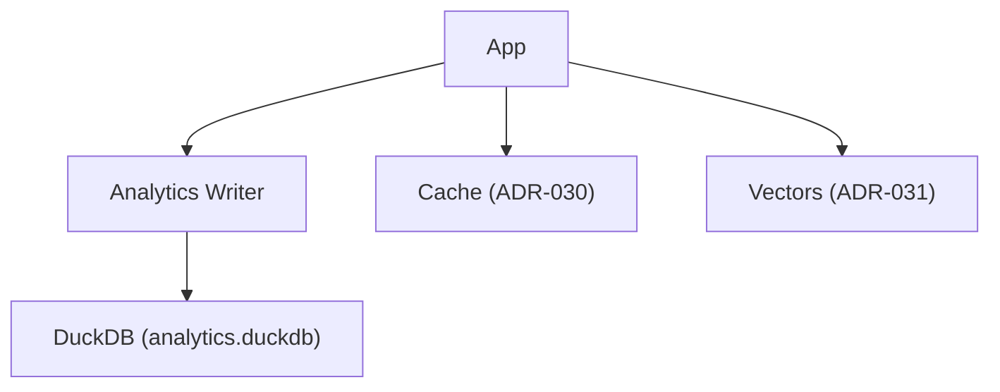

## Description

Provide an optional, local-only DuckDB database for lightweight performance and quality metrics. Keep analytics decoupled from document-processing cache (ADR‑030) and persistence (ADR‑031). Disabled by default; opt-in for advanced users who want local insights without external services.

## Context

- ADR‑007 explored broader analytics; later ADR‑030/031 simplified cache/persistence and avoided coupling analytics to cache
- Need a minimal local analytics path that preserves separation of concerns and remains optional

## Decision Drivers

- Local-first, offline operation; zero external services
- Minimal footprint; clear separation from cache (ADR‑030) and vectors (ADR‑031)
- Optional/opt-in to avoid default complexity
- Simple schema with straightforward retention

## Alternatives

- A: External observability services — Pros: rich UX; Cons: violates local-first
- B: Couple analytics with cache DB — Pros: fewer files; Cons: mixes concerns (ADR‑031 conflict)
- C: No analytics — Pros: simplest; Cons: loses local insight (this ADR enables optional opt-in)

### Decision Framework

| Model / Option             | Local-first (30%) | Simplicity (30%) | Separation (25%) | Maintenance (15%) | Total Score | Decision    |
| -------------------------- | ----------------- | ---------------- | ---------------- | ----------------- | ----------- | ----------- |
| Separate DuckDB (Selected) | 10                | 9                | 10               | 9                 | **9.6**     | ✅ Selected |
| Couple with cache          | 9                 | 8                | 4                | 7                 | 7.2         | Rejected    |
| External service           | 3                 | 6                | 7                | 6                 | 5.2         | Rejected    |

## Decision

Create a separate DuckDB analytics DB with a minimal schema. Off by default. When enabled, use narrow ingestion helpers with best-effort writes; analysis tolerates missing data. Retention prunes old records.

## High-Level Architecture



## Related Requirements

### Functional Requirements

- FR‑1: Persist basic query/embedding/reranking/system metrics
- FR‑2: Provide retention pruning

### Non-Functional Requirements

- NFR‑1: Optional and disabled by default
- NFR‑2: Local-only; no external services

### Performance Requirements

- PR‑1: Insert latency <5ms per record on local hardware

### Integration Requirements

- IR‑1: Analytics stored separate from cache/vectors
- IR‑2: Readable by UI analytics page (ADR‑013) when enabled

## Design

### Architecture Overview

- Single-file DuckDB at `settings.data_dir / "analytics" / "analytics.duckdb"`
- Minimal tables: query_metrics, embedding_metrics, reranking_metrics, system_metrics

### Implementation Details

In `src/core/analytics.py` (illustrative):

```python
import duckdb

def get_conn(path: str):
    return duckdb.connect(path, read_only=False)

def ensure_schema(conn):
    conn.execute("""
    CREATE TABLE IF NOT EXISTS query_metrics(
      ts TIMESTAMP, query_type TEXT, latency_ms DOUBLE, result_count INT, retrieval_strategy TEXT, success BOOLEAN
    );
    """)
```

### Configuration

```env
DOCMIND_ANALYTICS__ENABLED=false
DOCMIND_ANALYTICS__RETENTION_DAYS=60
DOCMIND_ANALYTICS__DB_PATH=./data/analytics/analytics.duckdb
```

## Testing

```python
def test_schema_and_insert(tmp_path):
    # ensure schema creation and one insert works
    pass
```

## Consequences

### Positive Outcomes

- Local insight into latency/quality without external services
- Clean separation from cache and vectors
- Optional path keeps defaults simple

### Negative Consequences / Trade-offs

- Additional disk usage when enabled
- Extra code paths (opt-in only)

### Ongoing Maintenance & Considerations

- Monitor DB growth; rely on retention pruning
- Keep schema minimal; extend cautiously

### Dependencies

- Python: `duckdb`

## Changelog

- **1.1 (2025-09-10)**: Implemented synchronous, parameterized writes; added ingestion logging in `document_processor.py`; added allowlist tests and reranker telemetry fields (`rerank.path`, timeout budget). Docs updated; UI analytics page available when enabled.
- **1.0 (2025-09-02)**: Initial proposal for optional DuckDB analytics DB and schema.
