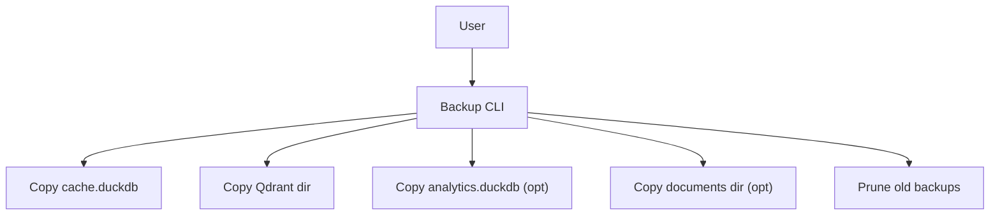

## Description

Provide a simple, manual backup mechanism with rotation for key local artifacts (cache DB, Qdrant data, optional analytics DB and documents). No daemons or external services; on-demand backups with predictable restore steps.

## Context

Earlier designs discussed background services; the local-first architecture (ADR‑030/031) prioritizes simplicity. Users still benefit from documented local backups that are easy to run and restore without adding runtime complexity.

## Decision Drivers

- Local-first, offline operation
- Simplicity: single command; no background jobs
- Safe restore steps and predictable copy semantics

## Alternatives

- A: Automated background tasks — Pros: convenience; Cons: complexity in local-first app
- B: External backup services — Pros: durability; Cons: violates offline default
- C: Manual CLI with rotation (Selected) — Pros: simple, explicit; Cons: user-initiated only

### Decision Framework

| Model / Option                 | Simplicity (40%) | Offline (30%) | Safety (20%) | Maintenance (10%) | Total Score | Decision      |
| ------------------------------ | ---------------- | ------------- | ------------ | ----------------- | ----------- | ------------- |
| Manual CLI + Rotation (Sel.)   | 10               | 10            | 9            | 9                 | **9.7**     | ✅ Selected    |
| Background scheduler           | 5                | 9             | 8            | 6                 | 6.8         | Rejected      |
| External service               | 6                | 2             | 9            | 7                 | 5.6         | Rejected      |

## Decision

Ship a CLI/script that creates a timestamped backup directory and prunes older backups beyond a configured limit. Include the cache DB, Qdrant local data, and optionally analytics DB and documents directory.

## High-Level Architecture



## Related Requirements

### Functional Requirements

- FR‑1: Create timestamped backup directory in `data/backups/backup_{YYYYMMDD_HHMMSS}`
- FR‑2: Include cache DB and Qdrant local data; optionally analytics DB and documents
- FR‑3: Prune backups to keep last N (default 7)
- FR‑4: Provide restore instructions (copy-back with app stopped)

### Non-Functional Requirements

- NFR‑1: Fully offline; stdlib only
- NFR‑2: Idempotent and safe (never delete in-progress backup)

### Performance Requirements

- PR‑1: Copy uses efficient shutil operations; avoids partial overwrites

### Integration Requirements

- IR‑1: Paths read from unified settings (ADR‑024/031)

## Design

### Architecture Overview

- Single command copies artifacts to a timestamped directory, then prunes by age/count

### Implementation Details

In `scripts/backup.py` (illustrative):

```python
from pathlib import Path
import shutil, time

def create_backup(settings, include_docs=False, include_analytics=False):
    ts = time.strftime("%Y%m%d_%H%M%S")
    dest = Path(settings.data_dir)/"backups"/f"backup_{ts}"
    dest.mkdir(parents=True, exist_ok=False)
    (dest/"cache").mkdir()
    shutil.copy2(Path(settings.cache_dir)/"docmind.duckdb", dest/"cache"/"docmind.duckdb")
    shutil.copytree(settings.qdrant_dir, dest/"qdrant")
    if include_analytics:
        (dest/"analytics").mkdir()
        shutil.copy2(Path(settings.data_dir)/"analytics"/"analytics.duckdb", dest/"analytics"/"analytics.duckdb")
    if include_docs:
        shutil.copytree(settings.documents_dir, dest/"documents")
    return dest
```

### Configuration

```env
DOCMIND_BACKUP__ENABLED=false
DOCMIND_BACKUP__KEEP_LAST=7
```

## Testing

```python
def test_rotation(tmp_path):
    # create N+2 fake backup dirs, run prune, assert only N left
    pass
```

## Consequences

### Positive Outcomes

- Simple, explicit backups with predictable restore steps
- No background tasks or external dependencies

### Negative Consequences / Trade-offs

- Manual operation; no continuous protection

### Ongoing Maintenance & Considerations

- Document safe restore procedure; ensure app is stopped
- Validate paths when settings change

### Dependencies

- System/Python: stdlib (`pathlib`, `shutil`, `time`)

## Changelog

- **v1.0 (2025-09-02)**: Initial proposal for manual backups with simple rotation.
