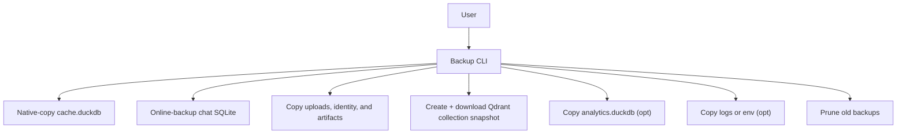

## Description

Provide a manual backup command with rotation for one complete local recovery
point. The command captures the authoritative uploads, active snapshot,
deployment identity, cache, chat database, artifacts, and exact Qdrant
collections. Analytics, logs, and `.env` remain optional.

## Context

Earlier designs discussed background services. The local-first architecture in
ADR-030 and ADR-031 instead uses an operator-run command with no scheduler or
external backup service.

## Decision drivers

- Local-first, offline operation
- Operational load: single command; no background jobs
- Safe restore steps and predictable copy semantics

## Alternatives

- A, automated background tasks: convenient, but adds a scheduler to the local app
- B, external backup services: durable, but violates the offline default
- C, manual CLI with rotation: explicit and offline, but requires an operator

### Decision framework

| Model / Option | Simplicity (40%) | Offline (30%) | Safety (20%) | Maintenance (10%) | Total Score | Decision |
| --- | --- | --- | --- | --- | --- | --- |
| Manual CLI + Rotation (Sel.) | 10 | 10 | 9 | 9 | **9.7** | Selected |
| Background scheduler | 5 | 9 | 8 | 6 | 6.8 | Rejected |
| External service | 6 | 2 | 9 | 7 | 5.6 | Rejected |

## Decision

Ship a CLI that creates a timestamped backup directory and prunes older backups
beyond a configured limit. A production run includes the cache database,
configured chat/checkpoint SQLite database, authoritative uploads, stable
deployment identity, active snapshot, existing artifact store, and exact
single-node Qdrant collections. Capture SQLite through its online backup API.
Capture DuckDB through `COPY FROM DATABASE` so committed write-ahead log (WAL)
state is included. DuckDB's single-process
writer model requires the standalone CLI to run after any separate DocMind
writer process stops. All callers require application and data-writer
quiescence because the filesystem snapshot tree is copied as one logical unit.

### Snapshot retention amendment

Include snapshot directories (`storage/<timestamp>`) in retention rules:

- Retain N latest snapshots (configurable) while never deleting the directory referenced by `CURRENT`.
- `manifest.meta.json` includes `created_at`, `versions`, `graph_exports`, and `complete` to aid audit/rotation (JSONL entries remain deterministic).
- Prune only fully finalized canonical snapshot directories. Remove abandoned
  `_tmp-*` workspaces only after acquiring the permanent sentinel's
  operating-system lock.
- Emit OpenTelemetry spans and structured `snapshot.retention` events describing
  successful and failed deletions for audit trails.

## High-level architecture


```mermaid
graph TD
  A["User"] --> B["Backup CLI"]
  B --> C["Native-copy cache.duckdb"]
  B --> H["Online-backup chat SQLite"]
  B --> I["Copy uploads, identity, and artifacts"]
  B --> D["Create + download Qdrant collection snapshot"]
  B --> E["Copy analytics.duckdb (opt)"]
  B --> F["Copy logs or env (opt)"]
  B --> G["Prune old backups"]
```

## Related requirements

### Functional requirements

- FR‑1: Create a collision-proof timestamped backup directory under `data/backups/`
- FR‑2: Include the cache database, configured chat SQLite database,
  authoritative uploads, deployment identity, active snapshot, existing
  artifact store, and exact single-node Qdrant collections
- FR‑3: Prune backups to keep last N (default 7)
- FR‑4: Provide restore instructions (copy-back with app stopped)

### Non-functional requirements

- NFR‑1: Fully offline; use the installed SQLite and DuckDB native clients
- NFR‑2: Idempotent and safe (never delete in-progress backup)

### Performance requirements

- PR‑1: Database copies use engine-native transaction snapshots; ordinary files use efficient shutil operations

### Integration requirements

- IR‑1: Paths, including `settings.chat.sqlite_path`, read from unified settings (ADR‑024/031)
- IR‑2: Chat SQLite is captured with the standard-library online backup API,
  not a raw main-file copy
- IR‑3: Ingestion-cache and analytics DuckDB files are captured with
  `COPY FROM DATABASE`, not raw main-file copies

## Design

### Architecture overview

- Single command copies artifacts to a timestamped directory, then prunes by age/count

### Implementation details

`scripts/backup.py` delegates creation and retention to
`src.persistence.backup_service`. The service creates a temporary workspace,
captures SQLite with `Connection.backup`, captures each DuckDB database with a
read-only `ATTACH` plus `COPY FROM DATABASE`, requests and downloads Qdrant
collection snapshots, validates their exact size and advertised SHA-256, writes
`manifest.json`, and atomically renames the workspace before pruning. ADR-051 is
implemented; the backup boundary consumes the canonical configured storage and
collection owners rather than maintaining a second snapshot orchestration path.
Any recoverability warning in `manifest.warnings` marks the manifest incomplete
and suppresses pruning, so a degraded run cannot evict the previous known-good
recovery point. `maintenance_warnings` records cleanup debt after recovery data
has verified and does not change `complete`. Complete and incomplete runs have
distinct directory names; pruning accepts only an exact complete manifest. An OS
file lock serializes create/prune, and failed temporary workspaces are removed.

The default `create` command includes uploads and Qdrant. The
`--diagnostic-no-uploads` and `--no-qdrant-snapshot` flags deliberately produce
an incomplete diagnostic capture. `manifest.json`'s `warnings` field records failures
that affect recovery. `maintenance_warnings` records server-side cleanup debt,
such as a Qdrant snapshot deletion failure, without invalidating already
verified recovery data.

A complete recovery point has an empty `warnings` list and includes `cache_db`,
`snapshots`, `chat_db`, `uploads`, `deployment_identity`, and
`qdrant_snapshots`. Its `databases` records bind the cache and chat copies to
their exact paths, byte counts, and SHA-256 digests. Its copied upload inventory
matches the active snapshot's corpus hash. Its Qdrant snapshot set matches
`activation.collections`, and its copied deployment identity matches
`activation.deployment_id`. Existing artifacts are content-inventoried and
included as the `artifacts` label.

Restore is intentionally not automated. The
[operations guide](../operations-guide.md#restore-a-backup) owns the exact
quiescence, artifact mapping, Qdrant version, verification, and rollback steps.
Restore the exact `activation.collections` names into a fresh, writer-quiesced
Qdrant target. Preserve the prior Qdrant instance for rollback because one
instance cannot retain two collections with the same physical name.

### Configuration

```env
DOCMIND_BACKUP_ENABLED=false
DOCMIND_BACKUP_KEEP_LAST=7
```

## Testing

The executable backup and retention cases live in
`tests/unit/scripts/test_backup_manifest.py` and
`tests/unit/scripts/test_backup_rotation.py`:

```bash
uv run pytest tests/unit/scripts/test_backup_manifest.py \
  tests/unit/scripts/test_backup_rotation.py -q -W error
```

## Consequences

### Positive outcomes

- One explicit backup contract with predictable restore steps
- No background tasks or external dependencies

### Negative consequences and trade-offs

- Manual operation; no continuous protection

### Ongoing maintenance

- Document safe restore procedure; ensure app is stopped
- Validate paths when settings change

### Dependencies

- Python standard library: SQLite online backup and ordinary file operations
- Installed `duckdb`: native transaction-consistent database copies
- Installed `qdrant-client`: server-side collection snapshot orchestration

## Changelog

- **v2.1 (2026-07-14)**: Made uploads and exact Qdrant generations required for
  a complete recovery point, defined diagnostic captures, and separated
  recoverability warnings from maintenance warnings.
- **v2.0 (2026-01-09)**: Amended with server-side Qdrant snapshots, manifest metadata, CURRENT pointer guardrails, and the implemented ADR‑051 snapshot service boundary.
- 1.3 (2025-09-16): Added CURRENT pointer guardrail, OpenTelemetry retention spans, and stale lock handling guidance.
- 1.2 (2025-09-16): Clarified snapshot metadata (`manifest.meta.json`, `graph_exports`) and cleanup of `_tmp-*` workspaces / `.lock.stale-*` remnants.
- 1.1 (2025-09-09): Added snapshot retention guidance and ADR‑038 cross‑link

- **v1.0 (2025-09-02)**: Initial proposal for manual backups with rotation.
