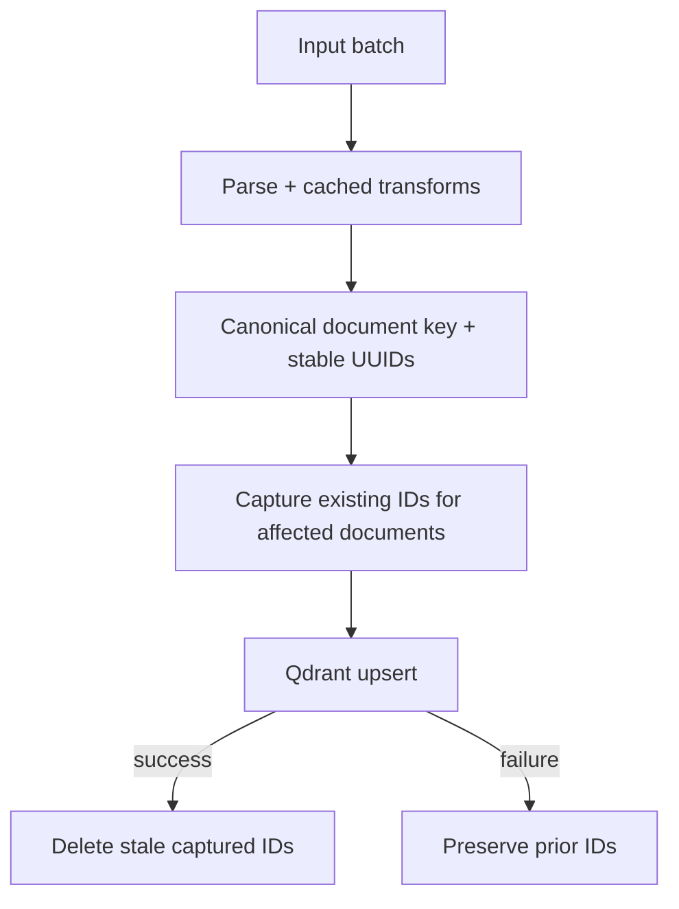

## Description

Avoid duplicate or stale Qdrant points with LlamaIndex transformation caching,
deterministic point IDs, a DocMind-owned canonical document key, and scoped
post-upsert deletion. No separate embedding cache is introduced.

## Context

Re-indexing unchanged content wastes compute and I/O. Prior ADRs unified processing cache (ADR‑030) and clarified storage (ADR‑031). We need a simple, robust reuse policy that prevents redundant embeddings while guaranteeing updates when content changes.

## Decision Drivers

- Reduce re-run cost (time/compute)
- Ensure correctness on content change
- KISS: leverage existing libraries and metadata

## Alternatives

- A: Deterministic IDs plus document-scoped stale deletion (selected)
- B: LlamaIndex `UPSERTS_AND_DELETE` across the persistent docstore
- C: Random IDs plus delete-before-insert

### Decision Framework

| Model / Option | Solution leverage (35%) | Application value (30%) | Maintenance (25%) | Adaptability (10%) | Total Score | Decision |
| --- | --- | --- | --- | --- | --- | --- |
| Deterministic scoped upsert | 9.2 | 9.5 | 9.0 | 8.5 | **9.2** | Selected |
| LlamaIndex whole-docstore delete | 9.0 | 5.5 | 8.5 | 7.0 | 7.6 | Rejected for partial batches |
| Delete before random-ID insert | 7.0 | 7.0 | 7.5 | 7.0 | 7.1 | Rejected |

## Decision

Use four coordinated owners:

1. `IngestionCache` reuses repeated batch transformations. The pipeline does
   not attach a LlamaIndex docstore because its duplicate filter omits
   unchanged nodes that the scoped replacement batch still owns.
2. Every parsed document and node carries its base ID in the parser-owned
   `docmind_document_id` metadata key. LlamaIndex remains free to own its generic
   document ID payload keys.
3. Text nodes receive deterministic Qdrant-compatible UUIDv5 IDs from canonical
   document ID, page ID, and chunk position. `VectorStoreIndex` performs the
   Qdrant upsert.
4. Before insertion, capture existing point IDs only for successfully loaded
   canonical documents. After a successful insertion, delete the captured IDs
   not present in the new node set. Never delete unrelated, missing, or rejected
   documents in a partial upload batch.

### Staleness & Snapshot Manifest (Amendment)

Define and use:

- `corpus_hash`: SHA‑256 of sorted `(relative_path, size, mtime_ns)` for all ingested files
- `config_hash`: SHA‑256 of canonical JSON with ingestion, parsing, OCR, PDF,
  and sorted per-input parser overrides

Persist both in `manifest.meta.json` within each tri-file snapshot (ADR‑038;
SPEC‑014) and surface a staleness badge in Chat when they mismatch the current
environment.

## High-Level Architecture

## Related Requirements

### Functional Requirements

- FR‑1: Preserve a canonical base-document ID across multi-page parsing
- FR‑2: Generate deterministic node IDs across runs
- FR‑3: Upsert current points, then delete only stale points for affected documents

### Non-Functional Requirements

- NFR‑1: No separate embedding cache layer
- NFR‑2: Minimal code; rely on library features

### Performance Requirements

- PR‑1: Re-run unchanged corpus performs near no-op indexing

### Integration Requirements

- IR‑1: Use LlamaIndex node metadata; Qdrant payload for hash

## Design

### Architecture Overview

- `src/models/processing.py` owns `docmind_document_id`.
- `src/processing/ingestion_api.py` attaches the key to every source document.
- `src/ui/ingest_adapter.py` owns stable point IDs and stale-point cleanup.
- Qdrant owns point upserts; LlamaIndex owns payload serialization.
- No compatibility key, force-reindex flag, or second cache is introduced.

## Testing

- Prove the custom key survives LlamaIndex payload conversion for multi-page input.
- Prove stable UUIDs repeat for the same document/page/chunk position.
- Prove successful insertion deletes captured stale IDs.
- Prove manifest hashes change when per-input parser overrides change.

## Consequences

### Positive Outcomes

- Faster re-runs; reduced compute and I/O
- Simple to reason about; minimal moving parts

### Negative Consequences / Trade-offs

- Point IDs intentionally change if the ID schema changes; that requires a
  versioned migration or explicit rebuild.
- A failed partial upsert can leave new and prior points together until retry,
  but it never deletes the last known-good prior set.

### Ongoing Maintenance & Considerations

- Keep deterministic ID inputs stable and version the scheme before changing it.
- Keep stale deletion scoped to explicit canonical document IDs.

### Dependencies

- Python: `hashlib`; existing LlamaIndex + Qdrant stack

## Changelog

- 1.2 (2026-07-11): Implemented canonical document ownership, deterministic UUIDv5 point IDs, scoped post-upsert stale deletion, and parser-override-aware manifest hashing.
- 1.1 (2025-09-09): Added corpus/config hash definitions for snapshot manifests; linked ADR‑038/SPEC‑014

- **v1.0 (2025-09-02)**: Initial proposal for idempotent indexing and reuse policy.
