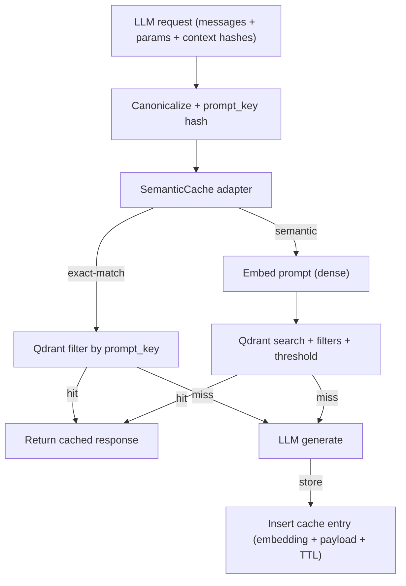

## Description

Adopt an optional semantic response cache to speed up repeated or near-duplicate LLM requests while preserving DocMind’s local-first posture.

Primary backend: **Qdrant-backed semantic cache** (dedicated collection) with strict metadata filtering, explicit invalidation, and an exact-match fast path to protect correctness.

## Context

DocMind already uses:

- Qdrant for vector retrieval
- DuckDBKVStore for ingestion cache (LlamaIndex IngestionCache)
- Local JSONL telemetry

Users often iterate: “Summarize this” → “Summarize again with a different tone” → “Extract key risks”. A response cache can reduce latency and (for remote providers) cost.

Constraints:

- Offline-first by default (remote endpoints blocked unless allowlisted)
- Deterministic tests and CI (no network)
- Avoid duplicating vector infra (prefer reuse of Qdrant)

## Decision Drivers

- Correctness and user trust (avoid false-positive cache hits)
- Offline-first and minimal operational burden
- Library-first: reuse Qdrant and existing embedding model wiring
- Privacy: avoid storing raw prompts; isolate cache entries by configuration/corpus hashes

## Alternatives

1. **Qdrant-backed semantic cache** (Selected)
2. **Exact-match cache only (SQLite/DuckDB)**
3. **GPTCache (SQLite + FAISS)**
4. **Provider-managed prompt caching** (e.g., Anthropic prompt caching via LlamaIndex; not portable)

### Consensus Summary (Zen)

Agreement:

- A cache must be **guardrailed** (strict filters, versioning/invalidation) or it will return wrong answers.
- Exact-match caching is safe and useful, but not sufficient to capture typical “near duplicate” chat behavior.

Disagreement:

- Whether semantic caching is worth the added complexity and correctness risk.

Resolution:

- Implement semantic caching **only with guardrails** and with a built-in exact-match path + corpus/config hash invalidation. This preserves correctness while still unlocking semantic wins.

### Decision Framework (≥9.0)

Weights: Complexity 40% · Perf 30% · Alignment 30% (10 = best)

| Option                                                                 | Complexity (40%) | Perf (30%) | Alignment (30%) |   Total |
| ---------------------------------------------------------------------- | ---------------: | ---------: | --------------: | ------: |
| **Qdrant semantic cache + exact-match + hash invalidation (Selected)** |              8.8 |        9.3 |             9.3 | **9.1** |
| Exact-match only (SQLite/DuckDB)                                       |              9.5 |        8.5 |             9.0 |    9.05 |
| GPTCache (SQLite + FAISS)                                              |              6.5 |        8.8 |             7.0 |     7.4 |

## Decision

Implement a semantic cache with these constraints:

1. **Dedicated Qdrant collection** for cache entries (not mixed with document vectors).

2. **Two-stage read path**:

   - **Exact-match**: attempt lookup by `prompt_key` (hash of canonicalized request + stable metadata).
   - **Semantic**: if enabled for the request type, do vector search (Cosine) with:
     - strict metadata filters (model id, temperature, prompt template id/version, tools enabled flag, etc.)
     - strict invalidation filters (`corpus_hash`, `config_hash`)
     - similarity threshold (`score_threshold`)

3. **Store minimal sensitive data**:

   - Do **not** store raw prompt text.
   - Store response text only when within `max_response_bytes` and when allowed by config.
   - Provide an opt-in “encrypt cached response payload” option using existing AES-GCM utilities.

4. **Fail open**: cache errors bypass cache and proceed with normal generation.

5. **Default Off**: enabled only when `settings.semantic_cache.enabled=true`.

## High-Level Architecture



## Related Requirements

### Functional Requirements

- FR‑1: Optionally serve responses from a cache (exact + semantic) for repeated requests.
- FR‑2: Provide a provider-agnostic adapter interface with a single integration point in the LLM call path.
- FR‑3: Invalidate cache entries when corpus/config hashes change.

### Non-Functional Requirements

- NFR‑1: Offline/local; deterministic tests; no network in CI.
- NFR‑2: Safe-by-default; feature-flag default Off.
- NFR‑3: Privacy-preserving: do not store raw prompts; support encryption for cached responses.

### Performance Requirements

- PR‑1: Cache lookup adds <100ms p50 on local hardware for typical cache sizes.

### Integration Requirements

- IR‑1: Use `settings.semantic_cache` (ADR‑024) and existing Qdrant client configuration.
- IR‑2: Integrate at pre-generation stage (read→compute→write) without changing prompt/template semantics.

## Design

### Architecture Overview

- Adapter `SemanticCacheProtocol` (get/set/prune) in `src/utils/semantic_cache.py`.
- Provider `QdrantSemanticCache` (dedicated collection).
- Cache keying uses:
  - canonicalized request payload → `prompt_key`
  - strict metadata filters (model, template version, params)
  - invalidation by `corpus_hash`/`config_hash`

### Implementation Details

In `src/utils/semantic_cache.py` (illustrative):

```python
from typing import Protocol

class SemanticCacheProtocol(Protocol):
    def get(self, *, prompt_key: str, embedding: list[float] | None, meta: dict) -> str | None: ...
    def set(self, *, prompt_key: str, embedding: list[float], response: str, meta: dict) -> None: ...
```

### Configuration

```env
DOCMIND_SEMANTIC_CACHE__ENABLED=false
DOCMIND_SEMANTIC_CACHE__PROVIDER=qdrant
DOCMIND_SEMANTIC_CACHE__SCORE_THRESHOLD=0.85
DOCMIND_SEMANTIC_CACHE__TTL_SECONDS=1209600
DOCMIND_SEMANTIC_CACHE__TOP_K=5
DOCMIND_SEMANTIC_CACHE__MAX_RESPONSE_BYTES=24000
DOCMIND_SEMANTIC_CACHE__NAMESPACE=default
```

## Testing

```python
def test_cache_hit_miss(mock_cache, deterministic_embed):
    # miss -> set -> hit sequence with thresholds and TTL
    pass
```

## Consequences

### Positive Outcomes

- Minimal, in-process semantic cache; offline deterministic
- Clear privacy posture; provider abstraction for future migration

### Negative Consequences / Trade-offs

- FAISS dependency footprint; read-time TTL vs scheduled cleanup

### Ongoing Maintenance & Considerations

- Tune `score_threshold` after observing hit quality
- Consider lightweight cleanup to trim expired rows

### Dependencies

- No new mandatory dependencies (reuses `qdrant-client` and existing embedding wiring).
- Optional (future): GPTCache provider can be added behind an extra, but is not required for the primary implementation.

## Changelog

- **3.0.0 (2026-01-09)**: Switch primary backend to guardrailed Qdrant semantic cache with exact-match fast path and hash invalidation.
