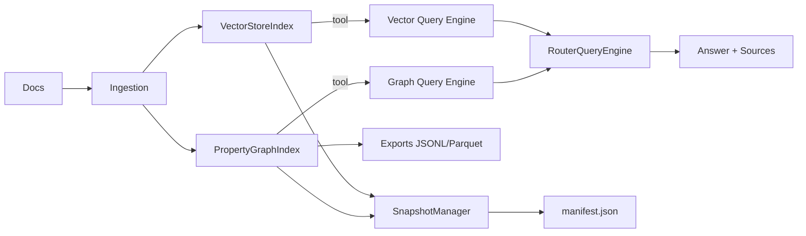

## Description

Adopt a library‑first GraphRAG strategy and wire it via a RouterQueryEngine toolset (vector + graph). Add SnapshotManager to provide atomic, versioned snapshots with a manifest for staleness detection and single‑writer safety. Provide UI defaults (GraphRAG toggle, staleness badge) and portable exports (JSONL baseline; Parquet optional).

Update (Phase‑2):

- Unify on `router_factory` and remove legacy/custom router code. Compose tools [semantic_search, hybrid_search, knowledge_graph].
- Provide a dedicated `ServerHybridRetriever` using Qdrant Query API (RRF default, DBSF optional) as a standalone module; no legacy router paths retained.
- Enrich snapshot manifest with versions, schema/persist versions; use relpath hashing under uploads.

## Context

GraphRAG was accepted (ADR‑019) as an optional enhancement, but lacked standardized router composition, robust persistence, and export guidance. We now have finalized best practices and must codify them to ensure reliability and maintainability.

## Decision Drivers

- Reliability and consistency: atomic snapshots + staleness detection
- Maintainability: library‑first (no undocumented methods; no index mutation)
- UX clarity: router defaults with safe fallbacks; clear toggles and badges
- Portability of exports and optional dependencies

## Alternatives

- A: Vector‑only routing — simpler but weaker for relational queries
- B: Graph‑only path — brittle and degrades when graph is missing or stale
- C: Router (vector+graph) + SnapshotManager (Selected) — balanced capability and robustness

### Decision Framework

| Option | Reliability (35%) | Maintainability (25%) | User Value (25%) | Complexity (15%) | Total | Decision |
|-------|--------------------|-----------------------|------------------|------------------|-------|----------|
| Router+Snapshot (Sel.) | 5 | 5 | 5 | 3 | 4.6 | ✅ Selected |
| Vector‑only | 4 | 5 | 3 | 4 | 4.1 | Rejected |
| Graph‑only | 3 | 3 | 4 | 3 | 3.3 | Rejected |

## Decision

- Router: When a graph exists and is healthy, compose tools `[vector_query_engine, graph_query_engine(include_text=true, path_depth=1)]` with `PydanticSingleSelector` (OpenAI) else `LLMSingleSelector`. If graph absent/unhealthy, use vector tool only.
- Graph helpers: Use documented APIs (`property_graph_store.get`, `get_rel_map`) and `PropertyGraphIndex.as_retriever/as_query_engine`. No index mutation.
- Persistence: Implement SnapshotManager to write to `storage/_tmp-<uuid>` and atomically rename to `storage/<timestamp>`. Write `manifest.json` with `corpus_hash`, `config_hash`, `created_at`, `versions`. Use a lockfile to ensure a single writer. Load the latest snapshot in Chat and show a staleness badge on mismatch.
- Exports: JSONL baseline (one relation per line from `get_rel_map`); Parquet optional if `pyarrow` is available. Metadata is recorded in `manifest.graph_exports` with telemetry fields (`seed_count`, `duration_ms`, `size_bytes`, `sha256`).
- UI: Documents page “Build GraphRAG (beta)” toggle (default off, configurable). Chat defaults to router when graph present and shows staleness badge when hashes mismatch.

## High-Level Architecture



## Related Requirements

### Functional

- FR‑009.1: Router engine wiring (vector+graph; fallback to vector)
- FR‑009.2: SnapshotManager with manifest hashing and lock
- FR‑009.3: Traversal using `get_rel_map` with capped depth (default 1)
- FR‑009.4: Export JSONL baseline; Parquet optional
- FR‑009.5: UI controls and staleness badge
- FR‑009.6: Tests (unit, integration, E2E smoke)

### Non‑Functional

- NFR‑MAINT: Library‑first; no undocumented APIs; no index mutation
- NFR‑REL: Atomic persistence; consistent reloads

### Integration

- IR: Works with existing VectorStoreIndex and Streamlit multipage UI

## Design

### Architecture Overview

- Build router engine via a factory that conditionally includes graph tool
- SnapshotManager orchestrates vector/graph persistence + manifest
- UI reads latest manifest to compute staleness

### Implementation Details (code anchors)

- `src/retrieval/router_factory.py`: `build_router_engine` and health checks
- `src/persistence/snapshot.py`: `SnapshotManager` with temp dir, atomic rename, manifest
- `src/retrieval/graph_config.py`: traversal/export helpers using `get_rel_map`
- `src/pages/02_documents.py`: GraphRAG toggle; snapshot invoke; export buttons
- `src/pages/01_chat.py`: staleness badge; default router when graph present

### Configuration

```env
DOCMIND_GRAPHRAG__ENABLED=false
DOCMIND_GRAPHRAG__SUBRETRIEVERS=false
DOCMIND_GRAPHRAG__DEFAULT_PATH_DEPTH=1
```

## Testing

- Unit: router override presence; traversal helpers; snapshot atomicity/manifest
- Integration: exports; ingest→router composition
- E2E (smoke): small doc set → router response with sources

## Telemetry & Observability

- Graph ingestion, export, and router selection MUST emit OpenTelemetry spans via `configure_observability` (SPEC-012).
- Structured telemetry events (`router_selected`, `export_performed`, `lock_takeover`) SHALL be logged via `log_jsonl` and mirrored in manifests.
- Console exporters provide offline-first observability when no OTLP endpoint is configured.

## Consequences

### Positive Outcomes

- Robust, portable GraphRAG with strong UX and reliability
- Clear defaults; safe fallback; simple exports

### Negative Consequences / Trade-offs

- Additional snapshot I/O; minor complexity in router factory

### Ongoing Maintenance & Considerations

- Monitor library upgrades; keep defaults conservative (path_depth=1)
- Revisit feature‑flagged sub‑retrievers as needed

### Dependencies

- LlamaIndex core; optional `pyarrow` for Parquet

## Changelog

- 1.1 (2025-09-16): Accepted; documented manifest metadata and OpenTelemetry instrumentation
- 1.0 (2025-09-09): Initial proposed ADR for GraphRAG router+SnapshotManager
