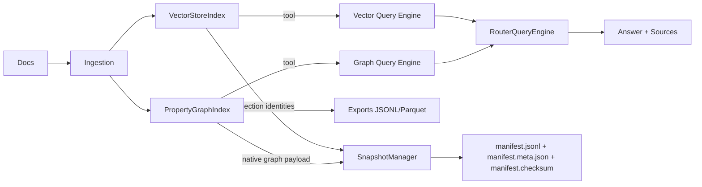

## Description

Adopt a library‑first GraphRAG strategy and wire it via a RouterQueryEngine toolset (vector + graph). Add SnapshotManager to provide atomic, versioned snapshots with a manifest for staleness detection and single‑writer safety. Provide UI defaults (GraphRAG toggle, staleness badge) and portable exports (JSONL baseline; Parquet optional).

Update (Phase‑2):

- Unify on `router_factory` and remove legacy/custom router code. Always compose
  `semantic_search`; add configured hybrid, keyword, multimodal, and graph tools.
- Provide a dedicated `ServerHybridRetriever` using Qdrant Query API (RRF default, DBSF optional) as a standalone module; no legacy router paths retained.
- Enrich snapshot manifest with versions, schema/persist versions; use relpath hashing under uploads.

## Context

GraphRAG was accepted (ADR‑019) as an optional enhancement, but lacked standardized router composition, robust persistence, and export guidance. We now have finalized best practices and must codify them to ensure reliability and maintainability.

## Decision Drivers

- Reliability and consistency: atomic snapshots + staleness detection
- Maintainability: library‑first (no undocumented methods; no index mutation)
- UX clarity: router defaults with safe fallbacks; clear toggles and badges
- Portability of exports and optional dependencies

## Alternatives

- A: Vector‑only routing — simpler but weaker for relational queries
- B: Graph‑only path — brittle and degrades when graph is missing or stale
- C: Router (vector+graph) + SnapshotManager (Selected) — balanced capability and robustness

### Decision Framework

| Option | Reliability (35%) | Maintainability (25%) | User Value (25%) | Complexity (15%) | Total | Decision |
| --- | --- | --- | --- | --- | --- | --- |
| Router+Snapshot (Sel.) | 5 | 5 | 5 | 3 | 4.6 | Selected |
| Vector‑only | 4 | 5 | 3 | 4 | 4.1 | Rejected |
| Graph‑only | 3 | 3 | 4 | 3 | 3.3 | Rejected |

## Decision

- Router: Always compose semantic search, then add configured hybrid, keyword,
  multimodal, and graph query engines. LlamaIndex's native
  `RouterQueryEngine.from_defaults(...)` owns selection. If graph is absent or
  unhealthy, only the graph tool is omitted.
- Graph helpers: Use documented APIs (`property_graph_store.get`, `get_rel_map`) and `PropertyGraphIndex.as_retriever/as_query_engine`. No index mutation.
- Persistence: Implement SnapshotManager to write to `storage/_tmp-<uuid>`
  and atomically rename to `storage/<timestamp>`. Each snapshot contains
  `manifest.jsonl`, `manifest.meta.json`, and `manifest.checksum`.
  `manifest.meta.json` owns the physical Qdrant collection identities,
  `corpus_hash`, `config_hash`, activation provenance, versions, and completion
  state. Graph-enabled snapshots persist LlamaIndex's complete native
  `StorageContext`: graph, document, index, and graph-local vector-store files.
  The graph-local vector store retains property-graph node embeddings across
  restart; app snapshots do not serialize the live Qdrant corpus vectors.
  Finalization uses a durable activation journal before rename and commits only
  through `CURRENT`. Readers ignore incomplete manifests. The required
  operating-system lock ensures a single writer.
- Exports: JSONL baseline (one relation per line from `get_rel_map`); Parquet
  optional if `pyarrow` is available. Metadata is recorded under
  `manifest.meta.json`'s `graph_exports` field with basename-only `filename`,
  `format`, `seed_count`, `duration_ms`, `size_bytes`, and `sha256`.
- UI: Documents page “Build GraphRAG (beta)” toggle (default off, configurable). Chat defaults to router when graph present and shows staleness badge when hashes mismatch.

## High-Level Architecture


```mermaid
flowchart LR
  D[Docs] --> I[Ingestion]
  I --> V[VectorStoreIndex]
  I --> PG[PropertyGraphIndex]
  V -->|tool| T1[Vector Query Engine]
  PG -->|tool| T2[Graph Query Engine]
  T1 & T2 --> R[RouterQueryEngine]
  R --> A[Answer + Sources]
  PG --> E[Exports JSONL/Parquet]
  V -->|collection identities| S[SnapshotManager]
  PG -->|native graph payload| S
  S --> M[manifest.jsonl + manifest.meta.json + manifest.checksum]
```

## Related Requirements

### Functional

- FR‑009.1: Router engine wiring (vector+graph; fallback to vector)
- FR‑009.2: SnapshotManager with manifest hashing and lock
- FR‑009.3: Traversal using `get_rel_map` with capped depth (default 1)
- FR‑009.4: Export JSONL baseline; Parquet optional
- FR‑009.5: UI controls and staleness badge
- FR‑009.6: Tests (unit, integration, E2E smoke)

### Non‑Functional

- NFR‑MAINT: Library‑first; no undocumented APIs; no index mutation
- NFR‑REL: Atomic persistence; consistent reloads

### Integration

- IR: Works with existing VectorStoreIndex and Streamlit multipage UI

## Design

### Architecture Overview

- Build router engine via a factory that conditionally includes graph tool
- SnapshotManager records physical Qdrant collection identity and packages the
  optional graph plus its activation manifest
- UI reads latest manifest to compute staleness

### Implementation Details (code anchors)

- `src/retrieval/router_factory.py`: `build_router_engine` and health checks
- `src/persistence/snapshot.py`: `SnapshotManager` with temp dir, atomic rename, manifest
- `src/retrieval/graph_config.py`: traversal/export helpers using `get_rel_map`
- `src/pages/02_documents.py`: GraphRAG toggle; snapshot invoke; export buttons
- `src/pages/01_chat.py`: staleness badge; default router when graph present

### Configuration

```env
# Global GraphRAG feature flag (used by router + UI)
DOCMIND_GRAPHRAG_CFG__ENABLED=false

# Advanced GraphRAG tuning (nested GraphRAG config model)
DOCMIND_GRAPHRAG_CFG__DEFAULT_PATH_DEPTH=1
```

## Testing

- Unit: router override presence; traversal helpers; snapshot atomicity/manifest
- Integration: exports; ingest→router composition
- E2E (smoke): small doc set → router response with sources

## Telemetry & Observability

- Graph export and router composition emit OpenTelemetry spans via
  `configure_observability` (SPEC-012). Spans are no-op unless
  `settings.observability.enabled` configures SDK providers. Router construction
  emits the OpenTelemetry `router_selected` event with tool count and names.
- Structured local telemetry records retrieval backend/outcome,
  `snapshot_stale_detected`, and `export_performed`. Export events mirror the
  manifest's identity measurements with telemetry-specific field names. DocMind
  does not emit per-query route or traversal-depth JSONL events.
- Exporters are disabled by default (offline-first). Tests may patch exporters to console; production uses OTLP exporters when enabled.

## Consequences

### Positive Outcomes

- Robust, portable GraphRAG with strong UX and reliability
- Clear defaults; safe fallback; simple exports

### Negative Consequences / Trade-offs

- Additional snapshot I/O; minor complexity in router factory

### Ongoing Maintenance & Considerations

- Monitor library upgrades; keep defaults conservative (path_depth=1)
- Revisit feature‑flagged sub‑retrievers as needed

### Dependencies

- LlamaIndex core; optional `pyarrow` for Parquet

## Changelog

- 1.4 (2026-07-14): Persist and reload the complete native property-graph
  StorageContext so semantic graph retrieval survives process restart.
- 1.3 (2026-07-14): Align native property-graph persistence, activation
  journaling, export metadata, and implemented telemetry contracts.
- 1.2 (2026-01-09): Docs-only: align observability notes with current SPEC-012 + implementation (no implicit console fallback; remove lock_takeover mention).
- 1.1 (2025-09-16): Accepted; documented manifest metadata and OpenTelemetry instrumentation
- 1.0 (2025-09-09): Initial proposed ADR for GraphRAG router+SnapshotManager
