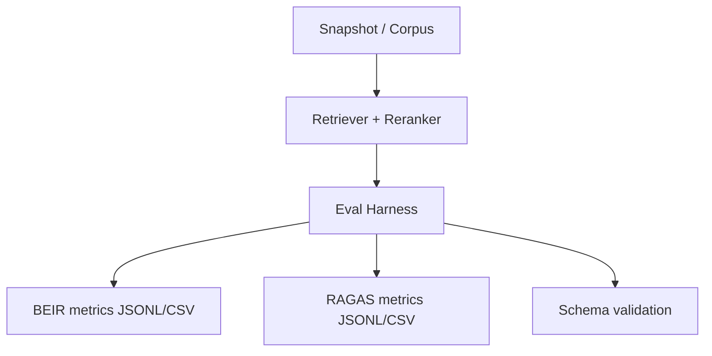

## Description

Provide **offline evaluation CLIs** to measure retrieval and RAG quality locally using BEIR-style IR metrics and RAGAS-style faithfulness/relevance metrics.

## Context

DocMind’s design goals include local-first operation, reproducibility, and measurable quality gates. RAG systems regress easily when changing ingestion, retrieval, reranking, or prompting. A lightweight, offline evaluation harness is required to:

- validate retrieval quality over time
- compare configuration changes deterministically
- avoid network dependency for evaluation runs

This ADR documents an existing decision already reflected in SPEC-010 and implemented under `tools/eval/`.

## Decision Drivers

- Offline-first operation (no network required for evaluation)
- Deterministic outputs for regressions and CI checks
- Reuse maintained libraries (BEIR, RAGAS) over bespoke metrics code

## Alternatives

- A: No evaluation harness — regressions undetected
- B: Cloud evaluation services — violates offline-first defaults
- C: Custom metric suite — high maintenance cost
- D: Offline CLIs with BEIR + RAGAS (Selected)

### Decision Framework

| Model / Option                   | Leverage (35%) | Value (25%) | Risk Reduction (25%) | Maint (15%) |    Total | Decision    |
| -------------------------------- | -------------: | ----------: | -------------------: | ----------: | -------: | ----------- |
| **D: Offline CLIs (BEIR+RAGAS)** |              9 |           8 |                    9 |           8 | **8.65** | ✅ Selected |
| A: None                          |              2 |           2 |                    1 |          10 |     2.65 | Rejected    |
| B: Cloud                         |              6 |           7 |                    3 |           6 |     5.35 | Rejected    |
| C: Custom                        |              4 |           6 |                    6 |           3 |     4.95 | Rejected    |

## Decision

Implement and maintain **offline evaluation CLIs**:

- `tools/eval/run_beir.py` for IR metrics (e.g., NDCG@k, Recall@k, MRR@k)
- `tools/eval/run_ragas.py` for RAG metrics (e.g., faithfulness, answer relevancy)

Outputs MUST be schema-validated and reproducible (seeded).

## High-Level Architecture

## Security & Privacy

- Evaluation runs MUST be offline by default.
- No raw document content or prompts should be uploaded anywhere.
- Outputs must avoid secrets; any logging must use safe summaries (counts, durations).

## Consequences

### Positive Outcomes

- Detect retrieval regressions before release
- Enables repeatable benchmarks during refactors

### Trade-offs

- Adds maintenance for evaluation schemas and fixtures
- Requires clear offline test strategy to avoid network in CI

## Changelog

- 1.0 (2026-01-09): Backfilled ADR to match SPEC-010 and existing tooling implementation.
