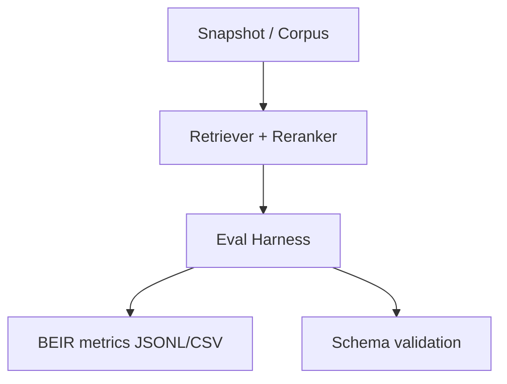

## Description

Provide one supported **offline evaluation CLI** to measure retrieval quality
locally using BEIR-style information-retrieval metrics.

## Context

DocMind’s design goals include local-first operation, reproducibility, and measurable quality gates. RAG systems regress easily when changing ingestion, retrieval, reranking, or prompting. A lightweight, offline evaluation harness is required to:

- validate retrieval quality over time
- compare configuration changes deterministically
- avoid network dependency for evaluation runs

This ADR documents an existing decision already reflected in SPEC-010 and implemented under `tools/eval/`.

## Decision Drivers

- Offline-first operation (no network required for evaluation)
- Deterministic outputs for regressions and CI checks
- Reuse maintained BEIR metrics over bespoke metric code

## Alternatives

- A: No evaluation harness — regressions undetected
- B: Cloud evaluation services — violates offline-first defaults
- C: Custom metric suite — high maintenance cost
- D: One offline BEIR CLI (Selected)

### Decision Framework

Weights reflect stakeholder consensus to prioritize leverage/maintenance (offline, repeatable, low overhead) while still valuing quality gates and risk reduction.

| Model / Option | Leverage (35%) | Value (25%) | Risk Reduction (25%) | Maint (15%) | Total | Decision |
| --- | --- | --- | --- | --- | --- | --- |
| D: Offline BEIR CLI | 9 | 8 | 9 | 9 | **8.80** | Selected |
| A: None | 2 | 2 | 1 | 10 | 2.65 | Rejected |
| B: Cloud | 6 | 7 | 3 | 6 | 5.35 | Rejected |
| C: Custom | 4 | 6 | 6 | 3 | 4.95 | Rejected |

## Decision

Implement and maintain one **offline evaluation CLI**:

- `tools/eval/run_beir.py` for IR metrics (e.g., NDCG@k, Recall@k, MRR@k)

Outputs MUST be schema-validated and reproducible (seeded).

### Evaluation Gates (CI)

- Retrieval quality gates (example defaults; tune per corpus):
  - **NDCG@10 < 0.60** → fail CI
  - **Recall@50 < 0.75** → fail CI
- Run the BEIR evaluator as a dedicated CI job when a representative corpus is
  available, and block merges when its explicit thresholds fail.

### BEIR Dataset Selection Strategy

- Use a fixed, representative subset for regression detection to keep runs fast:
  - `scifact`, `fiqa`, `trec-covid`, `arguana`, `nfcorpus`
- Run the full BEIR suite only for release candidates or scheduled performance sweeps.

### Version Pinning (Reproducibility)

- Pin evaluation tooling in `pyproject.toml`:
  - `beir>=2.0.0,<3.0.0`
- Rationale: keep compatible minor ranges in the spec while `uv.lock` pins exact versions for reproducible runs.

## High-Level Architecture

```mermaid
flowchart TD
  A[Snapshot / Corpus] --> B[Retriever + Reranker]
  B --> C[Eval Harness]
  C --> D[BEIR metrics JSONL/CSV]
  C --> E[Schema validation]
```

## Security & Privacy

- Evaluation runs MUST be offline by default.
- No raw document content or prompts should be uploaded anywhere.
- Outputs must avoid secrets; any logging must use **metadata-only logging with keyed HMAC fingerprints**. See `AGENTS.md` and `docs/specs/spec-028-safe-logging-no-pii-redactor.md` for the canonical safe-logging policy.

## Consequences

### Positive Outcomes

- Detect retrieval regressions before release
- Enables repeatable benchmarks during refactors

### Trade-offs

- Adds maintenance for one evaluation schema and its fixtures
- Requires clear offline test strategy to avoid network in CI

## Changelog

- 1.1 (2026-07-13): Hard-cut the unsupported RAGAS CLI, schema, and
  always-skipped tests; keep BEIR as the single runnable offline evaluation path.
- 1.0 (2026-01-09): Backfilled ADR to match SPEC-010 and existing tooling implementation.
