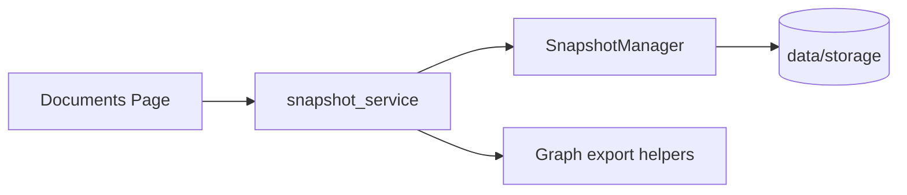

## Description

Extract snapshot rebuild and GraphRAG export packaging logic from `src/pages/02_documents.py` into a persistence-layer service so the Documents page remains UI wiring only and snapshot behavior is unit-testable.

## Context

`src/pages/02_documents.py` currently implements substantial domain logic:

- snapshot workspace lifecycle (`SnapshotManager.begin_snapshot/finalize_snapshot/cleanup_tmp`)
- vector/graph persistence
- GraphRAG export packaging (JSONL required; Parquet optional) and export metadata hashing
- corpus/config hashing and manifest writing

This violates UI/domain separation (ADR‑013/016), makes the behavior harder to test without Streamlit context, and increases the regression surface for future UI changes.

## Decision Drivers

- Keep Streamlit pages thin (no business logic, no heavy imports at import time)
- Improve testability (pure module tests without Streamlit runner)
- Preserve offline-first behavior and snapshot atomicity guarantees (ADR‑031/038)
- Avoid new dependencies and keep the API surface minimal

## Alternatives

- A: Extract a persistence-layer `snapshot_service` module (Selected)
- B: Keep logic in the page, only refactor into helper functions
- C: Move logic into `src/ui/` helpers (still UI-layer coupling; blocks future CLI/non-UI callers)

### Architecture Tier‑2 Decision (≥9.0 rule)

Weights: Complexity 40% · Performance 30% · Alignment 30% (10 = best)

| Option                                       | Complexity (40%) | Perf (30%) | Alignment (30%) |   Total |
| -------------------------------------------- | ---------------: | ---------: | --------------: | ------: |
| **A: `src/persistence/snapshot_service.py`** |              9.0 |        9.5 |             9.5 | **9.3** |
| B: keep in page                              |              8.5 |        9.5 |             6.5 |     8.2 |
| C: move to `src/ui/`                         |              7.5 |        9.2 |             7.5 |     8.0 |

## Decision

We will:

1. Add `src/persistence/snapshot_service.py` that owns snapshot rebuild/export packaging orchestration and returns a structured result.

2. Refactor `src/pages/02_documents.py` to call the service and only:

   - gather UI inputs
   - update `st.session_state` with indices/router on success
   - render status/progress and user-facing errors

3. Move the unit tests that currently validate snapshot rebuild behavior from the page module to the service module, and keep only a thin UI wiring test at the page level.

## High-Level Architecture

## Security & Privacy

- No new network surface.
- Snapshot exports remain under `settings.data_dir / "storage"`; no arbitrary path writes.
- Telemetry remains local-first; secrets are not logged.

## Testing

- Unit tests for `src/persistence/snapshot_service.py`:
  - writes manifest triad
  - includes deterministic `graph_exports` metadata (sha256, size, seed_count)
  - skips exports when graph index lacks required context
- Integration/AppTest: Documents page still renders and the snapshot rebuild action triggers the service (stubbing the service for deterministic tests).

## Consequences

### Positive Outcomes

- Clear boundary: pages do UI, persistence does snapshot orchestration.
- Lower regression risk: snapshot behavior tested without Streamlit.
- Enables future non-UI callers (CLI/batch) without importing Streamlit pages.

### Trade-offs

- One-time refactor of tests and page wiring.

## Changelog

- 1.0 (2026-01-09): Proposed for v1 maintainability and correctness.
