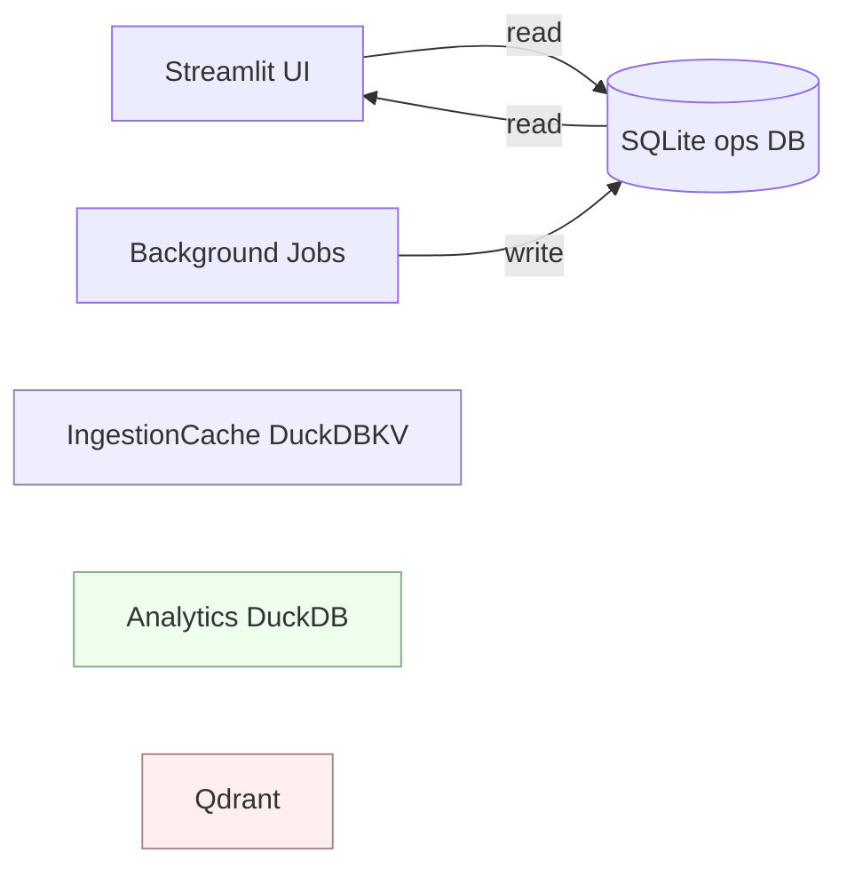

## Description

Introduce a dedicated **SQLite database in WAL mode** for DocMind operational metadata (jobs/runs/snapshots/UI state), separate from the ingestion cache (DuckDBKV) and analytics (DuckDB).

## Context

DocMind already persists:

- **Vectors** in Qdrant (ADR-031)
- **Ingestion cache** in DuckDB KV store via LlamaIndex IngestionCache (ADR-030)
- **Analytics** in DuckDB (ADR-032)

However, multiple UX and reliability features depend on **operational metadata** that is not well-modeled as “cache” or “analytics”:

- Background ingestion/snapshot rebuild job lifecycle (ADR-052)
- Snapshot history and “current” pointers for UI and restore flows (ADR-033)
- Durable, queryable “what happened” state for local-first debugging

We need a transactional store that supports:

- ACID updates for state transitions (queued → running → done/failed)
- concurrent readers while a single writer updates state (Streamlit + background threads)
- minimal dependencies and offline-first posture

## Decision Drivers

- Offline-first reliability (crash-safe state transitions)
- Concurrency semantics suited to “ops metadata” (many reads, occasional writes)
- Low maintenance burden (stdlib + mature tooling)
- Clear separation of concerns from analytics and ingestion cache

## Alternatives

- A: **SQLite (WAL) operational DB** (Selected)
  - Pros: stdlib, ACID, mature WAL semantics, great offline tooling, good read concurrency
  - Cons: requires light schema + migrations discipline; single-writer constraints must be respected
- B: DuckDB for operational metadata
  - Pros: already a dependency; single-file DB
  - Cons: concurrency/write patterns are less suited for “ops state”; risk of coupling to analytics/caching and lock contention
- C: JSON/JSONL flat files
  - Pros: simplest storage format
  - Cons: no transactional guarantees; safe concurrent writes require custom locking/compaction (reinventing SQLite)
- D: Reuse analytics DuckDB for ops data
  - Pros: fewer files
  - Cons: mixes OLAP + OLTP workloads; increases lock contention and migration coupling

### Decision Framework (≥9.0)

| Option                    | Complexity (40%) | Perf (30%) | Alignment (30%) |    Total | Decision    |
| ------------------------- | ---------------: | ---------: | --------------: | -------: | ----------- |
| **A: SQLite WAL ops DB**  |              9.5 |        9.0 |             9.5 | **9.35** | ✅ Selected |
| B: DuckDB ops DB          |              7.5 |        8.5 |             7.5 |     7.80 | Rejected    |
| C: JSON/JSONL             |              6.0 |        6.0 |             5.5 |     5.85 | Rejected    |
| D: Reuse analytics DuckDB |              6.5 |        7.5 |             5.5 |     6.50 | Rejected    |

## Decision

We will implement an **operational metadata store** backed by **SQLite in WAL mode**, stored under `settings.data_dir` (default: `./data/docmind.db`) and initialized/migrated at startup.

The ops DB will store **metadata only** (no raw document text, no raw prompts) and will be used by background job orchestration and UI pages that need durable state.

## Implementation Status (2026-01-17)

Current codebase coverage:

- **WAL configuration exists** for SQLite connections in `src/persistence/chat_db.py` and `src/persistence/memory_store.py`.
- **Settings are present** for `settings.database.sqlite_db_path` and `settings.database.enable_wal_mode`.
- **Startup directory initialization exists** in `src/config/integrations.py` for the ops DB path.

Missing for this ADR to be truly implemented:

- **Ops DB schema** (tables `jobs`, `snapshots`, `ui_state`) and foreign key constraints.
- **Migration logic** via `PRAGMA user_version` (v0 → v1) with transactional upgrades.
- **Ops DB initializer** that opens the DB, enables WAL/foreign keys/busy_timeout, runs migrations, and persists `user_version`.
- **Unit/integration tests** validating migrations and basic read/write flows.

Until the missing items are implemented, this ADR remains **Proposed**.

## High-Level Architecture



## Security & Privacy

- Store only operational metadata (IDs, paths, hashes, timestamps, counts).
- Never persist raw prompts or document text in the ops DB.
- Validate DB path and keep it under `settings.data_dir` by default.
- Never log secrets; sanitize any paths/URLs before logging.

## Migration / Rollout Plan

1. Add an ops DB initializer that:
   - ensures directory exists
   - enables WAL + foreign keys
   - applies migrations via `PRAGMA user_version`
   - v0 → v1 migration creates core tables (jobs, snapshots, ui_state) and sets `PRAGMA user_version=1`
   - each migration runs in its own transaction; on failure, rollback and abort startup
2. Track schema versions:
   - v0 = empty/legacy
   - v1 = initial ops schema (jobs/snapshots/ui_state)
3. Example migration sketch:

    ```sql
    BEGIN;
    PRAGMA foreign_keys=ON; -- enforce FK integrity between jobs and snapshots
    PRAGMA journal_mode=WAL; -- WAL for concurrent reads + durability under writer load

    -- jobs use TEXT ids; status: queued -> running -> done/failed; *_ms are INTEGER epoch ms
    CREATE TABLE IF NOT EXISTS jobs (
      id TEXT PRIMARY KEY,
      status TEXT NOT NULL,
      payload TEXT,
      created_at_ms INTEGER NOT NULL,
      updated_at_ms INTEGER NOT NULL
    );

    -- snapshots keep history per job_id (FK) for restores/audit
    CREATE TABLE IF NOT EXISTS snapshots (
      id TEXT PRIMARY KEY,
      job_id TEXT,
      data TEXT,
      created_at_ms INTEGER NOT NULL,
      FOREIGN KEY(job_id) REFERENCES jobs(id)
    );

    -- durable UI state key/value store; updated_at_ms as INTEGER epoch ms
    CREATE TABLE IF NOT EXISTS ui_state (
      key TEXT PRIMARY KEY,
      value TEXT,
      updated_at_ms INTEGER NOT NULL
    );

    PRAGMA user_version=1;
    COMMIT;
    ```

4. Integrate with background jobs (ADR-052) to write lifecycle events.
5. Add unit tests for migrations and core write/read APIs.

## Testing

- Unit tests:
  - migrations (upgrade from user_version N → N+1)
  - job lifecycle state transitions
  - busy_timeout/retry behavior for single-writer semantics
- Integration tests:
  - background job writes job state to DB (using a temp data dir)

## Operational concerns

- WAL checkpoint starvation: long-running readers can prevent checkpoints from advancing. Use periodic checkpoints and monitor WAL file size.
- Large write transactions can bloat WAL; keep writes small and short-lived.
- Retry strategy: set `busy_timeout`, use bounded retries/backoff for the single writer, and log when retries are exhausted.

## Consequences

### Positive Outcomes

- Durable, queryable operational state for “jobs, runs, snapshots”.
- Clean separation from analytics and ingestion cache.
- Improved UX for job progress, history, and restore flows.

### Negative Consequences / Trade-offs

- Adds one more persisted file to manage (`docmind.db`) and basic migration discipline.
- SQLite is single-writer; background writers must be serialized or use bounded retries.
