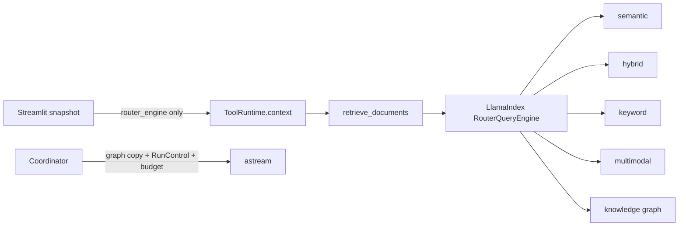

## Context

DocMind needs a synchronous Streamlit-facing coordinator, bounded LangGraph
execution, structured retrieval sources, and local-first persistence. The v1
design accumulated two retrieval owners: an injected LlamaIndex router and a
manual fallback that reconstructed vector, hybrid, and graph tools from raw
runtime objects. A feature flag selected between them.

That split duplicated reranking and fallback policy, expanded the transient
runtime contract, and made the configured router optional even though the UI
already builds it from each active snapshot. Separately, checking a timeout only
between synchronous graph events could not bound a blocked graph step.

## Decision Drivers

- Use public LangGraph and LlamaIndex capabilities.
- Make one wall-clock budget authoritative.
- Prevent late graph state from being published after timeout.
- Keep retrieval selection, reranking, and fallbacks in one owner.
- Never persist live engines, indexes, retrievers, or clients.
- Prefer deletion and a forward-only v2 contract over compatibility code.

## Decision Framework

Weights: solution leverage 35%, application value 30%, maintenance and cognitive
load 25%, architectural adaptability 10%.

| Retrieval design | Leverage | Value | Maintenance | Adaptability | Total |
| --- | ---: | ---: | ---: | ---: | ---: |
| Native LlamaIndex router as sole owner | 9.6 | 9.5 | 9.7 | 9.2 | **9.56** |
| Router plus manual raw-index fallback | 6.5 | 8.0 | 4.0 | 5.5 | 6.23 |
| App-owned tool factory only | 5.0 | 7.0 | 4.0 | 6.0 | 5.45 |

The native router is selected.

## Decision

### Authoritative deadline

The coordinator seeds an absolute monotonic deadline in every initial state and
refuses a missing or non-finite deadline. It owns one persistent, bounded
event-loop runner and executes the graph with `astream(...)`. Each run uses a
public `Pregel.copy(...)`, the remaining budget as `step_timeout`, and a public
`RunControl`. The synchronous caller waits on `Future.result(remaining)`. On
timeout it requests drain, cancels the wrapper, returns a stable timeout state,
and fences the same canonical user-scoped persistence key until wrapper cleanup
finishes. Only deadline and dependency timeouts set `timed_out`; capacity,
closure, overlap, and generic cancellation remain non-timeout stopped states.
Stopped runs never schedule memory consolidation or increment success metrics.

Provider request timeouts use the smallest configured request timeout,
`decision_timeout`, and explicit coordinator cap. OpenAI-compatible provider
retries are disabled when a coordinator cap is supplied so retries cannot
multiply that budget.

### Canonical retrieval

`build_router_engine(...)` constructs the required semantic tool plus configured
hybrid, keyword, multimodal, and graph tools using native LlamaIndex query-engine
APIs. `retrieve_documents` receives only the user query and injected LangGraph
state/runtime parameters, resolves `ToolRuntime.context["router_engine"]`, and
queries it once.

The router is mandatory for document retrieval. A missing or failed router
returns a safe structured error. DocMind does not rebuild a parallel retrieval
stack or fail open to raw indexes.

Async Qdrant clients remain on the persistent graph event loop that first uses the router. Session replacement performs one idempotent router close on that owner loop before cache or coordinator invalidation stops it. FastEmbed and SigLIP central processing unit (CPU) calls use retriever-owned bounded executors. Cancelling an async waiter does not release capacity until the underlying thread future finishes.

The v2 hard cut removes:

- `AgentConfig.enable_deadline_propagation`;
- `AgentConfig.enable_router_injection`;
- raw `vector`, `retriever`, and `kg` coordinator overrides;
- `src/agents/tool_factory.py`;
- manual `strategy` and `use_graphrag` retrieval-tool arguments; and
- duplicate strategy-specific agent fallback code.

Deadline propagation is unconditional after this cut; no deadline feature flag
remains.

## Architecture

## Consequences

### Positive

- One retrieval policy owner and one transient runtime object.
- Native router selection and query-engine postprocessors replace custom factory
  and fallback code.
- Downstream agents receive sanitized structured sources consistently.
- The caller deadline is authoritative and late graph results are rejected.
- Timed-out native CPU work cannot accumulate in the `asyncio` default executor, and router replacement closes every async client exactly once.

### Trade-offs

- Chat cannot retrieve until an active snapshot router is available.
- A dependency that ignores cancellation may finish an external side effect;
  native timeouts and idempotency remain required.
- Callers using the v1 raw-index or strategy arguments must migrate to the
  router-only contract.

## Verification

See SPEC-040 for the unit and integration evidence, including a real sleeping
synchronous node that proves prompt timeout and absence of a late checkpoint.
