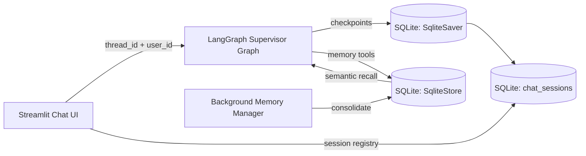

## Description

Adopt **LangGraph-native persistence** for DocMind Chat: durable **thread checkpoints** + **time-travel branching** via `langgraph-checkpoint-sqlite` and **hybrid long-term memory** via LangGraph `SqliteStore` integrated with **LangMem**.

## Context

DocMind’s Chat page currently uses `st.session_state.messages` only (no durability). The multi-agent supervisor supports a `thread_id`, but the coordinator uses `InMemorySaver`, so state is not persisted across restarts.

Earlier plans:

- ADR-021: generic conversational memory with a SQLite chat store (not implemented; superseded)
- ADR-043: v1-level JSON persistence via LlamaIndex `SimpleChatStore` (not implemented)

For the **final release**, chat must support:

- durable persistence across restarts (multi-session)
- **branching / time travel** (“fork from checkpoint”, replay, edit state)
- a **tiered memory system**:
  - short-term conversation context (thread state)
  - long-term memories (facts/preferences) with metadata-filtered recall
  - background consolidation to reduce “memory creep”

DocMind is offline-first and already uses LangGraph (supervisor pattern). We should reuse LangGraph primitives rather than invent a parallel persistence system.

## Decision Drivers

- Final-release capabilities: multi-session, branching/time travel, long-term memory + consolidation
- Offline-first security posture: no remote services required; egress remains gated by settings
- Library-first: use maintained LangGraph/LangMem primitives vs custom storage logic
- Observability: instrument key operations without logging raw chat content
- Maintainability: one canonical persistence path for agent state and memory

## Alternatives

- A: **LangGraph SQLite checkpointer + store + LangMem** (Selected)
  - Pros: native to LangGraph, supports time travel and long-term memory; offline-first; minimal custom code
  - Cons: adds dependency (`langgraph-checkpoint-sqlite`, `langmem`); must ensure message/state schemas are serializable
- B: LlamaIndex `SimpleChatStore` JSON + `ChatMemoryBuffer` only (ADR-043)
  - Pros: no new deps
  - Cons: no time travel; limited multi-agent state persistence; hard to extend to hybrid memory tiers
- C: Mem0 OSS stack
  - Pros: rich memory concepts and benchmarks; can be self-hosted
  - Cons: heavier operational footprint; more moving parts; risk of opaque behavior and prompt-injection memory poisoning
- D: Letta (MemGPT) self-hosted service
  - Pros: strong memory hierarchy concept
  - Cons: introduces a server/process; more operational and packaging complexity for Streamlit local-first UX
- E: Custom build (SQLite schema + Qdrant collection for memory vectors)
  - Pros: full control, reuse Qdrant
  - Cons: reinvents checkpointing/time-travel semantics; higher maintenance and correctness risk

### Decision Framework (≥9.0)

Weights: Complexity 40% · Performance 30% · Alignment 30% (10 = best)

| Option | Complexity (40%) | Perf (30%) | Alignment (30%) | Total | Decision |
|---|---:|---:|---:|---:|---|
| **A: LangGraph SQLite + LangMem** | 9.5 | 9.0 | 9.6 | **9.36** | ✅ Selected |
| B: LlamaIndex JSON store only | 9.5 | 7.5 | 6.5 | 8.00 | Rejected |
| C: Mem0 OSS | 6.5 | 8.0 | 6.0 | 6.93 | Rejected |
| D: Letta/MemGPT service | 5.5 | 7.5 | 5.0 | 5.93 | Rejected |
| E: Custom (SQLite + Qdrant memory) | 7.0 | 8.5 | 8.5 | 7.85 | Rejected |

## Decision

We will implement chat persistence and agentic memory using **LangGraph’s persistence primitives**:

1. Use `langgraph-checkpoint-sqlite==3.0.1`:
   - `langgraph.checkpoint.sqlite.SqliteSaver` as the **thread checkpointer** (durable checkpoints per `thread_id`).
   - `langgraph.store.sqlite.SqliteStore` as the **long-term memory store** (KV + metadata filters + semantic search via sqlite-vec).
2. Integrate **LangMem** for:
   - memory tools (hot path) to store/search memories during chat
   - background memory store manager for consolidation and contradiction resolution
3. Keep all persistence **local by default**. No cloud sync. Any remote LLM usage remains gated by existing DocMind settings.

This supersedes ADR-043 and ADR-021 by establishing **one canonical, final-release persistence strategy** built on LangGraph.

## High-Level Architecture

## Related Requirements

### Functional Requirements

- **FR-022:** Persist chat history locally across refresh/restart; provide per-session clear/purge.
- **FR-023:** Support multi-session management (create/rename/delete/select sessions).
- **FR-024:** Support branching/time travel: fork from a checkpoint, resume execution, and preserve history.
- **FR-025:** Support long-term memory (facts/preferences) with metadata-filtered recall and user-scoped namespaces.

### Non-Functional Requirements

- **NFR-SEC-001:** Offline-first defaults; remote endpoints are blocked unless explicitly enabled/allowlisted.
- **NFR-SEC-002:** Sensitive content is not logged; telemetry is metadata-only.
- **NFR-SEC-003:** Optional encryption-at-rest is supported (see Design).
- **NFR-REL-001:** Durable recovery after restart without corruption (SQLite WAL).

### Performance Requirements

- **PR-CHAT-001:** Chat session load (session list + latest state) p50 ≤ 100ms on local SSD.
- **PR-CHAT-002:** Memory recall (semantic search top_k=10) p50 ≤ 150ms for ≤10k memory items.

### Integration Requirements

- **IR-AGENT-001:** Works with existing LangGraph supervisor orchestration (ADR-011).
- **IR-UI-STATE-001:** Uses Streamlit-native state management + query params for shareable links (ADR-016).

## Design

### Storage boundaries

DocMind must keep operational metadata (jobs/snapshots) distinct from user chat content:

- **Ops DB** (metadata only): remains per ADR-055/Spec-039.
- **Chat DB** (user content): contains checkpoints, session registry, and long-term memory items.

### Chat DB path

- Default: `settings.chat.sqlite_path` (existing field; repurposed/clarified by this ADR).
- Must live under `settings.data_dir` by default.
- SQLite in WAL mode (enabled by `SqliteSaver.setup()` / `SqliteStore.setup()`).

### State schema constraints (serialization)

To persist and time-travel reliably:

- Graph state must be JSON/MsgPack serializable.
- Use LangGraph-recommended message models (`AnyMessage`) and reducers (`add_messages`) for multi-turn accumulation.
- Do not store un-serializable objects (e.g., live clients) in the persisted state.

### Long-term memory store configuration

Use `SqliteStore` with an embeddings adapter that reuses DocMind’s embedding model:

- Dimensions: `settings.embedding.dimension` (1024 for BGE-M3)
- Embeddings: wrap LlamaIndex `Settings.embed_model` behind a LangChain `Embeddings` adapter.
- Index fields: the memory payload field(s) that contain natural language to embed (e.g., `"content"`).

### Namespacing (multi-user and isolation)

Memory keys and namespaces must be scoped to avoid cross-session/user leakage.

Recommended namespace structure:

- `("memories", "{user_id}", "{thread_id}")` for per-user-per-session memories
- `("memories", "{user_id}")` for per-user global memories (optional)

### Branching / time travel semantics

Use LangGraph built-ins:

- `graph.get_state_history(config)` to enumerate checkpoints (reverse chronological).
- `graph.update_state(selected_state.config, values=...)` to fork state.
- `graph.invoke(None, new_config)` to resume from the forked checkpoint.

### Encryption-at-rest (optional)

For user chat content:

- Prefer LangGraph’s encrypted serializer support if/when enabled, driven by a dedicated config key.
- If encryption is not enabled, keep the DB local, document permissions guidance, and provide purge/export controls.

## Testing

- Unit tests:
  - Chat DB path validation (under `settings.data_dir`)
  - Session registry CRUD (create/rename/delete)
  - Store namespaces correctly isolate user_id/thread_id
- Integration tests (Streamlit AppTest):
  - Create new session → send message → restart AppTest → messages restored
  - Branch from checkpoint and resume → history shows fork
  - Memory tools store and retrieve a preference
- Security tests:
  - Ensure no raw message content is emitted in telemetry payloads

## Consequences

### Positive Outcomes

- Final-release chat persistence with **time travel** and **hybrid memory** becomes a first-class feature.
- Strong alignment with existing LangGraph supervisor investment.
- Local-only by default; minimal service footprint.

### Negative Consequences / Trade-offs

- Adds dependencies and requires careful state serialization boundaries.
- Memory systems introduce privacy risk unless purge/review controls are implemented as part of the feature.

### Ongoing Maintenance & Considerations

- Keep `langgraph-checkpoint-sqlite` pinned at a version with known SQL-injection fixes for metadata filtering.
- Maintain strict user/session scoping in namespaces and filters.
- Add regression tests around checkpoint listing and filter key validation.

