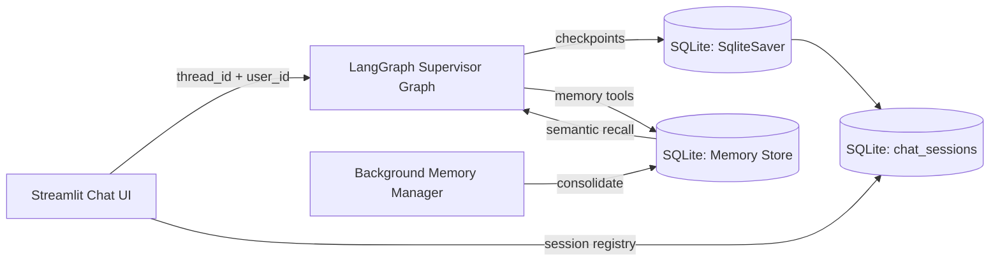

## Description

Adopt **LangGraph-native persistence** for DocMind Chat: durable **thread checkpoints** + **time-travel branching** via `langgraph-checkpoint-sqlite` and **hybrid long-term memory** via a DocMind-managed SQLite memory store (SQLite + `sqlite-vec` semantic search, modeled after LangGraph store semantics) with a **deterministic, testable memory consolidation pipeline** inspired by state-of-the-art “add/update/delete” memory update patterns.

## Context

DocMind’s Chat page currently uses `st.session_state.messages` only (no durability). The multi-agent supervisor supports a `thread_id`, but the coordinator uses `InMemorySaver`, so state is not persisted across restarts.

Earlier plans:

- ADR-021: generic conversational memory with a SQLite chat store (not implemented; superseded)
- ADR-043: v1-level JSON persistence via LlamaIndex `SimpleChatStore` (not implemented)

For the **final release**, chat must support:

- durable persistence across restarts (multi-session)
- **branching / time travel** (“fork from checkpoint”, replay, edit state)
- a **tiered memory system**:
  - short-term conversation context (thread state)
  - long-term memories (facts/preferences) with metadata-filtered recall
  - background consolidation with explicit add/update/delete semantics to reduce “memory creep” and contradictions

DocMind is offline-first and already uses LangGraph (supervisor pattern). We should reuse LangGraph primitives rather than invent a parallel persistence system.

## Decision Drivers

- Final-release capabilities: multi-session, branching/time travel, long-term memory + consolidation
- Offline-first security posture: no remote services required; egress remains gated by settings
- Library-first: use maintained LangGraph persistence primitives vs. building a parallel memory service
- Observability: instrument key operations without logging raw chat content
- Maintainability: one canonical persistence path for agent state and memory
- Production pragmatism: minimize new always-on services/ports (local-first UX)

## Alternatives

- A: **LangGraph SQLite checkpointer + DocMind memory store + deterministic consolidation** (Selected)
  - Pros: native to LangGraph, supports time travel and long-term memory; offline-first; single local DB; retention/TTL possible; minimal moving parts
  - Cons: must ensure message/state schemas are serializable; consolidation requires careful prompting + tests
- B: LlamaIndex `SimpleChatStore` JSON + `ChatMemoryBuffer` only (ADR-043)
  - Pros: no new deps
- Cons: no time travel; limited multi-agent state persistence; challenging to extend to hybrid memory tiers
- C: Zep/Graphiti temporal KG memory (self-hosted)
  - Pros: temporal knowledge graph semantics; strong memory + GraphRAG framing
  - Cons: service/process footprint and additional DB dependencies; more operational complexity for local-first Streamlit UX
- D: Mem0 OSS stack (dense/graph)
  - Pros: published benchmarks; explicit add/update/delete memory update architecture
  - Cons: heavier operational footprint (graph DB for Mem0g); more moving parts; opaque behavior risk for local UX
- E: Letta (MemGPT) self-hosted service
  - Pros: strong memory hierarchy concept
  - Cons: introduces a server/process; more operational and packaging complexity for Streamlit local-first UX
- F: Custom build (SQLite schema + Qdrant memory collection)
  - Pros: maximum control; reuse Qdrant for semantic retrieval
  - Cons: more custom code and lifecycle/retention logic; higher maintenance than LangGraph store; duplicates vector infra already present in LangGraph store

### Decision Framework (≥9.0)

Weights: Complexity 40% · Performance 30% · Alignment 30% (10 = best)

| Option                                                         | Complexity (40%) | Perf (30%) | Alignment (30%) |    Total | Decision    |
| -------------------------------------------------------------- | ---------------: | ---------: | --------------: | -------: | ----------- |
| **A: LangGraph SQLite + DocMind memory store + consolidation** |              9.2 |        9.0 |             9.7 | **9.26** | ✅ Selected |
| B: LlamaIndex JSON store only                                  |              9.5 |        7.5 |             6.5 |     8.00 | Rejected    |
| C: Zep/Graphiti service                                        |              6.0 |        8.5 |             6.5 |     6.95 | Rejected    |
| D: Mem0 OSS                                                    |              6.5 |        8.5 |             6.5 |     7.10 | Rejected    |
| E: Letta/MemGPT service                                        |              5.5 |        7.5 |             5.0 |     5.93 | Rejected    |
| F: Custom (SQLite + Qdrant memory)                             |              7.5 |        9.0 |             9.0 |     8.15 | Rejected    |

## Decision

We will implement chat persistence and agentic memory using **LangGraph’s persistence primitives**:

1. Use `langgraph-checkpoint-sqlite>=3.0.1`:
   - `langgraph.checkpoint.sqlite.SqliteSaver` as the **thread checkpointer** (durable checkpoints per `thread_id`).
   - DocMind-managed SQLite memory store as the **long-term memory store** (KV + metadata filters + semantic search via `sqlite-vec`).
2. Implement a **deterministic memory consolidation pipeline** (in-graph step) that:
   - extracts candidate “memories” from the most recent turn (facts/preferences) into a fixed schema
   - applies an explicit **ADD / UPDATE / DELETE / NOOP** policy against existing memories (bounded search window)
   - persists to the memory store under a strict namespace (`user_id`, `thread_id`) and enforces retention/TTL
3. Keep all persistence **local by default**. No cloud sync. Any remote LLM usage remains gated by existing DocMind settings.

This supersedes ADR-043 and ADR-021 by establishing **one canonical, final-release persistence strategy** built on LangGraph.

### Security Considerations

- `langgraph-checkpoint-sqlite>=3.0.1` is required to address both (allowing future security patches to be pulled in):
  - **CVE-2025-67644** (SQL injection via metadata filter keys in checkpoint list; patched in 3.0.1, released 2025-12-09)
  - **CVE-2025-64439** (JsonPlusSerializer RCE in versions < 3.0.0; patched in 3.0.0)

## High-Level Architecture



## Related Requirements

### Functional Requirements

- **FR-022:** Persist chat history locally across refresh/restart; provide per-session clear/purge.
- **FR-023:** Support multi-session management (create/rename/delete/select sessions).
- **FR-024:** Support branching/time travel: fork from a checkpoint, resume execution, and preserve history.
- **FR-025:** Support long-term memory (facts/preferences) with metadata-filtered recall and user-scoped namespaces.

### Non-Functional Requirements

- **NFR-SEC-001:** Offline-first defaults; remote endpoints are blocked unless explicitly enabled/allowlisted.
- **NFR-SEC-002:** Sensitive content is not logged; telemetry is metadata-only.
- **NFR-SEC-003:** Optional encryption-at-rest is supported (see Design).
- **NFR-REL-001:** Durable recovery after restart without corruption (SQLite WAL).

### Performance Requirements

- **PR-CHAT-001:** Chat session load (session list + latest state) p50 ≤ 100ms on local SSD.
- **PR-CHAT-002:** Memory recall (semantic search top_k=10) p50 ≤ 150ms for ≤10k memory items.

### Integration Requirements

- **IR-AGENT-001:** Works with existing LangGraph supervisor orchestration (ADR-011).
- **IR-UI-STATE-001:** Uses Streamlit-native state management + query params for shareable links (ADR-016).

## Design

### Storage boundaries

DocMind must keep operational metadata (jobs/snapshots) distinct from user chat content:

- **Ops DB** (metadata only): remains per ADR-055/Spec-039.
- **Chat DB** (user content): contains checkpoints, session registry, and long-term memory items.

### Chat DB path

- Default: `settings.chat.sqlite_path` (existing field; repurposed/clarified by this ADR).
- Must live under `settings.data_dir` by default.
- SQLite in WAL mode (enabled by `SqliteSaver.setup()` and Chat DB initialization).

### State schema constraints (serialization)

To persist and time-travel reliably:

- Graph state must be JSON/MsgPack serializable.
- Use LangGraph-recommended message models (`AnyMessage`) and reducers (`add_messages`) for multi-turn accumulation.
- Do not store un-serializable objects (e.g., live clients) in the persisted state.

### Long-term memory store configuration

Use the DocMind memory store with an embeddings adapter that reuses DocMind’s embedding model:

- Dimensions: `settings.embedding.dimension` (1024 for BGE-M3)
- Embeddings: wrap LlamaIndex `Settings.embed_model` behind a LangChain `Embeddings` adapter.
- Index fields: the memory payload field(s) that contain natural language to embed (e.g., `"content"`).

Adapter sketch:

```python
class LlamaIndexEmbeddingsAdapter(Embeddings):
  def embed_query(self, text: str) -> list[float]:
    return Settings.embed_model.get_text_embedding(text)

  def embed_documents(self, texts: list[str]) -> list[list[float]]:
    return Settings.embed_model.get_text_embeddings(texts)
```

### Memory consolidation semantics (final-release)

The system must not “append everything forever”. Consolidation is required to keep the memory store small, useful, and safe.

Rules:

- Extraction must output a typed schema (facts/preferences), not free-form text.
- Update policy must be explicit: **ADD**, **UPDATE**, **DELETE**, **NOOP**.
- Consolidation must be bounded:
  - limit candidates per turn
  - limit retrieval window when checking for overlap/contradictions
- Retention must be enforced:
  - TTL for low-importance memories
  - user-visible purge/delete for any stored memory.

Implementation detail: see SPEC-041 for consolidation rules, bounds, and importance scoring.

Example pseudocode:

```text
function consolidate_memories(latest_turn, existing_memories, config):
  candidates = extract_facts(latest_turn)  # typed schema
  for candidate in candidates:
    matches = search_memories(existing_memories, candidate, max_results=config.max_results)
    action = choose_action(candidate, matches)  # ADD/UPDATE/DELETE/NOOP
    apply_action(action, candidate, matches)
  enforce_retention(existing_memories, config.ttl_rules, user_id, thread_id)
```

### Namespacing (multi-user and isolation)

Memory keys and namespaces must be scoped to avoid cross-session/user leakage.

Recommended namespace structure:

- `("memories", "{user_id}", "{thread_id}")` for per-user-per-session memories
- `("memories", "{user_id}")` for per-user global memories (optional)

### Branching / time travel semantics

Use LangGraph built-ins for branching/time travel:

- `graph.get_state_history(config)` to enumerate checkpoints (reverse chronological).
- `graph.update_state(selected_state.config, values=...)` to fork state and create a branch.
- Resume execution via `graph.invoke(None, new_config)` from the forked checkpoint.

### Encryption-at-rest (optional)

For user chat content:

- Prefer LangGraph’s encrypted serializer support if/when enabled, driven by a dedicated config key.
- If encryption is not enabled, keep the DB local, document permissions guidance, and provide purge/export controls.

## Testing

- Unit tests:
  - Chat DB path validation (under `settings.data_dir`)
  - Session registry CRUD (create/rename/delete)
  - Store namespaces correctly isolate user_id/thread_id
- Integration tests (Streamlit AppTest):
  - Create new session → send message → restart AppTest → messages restored
  - Branch from checkpoint and resume → history shows fork
  - Memory tools store and retrieve a preference
- Security tests:
  - Ensure no raw message content is emitted in telemetry payloads
- Failure-path tests:
  - SQLite corruption recovery: verify WAL rollback and checkpoint integrity
  - Encryption-at-rest (if enabled): key rotation and recovery from missing/incorrect key
  - Concurrent access: multi-session read/write safety
  - Purge/export: ensure user-initiated purge fully removes stored data

## Consequences

### Positive Outcomes

- Final-release chat persistence with **time travel** and **hybrid memory** becomes a first-class feature.
- Strong alignment with existing LangGraph supervisor investment.
- Local-only by default; minimal service footprint.

### Negative Consequences / Trade-offs

- Adds dependencies and requires careful state serialization boundaries.
- Memory systems introduce privacy risk unless purge/review controls are implemented as part of the feature.

### Ongoing Maintenance & Considerations

- Keep `langgraph-checkpoint-sqlite>=3.0.1` as a floor constraint to ensure known SQL-injection fixes for metadata filtering are present, while allowing future security patches.
- Maintain strict user/session scoping in namespaces and filters.
- Add regression tests around checkpoint listing and filter key validation.
