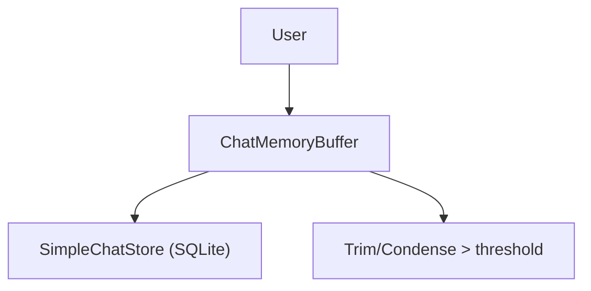

## Description

Adopt LlamaIndex ChatMemoryBuffer with SimpleChatStore (SQLite) for persistent chat history and context‑aware follow‑ups within a 128K context budget (ADR‑004/010). Use trimming/condensation as needed.

> Status notice (2026-01-09): Superseded by ADR-043. For v1 we standardize on `SimpleChatStore` persisted to JSON and wire it into existing `ChatMemoryBuffer` usage (no SQLite chat store).

## Context

Users expect persistent, context‑aware conversations across sessions. 128K windows require careful trimming to keep latency and memory in check.

## Decision Drivers

- Persistent history across restarts
- Follow‑ups leverage prior turns
- Efficient trimming for long sessions

## Alternatives

- A: No persistence — Poor UX
- B: Session‑only memory — Lost on restart
- C: Custom memory layer — Unnecessary complexity
- D: ChatMemoryBuffer + SimpleChatStore (Selected)

### Decision Framework

| Model / Option            | UX (40%) | Simplicity (30%) | Performance (20%) | Maintenance (10%) | Total   | Decision    |
| ------------------------- | -------- | ---------------- | ----------------- | ----------------- | ------- | ----------- |
| Buffer + Store (Selected) | 9        | 9                | 8                 | 9                 | **8.8** | ✅ Selected |
| Session‑only              | 5        | 10               | 9                 | 10                | 7.3     | Rejected    |
| Custom layer              | 7        | 4                | 7                 | 5                 | 5.9     | Rejected    |

## Decision

Use ChatMemoryBuffer for context and SimpleChatStore (SQLite/WAL) for persistence. Trim history proactively around 120K with buffer.

## High-Level Architecture



## Related Requirements

### Functional Requirements

- FR‑1: Persist conversations and restore on startup
- FR‑2: Use prior turns for follow‑ups
- FR‑3: Multi‑session support

### Non-Functional Requirements

- NFR‑1: Memory ops <100ms overhead
- NFR‑2: Trim to remain within 128K budget

### Integration Requirements

- IR‑1: UI (ADR‑013) binds to memory store

## Design

### Architecture Overview

- ChatMemoryBuffer holds recent turns; SimpleChatStore persists to SQLite.
- Trimming/condensation keeps window under ~128K tokens.

### Implementation Details

In `src/chat/memory.py` (illustrative):

```python
from llama_index.memory import ChatMemoryBuffer

def get_memory(session_id: str):
    # return ChatMemoryBuffer + SimpleChatStore (SQLite)
    return ChatMemoryBuffer.from_defaults(token_limit=120_000)

# Optional: SimpleChatStore (persistence)
def get_chat_store(sqlite_path: str):
    """Create a persistent chat store.
    Note: Import path may vary across LlamaIndex releases; adjust accordingly.
    """
    try:
        from llama_index.storage.chat_store.sqlite import SqliteChatStore
        store = SqliteChatStore(sqlite_path)
        # Enable WAL if desired
        # with sqlite3.connect(sqlite_path) as conn: conn.execute("PRAGMA journal_mode=WAL;")
        return store
    except Exception:
        return None
```

Using memory in a query path (example):

```python
from llama_index.core import VectorStoreIndex
from src.chat.memory import get_memory

def answer_with_memory(docs, query: str, session_id: str = "default") -> str:
    mem = get_memory(session_id)
    # Optionally feed memory turns as system context or combine with retrieval
    index = VectorStoreIndex.from_documents(docs)
    engine = index.as_query_engine(similarity_top_k=10)
    # Minimal example; production flow would interleave memory and retrieval
    return engine.query(query).response
```

### Configuration

```env
DOCMIND_CHAT__SQLITE_PATH=./data/docmind.db
```

## Testing

```python
def test_restore(tmp_path):
    # write one turn, reopen, verify
    pass
```

## Consequences

### Positive Outcomes

- Persistent, context‑aware chat
- Works within 128K window via trimming

### Negative Consequences / Trade-offs

- Requires careful trim logic to avoid losing salient turns

### Ongoing Maintenance & Considerations

- Monitor latency with large sessions; refine trim thresholds

### Dependencies

- Python: `llama-index`, `sqlite3`

## Changelog

- 3.2 (2025-09-02): Cache unification has no impact; confirmed separation
- 3.1 (2025-08-20): Added supervisor hooks for trimming/formatting
- 3.0 (2025-08-19): 128K context via FP8 KV; adjusted triggers
- 2.0 (2025-08-19): 262K experiment via INT8; then reduced
- 1.0 (2025-08-18): Initial memory system
