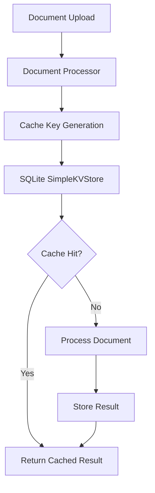

# ADR-025: Caching Strategy (Superseded)

## Metadata

**Status:** Superseded by ADR-030  
**Version/Date:** v2.1 / 2025-09-02

## Title

Caching Strategy for Document Processing

## Status Notice

This ADR is superseded by ADR-030: “Cache Unification via LlamaIndex IngestionCache (DuckDBKVStore)”. ADR-030 is the authoritative source for the current design and implementation. The original ADR-025 content is preserved below in an archived section for historical reference.

## Superseded Summary

- Earlier proposals used a simple/custom wrapper around SQLite/JSON persistence.
- The accepted direction (ADR-030) unifies on LlamaIndex IngestionCache with a DuckDB-backed KV store (single local-first file).
- Custom cache classes are removed with no backward compatibility retained.

## Related Decisions

- ADR-030: Cache Unification via LlamaIndex IngestionCache (DuckDBKVStore) — current
- ADR-031: Local-First Persistence Architecture (Vectors, Cache, Operational Data)
- ADR-026: Test/Production Separation

## Changelog

- 2.1 (2025-09-02): Superseded notice clarified; restored archived original content for reference.
- 2.0 (2025-09-02): Marked ADR-025 as superseded by ADR-030 and summarized outcome.
- 1.0 (2025-08-26): Initial ADR for simplified caching strategy. Replaced multi-library cache with minimal SQLite-based approach; ~90% code reduction, ~80% dependency reduction, ~98% setup simplification while maintaining core functionality.

## References

- Cache Architecture Analysis: `ai-research/2025-08-26/001-cache-architecture-over-engineering-assessment.md`
- Decision Framework Results: multi-criteria scoring showing 0.8675 vs 0.715 for simple vs complex
- LlamaIndex IngestionCache: <https://docs.llamaindex.ai/en/stable/module_guides/storing/ingestion_cache/>
- SQLite WAL Mode: <https://www.sqlite.org/wal.html> (concurrent access documentation)

---

## Archived Original ADR-025 (v1.0, 2025-08-26)

The content below preserves the original decision for historical/archival purposes. It is not the current design. See ADR-030 for the active approach.

### Context

- Document processing (Unstructured parsing → chunking → embeddings) is expensive and repeated during iterative workflows.
- Prior cache experiments introduced external services (e.g., Redis/FAISS) and bespoke serialization that increased operational complexity and maintenance burden.
- The product targets local-first, offline-capable usage with minimal setup.

### Goals

- KISS and library-first: deliver 90% of value with minimal moving parts.
- Zero external services; single-file local persistence.
- Safe for multi-process access in a desktop/Streamlit context.
- Easy to observe basic cache metrics (hit/miss, size).

### Non-Goals

- No distributed cache or remote service coordination.
- No cross-environment replication or multi-tenant partitioning.
- No legacy compatibility layers.

### Decision

Adopt a minimal, SQLite-backed key-value cache for document processing results. Implement as a thin wrapper around LlamaIndex’s SimpleKVStore (or equivalent) with:

- Single SQLite DB file (e.g., `./cache/docmind.db`).
- Hash-based cache keys from file content + size + mtime.
- WAL mode enabled for safe concurrent access.
- Basic statistics (hits, misses, total, size MB).

### Rationale

- Eliminates unnecessary services and bespoke code paths.
- Uses proven library primitives (SimpleKVStore) while keeping code surface minimal.
- Matches the local-first and offline product constraints.

### Considered Alternatives

- Redis-backed cache: adds service ops and configuration; unnecessary for single-user local-first workloads.
- FAISS/vector-level caching: orthogonal to document processing cache; higher memory footprint; operational overhead.
- Custom JSON files: simple but fragile for concurrency and corruption handling as cache grows.

### Architecture Overview

### Implementation Notes

- Location: `src/cache/simple_cache.py` with a small, explicit interface (get/store/clear/stats).
- Storage: SQLite file at `./cache/docmind.db`.
- Concurrency: enable WAL mode; rely on SQLite ACID guarantees for single-machine concurrency.
- Recovery: detect and recreate DB on corruption; log and continue.

### Configuration

- Defaults work out of the box; optional env vars:

  - `DOCMIND_CACHE_DIR` (default: `./cache`)
  - `DOCMIND_CACHE_SIZE_LIMIT` (bytes; soft limit for pruning policies)

### Testing

- Unit: verify hit/miss behavior, key stability, and corruption recovery path.
- Integration: repeated document runs demonstrate substantial latency reduction on second run.

### Consequences

- Positive: drastically simpler ops, minimal dependencies, quick setup, strong local durability.
- Negative: limited introspection vs. larger cache systems; single-machine scope.

### Migration

- Remove multi-service cache dependencies and bespoke serialization.
- Introduce SimpleCache; provide one-time script to clear any legacy cache artifacts if present.

---

## Post-Supersession Notes

- ADR-030 replaces the SimpleCache wrapper with LlamaIndex IngestionCache + DuckDBKVStore to consolidate on a first-class library abstraction and a robust single-file DB.
- The migration removes `src/cache/simple_cache.py` and wires `DuckDBKVStore` via IngestionCache in the ingestion pipeline.
