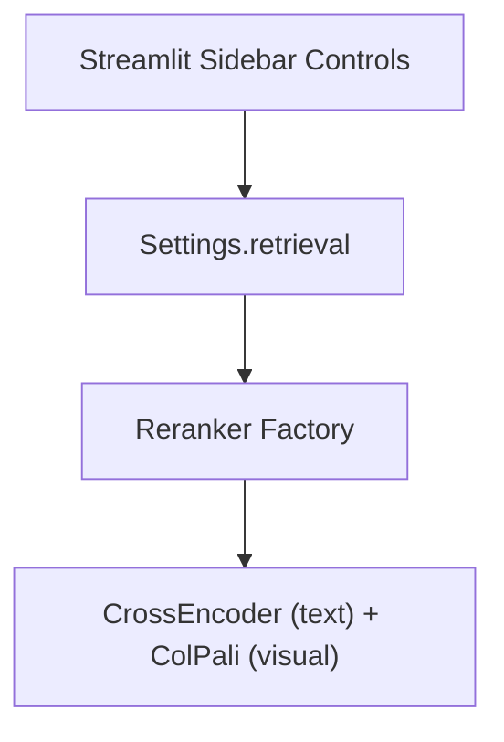

## Description

Reranking is now always‑on with internal caps/timeouts and fail‑open behavior. UI controls for `normalize_scores` and `top_n` remain minimal; legacy `reranker_mode` has been removed to reduce complexity and prevent footguns. Operators may use ops‑only env overrides when absolutely necessary.

## Context

Reranking uses a CrossEncoder for text and ColPali for visual nodes (ADR‑037). Operators need lightweight control to adjust ranked list size, score normalization, and mode without editing environment variables.

## Decision Drivers

- KISS: minimal controls only; no advanced panel
- Library-first: reuse existing reranker and settings
- Operator ergonomics and persistence
- Deterministic UI tests

## Alternatives

- A: No UI (env-only) — Pros: simpler; Cons: poor operator feedback
- B: Full advanced panel — Pros: flexibility; Cons: over-engineered for v1
- C: Minimal three controls (Selected) — Pros: high value with low complexity

### Decision Framework (Superseded)

| Model / Option                                | Simplicity (40%) | Operator Value (30%) | Testability (20%) | Alignment (10%) | Total Score | Decision           |
| --------------------------------------------- | ---------------- | -------------------- | ----------------- | --------------- | ----------- | ------------------ |
| **Always‑on (internal caps/timeouts)**        | 10               | 8                    | 9                 | 10              | **9.3**     | ✅ Superseding     |
| Minimal three controls (historical selection) | 8                | 8                    | 9                 | 8               | 8.3         | Historical (repl.) |
| Full advanced panel                           | 5                | 9                    | 6                 | 7               | 6.6         | Rejected           |

The minimal‑controls approach has been superseded by always‑on reranking with internal guardrails and telemetry. Any future UI exposure must be justified by measured operator value and retained simplicity.

## Decision (Historical; Superseded)

Add three sidebar controls and wire them to settings before constructing the reranker(s):

- Checkbox: Normalize scores (sigmoid)
- Number input: Top N (1–20)
- Radio: Reranker Mode (`auto|text|multimodal`)

## High-Level Architecture



## Related Requirements

### Functional Requirements

- FR‑1: Toggle sigmoid normalization on/off
- FR‑2: Set `top_n` in [1,20]
- FR‑3: Select reranker mode `auto|text|multimodal`

### Non-Functional Requirements

- NFR‑1: Minimal UI surface in v1.0/1.1
- NFR‑2: Deterministic tests via Streamlit AppTest

### Performance Requirements

- PR‑1: No measurable overhead beyond settings read/write

### Integration Requirements

- IR‑1: Read/write via unified settings (ADR‑024)
- IR‑2: Works with modality-aware reranking (ADR‑037) and UI architecture (ADR‑013/ADR‑016)

## Design

### Architecture Overview

- Sidebar controls mutate retrieval settings; reranker factory reads settings to construct CrossEncoder/ColPali paths.

### Implementation Details

In `src/app.py`:

```python
with st.sidebar:
    st.markdown("### Retrieval & Reranking")
    norm = st.checkbox("Reranker: Normalize scores", value=settings.retrieval.reranker_normalize_scores)
    top_n = st.number_input("Reranker: Top N", min_value=1, max_value=20, value=settings.retrieval.reranking_top_k)
    mode = st.radio("Reranker Mode", ["auto","text","multimodal"], index=0)

settings.retrieval.reranker_normalize_scores = bool(norm)
settings.retrieval.reranking_top_k = int(top_n)
# Legacy: settings.retrieval.reranker_mode (removed)
```

### Configuration

No new settings; uses existing `RetrievalConfig` fields (ADR‑024).

## Testing

```python
def test_controls_update_settings(app, settings):
    # simulate toggling controls and assert settings updated before reranker construction
    pass
```

## Consequences

### Positive Outcomes

- Minimal operator control improves practical reranking
- Deterministic UI tests; no new service dependencies

### Negative Consequences / Trade-offs

- Limited tuning surface by design in v1

### Ongoing Maintenance & Considerations

- Consider additional controls (e.g., thresholds) only if justified by demand

### Dependencies

- Python: `streamlit`, `sentence-transformers` (existing)

## Changelog

- **1.2.0 (2025-09-07)**: Marked Superseded by ADR‑024 v2.7 / SPEC‑005; added supersession decision framework
- **1.0.0 (2025-09-03)**: Initial accepted version.
