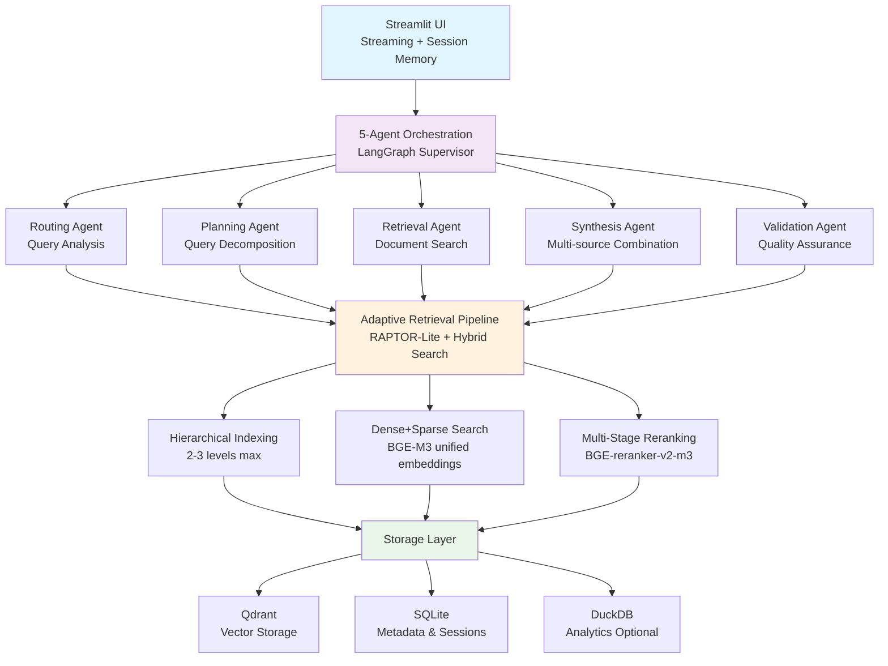

# DocMind AI - Architecture Overview

## Executive Summary

DocMind AI is an agentic RAG system leveraging Qwen3-4B-Instruct-2507-FP8's 128K context capability through FP8 KV cache optimization and parallel tool execution, designed for local-first operation with offline capabilities. The architecture employs a 5-agent system with unified embeddings, hierarchical retrieval, and efficient context processing to deliver enhanced performance on RTX 4090 Laptop hardware with 12-14GB VRAM usage.

## System Architecture

### Core Design Principles

- **Local-First**: 100% offline operation, no API dependencies
- **Library-First**: Leverage existing libraries over custom code (91% code reduction achieved)
- **KISS > DRY > YAGNI**: Simplicity over premature optimization
- **Efficient Context Processing**: Leverages 128K context windows through FP8 KV cache optimization with parallel tool execution (50-87% token reduction)

### High-Level Architecture



## Technology Stack

### Core Models (100% Local)

| Component           | Model                      | Size  | VRAM  | Purpose                             |
| ------------------- | -------------------------- | ----- | ----- | ----------------------------------- |
| **LLM**             | Qwen3-4B-Instruct-2507-FP8 | 3.6GB | 3.6GB | Generation, reasoning, 128K context |
| **Embedding**       | BGE-M3                     | 2.3GB | 2-3GB | Unified dense+sparse embeddings     |
| **Reranking**       | BGE-reranker-v2-m3         | 1.1GB | 1-2GB | Multi-stage reranking               |
| **KV Cache (128K)** | FP8 Quantization           | 0GB   | ~8GB  | 50% memory reduction vs FP16        |

**Total VRAM**: 12-14GB with 128K context (RTX 4090 Laptop optimized)

### Core Libraries

```toml
# RAG Framework
llama-index = "^0.11.0"           # Primary RAG framework
langgraph-supervisor = "^0.0.29"  # Agent orchestration

# Models & Inference
sentence-transformers = "^3.3.0"  # BGE-M3, reranking
transformers = "^4.46.0"          # Qwen3-14B
FlagEmbedding = "^1.2.0"         # BGE-M3 sparse features

# Enhanced Capabilities
instructor = "^1.3.0"             # Structured outputs (85-point feature)
dspy-ai = "^2.4.0"               # Query optimization (82-point feature)
gptcache = "^0.1.0"              # Semantic caching (72-point feature)
graphrag = "^0.1.0"              # Optional GraphRAG (76.5-point feature)

# Storage & UI
qdrant-client = "^1.12.0"        # Vector database
streamlit = "^1.40.0"            # UI with native streaming
unstructured = "^0.16.0"         # Document processing
```

## Agent Architecture

### 5-Agent System (ADR-011)

1. **Routing Agent**: Query analysis and strategy selection

   - Classifies query complexity and intent
   - Routes to appropriate retrieval strategies
   - Handles fallback scenarios

2. **Planning Agent**: Complex query decomposition

   - Breaks down multi-part questions
   - Creates retrieval sub-tasks
   - Coordinates multi-step reasoning

3. **Retrieval Agent**: Document search with optimization

   - Executes multi‑strategy retrieval (vector + hybrid; optional GraphRAG)
   - Optional DSPy query optimization for query rewriting (when enabled)
   - Manages server‑side dense+sparse fusion via Qdrant Query API

4. **Synthesis Agent**: Multi-source combination

   - Combines results from multiple retrieval passes
   - Resolves conflicts between sources
   - Generates coherent responses

5. **Validation Agent**: Response quality assurance
   - Validates response accuracy and relevance
   - Triggers correction loops when needed
   - Ensures factual consistency

### Orchestration Pattern

- **Framework**: LangGraph Supervisor
- **Coordination**: Built-in error handling and fallbacks
- **Memory**: LangGraph InMemoryStore (local-first)
- **Streaming**: Real-time response streaming via Streamlit

## Retrieval Architecture

### Unified Embedding Strategy (ADR-002)

**BGE-M3 Advantages**:

- **Only model** with unified dense+sparse embeddings in single forward pass
- 1024-dim dense + integrated sparse vectors
- 8,192 token context window
- 100+ languages support
- 70.0 NDCG@10 performance

### Adaptive Retrieval Pipeline (ADR-003)

**RAPTOR-Lite Implementation**:

- Simplified hierarchical indexing (2-3 levels max)
- Multi-strategy routing based on query complexity
- Local optimization for consumer hardware
- 15%+ improvement on complex queries

Server-side Hybrid Fusion:

- Hybrid dense+sparse fusion is performed server-side via the Qdrant Query API (Prefetch + FusionQuery). Default fusion is RRF; DBSF can be enabled via environment where supported. There are no client-side fusion knobs.

Router Composition (router_factory):

- The RouterQueryEngine is composed via `src/retrieval/router_factory.py` with tools `semantic_search`, `hybrid_search` (Qdrant server-side fusion), and `knowledge_graph` (when a PropertyGraphIndex is present and healthy). The selector prefers `PydanticSingleSelector` and falls back to `LLMSingleSelector`. Graph traversal is bounded by `path_depth=1` by default.

Example (pseudo):

```python
from src.retrieval.router_factory import build_router_engine

router = build_router_engine(vector_index, graph_index, settings)
result = router.query("Find relationships between X and Y")
print(result)
```

### Modern Reranking (ADR-006)

**Multi-Stage Pipeline**:

- BGE-reranker-v2-m3 as primary reranker
- Query-adaptive strategies
- Batch optimization and caching
- 10%+ NDCG@5 improvement target

## Performance Optimization

### Memory Management (ADR-010)

- **FP8 KV Cache**: 50% memory reduction with enhanced performance
- **AWQ Quantization**: Model size reduced to 2.92GB
- **Model sharing**: Unified BGE-M3 for embedding+reranking features
- **Hardware adaptation**: Automatic model selection based on VRAM
- **Resource pools**: Efficient GPU memory utilization at ~12.2GB total

### Caching Strategy

**Dual-Layer Caching**:

1. **Document Processing Cache**: LlamaIndex IngestionCache
2. **Semantic Query Cache**: GPTCache with BGE-M3 embeddings

### Storage Optimization (ADR-007)

- **Qdrant**: Vector storage with compression
- **SQLite**: Metadata and session persistence
- **DuckDB**: Analytics and reporting (optional)
- **40% storage reduction** through compression and deduplication

## Quality Assurance

### Evaluation Framework (ADR-012)

**Automated Metrics**:

- **DeepEval**: Answer relevancy, faithfulness, context precision
- **Ragas**: RAG-specific evaluation metrics
- **Custom metrics**: Response latency, cache hit rates

### Testing Strategy (ADR-014)

- **Unit tests**: pytest for all components
- **Integration tests**: End-to-end RAG pipeline testing
- **Performance tests**: Continuous benchmarking
- **Quality validation**: A/B testing for improvements

## Hardware Requirements

### Minimum Configuration

- **GPU**: RTX 4060 (16GB VRAM)
- **RAM**: 16GB system memory
- **Storage**: 50GB for models and data
- **Performance**: 2-4 second response times

### Recommended Configuration (RTX 4090 Laptop)

- **GPU**: RTX 4090 Laptop (16GB VRAM)
- **RAM**: 32GB system memory
- **Storage**: 100GB for models and data
- **Performance**: <2 second response times with 128K context and parallel execution

### Multi-Provider Support

- **vLLM (Recommended)**: FP8 KV cache, 100-160 tokens/sec decode, 800-1300 prefill
- **vLLM Alternative**: FP8 KV cache equivalent, similar performance
- **llama.cpp/Ollama**: GGUF fallback with quantization support

## Optional Enhancements

### DSPy Query Optimization (ADR-018)

- **Automatic query rewriting** for improved retrieval
- **MIPROv2 optimizer** for prompt tuning
- **Feature flag** for experimental rollout
- **82-point expert scoring** (high-value addition)

### GraphRAG Module (ADR-019)

- **LlamaIndex PropertyGraphIndex** integration
- **Zero additional infrastructure** (in-memory graph store)
- **Reuses Qdrant** vector store
- **<100 lines** integration code

### Structured Outputs (ADR-004)

- **Instructor library** for guaranteed JSON responses
- **Pydantic models** for response validation
- **Function calling** integration with Qwen3-14B
- **85-point expert scoring** (highest-value feature)

## Security & Privacy

### Local-First Design

- **Zero external APIs**: Complete offline operation
- **Local model storage**: All models cached locally
- **Data privacy**: Documents never leave local system
- **Network optional**: Works without internet connection

### Data Protection

- **SQLite encryption**: Optional database encryption
- **Memory safety**: Automatic cleanup of sensitive data
- **Document isolation**: Per-session document sandboxing

## Deployment

### Single Container Deployment (ADR-015)

```bash
# Single command deployment
docker-compose up

# Includes all dependencies:
# - Qdrant vector database
# - Model downloads and caching
# - Streamlit UI with streaming
# - All local models and libraries
```

### Configuration

```env
# Environment variables
QDRANT_HOST=localhost
QDRANT_PORT=6333
MODEL_CACHE_DIR=./models
OLLAMA_HOST=http://localhost:11434
ENABLE_GRAPHRAG=false
ENABLE_DSPY=false
```

## Integration Points

### ADR References

This architecture overview synthesizes decisions from:

- **ADR-001**: Modern Agentic RAG Architecture
- **ADR-002**: Unified Embedding Strategy
- **ADR-003**: Adaptive Retrieval Pipeline
- **ADR-004**: Local-First LLM Strategy
- **ADR-006**: Modern Reranking Architecture
- **ADR-007**: Hybrid Persistence Strategy
- **ADR-010**: Performance Optimization Strategy
- **ADR-011**: Agent Orchestration Framework
- **ADR-013**: User Interface Architecture
- **ADR-018**: DSPy Prompt Optimization
- **ADR-019**: Optional GraphRAG Module

### Future Extensibility

- **Modular design**: Components can be upgraded independently
- **Feature flags**: Experimental features behind toggles
- **Provider abstraction**: Support for additional model providers
- **Plugin architecture**: Extension points for custom functionality

## Success Metrics

### Performance Targets

- **Latency**: <1.5 seconds end-to-end query processing (RTX 4090 Laptop)
- **Memory**: 12-14GB VRAM total system usage with 128K context
- **Quality**: 15%+ improvement on complex queries
- **Reliability**: 90%+ queries processed without fallback
- **Context**: 128K token processing capability with intelligent context management

### Quality Measures

- **Accuracy**: 85%+ correlation with human evaluation
- **Relevance**: 10%+ NDCG@5 improvement from reranking
- **Consistency**: 95%+ response quality across query types
- **Coverage**: Support for 20+ document formats

This architecture delivers production-ready local RAG capabilities with high-performance processing while maintaining the simplicity and local-first principles that make DocMind AI effective for local deployment.
