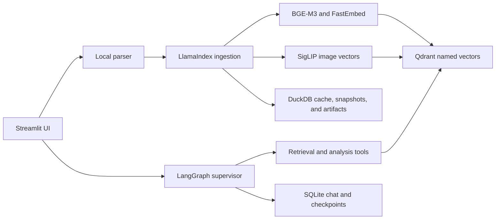

# Understand DocMind architecture

DocMind is a local-first document analysis application. This overview explains the runtime boundaries, canonical model paths, storage owners, and optional capabilities.

## Follow the primary data flow

DocMind separates parsing, ingestion, retrieval, orchestration, and persistence so each boundary has one implementation owner.


```mermaid
flowchart LR
    UI["Streamlit UI"] --> PARSER["Local parser"]
    PARSER --> INGEST["LlamaIndex ingestion"]
    INGEST --> TEXT["BGE-M3 and FastEmbed"]
    INGEST --> IMAGE["SigLIP image vectors"]
    TEXT --> QDRANT["Qdrant named vectors"]
    IMAGE --> QDRANT
    UI --> GRAPH["LangGraph supervisor"]
    GRAPH --> TOOLS["Retrieval and analysis tools"]
    TOOLS --> QDRANT
    GRAPH --> STATE["SQLite chat and checkpoints"]
    INGEST --> LOCAL["DuckDB cache, snapshots, and artifacts"]
```

The parser publishes canonical documents only after conversion succeeds. LlamaIndex then chunks and indexes those documents. The LangGraph supervisor calls retrieval tools and persists local session state.

## Keep parsing local

The parser boundary lives in `src/processing/parsing/` and has one supported implementation:

- Docling converts PDF, Office, and HTML inputs
- pypdfium2 inspects PDFs and renders page images
- RapidOCR performs local optical character recognition (OCR)
- The direct UTF-8 loader accepts only `.txt`, `.md`, `.markdown`, and `.rst`

PDF parsing requires the pinned Docling layout bundle. Prefetch it with `tools/models/pull.py --parser-defaults`, then validate its manifest with `scripts/parser_health.py --check`. RapidOCR owns and validates the models packaged in its locked wheel.

The parser runs behind a killable process boundary. Timeout and cancellation paths terminate and reap the worker. Searchable-PDF export is a separate, optional OCRmyPDF step that requires Portable Operating System Interface (POSIX) process groups.

## Use the canonical retrieval models

DocMind has one model path for each retrieval role:

| Role | Canonical implementation |
| --- | --- |
| Dense text embedding | BGE-M3 through the LlamaIndex Hugging Face adapter |
| Sparse text embedding | Direct `fastembed>=0.5.1` |
| Text reranking | BGE reranker cross-encoder |
| Image embedding and scoring | SigLIP through the pinned Transformers loader |

Qdrant stores dense vectors as `text-dense` and sparse vectors as `text-sparse`. Server-side Reciprocal Rank Fusion (RRF) is the default. Distribution-Based Score Fusion (DBSF) is an optional configuration.

SigLIP is the only image embedding backend. The codebase does not include alternate image embedding fallbacks.

## Route analysis through LangGraph

The repository-owned LangGraph `StateGraph` supervisor coordinates four worker
roles: planner, retrieval, synthesis, and validation. LangChain creates the role
agents inside that graph. The retrieval worker delegates tool selection to
LlamaIndex's native `RouterQueryEngine`.

The router exposes these tools when their dependencies and indexes are ready:

- `semantic_search`
- `hybrid_search`
- `keyword_search`
- `multimodal_search`
- `knowledge_graph`

`knowledge_graph` requires a supplied, healthy LlamaIndex core property graph
index. `DOCMIND_GRAPHRAG_CFG__ENABLED` controls the ingestion default, not a
second router gate. Keyword, multimodal, and hybrid tools remain
configuration-gated; semantic retrieval is always present.

## Persist local state by responsibility

Each persistence surface has one role:

| Surface | Responsibility |
| --- | --- |
| SQLite | Chat sessions and LangGraph checkpoints |
| DuckDB | Ingestion cache and optional local analytics |
| Qdrant | Named text vectors and SigLIP image vectors |
| Snapshot manager | Atomic activation manifests and optional property-graph artifacts |
| Artifact store | Content-addressed page images and thumbnails |

Durable stores use `ArtifactRef` values for binary artifacts. They do not store raw image blobs or absolute host paths.

## Treat remote services as an explicit trust change

Parsing, embedding, reranking, vector storage, telemetry, and persistence run locally by default. An operator can configure an approved remote language model or Ollama web tool, but that traffic crosses the local trust boundary.

When `DOCMIND_SECURITY__ALLOW_REMOTE_ENDPOINTS=false`, loopback endpoints are allowed. An allowlisted non-loopback hostname must resolve to public addresses. Private, link-local, reserved, and failed Domain Name System (DNS) resolutions are rejected.

Use `HF_HUB_OFFLINE=1` and `TRANSFORMERS_OFFLINE=1` only after every required model is present. These flags do not prove zero network egress. Measure egress separately when it is a release requirement.

## Install supported dependency profiles

`pyproject.toml` and `uv.lock` define the dependency contract. Supported local installations use uv, and container installations use the repository Docker image.

The default uv and Docker profiles install official CPU-only PyTorch wheels. Replace the CPU group with the `gpu` extra for the locked CUDA 12.8 wheels:

```bash
uv sync --frozen --no-group cpu --extra gpu
```

The core dependency surface includes:

- `llama-index-core>=0.14.21,<0.15.0` and selected integrations
- `fastembed>=0.5.1`
- `ollama==0.6.2`
- `torch==2.11.0`
- `transformers>=5.0.0,<6.0.0`

The application environment excludes the `llama-index` meta-package and removed LlamaIndex embedding adapters. External vLLM and llama.cpp servers connect through OpenAI-compatible HTTP endpoints and are not installed in the DocMind environment.

## Measure performance on the target machine

Model size, context length, hardware, corpus size, and enabled extras determine latency and memory use. The repository does not claim a universal throughput, response-time, or video-memory result.

Use the benchmark and monitoring scripts to produce evidence for a specific environment. The parser benchmark code expects schema 3. Regenerate its repeat-three artifact after the working tree is frozen.

## Read the owning documents

Use these documents for the detailed contracts:

- [Product requirements](../PRD.md)
- [System architecture](system-architecture.md)
- [Configuration reference](configuration.md)
- [Operations guide](operations-guide.md)
- [Parser runtime validation](parser-runtime-validation.md)
- [Architecture decisions](adrs/README.md)
