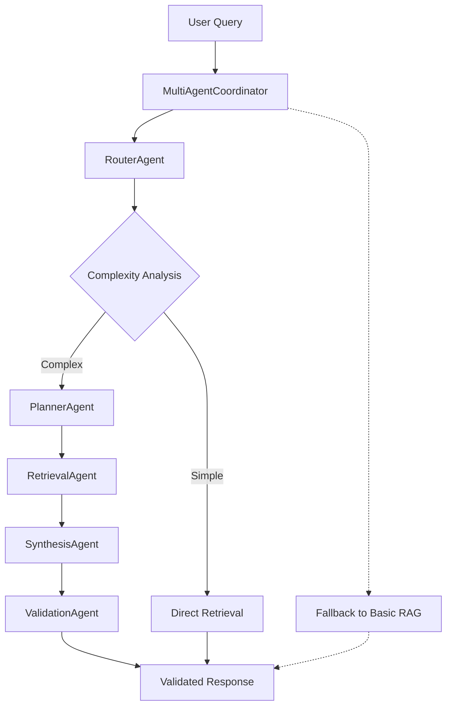
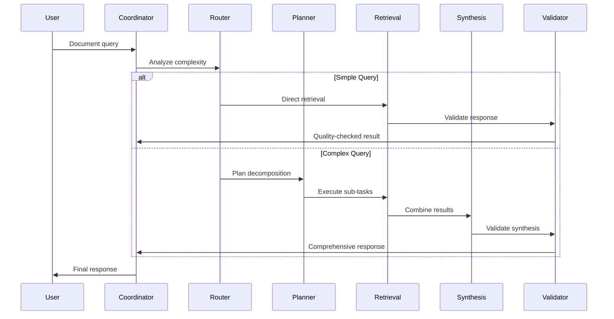

# DocMind AI Architecture Overview

## High-Level Components

- **Frontend:** Streamlit UI for uploads, configs, results, chat.

- **Backend:** Ollama/LlamaCpp/LM Studio for LLM inference.

- **Orchestration:** Multi-Agent Coordination System with LangGraph supervisor pattern.

- **Storage:** Qdrant for hybrid vector search.

- **Processing:** Utils for loading, chunking, analysis.

## Multi-Agent Coordination System

DocMind AI implements a sophisticated multi-agent architecture using LangGraph's supervisor pattern to coordinate specialized agents for complex document analysis tasks.

### Agent Architecture

### Specialized Agents

| Agent | Responsibility | Performance Target |
|-------|----------------|-------------------|
| **RouterAgent** | Query complexity analysis and strategy selection | <50ms |
| **PlannerAgent** | Complex query decomposition into sub-tasks | <100ms |
| **RetrievalAgent** | Multi-strategy document retrieval with DSPy optimization | <150ms |
| **SynthesisAgent** | Multi-source result combination and deduplication | <100ms |
| **ValidationAgent** | Response quality assessment and hallucination detection | <75ms |

### Agent Communication Patterns

- **Supervisor Orchestration**: LangGraph supervisor coordinates agent interactions
- **Shared State**: Context and metadata flow through MessagesState
- **Tool Integration**: Standardized @tool functions for consistent agent interfaces
- **Fallback Mechanisms**: Graceful degradation to basic RAG on agent failures

## Data Flow

### Document Processing Flow
1. User uploads docs → Loaded/split in src/utils/.
2. Indexed in Qdrant with hybrid embeddings (Jina v4 dense, FastEmbed sparse).
3. Analysis: Multi-agent system processes with specialized agents → Structured via Pydantic.
4. Chat: Multi-agent coordination with context preservation and validation.
5. GPU: torch.cuda for embeddings/reranking if enabled.

### Multi-Agent Query Processing Flow

## Key Technologies

### Core Infrastructure

- **Embeddings**: HuggingFace (Jina v4), FastEmbed (SPLADE++).

- **Multi-Agent Framework**: LangGraph supervisor pattern with specialized agents.

- **Optimization**: PEFT for efficiency, late chunking with NLTK, DSPy for query optimization.

- **Error Handling**: Tenacity for retry logic with exponential backoff.

- **Logging**: Loguru for structured logging with automatic rotation.

- **Caching**: Diskcache for document processing (90% performance improvement).

### Multi-Agent Technologies

- **LangGraph**: Native supervisor pattern for agent orchestration
- **Tool Integration**: @tool decorator with InjectedState for agent communication  
- **State Management**: MessagesState for context preservation across agents
- **Memory Systems**: InMemorySaver for conversation continuity
- **Performance Monitoring**: Built-in timing and quality metrics
- **Fallback Systems**: Graceful degradation to basic RAG on failures

## Architecture Design

DocMind AI follows modern library-first principles for reliability and maintainability:

### Core Design Principles

- **Robust Error Handling**: Tenacity-based retry logic with exponential backoff

- **Structured Logging**: Loguru integration for comprehensive monitoring and debugging

- **Type-Safe Configuration**: Pydantic BaseSettings for validated configuration management

- **High-Performance Caching**: Document processing cache layer delivers 90% speed improvement

- **Production-Ready Components**: Robust reliability with comprehensive error recovery

### Multi-Agent Design Principles

- **Agent Specialization**: Each agent has a focused responsibility and optimized performance
- **Supervisor Coordination**: LangGraph supervisor manages agent interactions and state
- **Performance Budgets**: Strict timing constraints (<300ms total overhead)
- **Graceful Degradation**: Automatic fallback to basic RAG when agents fail
- **Context Preservation**: Conversation continuity across multi-turn interactions
- **Quality Assurance**: Built-in validation and quality scoring for all responses

## Performance Characteristics

### Multi-Agent System Performance

| Operation | Target Time | Fallback Time |
|-----------|-------------|---------------|
| Simple query routing | <50ms | N/A |
| Query planning | <100ms | Bypass |
| Document retrieval | <150ms | <500ms |
| Result synthesis | <100ms | Skip |
| Response validation | <75ms | Basic check |
| **Total coordination overhead** | **<300ms** | **<3s fallback** |

See ADRs in [../adrs/](../adrs/) for all architectural decisions, including [ADR-011](../adrs/ADR-011-agent-orchestration-framework.md) for detailed multi-agent design decisions.
