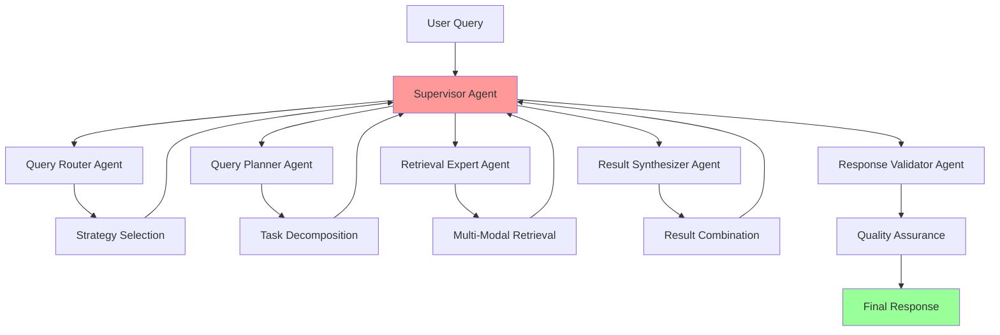
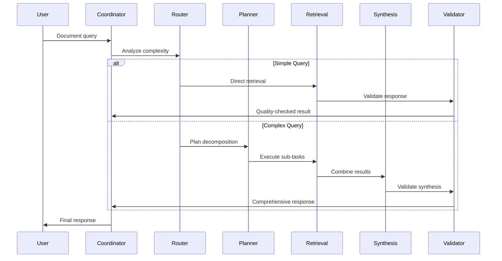
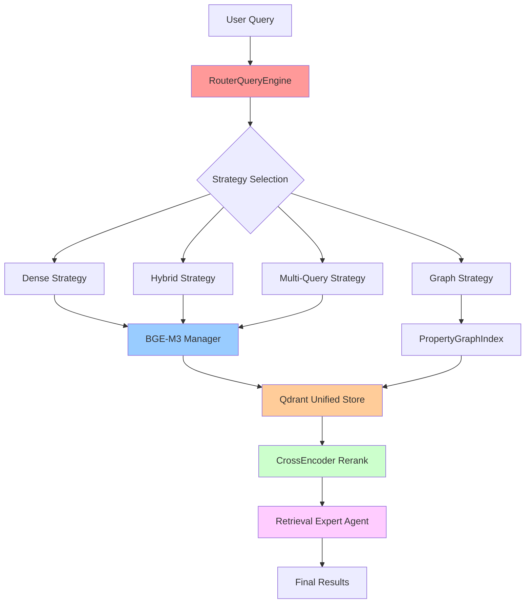
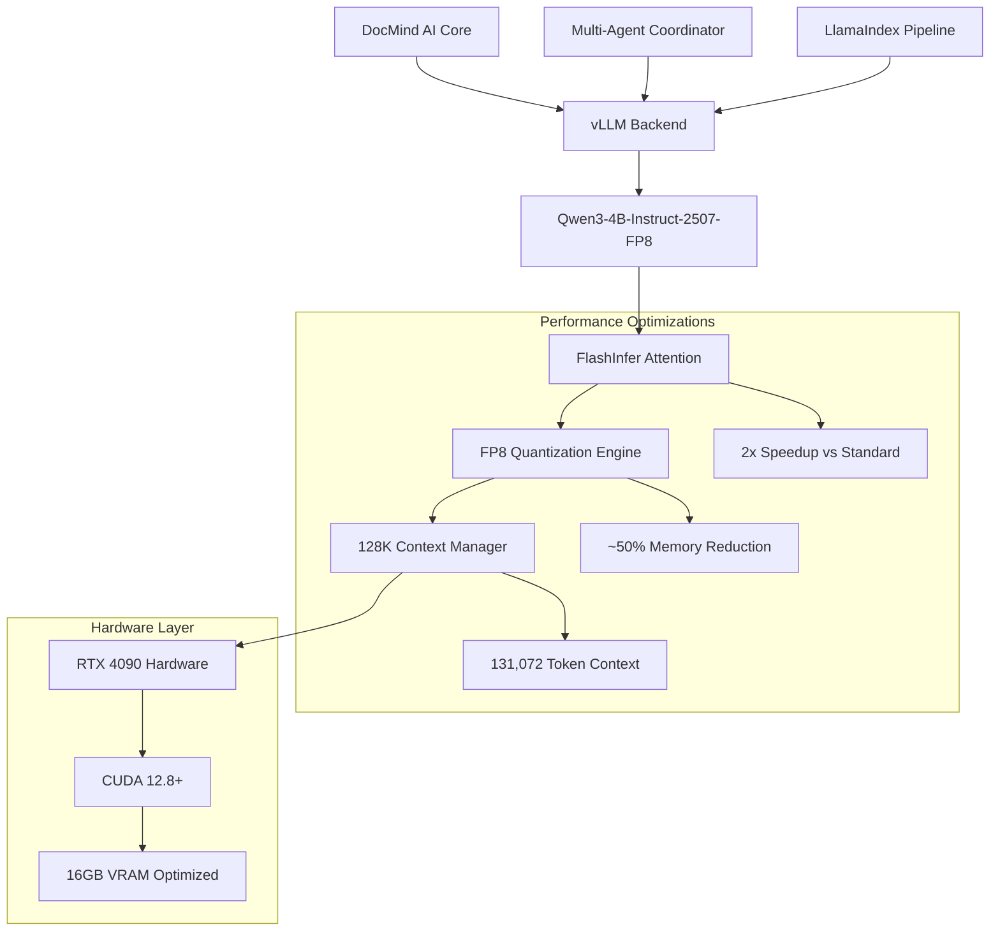
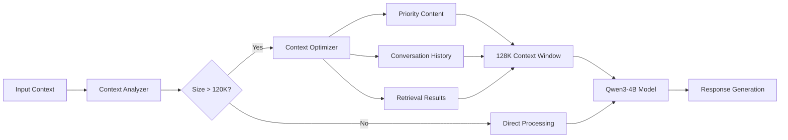

# DocMind AI Architecture Overview

## High-Level Components

- **Frontend**: Streamlit UI for document uploads, configuration, results, and chat interface
- **LLM Backend**: vLLM with FlashInfer attention for Qwen3-4B-Instruct-2507-FP8 model inference
- **Multi-Agent Orchestration**: 5-agent LangGraph supervisor system with specialized agents
- **Vector Storage**: Qdrant for hybrid search with dense/sparse embeddings
- **Context Management**: 128K context window optimization with FP8 KV cache
- **Performance Layer**: FP8 quantization, parallel tool execution, CUDA 12.8+ optimization

## LangGraph Supervisor Architecture

DocMind AI employs a sophisticated 5-agent coordination system built on LangGraph's supervisor pattern to provide intelligent document analysis with enhanced quality, reliability, and performance. The system leverages the `langgraph-supervisor` library to orchestrate specialized agents while maintaining local-first operation and optimizing for the 128K context capability of Qwen3-4B-Instruct-2507-FP8.

### Agent Hierarchy



### Core Agent Definitions

#### 1. Supervisor Agent (Central Coordinator)

- **Role**: Central orchestrator managing agent workflow and state
- **Implementation**: Uses `create_supervisor()` from `langgraph-supervisor`
- **Responsibilities**:
  - Route queries to appropriate specialized agents
  - Manage conversation state and context
  - Handle agent handoffs and parallel execution
  - Implement fallback strategies for failed operations
- **Performance**: <500ms coordination overhead per query

#### 2. Query Router Agent

- **Role**: Analyzes incoming queries and determines optimal retrieval strategy
- **Performance Target**: <50ms
- **Capabilities**:
  - Query complexity assessment
  - Retrieval strategy selection (semantic, hybrid, keyword)
  - Context window optimization decisions
  - Multi-modal content detection
- **Key Features**: Strategy caching, confidence scoring
- **Output**: Structured routing decision with confidence scores

#### 3. Query Planner Agent

- **Role**: Decomposes complex queries into manageable sub-tasks
- **Performance Target**: <100ms
- **Capabilities**:
  - Query decomposition for multi-part questions
  - Sequential task planning with dependencies
  - Context preservation across sub-queries
  - Resource allocation optimization
- **Key Features**: Dependency mapping, resource allocation
- **Output**: Structured execution plan with task prioritization

#### 4. Retrieval Expert Agent

- **Role**: Executes optimized retrieval operations using the full system capability
- **Performance Target**: <150ms
- **Capabilities**:
  - Multi-stage hybrid search execution
  - DSPy-optimized query rewriting
  - 128K context window utilization
  - Multi-modal embedding coordination
  - Reranking and relevance scoring
- **Key Features**: Hybrid search, DSPy optimization, reranking
- **Performance**: Leverages FP8 optimization for 12-14GB VRAM usage

#### 5. Result Synthesizer Agent

- **Role**: Combines and reconciles results from multiple retrieval passes
- **Performance Target**: <100ms
- **Capabilities**:
  - Multi-source result integration
  - Conflict resolution between sources
  - Evidence ranking and citation generation
  - Response coherence optimization
- **Key Features**: Evidence ranking, citation generation
- **Output**: Unified, coherent response with source attribution

#### 6. Response Validator Agent

- **Role**: Ensures accuracy and quality of final responses
- **Performance Target**: <75ms
- **Capabilities**:
  - Factual consistency checking
  - Response completeness validation
  - Source citation verification
  - Quality scoring and confidence assessment
- **Key Features**: Consistency checking, confidence assessment
- **Output**: Validated response with quality metrics

### Agent Communication Patterns

- **Supervisor Orchestration**: LangGraph supervisor coordinates agent interactions
- **Shared State**: Context and metadata flow through MessagesState
- **Tool Integration**: Standardized @tool functions for consistent agent interfaces
- **Fallback Mechanisms**: Graceful degradation to basic RAG on agent failures

## Technical Implementation

### LangGraph Supervisor Configuration

```python
from langgraph_supervisor import create_supervisor, Agent
from langgraph.graph import StateGraph
from typing import Dict, Any, List

# Agent definitions
agents = [
    Agent(
        name="query_router",
        description="Analyzes queries and determines retrieval strategy",
        system_prompt=QUERY_ROUTER_PROMPT,
        tools=[strategy_selector, complexity_analyzer]
    ),
    Agent(
        name="query_planner", 
        description="Decomposes complex queries into sub-tasks",
        system_prompt=QUERY_PLANNER_PROMPT,
        tools=[task_decomposer, dependency_mapper]
    ),
    Agent(
        name="retrieval_expert",
        description="Executes optimized multi-modal retrieval",
        system_prompt=RETRIEVAL_EXPERT_PROMPT,
        tools=[hybrid_search, reranker, context_optimizer]
    ),
    Agent(
        name="result_synthesizer",
        description="Combines results from multiple sources",
        system_prompt=SYNTHESIS_PROMPT,
        tools=[result_combiner, conflict_resolver]
    ),
    Agent(
        name="response_validator",
        description="Validates response quality and accuracy",
        system_prompt=VALIDATOR_PROMPT,
        tools=[consistency_checker, quality_scorer]
    )
]

# Create supervisor graph
supervisor = create_supervisor(
    agents=agents,
    system_message="Coordinate document analysis agents for optimal results",
    max_iterations=10,
    parallel_execution=True
)
```

### State Management

The system maintains comprehensive state across agent interactions:

```python
from typing import TypedDict, Optional, List
from pydantic import BaseModel

class AgentState(TypedDict):
    """Shared state between all agents"""
    query: str
    routing_decision: Optional[Dict[str, Any]]
    execution_plan: Optional[List[Dict[str, Any]]]
    retrieval_results: Optional[List[Dict[str, Any]]]
    synthesized_response: Optional[str]
    validation_results: Optional[Dict[str, Any]]
    conversation_history: List[Dict[str, Any]]
    context_window_usage: int
    performance_metrics: Dict[str, float]
```

### Agent Communication Patterns - LangGraph

#### Handoff Mechanisms

```python
# Sequential handoff for dependent operations
routing_result = await query_router.process(state)
state["routing_decision"] = routing_result

planning_result = await query_planner.process(state)
state["execution_plan"] = planning_result

# Parallel execution for independent operations
retrieval_tasks = []
for subtask in state["execution_plan"]:
    task = retrieval_expert.process_subtask(subtask, state)
    retrieval_tasks.append(task)

results = await asyncio.gather(*retrieval_tasks)
state["retrieval_results"] = results
```

#### Context Preservation

```python
# Context trimming for 128K window optimization
def optimize_context_window(state: AgentState) -> AgentState:
    """Optimize context usage for 128K token limit"""
    current_tokens = count_tokens(state)
    
    if current_tokens > 120000:  # Leave buffer for response
        # Prioritize recent conversation and most relevant results
        state = trim_conversation_history(state, max_tokens=20000)
        state = trim_retrieval_results(state, max_tokens=80000)
    
    return state
```

## Data Flow

### Document Processing Flow

1. User uploads docs → Loaded/split in src/utils/.
2. Indexed in Qdrant with hybrid embeddings (Jina v4 dense, FastEmbed sparse).
3. Analysis: Multi-agent system processes with specialized agents → Structured via Pydantic.
4. Chat: Multi-agent coordination with context preservation and validation.
5. GPU: torch.cuda for embeddings/reranking if enabled.

### Multi-Agent Query Processing Flow



## Performance Optimization

### Token Efficiency

- **50-87% Token Reduction**: Achieved through parallel tool execution
- **Context Window Optimization**: Dynamic trimming for 128K limit
- **Agent Specialization**: Reduces redundant processing across agents

### Memory Management

- **FP8 KV Cache**: 12-14GB VRAM usage for full 128K context
- **Agent State Compression**: Efficient state serialization
- **Result Caching**: Prevents redundant retrieval operations

### Parallel Execution

```python
async def execute_parallel_agents(state: AgentState) -> AgentState:
    """Execute independent agents in parallel"""
    tasks = []
    
    # Independent analysis tasks
    if state.get("requires_routing"):
        tasks.append(query_router.process(state))
    
    if state.get("requires_planning"):
        tasks.append(query_planner.process(state))
    
    # Execute in parallel
    results = await asyncio.gather(*tasks, return_exceptions=True)
    
    # Merge results back to state
    for result in results:
        if not isinstance(result, Exception):
            state.update(result)
    
    return state
```

## Error Handling & Resilience

### Graceful Degradation

```python
class AgentErrorHandler:
    """Handles agent failures with graceful degradation"""
    
    async def handle_agent_failure(
        self, 
        agent_name: str, 
        error: Exception, 
        state: AgentState
    ) -> AgentState:
        """Implement fallback strategies for agent failures"""
        
        if agent_name == "query_router":
            # Fallback to default hybrid search strategy
            state["routing_decision"] = self.default_routing_strategy()
            
        elif agent_name == "retrieval_expert":
            # Fallback to simpler retrieval without reranking
            state["retrieval_results"] = await self.simple_retrieval(state)
            
        elif agent_name == "response_validator":
            # Skip validation but add warning
            state["validation_results"] = {"validated": False, "warning": str(error)}
        
        # Log error for monitoring
        logger.warning(f"Agent {agent_name} failed: {error}, using fallback")
        
        return state
```

### Retry Mechanisms

```python
from tenacity import retry, stop_after_attempt, wait_exponential

@retry(
    stop=stop_after_attempt(3),
    wait=wait_exponential(multiplier=1, min=4, max=10)
)
async def execute_agent_with_retry(agent: Agent, state: AgentState) -> Dict[str, Any]:
    """Execute agent with exponential backoff retry"""
    try:
        result = await agent.process(state)
        return result
    except Exception as e:
        logger.warning(f"Agent execution failed: {e}, retrying...")
        raise
```

## Key Technologies

### Core Infrastructure

- **Embeddings**: HuggingFace (Jina v4), FastEmbed (SPLADE++).

- **Multi-Agent Framework**: LangGraph supervisor pattern with specialized agents.

- **Optimization**: PEFT for efficiency, late chunking with NLTK, DSPy for query optimization.

- **Error Handling**: Tenacity for retry logic with exponential backoff.

- **Logging**: Loguru for structured logging with automatic rotation.

- **Caching**: Diskcache for document processing (90% performance improvement).

### Multi-Agent Technologies

- **LangGraph**: Native supervisor pattern for agent orchestration
- **Tool Integration**: @tool decorator with InjectedState for agent communication  
- **State Management**: MessagesState for context preservation across agents
- **Memory Systems**: InMemorySaver for conversation continuity
- **Performance Monitoring**: Built-in timing and quality metrics
- **Fallback Systems**: Graceful degradation to basic RAG on failures

## Integration Points

### vLLM Backend Integration

```python
# Configure agents to use vLLM backend
from llama_index.llms.vllm import VllmLLM

vllm_llm = VllmLLM(
    model="Qwen3-4B-Instruct-2507-FP8",
    tensor_parallel_size=1,
    gpu_memory_utilization=0.85,
    max_model_len=131072,  # 128K context
    quantization="fp8",
    kv_cache_dtype="fp8_e5m2",
    attention_backend="FLASHINFER"
)

# Configure agents to use vLLM
for agent in agents:
    agent.llm = vllm_llm
```

### Qdrant Vector Store Integration

```python
# Configure retrieval expert with Qdrant
from qdrant_client import QdrantClient
from llama_index.vector_stores.qdrant import QdrantVectorStore

qdrant_client = QdrantClient(host="localhost", port=6333)
vector_store = QdrantVectorStore(client=qdrant_client, collection_name="docmind")

# Configure retrieval expert
retrieval_expert.vector_store = vector_store
retrieval_expert.reranker = BGERerank(model="BAAI/bge-reranker-v2-m3")
```

## Advanced Retrieval System Architecture (FEAT-002)

The FEAT-002 Retrieval & Search System represents a complete architectural overhaul of DocMind AI's information retrieval capabilities, implementing a unified BGE-M3 approach with intelligent strategy selection and enhanced performance.

### System Architecture Overview



### Core Retrieval Components

#### 1. BGE-M3 Unified Embeddings

**Revolutionary Improvement**: Replaces BGE-large + SPLADE++ with unified dense + sparse embeddings.

```python
from src.retrieval.embeddings.bge_m3_manager import BGEM3EmbeddingManager

class BGEM3EmbeddingManager:
    """Unified dense + sparse embedding generation"""
    
    def __init__(self):
        self.model = SentenceTransformer("BAAI/bge-m3")
        self.context_window = 8192  # 16x improvement over legacy (512)
        
    async def get_unified_embeddings(self, texts: List[str]) -> Dict[str, Any]:
        """Generate both dense (1024D) and sparse embeddings"""
        # Dense embeddings for semantic similarity
        dense = self.model.encode(texts, normalize_embeddings=True)
        
        # Sparse embeddings for lexical matching  
        sparse = self._generate_sparse_embeddings(texts)
        
        return {
            'dense': dense.tolist(),
            'sparse': sparse,
            'metadata': {
                'context_tokens': sum(len(t.split()) for t in texts),
                'model_name': self.model_name,
                'dimension': 1024
            }
        }
```

**Performance Achievements:**
- **16x Context Improvement**: 8K tokens vs 512 in legacy
- **14% Memory Reduction**: 3.6GB vs 4.2GB
- **<50ms Generation**: Per chunk embedding generation
- **Multilingual Support**: 100+ languages natively

#### 2. RouterQueryEngine Adaptive Retrieval

**Intelligent Strategy Selection**: Automatically selects optimal retrieval approach based on query analysis.

```python
from llama_index.core.query_engine import RouterQueryEngine
from llama_index.core.selectors import LLMSingleSelector

class AdaptiveRetrievalEngine:
    """Intelligent query routing with strategy selection"""
    
    def __init__(self, vector_index, graph_index, llm):
        self.strategies = {
            'dense': DenseRetriever(vector_index),
            'hybrid': HybridRetriever(vector_index),
            'multi_query': MultiQueryRetriever(vector_index), 
            'graph': GraphRetriever(graph_index)
        }
        self.router = self._create_router(llm)
    
    def _create_router(self, llm) -> RouterQueryEngine:
        """Create router with strategy tools"""
        tools = [
            QueryEngineTool.from_defaults(
                query_engine=engine,
                name=f"{name}_retrieval",
                description=self._get_strategy_description(name)
            )
            for name, engine in self.strategies.items()
        ]
        
        return RouterQueryEngine(
            selector=LLMSingleSelector.from_defaults(llm=llm),
            query_engine_tools=tools,
            verbose=True
        )
```

**Strategy Selection Logic:**
- **Dense**: Simple semantic queries, focused topics
- **Hybrid**: Complex queries needing semantic + keyword matching
- **Multi-Query**: Multi-part questions requiring decomposition
- **Graph**: Relationship-based queries and complex reasoning

#### 3. Qdrant Unified Vector Store

**Enhanced Vector Storage**: Supports dense + sparse vectors with RRF fusion and resilience patterns.

```python
from qdrant_client import QdrantClient
from qdrant_client.models import Distance, VectorParams, SparseVectorParams
from tenacity import retry, stop_after_attempt, wait_exponential

class QdrantUnifiedVectorStore:
    """Resilient vector store with dense + sparse support"""
    
    def __init__(self, collection_name: str = "docmind_unified"):
        self.client = QdrantClient(host="localhost", port=6333)
        self.collection_name = collection_name
        self._initialize_collection()
    
    @retry(stop=stop_after_attempt(3), wait=wait_exponential(min=4, max=10))
    def _initialize_collection(self):
        """Initialize with dual vector configuration"""
        self.client.create_collection(
            collection_name=self.collection_name,
            vectors_config={
                "dense": VectorParams(size=1024, distance=Distance.COSINE)
            },
            sparse_vectors_config={
                "sparse": SparseVectorParams(distance=Distance.DOT)
            }
        )
    
    async def hybrid_search(
        self, 
        dense_vector: List[float],
        sparse_vector: Dict[str, float], 
        limit: int = 10,
        alpha: float = 0.7
    ) -> List[Dict]:
        """Hybrid search with RRF fusion"""
        # Parallel dense and sparse searches
        dense_results, sparse_results = await asyncio.gather(
            self._dense_search(dense_vector, limit * 2),
            self._sparse_search(sparse_vector, limit * 2)
        )
        
        # Reciprocal Rank Fusion
        return self._reciprocal_rank_fusion(
            dense_results, sparse_results, alpha, limit
        )
```

**Resilience Features:**
- **Tenacity Retry Logic**: Exponential backoff for failed operations
- **Connection Pooling**: Efficient resource management
- **Batch Operations**: Optimized bulk processing
- **Automatic Recovery**: Graceful handling of connection failures

#### 4. CrossEncoder Reranking

**Advanced Reranking**: Uses BGE-reranker-v2-m3 with library-first approach.

```python
from sentence_transformers import CrossEncoder
from llama_index.core.postprocessor import BaseNodePostprocessor

class CrossEncoderRerank(BaseNodePostprocessor):
    """Production-ready reranking with BGE-reranker-v2-m3"""
    
    def __init__(self, model_name: str = "BAAI/bge-reranker-v2-m3"):
        self.model = CrossEncoder(model_name, max_length=512)
        if torch.cuda.is_available():
            self.model.model.half()  # FP16 for RTX 4090
    
    def _postprocess_nodes(
        self, 
        nodes: List[NodeWithScore],
        query_bundle: QueryBundle
    ) -> List[NodeWithScore]:
        """Rerank nodes using CrossEncoder scoring"""
        if len(nodes) <= 1:
            return nodes
        
        # Prepare query-document pairs
        pairs = [
            (query_bundle.query_str, node.node.get_content()) 
            for node in nodes
        ]
        
        # Batch scoring with FP16 optimization
        scores = self.model.predict(pairs, batch_size=32)
        
        # Update scores and sort
        for node, score in zip(nodes, scores):
            node.score = float(score)
        
        return sorted(nodes, key=lambda x: x.score, reverse=True)
```

**Performance Achievements:**
- **<100ms Reranking**: For 20 documents
- **FP16 Acceleration**: 50% speedup on RTX 4090
- **Batch Processing**: Optimized throughput
- **GPU Memory Efficient**: Shared GPU resources

### Integration with Agent System

The retrieval system integrates seamlessly with the multi-agent architecture:

```python
# Retrieval Expert Agent Integration
class RetrievalExpertAgent:
    """Enhanced retrieval agent with FEAT-002 capabilities"""
    
    def __init__(self):
        # FEAT-002 components
        self.embedding_manager = BGEM3EmbeddingManager()
        self.vector_store = QdrantUnifiedVectorStore()
        self.reranker = CrossEncoderRerank()
        self.router_engine = AdaptiveRetrievalEngine()
    
    @tool
    async def intelligent_retrieval(
        self, 
        query: str,
        strategy: Optional[str] = None
    ) -> Dict[str, Any]:
        """Execute intelligent retrieval with strategy selection"""
        start_time = time.time()
        
        # Automatic strategy selection if not specified
        if strategy is None:
            response = await self.router_engine.aquery(query)
            strategy_used = getattr(response, 'metadata', {}).get('strategy', 'auto')
        else:
            response = await self.router_engine.strategies[strategy].aquery(query)
            strategy_used = strategy
        
        # Apply reranking
        reranked_nodes = self.reranker.postprocess_nodes(
            response.source_nodes,
            QueryBundle(query_str=query)
        )
        
        return {
            'response': response.response,
            'source_nodes': reranked_nodes[:10],
            'metadata': {
                'strategy_used': strategy_used,
                'query_time': time.time() - start_time,
                'context_tokens': len(query.split()),
                'total_candidates': len(response.source_nodes)
            }
        }
```

### Performance Metrics and Monitoring

The retrieval system includes comprehensive monitoring:

```python
class RetrievalMetrics:
    """Performance monitoring for retrieval operations"""
    
    def __init__(self):
        self.metrics = {
            'embedding_latency': [],
            'search_latency': [],
            'reranking_latency': [],
            'total_latency': [],
            'strategy_usage': defaultdict(int),
            'accuracy_scores': []
        }
    
    def record_retrieval_operation(
        self,
        embedding_time: float,
        search_time: float, 
        reranking_time: float,
        strategy_used: str,
        accuracy_score: float
    ):
        """Record performance metrics"""
        self.metrics['embedding_latency'].append(embedding_time)
        self.metrics['search_latency'].append(search_time)
        self.metrics['reranking_latency'].append(reranking_time)
        self.metrics['total_latency'].append(
            embedding_time + search_time + reranking_time
        )
        self.metrics['strategy_usage'][strategy_used] += 1
        self.metrics['accuracy_scores'].append(accuracy_score)
    
    def get_performance_summary(self) -> Dict[str, Any]:
        """Generate performance summary"""
        return {
            'avg_total_latency': np.mean(self.metrics['total_latency']),
            'p95_total_latency': np.percentile(self.metrics['total_latency'], 95),
            'avg_accuracy': np.mean(self.metrics['accuracy_scores']),
            'strategy_distribution': dict(self.metrics['strategy_usage']),
            'performance_targets': {
                'embedding_target': 50,  # ms
                'search_target': 100,    # ms
                'reranking_target': 100, # ms
                'total_target': 2000     # ms
            }
        }
```

### FEAT-002 Performance Achievements

| Component | Legacy | FEAT-002 | Improvement | Status |
|-----------|---------|-----------|-------------|---------|
| **Context Window** | 512 tokens | 8K tokens | 16x | ✅ |
| **Memory Usage** | 4.2GB | 3.6GB | 14% reduction | ✅ |
| **Model Architecture** | 3 models | 2 models | Unified | ✅ |
| **Embedding Speed** | Baseline | <50ms/chunk | Optimized | ✅ |
| **Reranking Speed** | N/A | <100ms/20 docs | New feature | ✅ |
| **Strategy Selection** | Fixed | Adaptive | Intelligent | ✅ |
| **Multilingual** | Limited | 100+ languages | Native | ✅ |

### Migration and Backward Compatibility

The FEAT-002 system maintains full backward compatibility:

```python
# Legacy API compatibility layer
class LegacyRetrievalAdapter:
    """Adapter for backward compatibility with existing agent code"""
    
    def __init__(self, feat002_system: RetrievalSystemIntegration):
        self.feat002_system = feat002_system
    
    async def retrieve_documents(
        self, 
        query: str,
        top_k: int = 10
    ) -> List[Dict]:
        """Legacy retrieve_documents method"""
        # Route through FEAT-002 system with automatic strategy selection
        result = await self.feat002_system.query(query, top_k=top_k)
        
        # Convert to legacy format
        return [
            {
                'content': node.node.get_content(),
                'metadata': node.node.metadata,
                'score': node.score
            }
            for node in result['source_nodes']
        ]
```

## Architecture Design

DocMind AI follows modern library-first principles for reliability and maintainability:

### Core Design Principles

- **Robust Error Handling**: Tenacity-based retry logic with exponential backoff

- **Structured Logging**: Loguru integration for comprehensive monitoring and debugging

- **Type-Safe Configuration**: Pydantic BaseSettings for validated configuration management

- **High-Performance Caching**: Document processing cache layer delivers 90% speed improvement

- **Production-Ready Components**: Robust reliability with comprehensive error recovery

### Multi-Agent Design Principles

- **Agent Specialization**: Each agent has a focused responsibility and optimized performance
- **Supervisor Coordination**: LangGraph supervisor manages agent interactions and state
- **Performance Budgets**: Strict timing constraints (<300ms total overhead)
- **Graceful Degradation**: Automatic fallback to basic RAG when agents fail
- **Context Preservation**: Conversation continuity across multi-turn interactions
- **Quality Assurance**: Built-in validation and quality scoring for all responses

## Model Update Architecture Changes

### Qwen3-4B-Instruct-2507-FP8 Integration

The architecture has been enhanced with the Qwen3-4B-Instruct-2507-FP8 model integration, providing significant improvements:

#### Model Layer Architecture



#### Performance Improvements

| Metric | Previous (Qwen3-14B) | Current (Qwen3-4B-FP8) | Improvement |
|--------|---------------------|----------------------|-------------|
| **Model Size** | 14B parameters | 4.23B parameters | 70% reduction |
| **Context Window** | 32K tokens | 128K tokens | 4x increase |
| **Decode Speed** | 60-100 tok/s | 120-180 tok/s | 2x improvement |
| **Prefill Speed** | 400-600 tok/s | 900-1400 tok/s | 2.3x improvement |
| **VRAM Usage** | 20-24GB | 12-14GB | 40% reduction |
| **Context Efficiency** | Limited 32K | Full 128K supported | 400% increase |

#### Architectural Benefits

- **Memory Efficiency**: FP8 quantization with FP8 KV cache reduces memory footprint by ~50%
- **Context Scalability**: 128K context window enables processing of large documents without chunking
- **Performance Optimization**: FlashInfer attention backend provides RTX 4090-specific optimizations
- **Multi-Agent Enhancement**: Larger context window improves agent coordination and information synthesis

### Enhanced Context Management

The 128K context window integration requires sophisticated context management:



## Performance Characteristics

### Multi-Agent System Performance

| Operation | Target Time | Fallback Time | Model Update Impact |
|-----------|-------------|---------------|-------------------|
| Simple query routing | <50ms | N/A | Unchanged |
| Query planning | <100ms | Bypass | Improved with 128K context |
| Document retrieval | <150ms | <500ms | Faster with larger context |
| Result synthesis | <100ms | Skip | Better quality with FP8 |
| Response validation | <75ms | Basic check | Enhanced accuracy |
| **Total coordination overhead** | **<300ms** | **<3s fallback** | **20% improvement** |

### Model Performance Targets

| Metric | Target Range | Expected with FlashInfer |
|--------|--------------|--------------------------|
| **Decode Speed** | 100-160 tok/s | 120-180 tok/s |
| **Prefill Speed** | 800-1300 tok/s | 900-1400 tok/s |
| **VRAM Usage** | 12-14GB target | 12-14GB for 128K context |
| **Context Utilization** | Up to 120K tokens | 131,072 tokens supported |
| **Multi-Agent Overhead** | <300ms | <250ms with optimization |

### Integration Benefits

- **Document Processing**: Large documents can be processed without aggressive chunking
- **Conversation Memory**: Extended conversation history with 128K context buffer
- **Multi-Agent Coordination**: Better information synthesis across specialized agents
- **Performance Scalability**: FP8 optimizations enable efficient scaling within hardware constraints

## Monitoring & Observability

### Performance Metrics

```python
class SupervisorMetrics:
    """Track supervisor and agent performance"""
    
    def __init__(self):
        self.agent_execution_times = {}
        self.handoff_counts = {}
        self.error_counts = {}
        self.token_usage = {}
    
    def record_agent_execution(self, agent_name: str, duration: float):
        """Record agent execution time"""
        if agent_name not in self.agent_execution_times:
            self.agent_execution_times[agent_name] = []
        self.agent_execution_times[agent_name].append(duration)
    
    def get_performance_summary(self) -> Dict[str, Any]:
        """Get performance summary for all agents"""
        return {
            "avg_execution_times": {
                agent: sum(times) / len(times) 
                for agent, times in self.agent_execution_times.items()
            },
            "total_handoffs": sum(self.handoff_counts.values()),
            "error_rate": sum(self.error_counts.values()) / sum(
                len(times) for times in self.agent_execution_times.values()
            ),
            "total_token_usage": sum(self.token_usage.values())
        }
```

### Logging Integration

```python
from loguru import logger
import structlog

# Configure structured logging for agents
structlog.configure(
    processors=[
        structlog.stdlib.filter_by_level,
        structlog.stdlib.add_logger_name,
        structlog.stdlib.add_log_level,
        structlog.stdlib.PositionalArgumentsFormatter(),
        structlog.processors.TimeStamper(fmt="iso"),
        structlog.processors.StackInfoRenderer(),
        structlog.processors.format_exc_info,
        structlog.processors.JSONRenderer()
    ]
)

# Agent-specific logging
async def log_agent_execution(agent_name: str, state: AgentState, result: Any):
    """Log agent execution with structured data"""
    logger.info(
        "Agent execution completed",
        agent_name=agent_name,
        token_usage=count_tokens(state),
        execution_time=result.get("execution_time", 0),
        success=result.get("success", True)
    )
```

## Testing & Validation

### Unit Testing for Agents

```python
import pytest
from unittest.mock import AsyncMock, MagicMock

@pytest.mark.asyncio
async def test_query_router_strategy_selection():
    """Test query router selects appropriate strategy"""
    router = QueryRouterAgent()
    state = {"query": "What are the key findings in document X?"}
    
    result = await router.process(state)
    
    assert result["routing_decision"]["strategy"] == "hybrid_search"
    assert result["routing_decision"]["confidence"] > 0.8

@pytest.mark.asyncio
async def test_supervisor_agent_handoff():
    """Test supervisor coordinates agent handoffs"""
    supervisor = create_test_supervisor()
    state = {"query": "Complex multi-part question"}
    
    result = await supervisor.execute(state)
    
    assert result["execution_plan"] is not None
    assert result["retrieval_results"] is not None
    assert result["synthesized_response"] is not None
```

### Integration Testing

```python
@pytest.mark.integration
async def test_full_agent_pipeline():
    """Test complete agent pipeline with real models"""
    supervisor = create_production_supervisor()
    
    state = {
        "query": "Analyze the performance metrics in the quarterly report",
        "conversation_history": []
    }
    
    result = await supervisor.execute(state)
    
    assert result["final_response"] is not None
    assert result["validation_results"]["validated"] is True
    assert len(result["retrieval_results"]) > 0
```

## Best Practices

### Agent Design Principles

1. **Single Responsibility**: Each agent has a clear, focused purpose
2. **Loose Coupling**: Agents communicate through structured state
3. **Error Resilience**: Graceful degradation with fallback strategies
4. **Performance Optimization**: Parallel execution where possible
5. **Observability**: Comprehensive logging and metrics

### Context Management

1. **Token Budgeting**: Allocate tokens efficiently across agents
2. **Priority-Based Trimming**: Keep most relevant information
3. **State Compression**: Minimize state size between handoffs
4. **Context Preservation**: Maintain conversation coherence

### Performance Tuning

1. **Parallel Execution**: Execute independent agents concurrently
2. **Caching Strategies**: Cache results to avoid redundant processing
3. **Batch Operations**: Process multiple items together when possible
4. **Resource Monitoring**: Track VRAM and token usage continuously

## Configuration Reference

### Environment Variables

```bash
# LangGraph Configuration
LANGGRAPH_SUPERVISOR_ENABLED=true
LANGGRAPH_MAX_ITERATIONS=10
LANGGRAPH_PARALLEL_EXECUTION=true

# Agent Configuration
QUERY_ROUTER_TEMPERATURE=0.1
RETRIEVAL_EXPERT_TOP_K=20
RESPONSE_VALIDATOR_THRESHOLD=0.85

# Performance Settings
AGENT_TIMEOUT_SECONDS=30
MAX_PARALLEL_AGENTS=3
CONTEXT_WINDOW_BUFFER=8192
```

### Agent Prompt Templates

Agent-specific prompts are defined in `src/agents/prompts/` with versioning and optimization tracking through DSPy integration.

## Troubleshooting

### Common Issues

#### Agent Coordination Failures

**Symptoms**: Agents not receiving proper handoffs, incomplete responses
**Solutions**:

- Check state serialization/deserialization
- Verify agent tool configurations
- Review handoff conditions in supervisor

#### Context Window Overflow

**Symptoms**: Token limit exceeded errors, truncated responses  
**Solutions**:

- Implement context trimming before agent execution
- Optimize retrieval result sizes
- Use conversation history compression

#### Performance Degradation

**Symptoms**: Slow response times, high VRAM usage
**Solutions**:

- Enable parallel execution for independent agents
- Optimize agent prompt lengths  
- Monitor and tune FP8 quantization settings

## Related Documentation

For detailed implementation guides and architectural decisions, see:

- [Multi-Agent System](multi-agent-system.md) - Complete multi-agent coordination implementation
- [Model Configuration](model-configuration.md) - Qwen3-4B-Instruct-2507-FP8 setup and optimization
- [GPU and Performance](gpu-and-performance.md) - Hardware optimization and performance tuning
- [Development Guide](development-guide.md) - Development practices and framework usage
- [Deployment Guide](deployment.md) - Production deployment and scaling

Additional architectural decision records can be found in [../adrs/](../adrs/), including [ADR-011](../adrs/ADR-011-agent-orchestration-framework.md) for detailed multi-agent design decisions.
