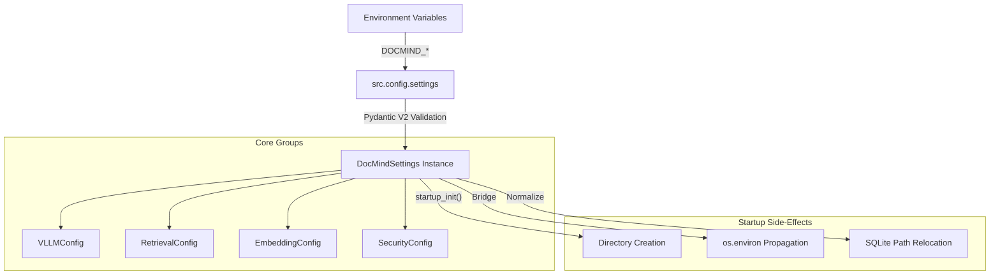

# DocMind AI Configuration Reference (2026)

## Overview

DocMind AI uses a centralized, type-safe configuration system powered by **Pydantic Settings v2**. This architecture ensures that every runtime knob is validated at startup, providing a single source of truth for developers and operators.

### Key Principles

- **Zero `os.getenv` Sprawl**: Core logic consumes `src.config.settings`, never raw environment variables (ADR-050).
- **Nested Schema**: Configuration is organized into logical groups (e.g., `vllm`, `retrieval`, `security`).
- **Convention-Over-Configuration**:
  - **Prefix**: `DOCMIND_`
  - **Separator**: `__` (double underscore) for nested fields (e.g., `DOCMIND_RETRIEVAL__TOP_K`).
- **Ergonomic Aliases**: High-traffic settings have top-level aliases (e.g., `DOCMIND_MODEL` -> `settings.vllm.model`).
- **Validation**: All inputs are validated for range, type, and security constraints.

---

## Configuration Architecture



### Environment Bridge Mode

During `startup_init()`, specific settings are propagated back to `os.environ`. This "Bridge" maintains compatibility with decoupled libraries (like OpenTelemetry or HuggingFace) that rely on traditional environment variables.

---

## Environment Variables Reference

### 1. Global & Core Settings

| Variable | Type | Default | Description |
| :--- | :--- | :--- | :--- |
| `DOCMIND_APP_NAME` | string | `DocMind AI` | Application identifier. |
| `DOCMIND_DEBUG` | boolean | `false` | Enables verbose debug logging. |
| `DOCMIND_LOG_LEVEL` | string | `INFO` | Standard Python log level (DEBUG, INFO, etc). |
| `DOCMIND_DATA_DIR` | path | `./data` | **Master Data Root**. All bare SQLite paths are relocated here. |
| `DOCMIND_CACHE_DIR` | path | `./cache` | Storage for temporary processing artifacts. |
| `DOCMIND_LOG_FILE` | path | `./logs/docmind.log` | Target file for structured logs. |

### 2. LLM Backend Selection

| Variable | Type | Default | Description |
| :--- | :--- | :--- | :--- |
| `DOCMIND_LLM_BACKEND` | enum | `ollama` | Options: `vllm`, `ollama`, `lmstudio`, `llamacpp`. |
| `DOCMIND_MODEL` | string | `None` | **Alias Override** for `vllm.model`. |
| `DOCMIND_CONTEXT_WINDOW` | int | `None` | **Alias Override** for `vllm.context_window`. |
| `DOCMIND_OLLAMA_BASE_URL` | string | `http://localhost:11434` | Endpoint for Ollama backend. |
| `DOCMIND_VLLM_BASE_URL` | string | `None` | Direct endpoint for vLLM (native or OpenAI-compatible). |
| `DOCMIND_ENABLE_GPU_ACCELERATION` | boolean | `true` | Controls hardware offloading for LlamaCPP/Embeddings. |

> [!IMPORTANT]
> **Backend URL Normalization**: All OpenAI-compatible endpoints are automatically normalized to include a single `/v1` suffix (e.g., `http://localhost:1234` becomes `http://localhost:1234/v1`).

---

### 3. vLLM Optimization (RTX 4090 / 2026 Profile)

Configurations for the primary execution backend. Optimized for **vLLM 0.10+**.

| Variable | Type | Default | Description |
| :--- | :--- | :--- | :--- |
| `DOCMIND_VLLM__MODEL` | string | `Qwen/Qwen3-4B-Instruct-2507-FP8` | Default production model. |
| `DOCMIND_VLLM__CONTEXT_WINDOW` | int | `131072` | Target KV cache capacity (tokens). |
| `DOCMIND_VLLM__GPU_MEMORY_UTILIZATION` | float | `0.85` | Fraction of VRAM reserved for KV cache. |
| `DOCMIND_VLLM__KV_CACHE_DTYPE` | string | `fp8_e5m2` | Enables FP8 quantization for massive contexts. |
| `DOCMIND_VLLM__ATTENTION_BACKEND` | string | `FLASHINFER` | Performance-critical attention provider. |
| `DOCMIND_VLLM__ENABLE_CHUNKED_PREFILL` | boolean | `true` | Optimizes throughput for long documents. |

---

### 4. Retrieval & Reranking

Controls the **Tri-Mode Retrieval** pipeline (Dense + Sparse + Visual).

| Variable | Type | Default | Description |
| :--- | :--- | :--- | :--- |
| `DOCMIND_RETRIEVAL__STRATEGY` | string | `hybrid` | Retrieval mode. |
| `DOCMIND_RETRIEVAL__TOP_K` | int | `10` | Final candidates delivered to the LLM. |
| `DOCMIND_RETRIEVAL__FUSION_MODE` | enum | `rrf` | `rrf` (Reciprocal Rank Fusion) or `dbsf`. |
| `DOCMIND_RETRIEVAL__ENABLE_SERVER_HYBRID` | boolean | `false` | Offloads fusion to Qdrant (requires Qdrant 1.11+). |
| `DOCMIND_RETRIEVAL__USE_RERANKING` | boolean | `true` | Enables Cross-Encoder post-processing. |
| `DOCMIND_RETRIEVAL__TEXT_RERANK_TIMEOUT_MS` | int | `250` | Hard deadline for text reranking stage. |
| `DOCMIND_RETRIEVAL__TOTAL_RERANK_BUDGET_MS` | int | `800` | Global budget across all reranker stages. |

---

### 5. Security & Guardrails

Default security posture is **Local-First / Secure-by-Default**.

| Variable | Type | Default | Description |
| :--- | :--- | :--- | :--- |
| `DOCMIND_SECURITY__ALLOW_REMOTE_ENDPOINTS` | boolean | `false` | If `false`, blocks any base URL outside the allowlist. |
| `DOCMIND_SECURITY__ENDPOINT_ALLOWLIST` | list | `[localhost, 127.0.0.1]` | Permitted remote hostnames. |
| `DOCMIND_SECURITY__TRUST_REMOTE_CODE` | boolean | `false` | Controls `trust_remote_code` for library imports. |
| `DOCMIND_HASHING__HMAC_SECRET` | secret | `[hidden]` | **Critical**: Secret key for PII redacting and log fingerprints. |

---

### 6. Observability & Telemetry

| Variable | Type | Default | Description |
| :--- | :--- | :--- | :--- |
| `DOCMIND_OBSERVABILITY__ENABLED` | boolean | `false` | Enables OpenTelemetry exporters. |
| `DOCMIND_OBSERVABILITY__PROTOCOL` | enum | `http/protobuf` | `grpc` or `http/protobuf`. |
| `DOCMIND_OBSERVABILITY__SAMPLING_RATIO` | float | `1.0` | Trace sampling (0.0 to 1.0). |
| `DOCMIND_TELEMETRY_DISABLED` | boolean | `false` | **Bridge Variable**: Disables local JSONL telemetry sink. |

---

### 7. Embedding & Vision

Text uses **BGE-M3** (Dense+Sparse); Vision uses **SigLIP**.

| Variable | Type | Default | Description |
| :--- | :--- | :--- | :--- |
| `DOCMIND_EMBEDDING__MODEL_NAME` | string | `BAAI/bge-m3` | Text embedding model. |
| `DOCMIND_EMBEDDING__DIMENSION` | int | `1024` | Resulting vector dimension. |
| `DOCMIND_EMBEDDING__ENABLE_SPARSE` | boolean | `true` | Computes Lexical/BM25-style weights via BGE-M3. |
| `DOCMIND_EMBEDDING__IMAGE_BACKBONE` | string | `auto` | Preferred SigLIP backbone or `auto`. |
| `DOCMIND_EMBEDDING__BATCH_SIZE_TEXT_GPU` | int | `12` | Optimization for CUDA. |
| `DOCMIND_EMBEDDING__BATCH_SIZE_TEXT_CPU` | int | `4` | Optimization for RAM-constrained systems. |

---

### 8. Document Processing

| Variable | Type | Default | Description |
| :--- | :--- | :--- | :--- |
| `DOCMIND_PROCESSING__CHUNK_SIZE` | int | `1500` | Tokens per document segment. |
| `DOCMIND_PROCESSING__CHUNK_OVERLAP` | int | `150` | Buffer between segments. |
| `DOCMIND_PROCESSING__NEW_AFTER_N_CHARS` | int | `1200` | Soft character limit for segment splitting. |
| `DOCMIND_PROCESSING__ENCRYPT_PAGE_IMAGES` | boolean | `false` | When true, renders PII-safe `*.enc` images. |

---

### 9. Database & Persistence

| Variable | Type | Default | Description |
| :--- | :--- | :--- | :--- |
| `DOCMIND_DATABASE__VECTOR_STORE_TYPE` | string | `qdrant` | Default vector backend. |
| `DOCMIND_DATABASE__QDRANT_URL` | string | `http://localhost:6333` | Service endpoint. |
| `DOCMIND_DATABASE__SQLITE_DB_PATH` | path | `docmind.db` | Primary relational store (relocated to data_dir). |
| `DOCMIND_DATABASE__ENABLE_WAL_MODE` | boolean | `true` | Recommended for concurrent SQLite access. |

---

### 10. UI & Monitoring

| Variable | Type | Default | Description |
| :--- | : :--- | :--- | :--- |
| `DOCMIND_UI__STREAMLIT_PORT` | int | `8501` | Service port for the web dashboard. |
| `DOCMIND_UI__RESPONSE_STREAMING` | boolean | `true` | Interactive tty-style response rendering. |
| `DOCMIND_MONITORING__MAX_MEMORY_GB` | float | `4.0` | System RAM safety threshold for alerts. |
| `DOCMIND_MONITORING__MAX_VRAM_GB` | float | `14.0` | GPU VRAM safety threshold for alerts. |

---

## Technical Side-Effects

### SQLite Path Relocation

To simplify container volume mounting, DocMind AI automatically relocates bare SQLite filenames to live under the `DOCMIND_DATA_DIR`.

**Logic**:

1. If a path is **absolute**, it is preserved.
2. If a path includes a **parent directory** (e.g., `./custom/db.sqlite`), it is preserved.
3. If a path is a **bare filename** (e.g., `docmind.db`), it is rewritten to `<DOCMIND_DATA_DIR>/docmind.db`.

Affected settings:

- `DOCMIND_DATABASE__SQLITE_DB_PATH`
- `DOCMIND_CHAT__SQLITE_PATH`

---

## Hardware Configuration Scenarios

Below are validated environment profiles for common hardware targets.

### 🎮 Gaming Laptop (8-12GB VRAM)

**Target**: Responsive RAG with moderate document sizes.

```bash
DOCMIND_LLM_BACKEND=ollama
DOCMIND_ENABLE_GPU_ACCELERATION=true
DOCMIND_VLLM__GPU_MEMORY_UTILIZATION=0.7
DOCMIND_CONTEXT_WINDOW=16384
DOCMIND_EMBEDDING__BATCH_SIZE_TEXT_CPU=4
```

### 🏎️ Workstation (RTX 3090/4090)

**Target**: Production-grade throughput with 128K context.

```bash
DOCMIND_LLM_BACKEND=vllm
DOCMIND_VLLM__GPU_MEMORY_UTILIZATION=0.85
DOCMIND_VLLM__KV_CACHE_DTYPE=fp8_e5m2
DOCMIND_VLLM__ATTENTION_BACKEND=FLASHINFER
DOCMIND_RETRIEVAL__USE_RERANKING=true
```

### 🏢 Air-Gapped / CPU-Only

**Target**: Maximum privacy, zero network required.

```bash
DOCMIND_LLM_BACKEND=llamacpp
DOCMIND_ENABLE_GPU_ACCELERATION=false
DOCMIND_EMBEDDING__EMBED_DEVICE=cpu
DOCMIND_SECURITY__ALLOW_REMOTE_ENDPOINTS=false
DOCMIND_HF_HUB_OFFLINE=1
```

---

## Detailed Configuration Analysis

### Computed Fields

Certain fields are **non-configurable** directly as they are derived from other settings for downstream consumption:

- **`effective_context_window`**: The actual window used in LlamaIndex. It is `min(DOCMIND_CONTEXT_WINDOW, DOCMIND_LLM_CONTEXT_WINDOW_MAX)`.
- **`backend_base_url_normalized`**: The final resolved endpoint string after applying `/v1` normalization and precedence rules.

### Backend Precedence Logic

The system resolves the LLM endpoint using the following order of priority:

1. `DOCMIND_OPENAI__BASE_URL` (highest)
2. Top-level backend specific variable (e.g., `DOCMIND_OLLAMA_BASE_URL`)
3. Nested configuration values in `settings.vllm`

---

## Usage Guide: Validation & Troubleshooting

### Validating Your Configuration

You can verify the final resolved state of the system using a short Python snippet:

```bash
# Verify model resolution
DOCMIND_LLM_BACKEND=vllm \
DOCMIND_MODEL=my-vllm-model \
python3 -c "from src.config import settings; print(f'Active Model: {settings.model or settings.vllm.model}')"

# Verify path relocation
DOCMIND_DATA_DIR=/tmp/docmind_data \
DOCMIND_DATABASE__SQLITE_DB_PATH=test.db \
python3 -c "from src.config import settings; from src.config.integrations import startup_init; startup_init(settings); print(f'Resolved DB Path: {settings.database.sqlite_db_path}')"
```

### Common Errors

| Error Message | Cause | Resolution |
| :--- | :--- | :--- |
| `ValueError: DOCMIND_HASHING__HMAC_SECRET must be at least 32 bytes` | Weak secret key. | Provide a longer random string. |
| `ValueError: Remote endpoints are disabled.` | Remote endpoint used while `security__allow_remote_endpoints=false`. | Set `DOCMIND_SECURITY__ALLOW_REMOTE_ENDPOINTS=true`. |
| `ValueError: chunk_overlap cannot exceed chunk_size` | Invalid processing logic. | Adjust overlap/size ratio. |

---

## Migration for 2026

Versions prior to 2.0 used flat environment variables without the `DOCMIND_` prefix.

- All variables now **require** the `DOCMIND_` prefix.
- Nested sections use `__` (double underscore).
- The `DATA_DIR` is now the definitive root for SQLite file relocation; ensure your Docker volumes are updated to mount to the directory specified in `DOCMIND_DATA_DIR`.
