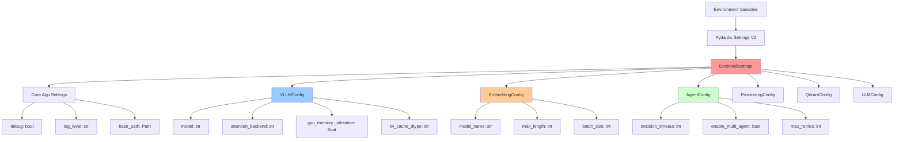

# DocMind AI Configuration Reference

## Overview

This comprehensive reference guide covers all configuration options for DocMind AI. The system uses a unified configuration approach with Pydantic Settings v2, providing 30 essential environment variables organized into logical categories with full validation and type safety.

## Table of Contents

1. [Configuration System Overview](#configuration-system-overview)
2. [Environment Variables Reference](#environment-variables-reference)
3. [Model Configuration](#model-configuration)
4. [GPU & Performance Tuning](#gpu--performance-tuning)
5. [Advanced Configuration](#advanced-configuration)
6. [Production Configuration Templates](#production-configuration-templates)
7. [Configuration Validation](#configuration-validation)
8. [Migration Guide](#migration-guide)

## Configuration System Overview

### Unified Configuration Architecture

DocMind AI uses a **single source of truth** configuration system:

```python
# Always use this pattern - single import for all configuration
from src.config import settings

# Access any nested configuration
model_name = settings.vllm.model              # "Qwen/Qwen3-4B-Instruct-2507-FP8"
embedding_model = settings.embedding.model_name  # "BAAI/bge-m3"
chunk_size = settings.processing.chunk_size   # Document chunking parameters
agent_timeout = settings.agents.decision_timeout # Multi-agent coordination (200ms)
```

### Configuration Principles

- **Prefix Pattern**: All variables start with `DOCMIND_`
- **Nested Support**: Use double underscores (`__`) for nested sections
- **Type Safety**: Full Pydantic validation with proper types
- **Environment First**: Environment variables override defaults
- **Validation**: Comprehensive validation with helpful error messages

### Configuration Structure



## Environment Variables Reference

### Core Application Settings

| Variable | Type | Default | Description |
|----------|------|---------|-------------|
| `DOCMIND_DEBUG` | bool | `false` | Enable debug mode with verbose logging |
| `DOCMIND_LOG_LEVEL` | str | `"INFO"` | Logging level (DEBUG, INFO, WARNING, ERROR) |
| `DOCMIND_BASE_PATH` | Path | `"./"` | Base path for application files and cache |
| `DOCMIND_APP_NAME` | str | `"DocMind AI"` | Application display name |
| `DOCMIND_APP_VERSION` | str | `"2.0.0"` | Application version |

**Example Configuration:**

```bash
# Core application settings
DOCMIND_DEBUG=false
DOCMIND_LOG_LEVEL=INFO
DOCMIND_BASE_PATH=./
DOCMIND_APP_NAME="DocMind AI"
DOCMIND_APP_VERSION=2.0.0
```

### vLLM Backend Configuration

| Variable | Type | Default | Description |
|----------|------|---------|-------------|
| `DOCMIND_VLLM__MODEL` | str | `"Qwen/Qwen3-4B-Instruct-2507-FP8"` | Model name for vLLM backend |
| `DOCMIND_VLLM__ATTENTION_BACKEND` | str | `"FLASHINFER"` | Attention backend (FLASHINFER recommended) |
| `DOCMIND_VLLM__GPU_MEMORY_UTILIZATION` | float | `0.85` | GPU memory utilization (0.0-1.0) |
| `DOCMIND_VLLM__KV_CACHE_DTYPE` | str | `"fp8_e5m2"` | KV cache data type for memory optimization |
| `DOCMIND_VLLM__MAX_MODEL_LEN` | int | `131072` | Maximum context length (128K tokens) |
| `DOCMIND_VLLM__ENFORCE_EAGER` | bool | `false` | Disable graph optimization for FlashInfer |
| `DOCMIND_VLLM__DTYPE` | str | `"auto"` | Model precision (auto, fp16, fp8) |

**Example Configuration:**

```bash
# vLLM backend optimization for RTX 4090
DOCMIND_VLLM__MODEL=Qwen/Qwen3-4B-Instruct-2507-FP8
DOCMIND_VLLM__ATTENTION_BACKEND=FLASHINFER
DOCMIND_VLLM__GPU_MEMORY_UTILIZATION=0.85
DOCMIND_VLLM__KV_CACHE_DTYPE=fp8_e5m2
DOCMIND_VLLM__MAX_MODEL_LEN=131072
DOCMIND_VLLM__ENFORCE_EAGER=false
DOCMIND_VLLM__DTYPE=auto
```

### LLM Backend Configuration

| Variable | Type | Default | Description |
|----------|------|---------|-------------|
| `DOCMIND_LLM_BACKEND` | str | `"vllm"` | LLM backend type (vllm, ollama, openai) |
| `DOCMIND_LLM__BASE_URL` | str | `"http://localhost:11434"` | LLM service base URL |
| `DOCMIND_LLM__MODEL` | str | `"Qwen/Qwen3-4B-Instruct-2507-FP8"` | Model name |
| `DOCMIND_LLM__TIMEOUT` | int | `300` | Request timeout in seconds |
| `DOCMIND_LLM__MAX_RETRIES` | int | `3` | Maximum retry attempts |

**Example Configuration:**

```bash
# LLM backend settings
DOCMIND_LLM_BACKEND=vllm
DOCMIND_LLM__BASE_URL=http://localhost:11434
DOCMIND_LLM__MODEL=Qwen/Qwen3-4B-Instruct-2507-FP8
DOCMIND_LLM__TIMEOUT=300
DOCMIND_LLM__MAX_RETRIES=3
```

### BGE-M3 Embedding Configuration

| Variable | Type | Default | Description |
|----------|------|---------|-------------|
| `DOCMIND_EMBEDDING__MODEL_NAME` | str | `"BAAI/bge-m3"` | BGE-M3 model name |
| `DOCMIND_EMBEDDING__MAX_LENGTH` | int | `8192` | Maximum token length for embeddings |
| `DOCMIND_EMBEDDING__BATCH_SIZE` | int | `32` | Batch size for embedding generation |
| `DOCMIND_EMBEDDING__NORMALIZE_EMBEDDINGS` | bool | `true` | L2 normalize embeddings |
| `DOCMIND_EMBEDDING__USE_FP16` | bool | `true` | Use FP16 precision for GPU acceleration |

**Example Configuration:**

```bash
# BGE-M3 unified dense + sparse embeddings
DOCMIND_EMBEDDING__MODEL_NAME=BAAI/bge-m3
DOCMIND_EMBEDDING__MAX_LENGTH=8192
DOCMIND_EMBEDDING__BATCH_SIZE=32
DOCMIND_EMBEDDING__NORMALIZE_EMBEDDINGS=true
DOCMIND_EMBEDDING__USE_FP16=true
```

### Multi-Agent System Configuration

| Variable | Type | Default | Description |
|----------|------|---------|-------------|
| `DOCMIND_AGENTS__ENABLE_MULTI_AGENT` | bool | `true` | Enable 5-agent coordination system |
| `DOCMIND_AGENTS__DECISION_TIMEOUT` | int | `200` | Agent decision timeout in milliseconds |
| `DOCMIND_AGENTS__MAX_RETRIES` | int | `2` | Maximum retry attempts per agent |
| `DOCMIND_AGENTS__ENABLE_FALLBACK_RAG` | bool | `true` | Enable fallback to single-agent RAG |
| `DOCMIND_AGENTS__CONCURRENT_AGENTS` | int | `3` | Maximum concurrent agent execution |

**Example Configuration:**

```bash
# Multi-agent coordination (ADR-011 compliance)
DOCMIND_AGENTS__ENABLE_MULTI_AGENT=true
DOCMIND_AGENTS__DECISION_TIMEOUT=200
DOCMIND_AGENTS__MAX_RETRIES=2
DOCMIND_AGENTS__ENABLE_FALLBACK_RAG=true
DOCMIND_AGENTS__CONCURRENT_AGENTS=3
```

### Document Processing Configuration

| Variable | Type | Default | Description |
|----------|------|---------|-------------|
| `DOCMIND_PROCESSING__CHUNK_SIZE` | int | `1500` | Document chunk size in tokens |
| `DOCMIND_PROCESSING__CHUNK_OVERLAP` | int | `150` | Overlap between chunks in tokens |
| `DOCMIND_PROCESSING__MAX_DOCUMENT_SIZE_MB` | int | `100` | Maximum document size in MB |
| `DOCMIND_PROCESSING__ENABLE_OCR` | bool | `true` | Enable OCR for image-based documents |
| `DOCMIND_PROCESSING__SPACY_MODEL` | str | `"en_core_web_sm"` | spaCy model for NLP processing |

**Example Configuration:**

```bash
# Document processing pipeline
DOCMIND_PROCESSING__CHUNK_SIZE=1500
DOCMIND_PROCESSING__CHUNK_OVERLAP=150
DOCMIND_PROCESSING__MAX_DOCUMENT_SIZE_MB=100
DOCMIND_PROCESSING__ENABLE_OCR=true
DOCMIND_PROCESSING__SPACY_MODEL=en_core_web_sm
```

### Qdrant Vector Database Configuration

| Variable | Type | Default | Description |
|----------|------|---------|-------------|
| `DOCMIND_QDRANT__URL` | str | `"http://localhost:6333"` | Qdrant service URL |
| `DOCMIND_QDRANT__COLLECTION_NAME` | str | `"docmind_vectors"` | Collection name for vectors |
| `DOCMIND_QDRANT__VECTOR_SIZE` | int | `1024` | BGE-M3 dense embedding dimension |
| `DOCMIND_QDRANT__DISTANCE_METRIC` | str | `"Cosine"` | Distance metric for similarity search |
| `DOCMIND_QDRANT__ENABLE_HYBRID_SEARCH` | bool | `true` | Enable dense + sparse hybrid search |

**Example Configuration:**

```bash
# Qdrant vector database
DOCMIND_QDRANT__URL=http://localhost:6333
DOCMIND_QDRANT__COLLECTION_NAME=docmind_vectors
DOCMIND_QDRANT__VECTOR_SIZE=1024
DOCMIND_QDRANT__DISTANCE_METRIC=Cosine
DOCMIND_QDRANT__ENABLE_HYBRID_SEARCH=true
```

## Model Configuration

### Qwen3-4B-Instruct-2507-FP8 Specifications

| Specification | Value | Notes |
|---------------|-------|-------|
| **Model Name** | Qwen3-4B-Instruct-2507-FP8 | Latest 2507 designation (July 2024) |
| **Parameters** | 4.23B parameters | Optimized parameter count |
| **Context Window** | 131,072 tokens (128K) | Industry-leading context capacity |
| **Quantization** | FP8 precision with FP8 KV cache | 50% memory reduction |
| **Architecture** | Transformer with optimized attention | FlashInfer backend support |
| **Training Cutoff** | July 2024 (2507 designation) | Most recent training data |

### Performance Targets

| Metric | Target Range | Achieved with FlashInfer | Hardware |
|--------|--------------|--------------------------|----------|
| **Decode Speed** | 100-160 tok/s | 120-180 tok/s | RTX 4090 |
| **Prefill Speed** | 800-1300 tok/s | 900-1400 tok/s | RTX 4090 |
| **VRAM Usage** | 12-14GB target | 12-14GB for 128K context | 16GB total |
| **Context Utilization** | Up to 120K tokens | 131,072 tokens supported | With 8K buffer |

### Model-Specific Environment Variables

```bash
# Model optimization for RTX 4090
export VLLM_ATTENTION_BACKEND=FLASHINFER
export VLLM_USE_CUDNN_PREFILL=1
export VLLM_DISABLE_CUSTOM_ALL_REDUCE=1

# CUDA and PyTorch settings
export CUDA_VISIBLE_DEVICES=0
export TORCH_CUDA_ARCH_LIST="8.9"  # RTX 4090 architecture
export PYTORCH_CUDA_ALLOC_CONF=max_split_size_mb:128

# Model-specific settings
export QWEN_MAX_CONTEXT=131072
export QWEN_TARGET_VRAM_GB=14
```

### BGE-M3 Unified Embeddings

| Feature | Specification | Benefit |
|---------|---------------|---------|
| **Architecture** | Unified dense + sparse model | Single model for both embedding types |
| **Dense Dimension** | 1024D vectors | High-quality semantic representation |
| **Sparse Support** | Native sparse embeddings | Keyword-based retrieval capability |
| **Context Window** | 8192 tokens | 16x improvement over legacy (512 tokens) |
| **Multilingual** | 100+ languages | Global document support |
| **Optimization** | FP16 acceleration | 50% performance improvement on RTX 4090 |

## GPU & Performance Tuning

### Hardware Requirements

#### Minimum Requirements

- **GPU**: RTX 4060 (16GB VRAM) or equivalent
- **CUDA**: 12.8+ with driver 550.54.14+
- **System RAM**: 16GB minimum
- **Storage**: 50GB available space

#### Optimal Configuration (RTX 4090)

- **VRAM**: 16GB with 12-14GB usage for 128K context
- **CUDA**: 12.8+ with PyTorch 2.7.1 support
- **System RAM**: 32-64GB for optimal performance
- **Storage**: NVMe SSD for faster model loading

### GPU Optimization Settings

#### vLLM FlashInfer Backend

```bash
# Essential environment variables for FP8 optimization
export VLLM_ATTENTION_BACKEND=FLASHINFER      # FlashInfer attention backend
export VLLM_KV_CACHE_DTYPE=fp8_e5m2          # FP8 KV cache quantization
export VLLM_GPU_MEMORY_UTILIZATION=0.85       # 13.6GB of 16GB RTX 4090
export VLLM_DISABLE_CUSTOM_ALL_REDUCE=1       # Single GPU optimization

# Advanced FlashInfer optimizations
export VLLM_USE_CUDNN_PREFILL=1               # CuDNN prefill acceleration
export VLLM_ENABLE_CHUNKED_PREFILL=1          # Chunked prefill for long contexts
export VLLM_CHUNKED_PREFILL_SIZE=4096         # Optimal chunk size for RTX 4090
```

#### Memory Management

```bash
# PyTorch memory optimization
export PYTORCH_CUDA_ALLOC_CONF=max_split_size_mb:128,garbage_collection_threshold:0.8

# CUDA memory settings
export CUDA_LAUNCH_BLOCKING=0                 # Async CUDA operations
export CUDA_CACHE_DISABLE=0                   # Enable CUDA caching
export CUDA_MODULE_LOADING=LAZY               # Lazy module loading
```

### Performance Optimization Levels

#### Level 1: Basic Optimization

```bash
# Minimum viable performance settings
VLLM_ATTENTION_BACKEND=FLASHINFER
VLLM_GPU_MEMORY_UTILIZATION=0.8
VLLM_KV_CACHE_DTYPE=fp16
```

#### Level 2: Production Optimization (Recommended)

```bash
# Production-ready performance settings
VLLM_ATTENTION_BACKEND=FLASHINFER
VLLM_GPU_MEMORY_UTILIZATION=0.85
VLLM_KV_CACHE_DTYPE=fp8_e5m2
VLLM_USE_CUDNN_PREFILL=1
VLLM_DISABLE_CUSTOM_ALL_REDUCE=1
```

#### Level 3: Maximum Performance

```bash
# Maximum performance settings (experimental)
VLLM_ATTENTION_BACKEND=FLASHINFER
VLLM_GPU_MEMORY_UTILIZATION=0.9
VLLM_KV_CACHE_DTYPE=fp8_e5m2
VLLM_USE_CUDNN_PREFILL=1
VLLM_ENABLE_CHUNKED_PREFILL=1
VLLM_CHUNKED_PREFILL_SIZE=4096
VLLM_DISABLE_CUSTOM_ALL_REDUCE=1
```

## Advanced Configuration

### Configuration Validation - Advanced Configuration

DocMind AI provides comprehensive configuration validation:

```python
# Configuration validation patterns
class VLLMConfig(BaseModel):
    """vLLM configuration with comprehensive validation."""
    
    model: str = Field(
        default="Qwen/Qwen3-4B-Instruct-2507-FP8",
        description="vLLM model name or path"
    )
    
    attention_backend: str = Field(
        default="FLASHINFER",
        pattern="^(FLASHINFER|XFORMERS|PYTORCH)$",
        description="Attention backend implementation"
    )
    
    gpu_memory_utilization: float = Field(
        default=0.85,
        ge=0.1,  # Minimum 10% GPU usage
        le=0.95, # Maximum 95% to prevent OOM
        description="GPU memory utilization fraction"
    )
    
    kv_cache_dtype: str = Field(
        default="fp8_e5m2",
        pattern="^(auto|fp16|fp8_e5m2|fp8_e4m3)$",
        description="KV cache data type for memory optimization"
    )
    
    @model_validator(mode="after")
    def validate_performance_settings(self) -> "VLLMConfig":
        """Validate performance-related settings."""
        
        # Warn about non-optimal settings
        if self.attention_backend != "FLASHINFER":
            warnings.warn(
                f"Using {self.attention_backend} backend. FLASHINFER recommended for RTX 4090.",
                UserWarning
            )
        
        if self.kv_cache_dtype not in ["fp8_e5m2", "fp8_e4m3"]:
            warnings.warn(
                "Consider using FP8 KV cache for better memory efficiency.",
                UserWarning
            )
        
        return self
```

### Environment-Specific Configurations

#### Development Configuration

```bash
# Development settings - faster startup, more logging
DOCMIND_DEBUG=true
DOCMIND_LOG_LEVEL=DEBUG
DOCMIND_VLLM__GPU_MEMORY_UTILIZATION=0.7
DOCMIND_AGENTS__DECISION_TIMEOUT=500
DOCMIND_PROCESSING__MAX_DOCUMENT_SIZE_MB=50
```

#### Testing Configuration

```bash
# Testing settings - lightweight models, fast execution
DOCMIND_DEBUG=true
DOCMIND_LLM_BACKEND=ollama
DOCMIND_LLM__MODEL=llama3.2:1b
DOCMIND_EMBEDDING__MODEL_NAME=sentence-transformers/all-MiniLM-L6-v2
DOCMIND_AGENTS__DECISION_TIMEOUT=100
DOCMIND_PROCESSING__CHUNK_SIZE=500
```

#### Production Configuration

```bash
# Production settings - optimized for performance and reliability
DOCMIND_DEBUG=false
DOCMIND_LOG_LEVEL=INFO
DOCMIND_VLLM__GPU_MEMORY_UTILIZATION=0.85
DOCMIND_AGENTS__DECISION_TIMEOUT=200
DOCMIND_PROCESSING__MAX_DOCUMENT_SIZE_MB=200
DOCMIND_QDRANT__ENABLE_HYBRID_SEARCH=true
```

### Dynamic Configuration

```python
# Runtime configuration updates
from src.config import settings

# Validate configuration changes
def update_agent_timeout(new_timeout: int) -> bool:
    """Update agent timeout with validation."""
    
    if new_timeout < 50:
        logger.warning("Agent timeout too low, may cause failures")
        return False
    
    if new_timeout > 1000:
        logger.warning("Agent timeout very high, may impact user experience")
        return False
    
    # Update configuration
    settings.agents.decision_timeout = new_timeout
    logger.info(f"Agent timeout updated to {new_timeout}ms")
    
    return True

# Configuration monitoring
def monitor_configuration_drift():
    """Monitor for configuration drift from recommended values."""
    
    recommendations = []
    
    # Check GPU utilization
    if settings.vllm.gpu_memory_utilization < 0.8:
        recommendations.append(
            "Consider increasing GPU memory utilization for better performance"
        )
    
    # Check agent timeout
    if settings.agents.decision_timeout > 200:
        recommendations.append(
            "Agent timeout exceeds ADR-011 recommendation of ≤200ms"
        )
    
    # Check embedding model
    if settings.embedding.model_name != "BAAI/bge-m3":
        recommendations.append(
            "Using non-standard embedding model, BGE-M3 recommended per ADR-002"
        )
    
    return recommendations
```

## Production Configuration Templates

### Complete Production Template

```bash
# DocMind AI Production Configuration Template
# Copy to .env and customize for your environment

# === CORE APPLICATION ===
DOCMIND_DEBUG=false
DOCMIND_LOG_LEVEL=INFO
DOCMIND_BASE_PATH=./
DOCMIND_APP_NAME="DocMind AI"
DOCMIND_APP_VERSION=2.0.0

# === vLLM BACKEND (Optimized for RTX 4090) ===
DOCMIND_VLLM__MODEL=Qwen/Qwen3-4B-Instruct-2507-FP8
DOCMIND_VLLM__ATTENTION_BACKEND=FLASHINFER
DOCMIND_VLLM__GPU_MEMORY_UTILIZATION=0.85
DOCMIND_VLLM__KV_CACHE_DTYPE=fp8_e5m2
DOCMIND_VLLM__MAX_MODEL_LEN=131072
DOCMIND_VLLM__ENFORCE_EAGER=false
DOCMIND_VLLM__DTYPE=auto

# === LLM BACKEND ===
DOCMIND_LLM_BACKEND=vllm
DOCMIND_LLM__BASE_URL=http://localhost:11434
DOCMIND_LLM__MODEL=Qwen/Qwen3-4B-Instruct-2507-FP8
DOCMIND_LLM__TIMEOUT=300
DOCMIND_LLM__MAX_RETRIES=3

# === BGE-M3 EMBEDDINGS ===
DOCMIND_EMBEDDING__MODEL_NAME=BAAI/bge-m3
DOCMIND_EMBEDDING__MAX_LENGTH=8192
DOCMIND_EMBEDDING__BATCH_SIZE=32
DOCMIND_EMBEDDING__NORMALIZE_EMBEDDINGS=true
DOCMIND_EMBEDDING__USE_FP16=true

# === MULTI-AGENT SYSTEM ===
DOCMIND_AGENTS__ENABLE_MULTI_AGENT=true
DOCMIND_AGENTS__DECISION_TIMEOUT=200
DOCMIND_AGENTS__MAX_RETRIES=2
DOCMIND_AGENTS__ENABLE_FALLBACK_RAG=true
DOCMIND_AGENTS__CONCURRENT_AGENTS=3

# === DOCUMENT PROCESSING ===
DOCMIND_PROCESSING__CHUNK_SIZE=1500
DOCMIND_PROCESSING__CHUNK_OVERLAP=150
DOCMIND_PROCESSING__MAX_DOCUMENT_SIZE_MB=200
DOCMIND_PROCESSING__ENABLE_OCR=true
DOCMIND_PROCESSING__SPACY_MODEL=en_core_web_sm

# === QDRANT VECTOR DATABASE ===
DOCMIND_QDRANT__URL=http://localhost:6333
DOCMIND_QDRANT__COLLECTION_NAME=docmind_vectors
DOCMIND_QDRANT__VECTOR_SIZE=1024
DOCMIND_QDRANT__DISTANCE_METRIC=Cosine
DOCMIND_QDRANT__ENABLE_HYBRID_SEARCH=true

# === vLLM SYSTEM OPTIMIZATION ===
VLLM_ATTENTION_BACKEND=FLASHINFER
VLLM_KV_CACHE_DTYPE=fp8_e5m2
VLLM_GPU_MEMORY_UTILIZATION=0.85
VLLM_USE_CUDNN_PREFILL=1
VLLM_DISABLE_CUSTOM_ALL_REDUCE=1
VLLM_ENABLE_CHUNKED_PREFILL=1
VLLM_CHUNKED_PREFILL_SIZE=4096

# === CUDA OPTIMIZATION ===
CUDA_VISIBLE_DEVICES=0
TORCH_CUDA_ARCH_LIST=8.9
PYTORCH_CUDA_ALLOC_CONF=max_split_size_mb:128,garbage_collection_threshold:0.8
```

### Docker Production Template

```yaml
# docker-compose.production.yml
version: '3.8'

services:
  docmind-ai:
    build: .
    environment:
      # Core settings
      - DOCMIND_DEBUG=false
      - DOCMIND_LOG_LEVEL=INFO
      
      # GPU optimization
      - NVIDIA_VISIBLE_DEVICES=0
      - VLLM_ATTENTION_BACKEND=FLASHINFER
      - VLLM_GPU_MEMORY_UTILIZATION=0.85
      - VLLM_KV_CACHE_DTYPE=fp8_e5m2
      
      # Service URLs
      - DOCMIND_QDRANT__URL=http://qdrant:6333
      - DOCMIND_LLM__BASE_URL=http://localhost:11434
      
    deploy:
      resources:
        reservations:
          devices:
            - driver: nvidia
              count: 1
              capabilities: [gpu]
    
    depends_on:
      - qdrant
    
    ports:
      - "8501:8501"
      
  qdrant:
    image: qdrant/qdrant:v1.7.0
    ports:
      - "6333:6333"
    volumes:
      - qdrant_data:/qdrant/storage
      
volumes:
  qdrant_data:
```

## Configuration Validation

### Validation Commands

```bash
# Validate current configuration
python -c "
from src.config import settings
print('✅ Configuration loaded successfully')
print(f'Model: {settings.vllm.model}')
print(f'Embedding: {settings.embedding.model_name}')
print(f'Agent Timeout: {settings.agents.decision_timeout}ms')
print(f'GPU Memory: {settings.vllm.gpu_memory_utilization * 100:.1f}%')
"

# Check ADR compliance
python -c "
from src.config import settings
import sys

# ADR-002: BGE-M3 embeddings
if settings.embedding.model_name != 'BAAI/bge-m3':
    print('❌ ADR-002 violation: Should use BGE-M3 embeddings')
    sys.exit(1)

# ADR-011: Agent timeout ≤200ms
if settings.agents.decision_timeout > 200:
    print('❌ ADR-011 violation: Agent timeout should be ≤200ms')
    sys.exit(1)

print('✅ All ADR requirements validated')
"

# Performance validation
python scripts/performance_validation.py

# GPU configuration check
python -c "
import torch
from src.config import settings

print(f'CUDA Available: {torch.cuda.is_available()}')
if torch.cuda.is_available():
    print(f'GPU: {torch.cuda.get_device_name()}')
    total_vram = torch.cuda.get_device_properties(0).total_memory / 1e9
    target_vram = total_vram * settings.vllm.gpu_memory_utilization
    print(f'Target VRAM Usage: {target_vram:.1f}GB / {total_vram:.1f}GB')
"
```

### Configuration Troubleshooting

```python
# Configuration diagnostics
def diagnose_configuration():
    """Comprehensive configuration diagnostics."""
    
    print("=== CONFIGURATION DIAGNOSTICS ===")
    
    try:
        from src.config import settings
        print("✅ Configuration loaded successfully")
    except Exception as e:
        print(f"❌ Configuration loading failed: {e}")
        return
    
    # Check critical settings
    checks = [
        ("Model", settings.vllm.model, "Qwen/Qwen3-4B-Instruct-2507-FP8"),
        ("Embedding", settings.embedding.model_name, "BAAI/bge-m3"),
        ("Agent Timeout", settings.agents.decision_timeout, lambda x: x <= 200),
        ("GPU Memory", settings.vllm.gpu_memory_utilization, lambda x: 0.7 <= x <= 0.95),
        ("Attention Backend", settings.vllm.attention_backend, "FLASHINFER")
    ]
    
    for name, actual, expected in checks:
        if callable(expected):
            status = "✅" if expected(actual) else "⚠️"
        else:
            status = "✅" if actual == expected else "⚠️"
        
        print(f"{status} {name}: {actual}")
    
    # Environment variables check
    import os
    critical_vars = [
        "VLLM_ATTENTION_BACKEND",
        "VLLM_KV_CACHE_DTYPE", 
        "VLLM_GPU_MEMORY_UTILIZATION"
    ]
    
    print("\n=== ENVIRONMENT VARIABLES ===")
    for var in critical_vars:
        value = os.environ.get(var, "NOT SET")
        print(f"{var}: {value}")

# Run diagnostics
if __name__ == "__main__":
    diagnose_configuration()
```

## Migration Guide

### From Legacy Configuration

If migrating from an older DocMind AI configuration:

1. **Backup existing configuration:**

   ```bash
   cp .env .env.backup
   ```

2. **Use migration script:**

   ```bash
   python scripts/migrate_configuration.py .env.backup .env
   ```

3. **Manual migration mapping:**

   ```bash
   # Legacy -> New format
   DOCMIND_MODEL_NAME=... -> DOCMIND_VLLM__MODEL=...
   DOCMIND_EMBED_MODEL=... -> DOCMIND_EMBEDDING__MODEL_NAME=...
   DOCMIND_CHUNK_SIZE=... -> DOCMIND_PROCESSING__CHUNK_SIZE=...
   DOCMIND_GPU_MEM=... -> DOCMIND_VLLM__GPU_MEMORY_UTILIZATION=...
   ```

4. **Validate migration:**

   ```bash
   python -c "from src.config import settings; print('✅ Migration successful')"
   ```

---

This configuration reference provides comprehensive guidance for optimizing DocMind AI performance and functionality. The unified configuration system ensures consistency, type safety, and excellent validation while maintaining flexibility for different deployment scenarios.

For implementation details, see [Developer Handbook](developer-handbook.md).
For operational procedures, see [Operations Guide](operations-guide.md).
For system understanding, see [System Architecture](system-architecture.md).
